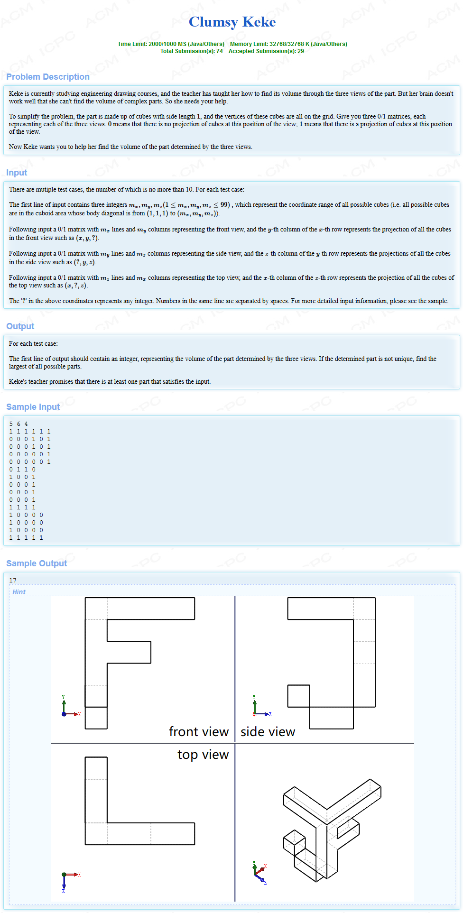
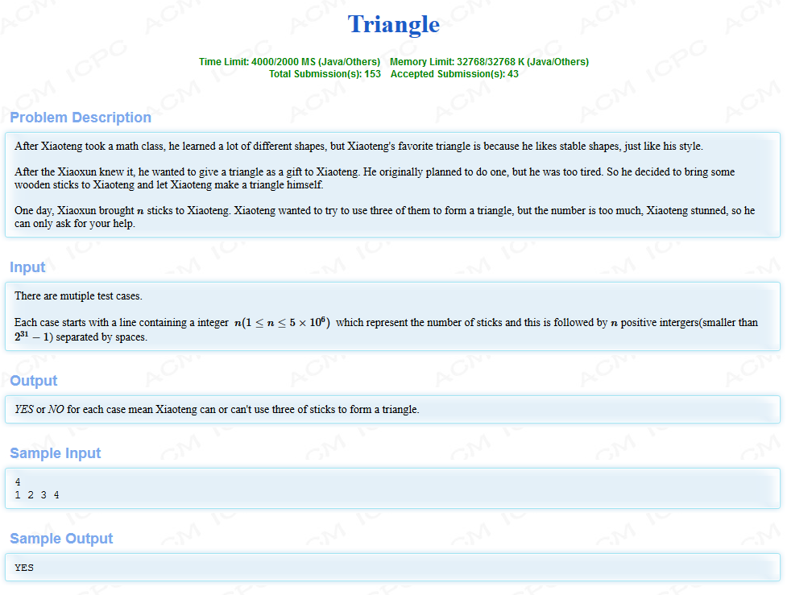

HDU6512--Triangle && HDU6518--Clumsy Keke

<!-- more -->

# [HDU6518--Clumsy Keke](http://acm.hdu.edu.cn/showproblem.php?pid=6518)



## 解析

题目大意：

给出一个三维图形的x，y，z轴的长度，然后分别给出正视图，侧视图，俯视图，视图的表示方法是在一个大方格里面，用0代表空白，用1代表阴影，这样就可以表示一个图形了，然后求出这个三维图形是由多少小正方体组成的。

我们可以运用逆向思维，首先构建一个完整的图形，然后减去没有出现的，最终剩下来的就是拥有的，然后再统计下有几个就是我们要求的答案了。

```c++
/*
2019-04-20 00:21:25	
46MS  2184K
*/
#include <cstdio>
#include <cstring>
using namespace std;
const int MAXN = 1e2;
bool Map[MAXN][MAXN][MAXN];

int main()
{
    int x, y, z;
    int input;
    while(scanf("%d %d %d", &x, &y, &z) != EOF)
    {
        memset(Map, false, sizeof(Map));
        for(int i = 1; i <= x; i++)
            for(int j = 1; j <= y; j++)
            {
                scanf("%d", &input);
                if(input == 0)
                {
                    for(int k = 1; k <= z; k++)
                        Map[i][j][k] = true;
                }
            }

        for(int i = 1; i <= y; i++)
            for(int j = 1; j <= z; j++)
            {
                scanf("%d", &input);
                if(input == 0)
                {
                    for(int k = 1; k <= x; k++)
                        Map[k][i][j] = true;
                }
            }

        for(int i = 1; i <= z; i++)
            for(int j = 1; j <= x; j++)
            {
                scanf("%d", &input);
                if(input == 0)
                {
                    for(int k = 1; k <= y; k++)
                        Map[j][k][i] = true;
                }
            }

        int ans = 0;
        for(int i = 1; i <= x; i++)
            for(int j = 1; j <= y; j++)
                for(int k = 1; k <= z; k++)
                {
                    if(Map[i][j][k] == false)
                        ans++;
                }

        printf("%d\n", ans);
    }
}
```

# [HDU6512-Triangle](http://acm.hdu.edu.cn/showproblem.php?pid=6512)



## 解析

题目大意：

给出n个数，问你能不能从中选中三个数构成三角形

（根据范围，直接算肯定T）

因为两边之和一定要大于第三边，因此当数列满足，排序后，较小两边相加都小于等于下一条边，这种序列即斐波那契数列，甚至比斐波那契数列更容易增大的数列。

反过来想想，既然构造一个超长的不能满足构成三角形的数列必须最低限度是构造一个斐波那契数列，那么这个数列长度能否构造得很长？不行，因为斐波那契数列到第51个就超过`5^1e6`了。
因为数列中所有值都小于5^1e6，因此任何区间大于50的长度，必定存在能构造出三角形的三边，150以内的，直接区间排序后暴力查找是否存在能构成三边的三角形即可。

参考：[https://blog.csdn.net/kuronekonano/article/details/79701126](https://blog.csdn.net/kuronekonano/article/details/79701126)

```c++
/*
2019-04-19 21:24:51
1513MS	1384K
*/
#include <iostream>
#include <string>
#include <cstdio>
#include <algorithm>
using namespace std;
const int MAXN = 5*1E6+100;
char s[MAXN];
int arr[1000];
int main()
{
    int n,a ,b ,c;
    while(scanf("%d", &n) != EOF)
    {
        if(n > 50)
        {
            for(int i = 0; i < n; i++)
                scanf("%d", &a);
            printf("YES\n");
        }
        else
        {
            for(int i = 0; i < n; i++)
                scanf("%d", &arr[i]);
            sort(arr, arr + n);
            bool flag = false;
            for(int i = 2; i < n; i++)
            {
                int a = arr[i];
                int b = arr[i-1];
                int c = arr[i-2];
                if((a+b>c && a+c>b && b+c>a))
                {
                    flag = true;
                    printf("YES\n");
                    break;
                }
            }
            if(!flag)
                printf("NO\n");
        }
    }
    return 0;
}
```

