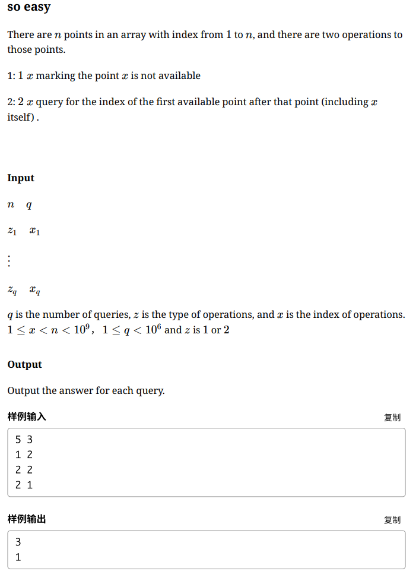
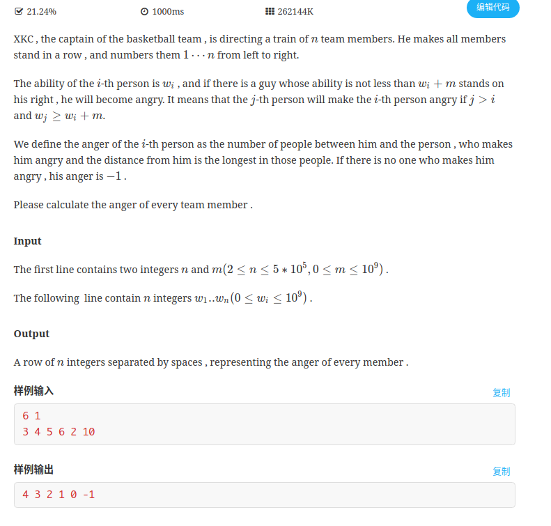

B-so easy

<!-- more -->

# [B-so easy](https://nanti.jisuanke.com/t/41384)

参考：[2019徐州网络赛 B so easy - binarycopycode - CSDN博客](https://blog.csdn.net/liufengwei1/article/details/100606177)

## 题目

- 2000ms
-  262144K




## 大意

有n个点，分别标号为`1-n`，两种操作：

- `1 X`，表示去掉第X个点
- `2 X`，表示查询`[x,n]`内第一个存在的点。

## 题解

模拟并查集操作即可（当时并没有想到系列），具体看代码

注意，因为数据量大，所以得用`unordered_map`代替数组

*（`unorderd_map`的存取查询操作都近似于`O(1)`，`map`是带`log`的，而且`1e6`太大，`map`会T）*

```c++
/**
 * 2019-09-08 21:36
 * 1089ms
 * 20096kB
 * c++11
 */
#include <iostream>
#include <unordered_map>
using namespace std;

//Map[x]存x右边第一个在哪，初始的是Map[x]=x+1
unordered_map<int, int>Map;

inline int father(int x)
{
    if(Map.count(x) == 0)
        return x;
    return Map[x] = father(Map[x]);
}

int main()
{
    int n, q;
    scanf("%d %d", &n, &q);
    int op, x, ans;
    while(q--)
    {
        scanf("%d%d", &op, &x);
        if(op == 1)
            Map[x] = father(x+1);
        else
            printf("%d\n", father(x));
    }
    return 0;
}
```

> STL中，`map` 对应的数据结构是 红黑树。红黑树是一种近似于平衡的二叉查找树，里面的数据是有序的。在红黑树上做查找操作的时间复杂度为 `O(logN)`。而 `unordered_map` 对应 哈希表，哈希表的特点就是查找效率高，时间复杂度为常数级别 `O(1)`， 而额外空间复杂度则要高出许多。所以对于需要高效率查询的情况，使用 `unordered_map` 容器。而如果对内存大小比较敏感或者数据存储要求有序的话，则可以用 `map` 容器。
>
> [C++ STL 之哈希表 | unordered_map | 「浮生若梦」 - sczyh30's blog](https://www.sczyh30.com/posts/C-C/cpp-stl-hashmap/)

# [E.XKC's basketball team](https://nanti.jisuanke.com/t/41387)

## 题目



## 大意

给定n个数，与一个数m，求ai右边最后一个至少比ai大m的数与这个数之间有多少个数

## 题解

### 线段树

参考：[2019 徐州icpc网络赛 E. XKC's basketball team - 代码天地](https://www.codetd.com/article/7225701)

对于每一个数，利用二分的方法求他右边大于等于`ai+m`的数的最后一个值

关键在于怎么二分呢？

利用线段树存储区间最大值，看这个区间的最大值是不是比`ai+m`大

```c++
/**
 * 2019-09-08 22:05
 * 445ms
 * 51132kB	
 * c++11
 */

#include<bits/stdc++.h>
using namespace std;
#define maxn 1000005
#define mod 1000000007
int a[maxn];
struct node
{
    int l,r,ma;
}tree[maxn*4];
void build(int l,int r,int p)
{
    tree[p].l = l;
    tree[p].r = r;
    tree[p].ma = -1;
    if(l == r)
    {
        tree[p].ma = a[l];
        return;
    }
    int mid = (l+r)/2;
    build(l,mid,p*2);
    build(mid+1,r,p*2+1);
    tree[p].ma = max(tree[p*2].ma,tree[p*2+1].ma);
}
int query(int x,int y,int p)
{
    if(x == tree[p].l && y == tree[p].r)
        return tree[p].ma;
    int mid = (tree[p].l + tree[p].r)/2;
    if(x > mid)
        return query(x,y,p*2+1);
    else if(y <= mid)
        return query(x,y,p*2);
    else
        return max(query(x,mid,p*2),query(mid+1,y,p*2+1));
 
}
int main()
{
    int T,i,j,k,n,q,x,y,m,s,l,r,mid;
    scanf("%d%d",&n,&m);
    for(i=1;i<=n;++i)
        scanf("%d",&a[i]);
    build(1,n,1);
    for(i=1;i<n;i++)
    {
        s=m+a[i];
        l=i+1;
        r=n;
        while(l<r)
        {
              mid=(l+r+1)/2;
             if(query(mid,r,1)>=s)
            {
                l=mid;
             }
             else if(query(l,mid,1)>=s)
             {
                 r=mid-1;
             }
             else 
             {
                  break;
             }
        }
        if(a[l]>=s)
        cout<<l-i-1<<' ';
        else
        cout<<"-1"<<' ';
    }
    cout<<"-1"<<endl;
    return 0;
}
```

### 单调队列

从后向前维护一个递增的队列，从后往前遍历：

- 若当前的数大于队尾就进队，否则从该队列中二分找最小的比自己大至少 的数，二者之间的距离即为答案
- 若当前数小于队尾，那这个数一定没有队尾的数优，因为它既比队尾的数靠前，又比它小。

时间复杂度：`O(nlogn)`

### ST表

此题也可以用ST表+二分等方法写出

