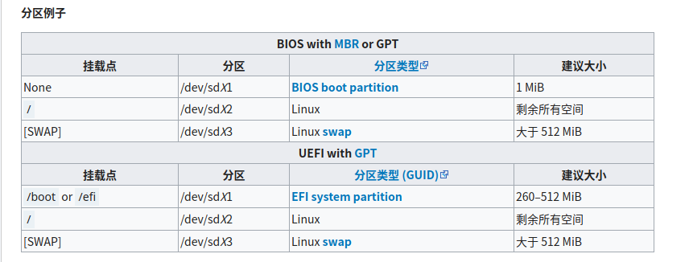

整理一下，方便以后安装Arch Linux

<!-- more -->

刻录u盘略过。。。

# 检测是否是UEFI启动

```
ls /sys/firmware/efi/efivars
```

- 文件不存在说明不是以UEFI启动

# 连接WIFI

```
wifi-menu
```

然后可以检测连接是否成功

```
ping -c 5 www.baidu.com
```

# 更新系统时间

### 操作

```
 timedatectl set-ntp true
```

查看服务状态

```
timedatectl status
```

### 原因

- 系统时间不对可能造成`ssl`连接失败导致安装出错

- 验证软件包签名，确定公钥过期没过期
- `https`证书，也要验过期时间

# 分区

### 检测分区情况

```
lsblk
```

### 分区

```
cfdisk /dev/sdx
```



### 格式化分区

1. 格式化成`ext4`

```
mkfs.ext4 /dev/sdX2
```

2. 格式`swap`分区并激活

```
mkswap /dev/sdX3
swapon /dev/sdX3
```

### 挂载分区

1. 首先将根分区 [挂载](https://wiki.archlinux.org/index.php/Mount) 到 `/mnt`

```
mount /dev/sdX2 /mnt
```

（可选）

2. 挂载`home`分区

```
mkdir /mnt/home
mount /dev/sdx3 /mnt/home
```

3. 挂载`boot`分区(uefi)

```
mkdir -p /mnt/boot/efi
mount /dev/sdx4 /mnt/boot/efi
```

# 安装

### 选择镜像源

```
vi /etc/pacman.d/mirrorlist
```

在列表中越前的镜像在下载软件包时有越高的优先权，将中科大源复制到第一行

### 安装基本系统

```
 pacstrap /mnt base base-devel
```

# 配置系统

### Fstab

用以下命令生成 [fstab](https://wiki.archlinux.org/index.php/Fstab) 文件 (用 `-U` 或 `-L` 选项设置UUID 或卷标)：

```
genfstab -U /mnt >> /mnt/etc/fstab
```

### Chroot

[Change root](https://wiki.archlinux.org/index.php/Change_root) 到新安装的系统：

```
arch-chroot /mnt
```

### 时区

设置时区

```
ln -sf /usr/share/zoneinfo/Asia/Shanghai /etc/localtime

```

硬件时间设置，默认为`UTC`时间

```
hwclock --systohc 
```

### 本地化

`/etc/locale.gen` 是一个仅包含注释文档的文本文件。指定您需要的本地化类型，只需移除对应行前面的注释符号（`＃`）即可，建议选择带 `UTF-8` 的项

```
# nano /etc/locale.gen
en_US.UTF-8 UTF-8
zh_CN.UTF-8 UTF-8
zh_TW.UTF-8 UTF-8
```

接着执行以生成 locale 讯息

```
 locale-gen
 echo LANG=en_US.UTF-8 > /etc/locale.conf
```

### 网络

设置主机名

```
echo cc > /etc/hostname
```

添加对应的信息到`host`

```
# nano /etc/hosts
127.0.0.1	localhost
::1		localhost
127.0.1.1	myhostname.localdomain	myhostname
```

### Root密码

```
passwd
```


### 安装引导

```
pacman -S grub
```

- 非uefi

```
grub-install --target=i386-pc /dev/sdx 
#/dev/sdx 是已经完成分区的磁盘，grub 将安装到它上面。
```

- uefi

```
grub-install --target=x86_64-efi --efi-directory=/boot/efi --bootloader-id=grub
# 注意要挂载/boot/efi，见上面挂载boot分区那步
```

生成主配置文件

```
 grub-mkconfig -o /boot/grub/grub.cfg
```

### 安装微码

```
pacman -S amd-ucode
```

### 无线连接

```
pacman -S iw wpa_supplicant dialog
```

# 重启

```
exit #返回安装环境
umount -R /mnt
reboot
```

# 配置新系统

### 换源

1. ustc置顶

```
vim /etc/pacman.d/mirrorlist
```

2. archlinuxcn

   在 `/etc/pacman.conf` 文件末尾添加两行

   ```
   [archlinuxcn]
   Server = https://mirrors.ustc.edu.cn/archlinuxcn/$arch
   ```

   然后请安装 `archlinuxcn-keyring` 包以导入` GPG key`。

### 桌面环境

1. 安装`xorg`

   `Xorg`是`Linux`下的一个著名的开源图形服务，我们的桌面环境需要`Xorg`的支持。

   ```
   pacman -S xorg-server xorg-xinit
   ```

2. 桌面环境

   - `xfce`

     ```
     pacman -S xfce4 xfce4-goodies
     ```

   - `KDE(Plasma)`

     ```
      pacman -S plasma kde-applications
     ```
     更多:[archwiki](https://wiki.archlinux.org/index.php/Desktop_environment_(%E7%AE%80%E4%BD%93%E4%B8%AD%E6%96%87)
3. 桌面管理器

   安装好了桌面环境包以后，我们需要安装一个图形化的桌面管理器来帮助我们登录并且选择我们使用的桌面环境，这里我推荐使用`sddm`。

   ```
   pacman -S sddm
   ```

4. 开机自启`sddm`服务

   ```
   systemctl enable sddm
   ```


### 新建用户

```
useradd -d /home cc
passwd cc
```

设置权限

```
nano /etc/sudoers
在 root ALL=(ALL) ALL 下面添加
用户名 ALL=(ALL) ALL
为你刚才创建的用户 添加sudo权限
```

