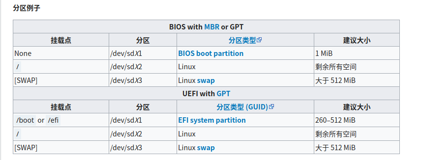
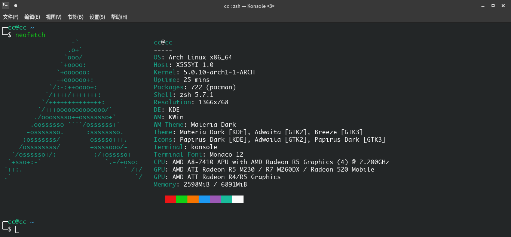
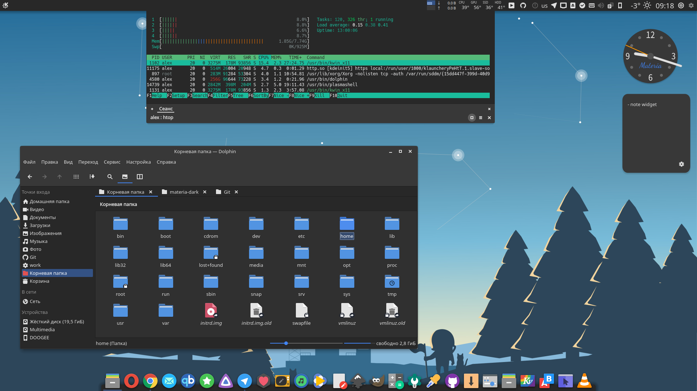
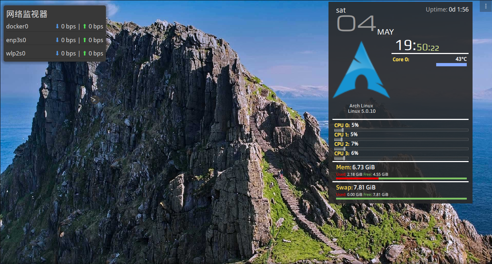

整理一下，方便以后安装Arch Linux

<!-- more -->

刻录u盘略过。。。

# 检测是否是UEFI启动

```
ls /sys/firmware/efi/efivars
```

- 文件不存在说明不是以UEFI启动

# 连接WIFI

```
wifi-menu
```

然后可以检测连接是否成功

```bash
ping -c 5 www.baidu.com
```

# 更新系统时间

## 操作

```
 timedatectl set-ntp true
```

## 查看服务状态

```
timedatectl status
```

原因

- 系统时间不对可能造成`ssl`连接失败导致安装出错

- 验证软件包签名，确定公钥过期没过期
- `https`证书，也要验过期时间

# 分区

## 检测分区情况

```
lsblk
```

## 分区

```
cfdisk /dev/sdx
```



## 格式化分区

- 格式化成`ext4`

```
mkfs.ext4 /dev/sdX2
```

- 格式`swap`分区并激活

```
mkswap /dev/sdX3
swapon /dev/sdX3
```

- 格式化`efi`分区

```
mkfs -t vfat /dev/sdX4
```

## 挂载分区

- 首先将根分区 [挂载](https://wiki.archlinux.org/index.php/Mount) 到 `/mnt`

```
mount /dev/sdX2 /mnt
```

（多个分区的情况下可选）

- 挂载`home`分区

```
mkdir /mnt/home
mount /dev/sdx3 /mnt/home
```

- 挂载`boot`分区(uefi)

```
mkdir -p /mnt/boot/efi
mount /dev/sdx4 /mnt/boot/efi
```

# 安装

## 选择镜像源

```
vi /etc/pacman.d/mirrorlist
```

在列表中越前的镜像在下载软件包时有越高的优先权，将清华源复制到第一行

## 安装基本系统

```
 pacstrap /mnt base base-devel
```

# 配置系统

## Fstab

用以下命令生成 [fstab](https://wiki.archlinux.org/index.php/Fstab) 文件 (用 `-U` 或 `-L` 选项设置UUID 或卷标)：

```
genfstab -U /mnt >> /mnt/etc/fstab
```

## Chroot

[Change root](https://wiki.archlinux.org/index.php/Change_root) 到新安装的系统：

```
arch-chroot /mnt
```

## 时区

设置时区

```
ln -sf /usr/share/zoneinfo/Asia/Shanghai /etc/localtime
```

硬件时间设置，默认为`UTC`时间

```
hwclock --systohc 
```

## 本地化

`/etc/locale.gen` 是一个仅包含注释文档的文本文件。指定您需要的本地化类型，只需移除对应行前面的注释符号（`＃`）即可，建议选择带 `UTF-8` 的项

```
# nano /etc/locale.gen
en_US.UTF-8 UTF-8
zh_CN.UTF-8 UTF-8
zh_TW.UTF-8 UTF-8
```

接着执行以生成 locale 讯息

```
 locale-gen
 echo LANG=en_US.UTF-8 > /etc/locale.conf
```

## 网络

设置主机名

```
echo cc > /etc/hostname
```

添加对应的信息到`host`

```
# nano /etc/hosts
127.0.0.1	localhost
::1		localhost
127.0.1.1	myhostname.localdomain	myhostname
```

## Root密码

```
passwd
```


## 安装引导

```
pacman -S grub efibootmgr
```

- 非uefi

```
grub-install --target=i386-pc /dev/sdx 
#/dev/sdx 是已经完成分区的磁盘，grub 将安装到它上面。
```

- uefi

```
grub-install --target=x86_64-efi --efi-directory=/boot/efi --bootloader-id=grub
# 注意要挂载/boot/efi，见上面挂载boot分区那步
```

生成主配置文件

```
 grub-mkconfig -o /boot/grub/grub.cfg
```

## 安装微码

```
pacman -S amd-ucode
```

## 无线连接

```
pacman -S iw wpa_supplicant dialog
```

# 重启

```
exit #返回安装环境
umount -R /mnt
reboot
```

# 配置新系统

## 新建用户

```
useradd -m -G wheel cc
passwd cc
```

设置权限

```
nano /etc/sudoers
在 root ALL=(ALL) ALL 下面添加
用户名 ALL=(ALL) ALL
为你刚才创建的用户 添加sudo权限
```

## 添加archcn源

在 `/etc/pacman.conf` 文件末尾添加两行

```
[archlinuxcn]
Server = https://mirrors.tuna.tsinghua.edu.cn/archlinuxcn/$arch
```

然后请安装 `archlinuxcn-keyring` 包以导入` GPG key`。

## 常用软件

```shell
 pacman -S git make cmake openssh gcc g++ gdb vim wget sshpass net-tools ntfs-3g
```

## linux-lts内核

更换为lts内核

```
 sudo pacman -S linux-lts
```

卸载原内核

```shell
$ pacman -Q | grep linux
archlinux-appstream-data 20190424-1
archlinux-keyring 20190123-2
archlinuxcn-keyring 20190422-1
libutil-linux 2.33.2-1
linux 5.0.10.arch1-1
linux-api-headers 5.0.7-1
linux-firmware 20190424.4b6cf2b-1
linux-lts 4.19.37-1
util-linux 2.33.2-1
$ pacman -R linux
$  sudo grub-mkconfig -o /boot/grub/grub.cfg
```

## 桌面环境



1. 安装`xorg`

   `Xorg`是`Linux`下的一个著名的开源图形服务，我们的桌面环境需要`Xorg`的支持。

   ```
   pacman -S xorg-server xorg-xinit
   ```

2. 桌面环境

   - `xfce`

     ```
     pacman -S xfce4 xfce4-goodies
     ```

   - `KDE(Plasma)`

     ```
      pacman -S plasma kde-applications
     ```
     更多:[archwiki](https://wiki.archlinux.org/index.php/Desktop_environment_(%E7%AE%80%E4%BD%93%E4%B8%AD%E6%96%87)
3. 桌面管理器

   安装好了桌面环境包以后，我们需要安装一个图形化的桌面管理器来帮助我们登录并且选择我们使用的桌面环境，这里我推荐使用`sddm`。

   ```
   pacman -S sddm
   ```

4. 开机自启`sddm`服务

   ```
   systemctl enable sddm
   ```

## yay

Arch拥有一个强大的用户库AUR即Arch User Repository，为我们提供了官方包之外的各种软件包，一些闭源的软件包也可以在上面找到，可以说AUR极大地丰富了软件包的种类与数量，并可以配合yay这样的工具为用户省下大量安装、更新软件包的时间。

yay实际上也是一个软件包，我们可以把它看成是对pacman的包装，它兼容pacman的所有操作，最大的不同是我们可以用它方便地安装与管理AUR中的包，下面的许多软件包都是在AUR库中的，也都是使用AUR来安装的。

**安装**

```shell
pacman -S yay
```

## zsh

- 安装

```shell
pacman -S zsh

#设置zsh为默认shell
sudo chsh -s /bin/zsh username

#安装oh-my-zsh
yay -S oh-my-zsh-git
```

---

**插件**

- zsh-autosuggestions

```shell
git clone https://github.com/zsh-users/zsh-autosuggestions ${ZSH_CUSTOM:-~/.oh-my-zsh/custom}/plugins/zsh-autosuggestions
```

- `zsh-syntax-highlighting`

```shell
git clone https://github.com/zsh-users/zsh-syntax-highlighting.git ${ZSH_CUSTOM:-~/.oh-my-zsh/custom}/plugins/zsh-syntax-highlighting
```

- 配置`~/.zshrc`

```she
plugins=( zsh-autosuggestions zsh-syntax-highlighting)
```

---

## 配置网络

- 安装networkmanager

``` shell
pacman -S networkmanager
```

- 设置开机自启并启用

```shell
systemctl enable NetworkManager
systemctl start NetworkManager
```

- 安装前端插件

  - GTK3+前端小程序，工作在Xorg环境下，带有一个系统托盘。 

    ```shell
    pacman -S network-manager-applet
    ```

  - kde可以只安装plasma-nm，然后通过 面板的选项 > 添加部件 > 网络 来把它添加到KDE的任务栏上。

## 中文输入法
**搜狗输入法**

```shell
 pacman -S fcitx fcitx-im fcitx-sogoupinyin fcitx-configtool zenity
```


装完以后需要修改`/etc/profile`文件，在文件开头加入三行

```shell
export XMODIFIERS="@im=fcitx"
export GTK_IM_MODULE="fcitx"
export QT_IM_MODULE="fcitx"
```
可以解决一些软件无法调出fcitx的问题。

## 字体

1. 安装字体

```shell
pacman -S ttf-dejavu ttf-monaco noto-fonts noto-fonts-cjk noto-fonts-emoji noto-fonts-extra otf-fira-code
```

2. 选择
   - 字体: `noto fonts cjk`,
   - 等宽字体: `Fira Code`或者`monaco`

3. 配置文件

```shell
# .config/fontconfig/fonts.conf

<?xml version='1.0'?>
<!DOCTYPE fontconfig SYSTEM 'fonts.dtd'>
<fontconfig>
    <alias>
        <family>serif</family>
        <prefer>
            <family>Noto Serif</family>
            <family>Noto Serif CJK SC</family>
            <family>Noto Serif CJK TC</family>
            <family>Noto Serif CJK JP</family>
            <family>Noto Serif CJK KR</family>
            <family>Noto Color Emoji</family>
            <family>Noto Emoji</family>
        </prefer>
    </alias>
    <alias>
        <family>sans-serif</family>
        <prefer>
            <family>Noto Sans</family>
            <family>Noto Sans CJK SC</family>
            <family>Noto Sans CJK TC</family>
            <family>Noto Sans CJK JP</family>
            <family>Noto Sans CJK KR</family>
            <family>Noto Color Emoji</family>
            <family>Noto Emoji</family>
        </prefer>
    </alias>
    <alias>
        <family>sans-sans</family>
        <prefer>
            <family>Noto Sans CJK SC</family>
            <family>Noto Sans CJK TC</family>
            <family>Noto Sans CJK JP</family>
            <family>Noto Sans CJK KR</family>
            <family>Noto Color Emoji</family>
            <family>Noto Emoji</family>
        </prefer>
    </alias>
    <alias>
        <family>tahoma</family>
        <prefer>
            <family>Noto Sans CJK SC</family>
            <family>Noto Color Emoji</family>
            <family>Noto Emoji</family>
        </prefer>
    </alias>
    <alias>
        <family>monospace</family>
        <prefer>
            <family>Fira Code</family>
            <family>Noto Sans CJK SC</family>
            <family>Noto Color Emoji</family>
            <family>Noto Emoji</family>
            <family>Noto Sans Mono</family>
            <family>DejaVu Sans Mono</family>
        </prefer>
    </alias>
    <alias>
        <family>emoji</family>
        <default>
            <family>Noto Color Emoji</family>
        </default>
    </alias>
    <alias>
        <family>Apple Color Emoji</family>
        <prefer>
            <family>Noto Color Emoji</family>
        </prefer>
        <default>
            <family>sans-serif</family>
        </default>
    </alias>
    <alias>
        <family>Segoe UI Emoji</family>
        <prefer>
            <family>Noto Color Emoji</family>
        </prefer>
        <default>
            <family>sans-serif</family>
        </default>
    </alias>
    <match target="font">
        <edit mode="assign" name="antialias">
            <bool>true</bool>
        </edit>
        <edit mode="assign" name="rgba">
            <const>rgb</const>
        </edit>
        <edit mode="assign" name="hinting">
            <bool>false</bool>
        </edit>
        <edit mode="assign" name="hintstyle">
            <const>hintnone</const>
        </edit>
    </match>
    <dir>~/.fonts</dir>
    <match target="font">
        <edit mode="assign" name="hinting">
            <bool>false</bool>
        </edit>
    </match>
    <match target="font">
        <edit mode="assign" name="hintstyle">
            <const>hintnone</const>
        </edit>
    </match>
</fontconfig>
```


参考:

[Localization/Simplified Chinese](https://wiki.archlinux.org/index.php/Localization/Simplified_Chinese_(%E7%AE%80%E4%BD%93%E4%B8%AD%E6%96%87))

[Font Configuration/Chinese](https://wiki.archlinux.org/index.php/Font_Configuration/Chinese_(%E7%AE%80%E4%BD%93%E4%B8%AD%E6%96%87))

[Arch Linux字体渲染(fontconfig)-fonts.conf参考](https://blog.firerain.me/article/14)

## synaps

Synapse是一个快速的软件启动器，可以方便地查找安装的软件，设置快捷键使用再也不用找软件入口了。

```she
pacman -S synapse
```

## 剪贴板

- 删除自带的`klipper`（kde）

```shell
rm -rf /usr/share/plasma/plasmoids/org.kde.plasma.clipboard
```

- 安装`copyq`

```shell
pacman -S copyq
```

## xournal

```shell
yay -S xournal
```

## VirtualBox

```shell
pacman -S virtualbox virtualbox-ext-vnc virtualbox-guest-iso virtualbox-host-modules-arch
```

再去官网下载Oracle VM VirtualBox Extension Pack ，在设置中导入使用。安装windows的过程不在这里讲解，记得安装之后在windows内安装扩展客户端软件即可。

## 系统备份

```shell
pacman -S timeshifts
systemctl enable --now cronie.service
```

## 声卡

```shell
pacman -S alsa-utils pulseaudio pulseaudio-bluetooth

#前端
pacman -S pavucontrol
```

## 蓝牙

```shell
sudo pacman -S bluez bluez-utils
sudo systemctl start bluetooth.service
sudo systemctl enable bluetooth.service
```

图形界面使用`blueman`

```shell
pacman -S blueman
```

为了消除登录时蓝牙请求权限，创建`/etc/polkit-1/rules.d/81-blueman.rules`

```shell
polkit.addRule(function(action, subject) {
  if (action.id == "org.blueman.rfkill.setstate" && subject.local && subject.active && subject.isInGroup("wheel")) {
      return polkit.Result.YES;
  }
  if (action.id == "org.blueman.network.setup" && subject.local && subject.active && subject.isInGroup("wheel")) {
      return polkit.Result.YES;
  }
});
```

## 文本工具

```shell
pacman -S foxitreader typora visual-studio-code-bin mousepad
```

## 编译器

```shell
pacman -S codeblocks
```

## 互联网工具

```shell
pacman -S firefox chromium filezilla teamviewer
```

**teamviewer not ready**

```shell
sudo systemctl start teamviewerd
sudo systemctl enable teamviewerd
```

## 图形软件

```shell
pacman -S flameshot nomacs
```

## jdk8

1. 到[https://www.oracle.com/technetwork/java/javase/downloads/jdk8-downloads-2133151.html](https://www.oracle.com/technetwork/java/javase/downloads/jdk8-downloads-2133151.html)下载jdk8

2. 解压并且配置环境变量

## 显卡

[Xorg - ArchWiki](https://wiki.archlinux.org/index.php/Xorg)

```shell
pacman -S xf86-video-amdgpu mesa
```

## 美化



```shell
# 主题Materia KDE
pacman -S materia-kde kvantum-theme-materia

# 图标papirus
pacman -S papirus-icon-theme

# 光标
yay -S capitaine-cursors
```

对应的介绍

- [Materia KDE](https://github.com/PapirusDevelopmentTeam/materia-kde)

- [papirus](https://github.com/PapirusDevelopmentTeam/papirus-icon-theme)
- [mac--capitaine-cursors](https://github.com/keeferrourke/capitaine-cursors)

## KDE系部分软件

```shell
pacman -S dolphin dolphin-plugins konsole ark
```

- Simple System Monitor

```shell
# 下载https://github.com/dhabyx/plasma-simpleMonitor/releases
plasmapkg2 -i plasma-simpleMonitor-0.6.plasmoid
```

- 桌面添加网络监视器



## 解决问题

- `systemd-backlight@backlight:acpi_video0.service failed`

添加backlight文件夹下的文件名到grub文件,然后禁止上面的service

```shell
$ ls /sys/class/backlight/
radeon_bl0
$ sudo vim /etc/default/grub
GRUB_CMDLINE_LINUX_DEFAULT="quiet acpi_backlight=radeon_bl0"
$ sudo grub-mkconfig -o /boot/grub/grub.cfg
$ sudo systemctl mask systemd-backlight@backlight:acpi_video0.service
$ reboot
```

## Docker

```shell
pacman -S docker
sudo systemctl enable docker
sudo systemctl start docker
sudo groupadd docker
sudo gpasswd -a ${USER} docker
```

## 划词翻译

参考：[https://blog.einverne.info/post/2018/08/goldendict.html](https://blog.einverne.info/post/2018/08/goldendict.html)

```shell
pacman -S goldendict
```

- 有道的源

`http://dict.youdao.com/search?q=%GDWORD%&ue=utf8`

- Chinese Wikipedia

`https://zh.wikipedia.org/w`

- Chinese Wiktionary

`https://zh.wiktionary.org/w`

## 16进制查看器

```she
pacmam -S ghex   #查看功能
pacman -S okteta #修改功能
```

## 离线文档管理

```shell
pacman -S zeal
#第三方源：https://zealusercontributions.now.sh/
```

## pip

```shell
pacman -S python-pip
```

