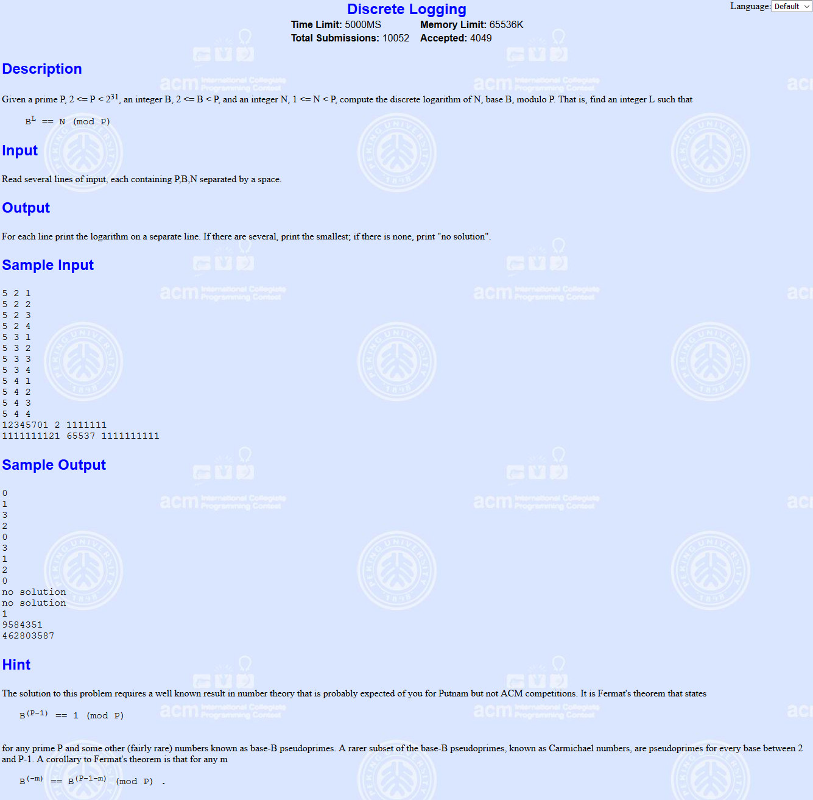

BSGS

<!-- more -->

#  BSGS(baby-step gaint-step)

该算法是指类似于$a^{x} \equiv b(\bmod p​$)的方程，已知a，b，p，求x的算法

**原始的BSGS只能解决p为质数的情况**

由费马小定理$a^{p-1} \equiv 1(\bmod p)​$（a，p互质）

同时拆开上面两式得

$a^{p-1} (\bmod p)= 1(\bmod p)​$

$a^{x} (\bmod p)= b(\bmod p)$

b最小取值1，而当$x=p-1$时正好为$b=1$，所以当b增大时，x须小于p-1，才能让b大于1，综合得

**解x满足$0 \leq x<p​$**

## 求解过程

设$m=\lceil\sqrt{p}\rceil​$（根号p向上取整），$x=Am-B(0 \leq A,B < m)​$

则由$a^{x} \equiv b(\bmod p)​$有$a^{Am- B} \equiv b(\bmod p)​$

即$\frac{a^{Am}}{a^{B}}\equiv b(\bmod p)​$

即$a^{Am }  \equiv b a^{B}(\bmod p)$

我们已知的是a，b，所以我们可以先算出等式右边的$ba^{B}​$的所有取值，用hash/map存下来，然后逐一计算$a^{Am}​$，枚举A，寻找是否有与之相等的$ba^{B}​$，从而我们可以得到所有的$x=A\lceil\sqrt{p}\rceil- B​$

注意到$A,B <\lceil\sqrt{p}\rceil$，所以时间复杂度为$O(\sqrt{p})$，用 map 的话会多一个 log

## 模板题--http://poj.org/problem?id=2417



```c++
/*
892K	32MS	
2019-04-19 00:13:27
*/
#include <cmath>
#include <cstdio>
#include <cstring>
#define MOD 76543
using namespace std;

int hs[MOD], head[MOD], next[MOD], id[MOD], top;

void insert(int x, int y)
{
    int k = x % MOD;
    hs[top] = x;
    id[top] = y;
    next[top] = head[k];
    head[k] = top++;
}
int find(int x)
{
    int k = x % MOD;
    for (int i = head[k]; i != -1; i = next[i])
        if (hs[i] == x)
            return id[i];
    return -1;
}
int BSGS(int a, int b, int n)
{
    memset(head, -1, sizeof(head));
    top = 1;
    if (b == 1)
        return 0;
    int m = sqrt(n * 1.0), j;
    long long x = 1, p = 1;
    for (int i = 0; i < m; i++, p = p * a % n)
        insert(p * b % n, i);
    for (long long i = m; ; i += m)
    {
        if ((j = find(x = x * p % n)) != -1)
            return i - j;
        if (i > n)
            break;
    }
    return -1;
}
int main()
{
    int a, b, n;
    while (~scanf("%d%d%d", &n, &a, &b))
    {
        int ans = BSGS(a, b, n);
        if (ans == -1)
            printf("no solution\n");
        else
            printf("%d\n", ans);
    }
}
```

