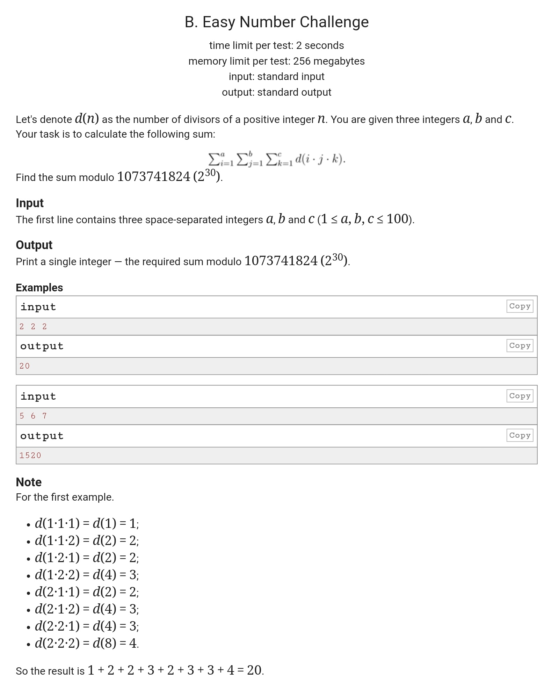

CodeForces-236B-求因子个数
<!-- more -->

# 题目



## 题目大意

先算出`q=i*j*k`，然后算q的因子的个数，最后把这个因子和加起来`mod`上一个数

记录下求解因子个数的办法

```c++
/*
2019-03-15 15:00:35
92ms
*/
#include <cstdio>
using namespace std;
const int MAXN = 1e6 + 10;
const int MOD = 1073741824;
int arr[MAXN];

void init()
{
	arr[1] = 1; 
	for(int i = 2; i < MAXN; i++) //初始化，每一个数最少有两个因子，１和它本身
		arr[i] = 2;
    
    //i*j得到一个数，代表这个数有因i和j，如果i,j相等,因子个数+1,否则+2
	for(int i = 2; i*i < MAXN; i++)　
		for(int j = i; j*i < MAXN; j++)
		{
			if(i != j)
				arr[i*j] += 2;
			else
				arr[i*j] += 1;
		}
}

int main()
{
	int a, b, c;
	int ans = 0;
	init();
	scanf("%d %d %d", &a, &b, &c);
	for(int i = 1; i <= a;i++)
		for(int j = 1; j <= b; j++)
			for(int k = 1; k <= c; k++)
			{
				ans += arr[i*j*k];
				if(ans > MOD)
					ans %= MOD;
			}
	printf("%d\n", ans); 
	return 0;
}

```

