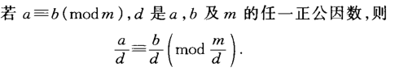
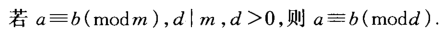
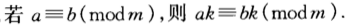
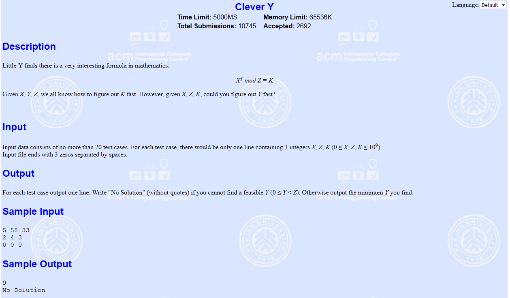

EXBSGS

<!-- more -->

$a^{x} \equiv b(\bmod p)$

BSGS只能求解p为素数的情况，EXBSGS可以完美解决这个问题，其基本思路就是通过转换，然后可以运用BSGS算法来求解，最终还是基于BSGS基础

# EXBSGS

参考：[https://www.cnblogs.com/TheRoadToTheGold/p/8478697.html](https://www.cnblogs.com/TheRoadToTheGold/p/8478697.html)

[https://blog.csdn.net/a_bright_ch/article/details/83513731](https://blog.csdn.net/a_bright_ch/article/details/83513731)

[https://www.cnblogs.com/lajioj/p/9529255.html](https://www.cnblogs.com/lajioj/p/9529255.html)

求解$a^{x} \equiv b(\bmod p)$（P不一定是质数）的最小非负正整数解

**先放三个同余定理**

- 定理1：



- 定理2：



- 定理3：



**求解**

1. 如果b==1，那么x=0，算法结束

2. 若gcd(a, p) != 1，令d=gcd(a, p)，若d不能整除b，则无解，算法结束，否则继续

   ```
   例如当x=1，a=4，p=8，b=3时，代入公式有4 mod 8和3 mod 8，此时d = gcd(a, p) = 4，说明a与p有因子为4，但是d不能整除b，说明b中没有共同因子，同样mod同一个数，没有共同因子，那么说明方程无解
   ```

3. 把一个a提取出来，$a^{x} \equiv b(\bmod p)$变成$a*a^{x-1} \equiv b(\bmod p)$

   同时除以d得$a^{x-1} * \frac{a}{d} \equiv \frac{b}{d}\left(\bmod \frac{p}{d}\right)$
   
4. 持续第三步除法，直到$\operatorname{gcd}\left(\mathrm{a}, \frac{p}{\prod_{i-1}^{k} d_{i}}\right)=1$

   此时有$a^{x-k} * \frac{a^{k}}{\prod_{i-1}^{k} d_{i}} \equiv \frac{b}{\prod_{i-1}^{k} d_{i}}\left(\bmod \frac{p}{\prod_{i-1}^{k} d_{i}}\right)$

5. 枚举 0<x<k，若有解，输出x，算法结束

6. 对于x>=k

   $a=a^{x-k}$, $b=\frac{b}{\prod_{i-1}^{k} d_{i}}$ , $p= \frac{p}{\prod_{i-1}^{k} d_{i}}$

   A，P 互素

   直接BSGS求$\frac{a^{k}}{\prod_{i-1}^{k} d_{i}}*a^{x} \equiv b ( \  mod\ p)$，所得结果+k即可

# 模板题http://poj.org/problem?id=3243



```c++
/*
hash版，省时间耗空间
2208K	63MS
2019-04-19 15:36:08
*/
#include<cstdio>
#include<cstdlib>
#include<cstring>
#include<iostream>
#include<cmath>
#include<algorithm>
using namespace std;

typedef long long LL;
const LL N = 40000, Max = (1 << 16) - 1;
bool bk;
LL X, Z, K, len;
bool vis[70000];
struct node{
	LL d, id, next;
}Hash[2 * Max];

int exgcd(LL a, LL b, LL &x, LL &y)
{
	if (b == 0) { x = 1, y = 0; return a; }
	LL tx, ty;
	LL d = exgcd(b, a%b, tx, ty);
	x = ty; y = tx - (a / b)*ty;
	return d;
}

void ins(LL d, LL id)
{
	LL t = d&Max;
	if (!vis[t]) {
		vis[t] = 1;
		Hash[t].d = d, Hash[t].id = id, Hash[t].next = -1;
		return;
	}
	for (; Hash[t].next != -1; t = Hash[t].next)
	{
		if (Hash[t].d == d) return;
	}
	Hash[t].next = ++len;
	Hash[len].d = d; Hash[len].id = id; Hash[len].next = -1;
}

LL find(LL d)
{
	LL t = d&Max;
	if (!vis[t]) return -1;
	for (; t != -1; t = Hash[t].next)
	{
		if (Hash[t].d == d) return Hash[t].id;
	}
	return -1;
}

LL BSGS()
{
	LL t, g, x, y, pm, a, b, c, m, k, sum, am;
	a = X; b = K; c = Z; k = 1; sum = 0; t = 1 % c;
	for (int i = 0; i <= 100; i++){
		if (t == b) return i;
		t = t*a%c;
	}
	while ((g = exgcd(X, c, x, y)) != 1)
	{
		k = (k*X / g) % c;
		c /= g;
		if (b%g) return -1;
		b /= g;
		sum++;
	}
	m = (LL)(ceil((double)sqrt((double)c)));
	ins(k, 0);
	t = k; pm = 1;
	for (int i = 1; i <= m; i++)
	{
		t = t*a%c, pm = pm*a%c;
		ins(t, i);
	}
	exgcd(pm, c, x, y);
	am = x%c + c;
	t = b;
	for (int i = 0; i <= m; i++)
	{
		x = find(t);
		if (x != -1) return i*m + x + sum;
		t = t*am%c;
	}
	return -1;
}

int main()
{
	while (scanf("%lld%lld%lld", &X, &Z, &K) != EOF && Z && X && K){
		K %= Z; len = Max;
		memset(vis, 0, sizeof(vis));
		LL ans = BSGS();
		if (ans != -1) printf("%lld\n", ans);
		else printf("No Solution\n");
	}
	return 0;
}
```

```c++
/*
二分版，耗时间省空间
1108K	313MS
2019-04-19 15:41:10
*/
#include<cstdio>
#include<cstdlib>
#include<cstring>
#include<iostream>
#include<cmath>
#include<algorithm>
using namespace std;

typedef long long LL;
const int N = 40000;
bool bk;
LL X, Z, K, a, b, c, m, k, sum, am, bl;
struct node{
	LL d, id;
}bit[N], p[N];

bool cmp(node x, node y){
	if (x.d != y.d) return x.d<y.d;
	return x.id<y.id;
}

LL gcd(LL u, LL v)
{
	if (v == 0) return u;
	return gcd(v, u%v);
}

LL find(LL x)
{
	int l = 0, r = bl;
	while (l <= r)
	{
		int mid = (l + r) >> 1;
		if (bit[mid].d == x) return bit[mid].id;
		if (bit[mid].d>x) r = mid - 1;
		if (bit[mid].d<x) l = mid + 1;
	}
	return -1;
}

void exgcd(LL u, LL v, LL &x, LL &y)
{
	if (v == 0) { x = 1, y = 0; return; }
	LL tx, ty;
	exgcd(v, u%v, tx, ty);
	x = ty; y = tx - (u / v)*ty;
	return;
}

LL BSGS()
{
	LL t, g, x, y, pm;
	a = X; b = K; c = Z; k = 1; sum = 0; bk = 1; bl = 0; t = 1 % c;
	for (int i = 0; i <= 100; i++){//避免a的负数次方
		if (t == b) return i;
		t = t*a%c;
	}
	while ((g = gcd(X, c)) != 1)
	{
		k = (k*X / g) % c;//k记得要mod，否则溢出
		c /= g;
		if (b%g) return -1;
		b /= g;
		sum++;
	}
	m = (LL)(ceil((double)sqrt((double)c)));//要约分之后再求m
	p[0].d = k%c;
	p[0].id = 0;
	pm = 1;//pm是不用*k的
	for (int i = 1; i <= m; i++)
		p[i].d = p[i - 1].d*a%c, pm = pm*a%c, p[i].id = i;
	sort(p, p + 1 + m, cmp);
	bit[0] = p[0]; bl = 0;
	for (int i = 1; i <= m; i++)
	{
		if (p[i].d != p[i - 1].d) bit[++bl] = p[i];
	}
	exgcd(pm, c, x, y);
	am = (x%c + c);//避免am=0

	t = b;
	x = find(b);
	if (x != -1) return x;
	for (int i = 1; i <= bl; i++)
	{
		t *= am; t %= c;
		x = find(t);
		if (x != -1)
			return i*m + x;
	}
	return -1;
}

int main()
{
	while (~scanf("%lld%lld%lld", &X, &Z, &K) && X && Z && K){
		if (!X && !Z && !K) return 0;
		K %= Z;
		LL ans = BSGS();
		if (ans != -1) printf("%lld\n", ans + sum);
		else printf("No Solution\n");
	}
	return 0;
}
```

