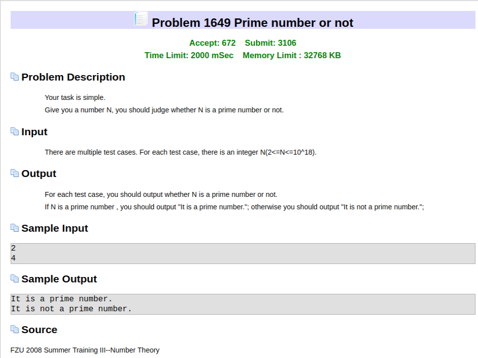

FZU-1649-PrimeNumberOrNot-大素数判断
<!-- more -->

# 题目

## [FZU-1649](<http://acm.fzu.edu.cn/problem.php?pid=1649>)



# 思路

普通素数筛法不能用于大数。此时只能用别的算法----米勒-拉宾素数测试

我们知道对于某个素数P,由费马定理得
$$
a^p \ mod \ p \equiv a
$$
于是就有了希望使用这个来判断某个p是否是素数

------

**但$a^p \ mod \ p \equiv a​$不是`p是素数`的充分条件**

***存在有名但是极端稀少的Carmichael数，它们不是素数但是满足费马小定理，比如561, 1105, 1729, 2465, 2821,6601, 8911, 10585, 15841, 29341...。***

所以如果我们只是随机的从`1`和`p-1`之间（这里p是一个待判断的正整数）取一个数a计算$a^p \ mod \ p \equiv a$的值，如果该值不是a，那么我们100%肯定p不是素数。但**如果$a^p \ mod \ p \equiv a$的值是a，p可能是素数也可能不是。**

--------

费马小定理的一个特殊情况，如果n是一个素数，那么`phi(n)=n-1`，而任意不大于n的数a都与n互质，于是费马小定理的推论为：
$$
a^{n-1}=1\ mod\ n\ (当n为素数，而a为任意整数时)
$$
即一个数字n为素数的必要条件是对于任意`a<n`，都有$a^{n-1}\ mod\ n = 1​$

--------

但是这是必要条件，根据计算，如果n为任意数字，单独任取一个`a<n`，当$a^{n-1}\ mod\ n = 1$成立时，**有`25%`可能性n为合数**

**所以我们可以通过多次随机选择不同的a，如果上面测试都被通过，我们就可以说n有很大的可能是素数。这种算法``是米勒-拉宾素数测试`。**

----------

注意:

在计算$a^{n-1}\ mod\ n$的时候，n可能很大，所以$a^{n-1}$可能越界，就需要用快速幂取模，但a很大的时候`a*a`也可能越界，就需要用快速乘法（基于快速幂）

参考：[<https://blog.csdn.net/qq_40889820/article/details/82145736>](https://blog.csdn.net/qq_40889820/article/details/82145736)

```c++
/*
1046ms
2019-03-16 16:46:15
*/
#include <cstdio>
#include <cstdlib>
#include <iostream>
#include <ctime>
using namespace std;
#define random(a, b) (rand()%(b-a+1)+a)  //取得在[a,b]间的随机数
typedef long long ll;
typedef long double ld;

ll mul(ll a, ll b, ll MOD) //快速乘法
{
    return (a * b - (ll)((ld)a / MOD * b) * MOD + MOD) % MOD;
}

ll mod_pow(ll x, ll n, ll mod)//快速幂
{
    ll ans = 1;
    while(n > 0)
    {
        if(n & 1)
            ans = mul(ans, x, mod);
        x = mul(x, x, mod);
        n >>= 1;
    }
    return ans;
}

bool is_prime(ll n)
{
    if(n == 2)
        return true;
    else if(n % 2 == 0)
        return false;
    srand((unsigned)time(NULL));
    for(int i = 1; i <= 1000; i++)
    {
        ll a = random(1, n-1); //取得在[1,n-1]的随机数
        if(mod_pow(a, n-1, n) != 1)
            return false;
    }
    return true;
}

int main()
{
	ll num;
	ios::sync_with_stdio(false);
	cin.tie(0);cout.tie(0);
	while(cin>>num)
	{
		if(is_prime(num))
		    cout<<"It is a prime number."<<endl;
		else cout<<"It is not a prime number."<<endl;
	}
}
```

