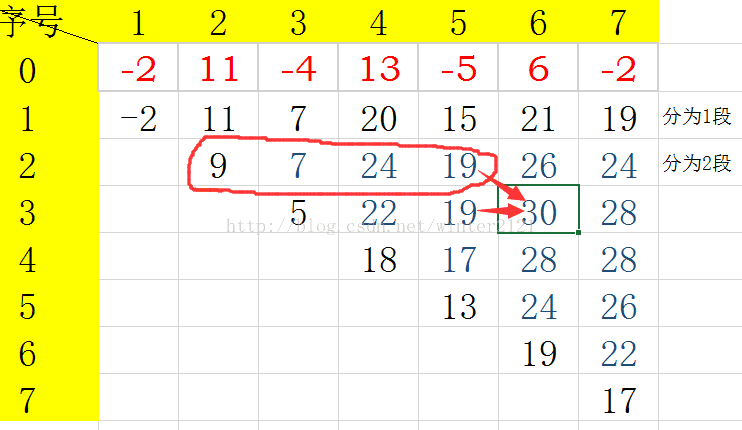

HDU1024-Max Sum Plus Plus

<!-- more -->

# [HDU1024](http://acm.hdu.edu.cn/showproblem.php?pid=1024)


# 解析

## 题意

在n个数中选出m组数, 每组数连续且不能相交,使得这m组的和是所有m组数中最大的。

每组数也可以叫做每一段

例如:

```
2 6 -1 4 -2 3 -2 3
选两组数,当我们选{4,-2,3},{3}这两组数时可得到最大的和8
```

## DP

参考：

[https://blog.csdn.net/zuzhiang/article/details/78450380](https://blog.csdn.net/zuzhiang/article/details/78450380)

**`定义二维数组dp，dp[i][j]，表示前 j 项所构成 i 子段的最大和，且必须包含着第j项，即以第j项结尾`**

求`dp[i][j]`，有两种情况:

- `dp[i][j] = dp[i][j-1]+a[j] `，把第j项融合到第 j-1 项的子段中，子段数没变
- `dp[i][j] = dp[i-1][t]+a[j]（i-1<= t<j）`,把第 j 项作为单独的一个子段，然后找一下i-1个子段时，最大的和，然后加上a[ j ] ，字段数由i-1变成i

然后比较上面两种情况，取最大的。即

`dp[i][j] = max(dp[i][j-1]+a[j], dp[i-1][t]+a[j])`



如图，要求`dp[3][6]`，只需比较他左边的那个，和上面那一行圈起来的之中最大的数，再加上a[ j ] 即为`dp[3][6]` 的值。

**优化**

1. 每确定一个`dp[ i ][ j ]`，只需用到本行和上一行，所以不用开二维数组也可以，省内存。类似于01背包。所以可以开两个一维数组，pre和dp，pre记录上一行，dp记录当前行

2. 对上一行红圈中的数字找最大值时，可以在每次计算dp之前，同时记录下j前面的最大元素。避免一次循环来查找。

```c++
/*
468MS	9596K
2019-04-15 18:37:21	
*/
#include <cstdio>
#include <cstring>
#include <algorithm>
#include <iostream>
using namespace std;
const int INF = 0X3F3F3F3F;
const int MAXN = 1E6+10;
int dp[MAXN], pre[MAXN], arr[MAXN];
int main()
{
    int n, m;
    while(scanf("%d %d", &m, &n) != EOF)
    {
        memset(dp, 0, sizeof(dp));
        memset(pre, 0 ,sizeof(pre));
        for(int i = 1; i <= n; i++)
            scanf("%d", &arr[i]);
        int tmp;
        for(int i = 1; i <= m; i++)
        {
            tmp = -INF;
            for(int j = i; j <= n; j++)
            {
                dp[j] = max(dp[j-1], pre[j-1])+arr[j];
                pre[j-1] = tmp;
                tmp = max(tmp, dp[j]);
            }
        }
        printf("%d\n", tmp);
    }
    return 0;
}
```

