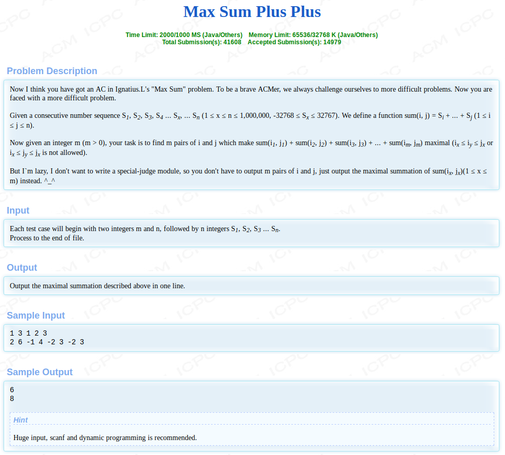

HDU1024-Max Sum Plus Plus

<!-- more -->

# [HDU1024](http://acm.hdu.edu.cn/showproblem.php?pid=1024)



# 解析

## 题意

在n个数中选出m组数, 每组数连续且不能相交,使得这m组的和是所有m组数中最大的。

每组数也可以叫做每一段

例如:

```
2 6 -1 4 -2 3 -2 3
选两组数,当我们选{4,-2,3},{3}这两组数时可得到最大的和8
```

## DP

参考:[http://www.voidcn.com/article/p-ftwqucfz-rx.html](http://www.voidcn.com/article/p-ftwqucfz-rx.html)

[https://blog.csdn.net/a1097304791/article/details/87872686](https://blog.csdn.net/a1097304791/article/details/87872686)

[https://www.cnblogs.com/dongsheng/archive/2013/05/28/3104629.html](https://www.cnblogs.com/dongsheng/archive/2013/05/28/3104629.html)

我们可以很清楚地得，这是一个顺序DP，由ix<=iy可得。

那它在当前位置或者称为状态，又能做出几个决策才能保证到目前状态是最大的呢？

当然是逐步取其上一状态的最大值。

**综上所述就可以得此模糊状态转移方程：`dp[i][j] =MAX(dp[?][?],dp[??][??]`) （或者是三个或者更多）**


**设`dp[i][j]` 为前j个数字组成i段的最大和,且最后一个字段以第j项结尾。保存数据的数组为arr**

因为必须是以 `arr[j] `结尾的，所以`arr[j]`一定属于最后一个子段，即要么自己独立成一个子段，要么与前边以`arr[j-1]`结尾的子段联合。所以有

```c++
dp[i][j]=max(dp[i][j-1]+num[j],dp(i-1,t)+num[j])  //其中i-1<=t<=j-1
```

- `dp[i][j-1]+num[j]`表示与前边以`arr[j-1]`结尾的子段联合，

- `dp(i-1,t)+num[j]`表示自己独立成一个子段，即前t个数组成的i-1个段再加上第j个项

涉及到三个不同的变量，所以该算法的时间复杂度几乎为O(n^3)，又n<=1000000，所以该办法不可取


由上面的转移方程可知，我们只要找到`dp[i][j-1]`和`dp[i-1][t]`的最大值加上`arr[j]`即为`dp[i][j]`.

所以，定义一个数组`pre_max[n]`，用`pre_max[j-1]`来表示求解`dp[i][j]`时`dp[i-1][t]`的最大值,则`dp[i][j]=max(pre_max[j-1],dp[i][j-1])+num[j]`。


