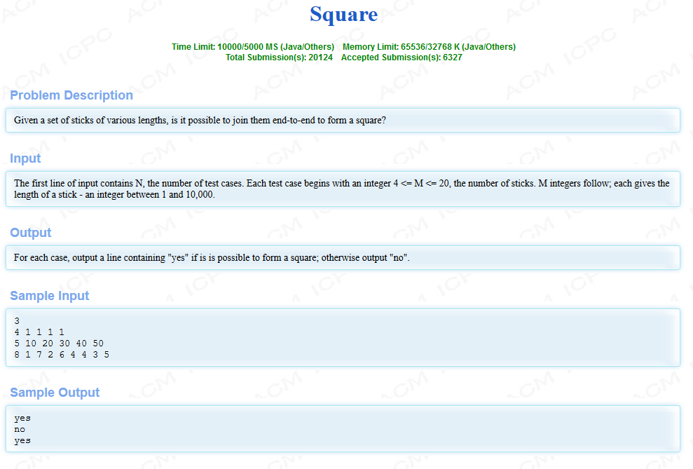

HDU1518---Square

<!-- more -->

# 题目

链接：[HDU1518](http://acm.hdu.edu.cn/showproblem.php?pid=1518)



# 分析

参考：[https://blog.csdn.net/guodongxiaren/article/details/23126997](https://blog.csdn.net/guodongxiaren/article/details/23126997)

题意就是好多棍子，看能不能拼成正方形。主要注意的有几点：

- 所有棍子都要用到，不能剩余
- 输入已经保证大于4根棍子了。所以无需判断可能小于3根棍子的情况
- 棍长的总数首先要是4的倍数，才能进行。否则直接输出 “no”
- 当前面前提满足以后，再满足3 根棍子拼好，就完工了。最后一根一定能拼好。

解法就是运用dfs方法不断尝试，当一个结果不符合题意时，就回溯到上一个结果。

此外，我们还可以提前对数据进行排序，将数据从大到小排序，以提高查找速率。

```c++
/*
421MS	1320K
2019-04-12 22:40:37
*/
#include <cstdio>
#include <cstring>
#include <algorithm>
using namespace std;
const int MAXN  =1E5+10;
int arr[MAXN]; //存储木棍长度
bool vis[MAXN]; //代表此木棍有没有被用过
int one, n, t; //one:正方形一条边长度
bool cmp(int a, int b)
{
    if(a > b)
        return true;
    return false;
}
//num:已经边的个数，pos:现在遍历的第几根棍子，res:要凑成目标长度剩余的长度
bool dfs(int num, int pos, int res) 
{
    if(num == 3) //3条边拼好就能保证都拼好
        return true;
    for(int i = pos; i < n; i++)
    {
        if(vis[i])
            continue;
        vis[i] = true;
        if(arr[i] == res) //拼好了一条边，所以递归下一个棍子要拼的状态
        {
            if(dfs(num+1, 0, one))
                return true;
        }
        //如果第i根棍子的长度小于目前所需的。那么也把它加上
        else if(arr[i] < res) 
        {
            if(dfs(num, i+1, res-arr[i]))
                return true;
        }
        /*前面如果满足的话，就会返回true。而不执行这一句
         *如果能走到这句，那么就是说前面的情况都不成功，
         *也就是说这根棍子不能凑近去，所以要推翻加入这根棍子的方案
        */
        vis[i] = false;
    }
    return false;
}

int main()
{
    scanf("%d", &t);
    while(t--)
    {
        scanf("%d", &n);
        int cnt = 0;
        for(int i = 0; i < n; i++)
        {
            scanf("%d", &arr[i]);
            cnt += arr[i];
        }
        if(cnt % 4 != 0)
        {
            printf("no\n");
            continue;
        }
        one = cnt / 4;
        memset(vis, false, sizeof(vis));
        sort(arr, arr+n, cmp);
        if(dfs(0,0,one))
            printf("yes\n");
        else
            printf("no\n");
    }
    return 0;
}
```

