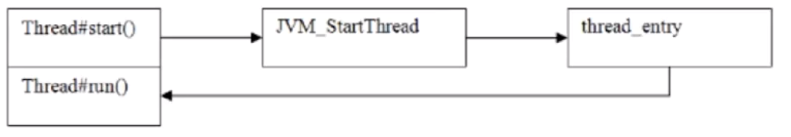

尝试从源码分析start与run的区别，Thread与Runnable的区别

<!-- more -->

# start与run

先来看两个程序

```java
package indi.greenhat.thread;

/**
 * @description: runable与start的区别
 * @author: GreenHatHG
 * @create: 2019-07-23 09:02
 **/
public class Thread1 {

    private static void attack(){
        System.out.println("attack");
        System.out.println("Current Thread is: " + Thread.currentThread().getName());
    }

    public static void main(String[] args) {
        Thread t = new Thread(){

            @Override
            public void run(){
                attack();
            }
        };

        System.out.println("current main thread is: " + Thread.currentThread().getName());
        t.run();
    }
    
}
```

程序输出:

```java
current main thread is: main
attack
Current Thread is: main
```

然后启动线程那里，改为

```java
t.start();
//之前是t.run()
```

程序输出:

```java
current main thread is: main
attack
Current Thread is: Thread-0
```

----------

从程序运行的结果很简单的看出，使用`run()`方法会使用主线程来运行，而`start()`方法则使用非主线程来运行

## start

```java
/**
 * Java虚拟机调用此线程的run方法，使该线程开始执行
 * 结果是两个线程并发运行：当前线程（从调用start方法返回）和另一个线程（执行其run方法）。
 * 多次启动线程是不合法的。特别是，一旦完成执行，线程可能无法重新启动。
 * 如果该线程已经启动，则再次调用start()方法，就会抛出IllegalThreadStateException异常。
 */
public synchronized void start() {
        /**
         * 此方法不会被VM创建或者是设置的主线程或“系统”组线程调用
         * 将来添加到该方法中的任何新功能可能也必须添加到VM中。
         * 
         * 新的线程threadState值是0
         */
        if (threadStatus != 0)
            throw new IllegalThreadStateException();

        /**
         * 通知线程组该线程将要开始运行，这样该线程就会被添加到线程列表中
         * 此时列表的unstarted数将会减少。
         */
        group.add(this);

        boolean started = false;
        try {
            // 调用原生方法态方法启动线程
            start0();
            // 已经运行的标记设置为true
            started = true;
        } finally {
            try {
                if (!started) {
                    group.threadStartFailed(this);
                }
            } catch (Throwable ignore) {
                //若开始运行标记未设置成功，则通知线程组该线程尝试运行失败
            }
        }
    }
```

再看该方法里面的`start0()`方法

```java
private native void start0();
	/**
	 * 如果该线程是使用独立的Runnable运行对象构造的,则调用该Runnable对象的run方法
	 * 否则，此方法不执行任何操作并返回
	 * Thread的子类应该重写此方法。
	 */
    @Override
    public void run() {
        if (target != null) {
            target.run();
        }
    }
```

`start0()`是`native`方法，我们可以查看`openjdk`里面对应的实现[Thread.c](http://hg.openjdk.java.net/jdk8/jdk8/jdk/file/687fd7c7986d/src/share/native/java/lang/Thread.c)

```c++
...
static JNINativeMethod methods[] = {
    {"start0",           "()V",        (void *)&JVM_StartThread},
    ...
```

可以看到，它是调用的`JVM`的`JVM_StartThread`方法

然后再去看对应的源码[jvm.cpp](http://hg.openjdk.java.net/jdk8/jdk8/hotspot/file/87ee5ee27509/src/share/vm/prims/jvm.cpp)

```c++
...
JVM_ENTRY(void, JVM_StartThread(JNIEnv* env, jobject jthread))
  JVMWrapper("JVM_StartThread");
  JavaThread *native_thread = NULL;
	...
  native_thread = new JavaThread(&thread_entry, sz);
...
```

可以看到，会通过`new JavaThread`方法创建一个新的线程，再看其形参`thread_entry`

```c++
static void thread_entry(JavaThread* thread, TRAPS) {
  HandleMark hm(THREAD);
  Handle obj(THREAD, thread->threadObj());
  JavaValue result(T_VOID);
  JavaCalls::call_virtual(&result,
                          obj,
                          KlassHandle(THREAD, SystemDictionary::Thread_klass()),
                          vmSymbols::run_method_name(),
                          vmSymbols::void_method_signature(),
                          THREAD);
}
```

可以看到`thread_entry`会通过让虚拟机创建一个线程，然后去执行`run()`方法里面的内容

## 总结

从上面的源码执行过程来看，它们的调用如下：



- 调用`start()`方法会创建一个新的子线程并启动

- `run()`方法只是`Thread`的一个普通方法调用

  

# Thread与Runnable

`Thread`是一个类，其实现了`Runnable`接口

```java
public
class Thread implements Runnable {
    ...
}
```

```java
public interface Runnable {
    /**
     * Runnable接口实现的类，应该是任何实例想要由线程执行的类
     * 该类必须定义一个没有参数的方法，称为run
     * 设计该接口的目的是希望为在活动时执行代码的对象提供通用协议
     * 例如，Runnable由Thread类实现。
     * 活动只是意味着一个线程已经启动但尚未停止
     * 此外，Runnable为非Thread子类别的类别提供了一种启动方式
     * 通过实例化某个Thread实例并将自身作为运行目标，就可以运行为Runnable的类别而无需创建Thread的子类别。
     */
    public abstract void run();
}
```

上面看来，`Runnable`接口并没有具备多线程的特性，是依赖`Thread`里面的`start()`方法去创建一个子线程

看下面例子

```java
package indi.greenhat.thread;

/**
 * @description: Thread与Runnable区别
 * @author: GreenHatHG
 * @create: 2019-07-23 10:18
 **/
public class Thread2 extends Thread{
    private String name;
    public Thread2(String name){
        this.name = name;
    }

    @Override
    public void run(){
        for(int i = 0; i < 4; i++){
            System.out.println("Thread start: " + this.name + ",i: " + i);
        }
    }

    public static void main(String[] args) {
        Thread2 th1 = new Thread2("threa1");
        Thread2 th2 = new Thread2("threa2");
        Thread2 th3 = new Thread2("threa3");
        th1.start();
        th2.start();
        th3.start();
    }
}
```

运行结果：

```java
Thread start: threa1,i: 0
Thread start: threa1,i: 1
Thread start: threa1,i: 2
Thread start: threa1,i: 3
Thread start: threa2,i: 0
Thread start: threa2,i: 1
Thread start: threa2,i: 2
Thread start: threa2,i: 3
Thread start: threa3,i: 0
Thread start: threa3,i: 1
Thread start: threa3,i: 2
Thread start: threa3,i: 3
```
---

```java
package indi.greenhat.thread;

/**
 * @description: Thread与Runnable区别
 * @author: GreenHatHG
 * @create: 2019-07-23 10:24
 **/
public class MyRunnable implements Runnable{
    private String name;
    public MyRunnable(String name){
        this.name = name;
    }

    @Override
    public void run(){
        for(int i = 0; i < 4; i++){
            System.out.println("MyRunnable start: " + this.name + ",i: " + i);
        }
    }

    public static void main(String[] args) {
        MyRunnable th1 = new MyRunnable("threa1");
        MyRunnable th2 = new MyRunnable("threa2");
        MyRunnable th3 = new MyRunnable("threa3");
        Thread t1 = new Thread(th1);
        Thread t2 = new Thread(th2);
        Thread t3 = new Thread(th3);
        t1.start();
        t2.start();
        t3.start();
    }
}
```

运行结果：

```java
Thread start: threa3,i: 0
Thread start: threa3,i: 1
Thread start: threa3,i: 2
Thread start: threa3,i: 3
Thread start: threa1,i: 0
Thread start: threa1,i: 1
Thread start: threa1,i: 2
Thread start: threa1,i: 3
Thread start: threa2,i: 0
Thread start: threa2,i: 1
Thread start: threa2,i: 2
Thread start: threa2,i: 3
```

总结：

- `Thread`是实现了`Runnable`接口的类，使得`run`支持多线程
- 因类的单一继承原则，推荐多使用`Runnable`接口


----

参考：

[同一个线程多次调用start()会出现的问题 - 风止雨歇 - 博客园](https://www.cnblogs.com/yufeng218/p/9940562.html)

---

