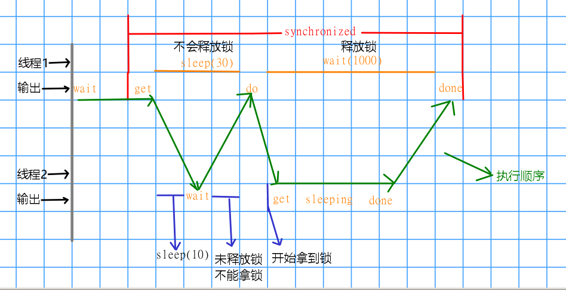
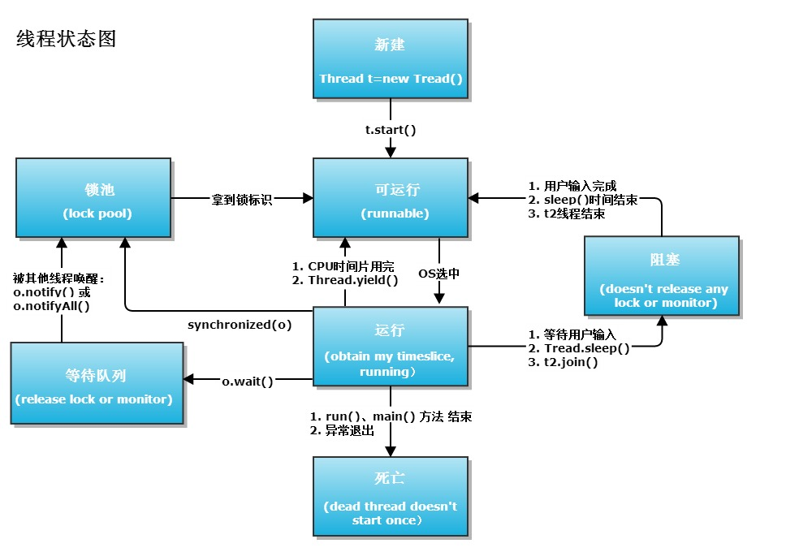

线程的6种状态，sleep与wait的区别

<!-- more -->

# 线程的状态

## 初识6种状态

由jdk8中的`java.lang.Thread.State`可知，


线程有6个状态

- NEW 
  尚未启动的线程处于此状态。
- RUNNABLE
  在Java虚拟机中执行的线程处于此状态。
- BLOCKED
  被阻塞等待监视器锁定的线程处于此状态。
- WAITING
  正在等待另一个线程执行特定动作的线程处于此状态。
- TIMED_WAITING
  正在等待另一个线程执行动作达到指定等待时间的线程处于此状态。
- TERMINATED
  已退出的线程处于此状态。

一个线程可以在给定时间点处于一个状态。 这些状态是不反映任何操作系统线程状态的虚拟机状态。

`Thread.State`继承关系：

> public static enum Thread.State extends Enum<Thread.State>
>
> java.lang.Object
>
> ​	java.lang.Enum<Thread.State>
>
> ​		java.lang.Thread.State


(图源：[Java线程及线程池状态 - 时间朋友 - 博客园](https://www.cnblogs.com/doit8791/p/9067073.html))


(图源：[线程状态 - 神评网](http://www.ishenping.com/ArtInfo/1194756.htmll))

## 6种状态解释

### 初始(NEW)

新创建了一个线程对象，但还没有调用`start()`方法。

实现`Runnable`接口和继承`Thread`可以得到一个线程类，`new`一个实例出来，线程就进入了初始状态。

### 运行(RUNNABLE)

**`Java`线程中将就绪（`ready`）和运行中（`running`）两种状态笼统的称为“运行”。**

- 线程对象创建后，其他线程(比如`main`线程）调用了该对象的`start()`方法。该状态的线程位于可运行线程池中，等待被线程调度选中，获取`CPU`的使用权，此时处于就绪状态（`ready`）。就绪状态只是说你资格运行，调度程序没有挑选到你，你就永远是就绪状态。除了`start()`方法让线程进入就绪状态，下面三种情况也可以：
  - 当前线程`sleep()`方法结束，其他线程`join(`)结束，等待用户输入完毕，某个线程拿到对象锁，这些线程也将进入就绪状态。
  - 当前线程时间片用完了，调用当前线程的`yield()`方法，当前线程进入就绪状态。
  - 锁池里的线程拿到对象锁后，进入就绪状态。

- 就绪状态的线程在获得CPU时间片后变为运行中状态（`running`）。

### 阻塞(BLOCKED)

表示线程阻塞于锁。

是线程阻塞在进入`synchronized`关键字修饰的方法或代码块(获取锁)时的状态。

### 等待(WAITING)

进入该状态的线程需要等待其他线程做出一些特定动作（通知或中断）。

处于这种状态的线程不会被分配`CPU`执行时间，它们要等待被显式地唤醒，否则会处于无限期等待的状态。

### 超时等待(TIMED_WAITING)

该状态不同于`WAITING`，它可以在指定的时间后自行返回。

*处于这种状态的线程不会被分配CPU执行时间，不过无须无限期等待被其他线程显示地唤醒，在达到一定时间后它们会自动唤醒。*

### 终止(TERMINATED)

表示该线程已经执行完毕。

1. 当线程的`run()`方法完成时，或者主线程的`main()`方法完成时，我们就认为它终止了。这个线程对象也许是活的，但是，它已经不是一个单独执行的线程。线程一旦终止了，就不能复生。

2. 在一个终止的线程上调用`start()`方法，会抛出`java.lang.IllegalThreadStateException`异常。

```java
package thread;

/**
 * @author GreenHatHG
 * @create 2019-08-04 10:52
 */
public class Demo01 {
    private static void attack(){
        System.out.println("Fight");
        System.out.println("Current Thread is: " + Thread.currentThread().getName());
    }

    public static void main(String[] args) throws InterruptedException {
        Thread t = new Thread(){
            public void run(){
                attack();
            }
        };
        System.out.println("Current main thread is: " + Thread.currentThread().getName());
        t.start();
        //结束线程
        t.join();
        //线程不会复活，抛出异常
        t.start();
    }
}
```

```java
Current main thread is: main
Fight
Current Thread is: Thread-0
Exception in thread "main" java.lang.IllegalThreadStateException
	at java.lang.Thread.start(Thread.java:708)
	at thread.demo01.main(demo01.java:24)
```


(图源：[Java线程的6种状态及切换(透彻讲解) - 潘建南的博客 - CSDN博客](http://www.ishenping.com/ArtInfo/1194756.htmll))

# sleep与wait的区别

- `jdk8`中的`sleep`

```java
/**
 * 导致当前正在执行的线程休眠（暂时停止执行）指定的毫秒数
 * 具体取决于系统计时器和调度程序的精度和准确性。
 * 该线程不会失去任何monitor的所有权。
 */
java.lang.Thread public static void sleep(long millis)
throws InterruptedException
```

- `jdk8`中的`wait`

```java
java.lang.Object public final void wait(long timeout)
throws InterruptedException
```

区别：


1. `sleep`是`Thread`类的方法,`wait`是`Object`类中定义的方法

2. `sleep`可以在任何地方使用； 而`wait`只能在`synchronize`方法或者`synchronize`块中使用
3. **`Thread.sleep`只会让出`CPU`，不会导致锁行为的改变；`Object.wait`不仅让出`CPU`，还会释放已经占有的同步资源锁**

总结起来就是：

- `sleep`方法是`Thread`类里面的，主要的意义就是让当前线程停止执行，让出`CPU`给其他的线程，但是不会释放对象锁资源以及监控的状态，当指定的时间到了之后又会自动恢复运行状态。
- `wait`方法是`Object`类里面的，主要的意义就是让线程放弃当前的对象的锁，进入等待此对象的等待锁定池，只有针对此对象调动`notify`方法后本线程才能够进入对象锁定池准备获取对象锁进入运行状态。

```java
package thread;

/**
 * @author GreenHatHG
 * @description sleep与wait
 * @create 2019-08-05 15:14
 */
public class Demo2 {
    public static void main(String[] args) {
        final Object lock = new Object();
        new Thread(new Runnable() {
            @Override
            public void run() {
                try {
                    System.out.println("Thread A is waiting to get lock");
                    //获取同步锁才能执行里面的代码
                    synchronized (lock) {
                        System.out.println("Thread A get lock");
                        Thread.sleep(30);
                        System.out.println("Thread A do wait method");
                        //等待1s自动被唤醒
                        lock.wait(1000);
                        System.out.println("Thread A is done");
                    }
                }catch (Exception e){
                    e.printStackTrace();
                }
            }
        }).start();

        try{
            //第一个线程开启后，sleep 10 ms再开启第二个线程
            Thread.sleep(10);
        }catch (Exception e){
            e.printStackTrace();
        }

        new Thread(new Runnable() {
            @Override
            public void run() {
                try {
                    System.out.println("Thread B is waiting to get lock");
                    //获取同步锁才能执行里面的代码
                    synchronized (lock) {
                        System.out.println("Thread B get lock");
                        System.out.println("Thread B is sleeping 10 ms");
                        Thread.sleep(10);
                        System.out.println("Thread B is done");
                    }
                }catch (Exception e){
                    e.printStackTrace();
                }
            }
        }).start();
    }
}
```

```java
Thread A is waiting to get lock
Thread A get lock
Thread B is waiting to get lock
Thread A do wait method
Thread B get lock
Thread B is sleeping 10 ms
Thread B is done
Thread A is done
```



# notify与notifyAll的区别

上面的例子只是在线程1的时候只是`lock.wait(1000);`，如果我们把它改为`lock.wait();`那么就会进入无限期状态，需要唤醒才能执行下一步，所以程序就不会停下来，这时候在线程2的`synchronized `代码块里面的最后一行加一个`lock.notify()`或者`lock.notifyAll()`就可以让程序正常终止

---

为了了解两者区别，我们需要知道如下概念，锁池(`EntryList`)和等待池(`WaitSet`)

## 锁池

如果线程A拥有了某个对象的锁的话，其他线程B、C想调用这个对象的`synchronized`方法（或者进入方法块）的话，就必须获得该对象锁的拥有权。

而这时该对象的锁被线程A锁占用，因此B、C线程就会被阻塞，进入到一个地方等待锁的释放，这个地方就是锁池。

## 等待池

假设线程A调用了某个对象的`wait()`方法，线程A就会释放该对象的锁，同时线程A就进入到该对象的等待池中，进入等待池的线程都不会去竞争该对象的锁。

## 区别

```java
java.lang.Object public final void notify()
    
java.lang.Object public final void notifyAll()
```

**`notify`和`notifyAll`的作用就是在某个线程调用了`wait()`方法之后，对等待池中的这些线程进行一个唤醒操作**，区别就是

**`notify`**只会随机选取一个处于等待池中的线程进入锁池去竞争获取锁的机会

**`notifyAl`l**会让所有处于等待池的线程全部进入锁池去竞争获取锁的机会

# yield

```java
java.lang.Thread public static void yield()
```

当调用`Thread.yield`函数时，会给线程调度器一个当前线程愿意让出`CPU`使用的暗示，但是线程调度器可能会忽略这个暗示。对已有的锁不产生影响。

下面这个代码主要是判断在i等于5的时候当前线程会不会让位给别的线程

```java
package thread;

/**
 * @author GreenHatHG
 * @description yield
 * @create 2019-08-06 9:40
 */
public class Demo03 {
    public static void main(String[] args) {
        Runnable yieldTask = new Runnable() {
            @Override
            public void run() {
                for(int i = 1; i <= 10; i++){
                    System.out.println(Thread.currentThread().getName() + i);
                    if(i == 5){
                        Thread.yield();
                    }
                }
            }
        };

        Thread t1 = new Thread(yieldTask, "A");
        Thread t2 = new Thread(yieldTask, "B");
        t1.start();
        t2.start();
    }
}
```

```java
A1
A2
A3
A4
A5
B1
B2
B3
B4
B5
B6
B7
B8
B9
B10
A6
A7
A8
A9
A10
```

# 中断线程

- `Thread.stop`, `Thread.suspend`, `Thread.resume`

都已经被废弃了。因为它们太暴力了，是不安全的，这种暴力中断线程是一种不安全的操作，会引发难以预期的异常。

- `interrupt`

```java
java.lang.Thread public void interrupt()
```

目前应该用的是`interrupt()`方法，它是通知线程应该中断了：

- 如果线程处于阻塞状态，那么线程将立即退出被阻塞的状态，并抛出一个`InterruptedException`异常。
- 如果线程处于正常活动状态，那么会将该线程的中断标志设置为`true`。被设置中断标志的线程将继续正常运行，不受影响

**interrupt() 并不能真正的中断线程，这点要谨记。需要被调用的线程自己进行配合才行。也就是说，一个线程如果有被中断的需求，那么就需要这样做：**

- 在正常运行任务时，经常检查本线程的中断标志位，如果被设置了中断标志就自行停止线程。

- 在调用阻塞方法时正确处理`InterruptedException`异常。（例如：catch异常后就结束线程。）

```java
package thread;

/**
 * @author GreenHatHG
 * @description interrupt
 * @create 2019-08-06 16:37
 */
public class Demo04 {
    public static void main(String[] args) throws InterruptedException {
        Runnable interruptTask = new Runnable() {
            @Override
            public void run() {
                int i = 0;
                try {
                    //正常运行时，经常检查本线程的中断标志位
                    //如果被设置了中断标志就自行停止线程
                    while (!Thread.currentThread().isInterrupted()) {
                        Thread.sleep(100);
                        i++;
                        System.out.println(Thread.currentThread().getName()
                                + "(" + Thread.currentThread().getState()
                                + ") loop" + i);
                    }
                } catch (Exception e) {
                    //在调用阻塞方法时正确处理InterruptedException异常。
                    //例如catch异常后就结束线程
                    System.out.println(Thread.currentThread().getName()
                            + "(" + Thread.currentThread().getState()
                            + ") catch InterruptedException");
                }
            }
        };

        Thread t1 = new Thread(interruptTask, "t1");
        System.out.println(t1.getName() + "(" + t1.getState() + ") is new");

        t1.start();
        System.out.println(t1.getName() + "(" + t1.getState() + ") is started");

        //主线程休眠300s，然后主线程给t1发中断指令
        Thread.sleep(300);
        t1.interrupt();
        System.out.println(t1.getName() + "(" + t1.getState() + ") is interrupted");

        //主线程休眠300ms，然后查看t1状态
        Thread.sleep(300);
        System.out.println(t1.getName() + "(" + t1.getState() + ") is interrupted now");
    }
}
```

```java
t1(NEW) is new
t1(RUNNABLE) is started
t1(RUNNABLE) loop1
t1(RUNNABLE) loop2
t1(TIMED_WAITING) is interrupted
t1(RUNNABLE) catch InterruptedException
t1(TERMINATED) is interrupted now
```



(图源：[一张图让你看懂JAVA线程间的状态转换 - 程明东 - OSCHINA](https://my.oschina.net/mingdongcheng/blog/139263))

```java
java.lang.Thread public final void join()
throws InterruptedException
```

*`thread.join`把指定的线程加入到当前线程，可以将两个交替执行的线程合并为顺序执行的线程。比如在线程B中调用了线程A的`join()`方法，直到线程A执行完毕后，才会继续执行线程B。*

参考：

[Java线程的6种状态及切换(透彻讲解) - 潘建南的博客 - CSDN博客](https://blog.csdn.net/pange1991/article/details/53860651)

[问二十：说说notify和notifyAll的区别？](https://www.icode9.com/content-4-179207.html)

[线程中断机制(interrupt) - 简书](https://www.jianshu.com/p/e0ff2e420ab6)

---

