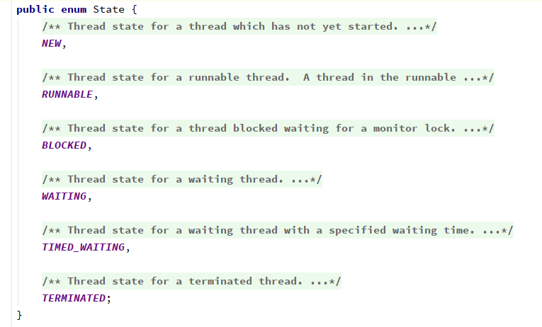
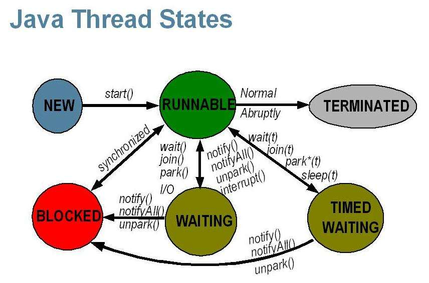
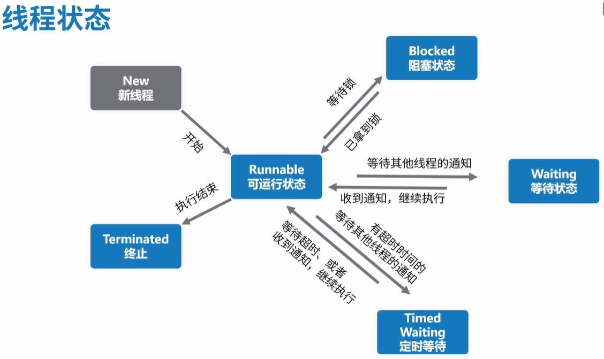

线程的6种状态，sleep与wait的区别

<!-- more -->

# 线程的状态

## 初识6种状态

由jdk8中的`java.lang.Thread.State`可知，



线程有6个状态

- NEW 
  尚未启动的线程处于此状态。
- RUNNABLE
  在Java虚拟机中执行的线程处于此状态。
- BLOCKED
  被阻塞等待监视器锁定的线程处于此状态。
- WAITING
  正在等待另一个线程执行特定动作的线程处于此状态。
- TIMED_WAITING
  正在等待另一个线程执行动作达到指定等待时间的线程处于此状态。
- TERMINATED
  已退出的线程处于此状态。

一个线程可以在给定时间点处于一个状态。 这些状态是不反映任何操作系统线程状态的虚拟机状态。

`Thread.State`继承关系：

> public static enum Thread.State extends Enum<Thread.State>
>
> java.lang.Object
>
> ​	java.lang.Enum<Thread.State>
>
> ​		java.lang.Thread.State



(图源：[Java线程及线程池状态 - 时间朋友 - 博客园](https://www.cnblogs.com/doit8791/p/9067073.html))



(图源：[线程状态 - 神评网](http://www.ishenping.com/ArtInfo/1194756.htmll))

## 6种状态解释

### 初始(NEW)

新创建了一个线程对象，但还没有调用`start()`方法。

实现`Runnable`接口和继承`Thread`可以得到一个线程类，`new`一个实例出来，线程就进入了初始状态。

### 运行(RUNNABLE)

**`Java`线程中将就绪（`ready`）和运行中（`running`）两种状态笼统的称为“运行”。**

- 线程对象创建后，其他线程(比如`main`线程）调用了该对象的`start()`方法。该状态的线程位于可运行线程池中，等待被线程调度选中，获取`CPU`的使用权，此时处于就绪状态（`ready`）。就绪状态只是说你资格运行，调度程序没有挑选到你，你就永远是就绪状态。除了`start()`方法让线程进入就绪状态，下面三种情况也可以：
  - 当前线程`sleep()`方法结束，其他线程`join(`)结束，等待用户输入完毕，某个线程拿到对象锁，这些线程也将进入就绪状态。
  - 当前线程时间片用完了，调用当前线程的`yield()`方法，当前线程进入就绪状态。
  - 锁池里的线程拿到对象锁后，进入就绪状态。

- 就绪状态的线程在获得CPU时间片后变为运行中状态（`running`）。

### 阻塞(BLOCKED)

表示线程阻塞于锁。

是线程阻塞在进入`synchronized`关键字修饰的方法或代码块(获取锁)时的状态。

### 等待(WAITING)

进入该状态的线程需要等待其他线程做出一些特定动作（通知或中断）。

处于这种状态的线程不会被分配`CPU`执行时间，它们要等待被显式地唤醒，否则会处于无限期等待的状态。

### 超时等待(TIMED_WAITING)

该状态不同于`WAITING`，它可以在指定的时间后自行返回。

*处于这种状态的线程不会被分配CPU执行时间，不过无须无限期等待被其他线程显示地唤醒，在达到一定时间后它们会自动唤醒。*

### 终止(TERMINATED)

表示该线程已经执行完毕。

1. 当线程的`run()`方法完成时，或者主线程的`main()`方法完成时，我们就认为它终止了。这个线程对象也许是活的，但是，它已经不是一个单独执行的线程。线程一旦终止了，就不能复生。

2. 在一个终止的线程上调用`start()`方法，会抛出`java.lang.IllegalThreadStateException`异常。

```java
package thread;

/**
 * @author GreenHatHG
 * @create 2019-08-04 10:52
 */
public class demo01 {
    private static void attack(){
        System.out.println("Fight");
        System.out.println("Current Thread is: " + Thread.currentThread());
    }

    public static void main(String[] args) throws InterruptedException {
        Thread t = new Thread(){
            public void run(){
                attack();
            }
        };
        System.out.println("Current main thread is: " + Thread.currentThread());
        t.start();
        //结束线程
        t.join();
        //线程不会复活，抛出异常
        t.start();
    }
}
```

```java
Current main thread is: Thread[main,5,main]
Fight
Current Thread is: Thread[Thread-0,5,main]
Exception in thread "main" java.lang.IllegalThreadStateException
	at java.lang.Thread.start(Thread.java:708)
	at thread.demo01.main(demo01.java:24)
```


# sleep与wait的区别


1. `sleep`是`Thread`类的方法,`wait`是`Object`类中定义的方法

2. `sleep`可以在任何地方使用； 而`wait`只能在`synchronize`方法或者`synchronize`块中使用
3. **`Thread.sleep`只会让出`CPU`，不会导致锁行为的改变；`Object.wait`不仅让出`CPU`，还会释放已经占有的同步资源锁**

总结起来就是：

- `sleep`方法是`Thread`类里面的，主要的意义就是让当前线程停止执行，让出`CPU`给其他的线程，但是不会释放对象锁资源以及监控的状态，当指定的时间到了之后又会自动恢复运行状态。
- `wait`方法是`Object`类里面的，主要的意义就是让线程放弃当前的对象的锁，进入等待此对象的等待锁定池，只有针对此对象调动`notify`方法后本线程才能够进入对象锁定池准备获取对象锁进入运行状态。


---

参考：

[Java线程的6种状态及切换(透彻讲解) - 潘建南的博客 - CSDN博客](https://blog.csdn.net/pange1991/article/details/53860651)

---

