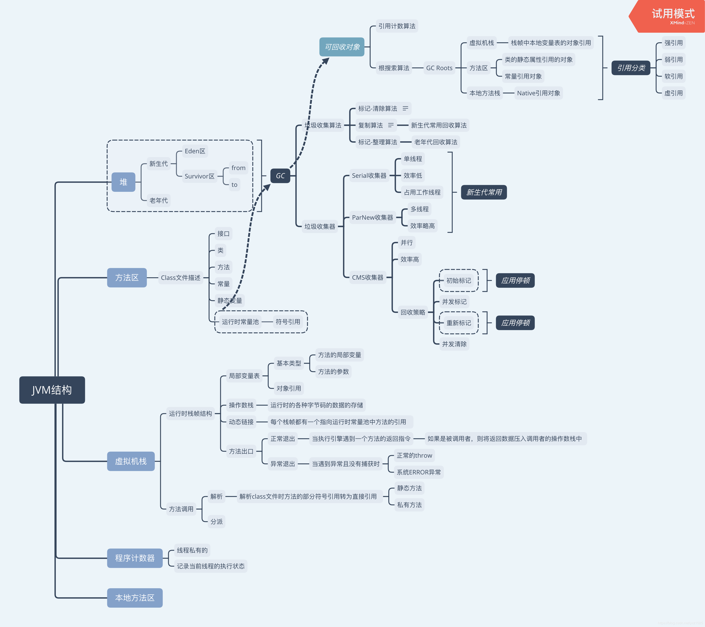
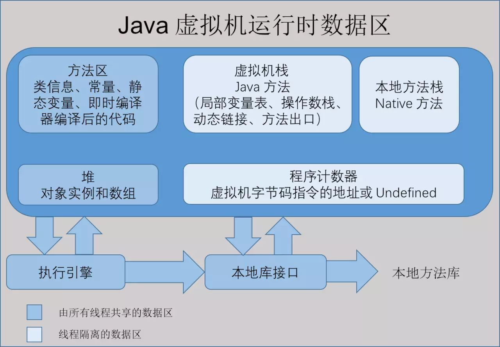

---

title: Java虚拟机笔记--java虚拟机结构
date: 2019-03-19 16:34:39
categories: 读书笔记
tags:
- jvm
---

<!-- more -->

# 整体结构

# Class文件格式

1. 编译后被Java虚拟机所执行的代码使用了一种平台中立（不依赖于特定硬件及操作系统）的二进制格式来表示，并且经常（但并非绝对）以文件的形式存储，因此这种格式称为**class文件格式**。
2. class文件格式中精确地定义了类与接口的表示形式，包括在平台相关的目标文件格式中一些细节上的惯例，例如字节序(`byte ordering`）等。

# 数据类型

1. 与Java程序语言中的数据类型相似，Java虚拟机可以操作的数据类型可分为两类：**原始类型**（`primitive type`，也经常翻译为原生类型或者基本类型）和**引用类型**（`reference type`）。
2. 与之对应，也存在原始值（`primitive value`)和引用值（`reference value`)两种类型的数值，它们可用于变量赋值、参数传递、方法返回和运算操作。
3. Java虚拟机希望尽可能多的类型检查能在程序运行之前完成，换句话说，**编译器应当在编译期间尽最大努力完成可能的类型检查，使得虚拟机在运行期间无需进行这些操作。**原始类型的值不需要通过特殊标记或别的额外识别手段来在运行期确定它们的实际数据类型，也无需刻意将它们与引用类型的值区分开。虚拟机的字节码指令本身就可以确定它的指令操作数的类型是什么，所以可以利用这种特性直接确定操作数的数值类型。

## 原始类型与值

​	Java虚拟机所支持的原始数据类型包括数值类型（`numeric type`）、`boolean`类型和`returnAddress`类型三类

### returnAddress

​	`returnAddress`类型是指向某个操作码（`opcode`）的指针，此操作码与Java虚拟机指令相对应。在虚拟机支持的所有原始类型中，只有`returnAddress`类型是不能直接与Java语言的数据类型相对应的

### 浮点数

​	在浮点数中，正数零和负数零是相等的，但是它们在某些操作上会有区别。例如，`1.0`除以`0.0`会产生正无穷大的结果，而`1.0`除以`-0.0`则会产生负无穷大的结果

### boolean类型

1. 虽然Java虚拟机定义了`boolean`这种数据类型，但是只对它提供了非常有限的支持。在Java虚拟机中没有任何供`boolean`值专用的字节码指令，**Java语言表达式所操作的`boolean`值，在编译之后都使用Java虚拟机中的int数据类型来代替**

2. **在Oracle公司的虚拟机实现里，Java语言中的`booIean`数组将会被编码成Java虚拟机的`byte`数组，每个`boolean`元素占8位。**
3. Java虚拟机会把`boolean`数组元素中的`true`值采用1来表示，`false`值采用0来表示，当Java编译器把Java语言中的`boolean`类型值映射为Java虚拟机的int类型值时，也必须采用上述表示方式

## 引用类型与值
​	Java虚拟机中有三种引用类型：类类型(`class type`)，数组类型(`array type`)和接口类型(`interface type`)。

# 运行时的数据区

## PC寄存器

1. **Java虚拟机可以支持多条线程同时执行，每一条Java虚拟机线程都有自己的PC（`program counter`）寄存器。在任意时刻。一条Java虚拟机线程只会执行一个办法的代码，这个正在被线程执行的方法称为该线程的当前方法（`currentme thod`）。**
2. 如果这个方法不是`native`的，那PC寄存器就保存Java虚拟机正在执行的字节码指令的地址，如果该方法是`native`的，那pc寄存器的值是`undefined`。pc寄存器的容量至少应当能保存一个`returnAddress`类型的数据或者一个与平台相关的本地指针的值。

> 在编程领域，**JNI** （Java Native Interface,Java本地接口）是一种编程框架，使得Java虚拟机中的Java程序可以调用本地应用/或库，也可以被其他程序调用。 本地程序一般是用其它语言（C、C++或汇编语言等）编写的，并且被编译为基于本机硬件和操作系统的程序

`native方法称为本地方法。在java源程序中以关键字“native”声明，不提供函数体。其实现使用C/C++语言在另外的文件中编写，编写的规则遵循Java本地接口的规范(简称JNI)。简而言就是Java中声明的可调用的使用C/C++实现的方法`

## Java虚拟机栈

1. **每一条Java虚拟机线程都有自己私有的Java虚拟机栈（Java Virtual Machine stack)，这
   个栈与线程同时创建，用于存储栈帧。**Java虚拟机栈的作用与传统语言（例如C语言）中的栈非常类似，**用于存局部变量与一些尚未算好的结果。另外，它在方法调用和返回中也扮演了很重要的角色。**

2. 因为除了栈帧的出栈和入栈之外，Java虚拟机栈不会再受其他因素的影响，所以栈帧可以在堆中分配，**Java虚拟机栈所使用的内存不需要保证是连续的。**

3. Java虚拟机规范既允许Java虚拟机栈被实现成固定大小，也允许根据计算动态来扩展和收缩。如果采用固定大小的Java虚拟机栈，那每一个线程的Java虚拟机栈容量可以在线程创建的时候独立选定。	

4. Java虚拟机栈可能发生如下异常情况：
   - 如果线程请求分配的栈容量超过Java虚拟机栈允许的最大容量，Java虚拟机将会抛出一个`StackOverflowError`异常
   - 如果Java虚拟机栈可以动态扩展，并且在尝试扩展的时候无法申请到足够的内存，或者在创建新的线程时没有足够的内存去创建对应的虚拟机栈，那Java虚拟机将会抛出一个`OutOfMemoryError`异常

## Java堆

1. **在Java虚拟机中，堆（`heap`)是可供各个线程共享的运行时内存区域，也是供所有类实例和数组对象分配内存的区域。**

2. **Java堆在虚拟机启动的时候就被创建**，它存储了被自动内存管理系统(`automatic storagemanagement system`)，也就是常说的`garbage collector`（垃圾收集器))所管理的各种对象，这些受管理的对象无需也无法显式地销毁。

3. **请注意避免混淆`Stack`、`Heap`和`Java（VM）Stack、JavaHeap`的概念，Java虚拟机的实现本质上是由其他
   语言所编写的应用程序，Java语言程序里分配在`Java Stack`中的数据，从实现拟机的程序角度上看则可
   能分配在Heap之中。**

4. Java堆的容量可以是固定的，也可以随着程序执行的需求动态扩展，并在不需要过多空间时自动收缩。**Java堆所使用的内存不需要保证是连续的**

5. Java堆可能发生如下异常情况：
   - 如果实际所需的堆超过了自动内存管理系统能提供的最大容量，那Java虚拟机将会抛出一个`OutOfMemoryError`异常

## 方法区

1. 在Java虚拟机中，方法区(`method area`)是可供各个线程共享的运行时内存区域

2. **它存储了每一个类的结构信息，运行时常量池(` runtime constant pool)`、字段和方法数据、构造函数和普通方法的字节码内容，还包括一些在类、实例、接口初始化时用到的特殊方法。**
3. 方法区在虚拟机启动的时候创建，虽然方法区是堆的逻辑组成部分，但是简单的虚拟机实现可以选择在这个区域不实现垃圾收集与压缩。
4. 方法区可能发生如下异常情况：
   - 如 果 方 法 区 的 内 存 空 间 不 能 满 足 内 存 分 配 请 求 ，那 么 Java虚拟机将抛岀一个
     `OutOfMemoryError` 异常

## 运行时常量池

1. 运 行 时 常 量 池 `(runtime constant pool`) 是 `class` 文件中每一个类或接口的常量池表(`constant_pool table`)的运行时表示形式，它包括了若干种不同的常量，从编译期可知的数值字面量到必须在运行期解析后才能获得的方法或字段引用。
2. 运行时常量池类似于传统语言中的符号表(`symbol table`)
3.   每一个运行时常量池都在Java虚拟机的方法区中分配，在加载类和接口到虚拟机后，就创建对应的运行时常量池

4. 在创建类和接口的运行时常量池时，可能会发生如下异常情况:
   - 当创建类或接口时，如果构造运行时常量池所需要的内存空间超过了方法区所能提供的最大值，那么 Java虚拟机将会抛出一个`OutOfMemoryError` 异常

## 本地办法栈

1. Java虚拟机实现可能会使用到传统的栈（通常称为`C stack`）来支持 `native` 方 法 （指使用 Java以外的其他语言编写的方法）的执行，这个栈就是本地方法栈（`native method stack`）

2. 当 Java虚拟机使用其他语言（例如C语言）来实现指令集解释器时，也可以使用本地方法栈。如果 Java虚拟机不支持`native`方法，或是本身不依赖传统栈，那么可以不提供本地方法栈，如果支持本地方法栈，那这个栈一般会在线程创建的时候按线程分配。

3. 本地方法栈可能发生如下异常情况:

   - 如果线程请求分配的栈容量超过本地方法栈允许的最大容量， Java虚拟机将会抛出一个`StackOverflowError`异常

   - 如果本地方法栈可以动态扩展，并且在尝试扩展的时候无法申请到足够的内存，或者在创建新的线程时没有足够的内存去创建对应的本地方法栈，那 么 Java虚拟机将会抛出一个`OutOfMemoryError` 异常

## 栈帧

1. 栈帧 (`frame`)是用来存储数据和部分过程结果的数据结构，同时也用来处理动态链接(`dynamic linking`)方法返回值和异常分派（`dispatch exception)`

2. 栈帧随着方法调用而创建，随着方法结束而销毁—无论方法是正常完成还是异常完成（抛出了在方法内未被捕获的异常）都算作方法结束。栈帧的存储空间由创建它的线程分配在Java虚拟机栈之中，每一个栈帧都有自己的本地变量表（`local variable`）、操作数栈 （`operand stack`）和指向当前方法所属的类的运行时常量池 的引用。
3. 本地变量表和操作数栈的容量在编译期确定，并通过相关方法的code属 性保存及提供给栈帧使用。因此，栈帧数据结构的大小仅仅取决于Java虚拟机的实现。实现者可以在调用方法时给它们分配内存
4. 在某条线程执行过程中的某个时间点上，只有目前正在执行的那个方法的栈帧是活动的。这个栈帧称为**当前 栈帧 **(`current frame`),这个栈帧对应的方法称为**当前方法**(`currentm ethod`),定义这个方法的类称作当前类(`current class`)。对局部变量表和操作数栈的各种操作 ，通常都指的是对当前栈帧的局部变量表和操作数栈所进行的操作。
5. 如果当前方法调用了其他方法，或者当前方法执行结束，那这个方法的栈帧就不再是当前栈帧了。**调用新的方法时，新的栈帧也会随之而创建，并且会随着程序控制权移交到新方法而成为新的当前栈帧**。方法返回之际，当前栈帧会传回此方法的执行结果给前一个栈帧,然后，虚拟机会丢弃当前栈帧，使得前一个栈帧重新成为当前栈帧。请特别注意，**栈帧是线程本地私有的数据，不可能在一个栈帧之中引用另外一个线程的栈帧**。

## 局部变量表

1. 每个栈帧内部都包含一组称为局部变量表的变量列表
2. 一个局部变量可以保存一个类型为`boolean`、`byte` 、`char`、`short` 、`int` 、`float`、`reference` 或 `returnAddress`的数据 。两个局部变量可以保存一个类型为`long`或`double`的数据。`long `和 `double` 类型的数据占用两个连续的局部变量
3. Java虚拟机使用局部变量表来完成方法调用时的参数传递。

## 操作数栈

1. 每个栈帧内部都包含一个称为操作数栈的后进先岀栈
2. 栈帧在刚刚创建时，操作数栈是空的。 Java虚拟机提供一些字节码指令来从局部变量表或者对象实例的字段中复制常量或变量值到操作数栈中，也提供了一些指令用于从操作数栈取走数据、操作数据以及把操作结果重新入栈。在调用方法时，操作数栈也用来准备调用方法的参数以及接收方法返回结果.
3. 操作数栈的每个位置上可以保存一个Java虚拟机中定义的任意数据类型的值，包括`long`和`double`类型

## 动态链接

每个栈帧内部都包含一个指向当前方法所在类型的运行时常量池的引用，以便对当前方法的代码实现动态链接。在 class 文件里面，一个方法若要调用其他方法，或者访问成员变量，则需要通过符号引（`symbolicreference`）来表示，动态链接的作用就是将这些以符号引用所表示的方法转换为对实际方法的直接引用。

