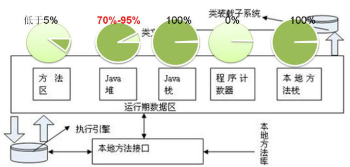
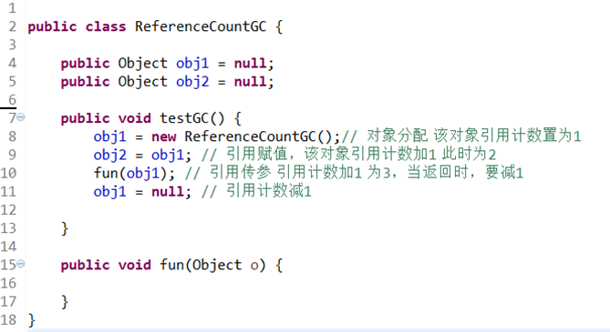
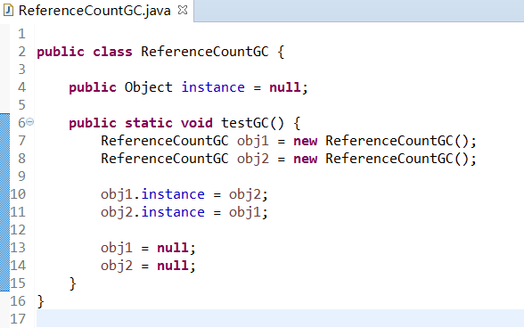
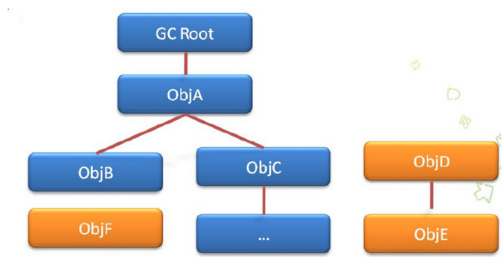

垃圾回收算法与 JVM 垃圾回收器

<!-- more -->

要想搞明白垃圾回收，就是要搞明白**四个问题**：

- 在JVM的哪块内存中发生垃圾回收？

- 哪些对象需要被回收？

- 什么时候回收？

- 怎样回收这些对象？

# 在JVM的哪块内存中发生垃圾回收

JVM的内存分区:

1. 程序计数器：当前线程所执行的字节码的行号指示器，控制着程序的分支、循环、跳转、异常处理。是线程私有的。

2. 虚拟机栈：为每个方法在执行时创建一个栈帧，用于存储局部变量表、操作数栈栈等。其中局部变量表存储基本数据类型和**对象引用**。是线程私有的。

3. JAVA堆：所有**对象实例**都在堆上分配。所有线程共享此块内存。

4. 方法区：所有线程共享的内存区域，用于存储虚拟机加载的类信息、常量、静态变量等。

**由于垃圾回收是回收和对象有关的东西，所以主要发生在虚拟机栈和堆中；少部分发生在方法区。**

下图更详细的说明了垃圾回收发生的位置：

本地方法栈与虚拟机栈相似，经常在一些虚拟机实现中被合并起来。

# 哪些对象需要被回收

其实这个问题很好回答，当然是不用的对象需要被回收啦！但是JVM不知道哪些对象是你不用的。所以就有了另一种判断方法：**不能用的对象就是你不需要用的**，因为你就算想用也用不到，所以必然是不用的对象。

所以就有了**引用计数法**来判断一个对象是否可以使用。

引用计数法非常简单——给一个对象添加一个引用计数器，初始值为零，有一个地方引用它时，计数器加一，当一个引用失效时，计数器减一。计数器为零时此对象不可用。

下面就是对一个引用计数的举例：

引用计数法有一个致命的缺陷，如下图，就是当两个对象相互引用时，这两个对象实际是不可获得的，但是由于引用计数不为零，所以均不会被回收。

为了解决这个问题，就有了可达性分析法：

算法的思路是通过一系列称为GC Roots的对象作为起始点，从这些节点向下搜索，**当一个对象到GC Roots时没有任何引用链相连，证明此对象是不可用的**。如下图，从GC Root不能到达ObjD ObjF ObjE，所以这三个对象是不可用的。

可做GC Roots的对象有 虚拟机栈中引用的对象（本地变量表）、方法区中静态属性引用的对象、方法区中常量引用的对象、本地方法栈中引用的对象（Native对象）。

----

待更

-----

参考：

[垃圾回收算法与 JVM 垃圾回收器综述 - 知乎](https://zhuanlan.zhihu.com/p/28258571)

[JVM 垃圾回收 - 知乎](https://zhuanlan.zhihu.com/p/26386634)

[搞定JVM垃圾回收就是这么简单 - 知乎](https://zhuanlan.zhihu.com/p/43211695)

[JVM 垃圾回收器工作原理及使用实例介绍](https://www.ibm.com/developerworks/cn/java/j-lo-JVMGarbageCollection/index.html)