垃圾回收算法与 JVM 垃圾回收器

<!-- more -->

# 一览

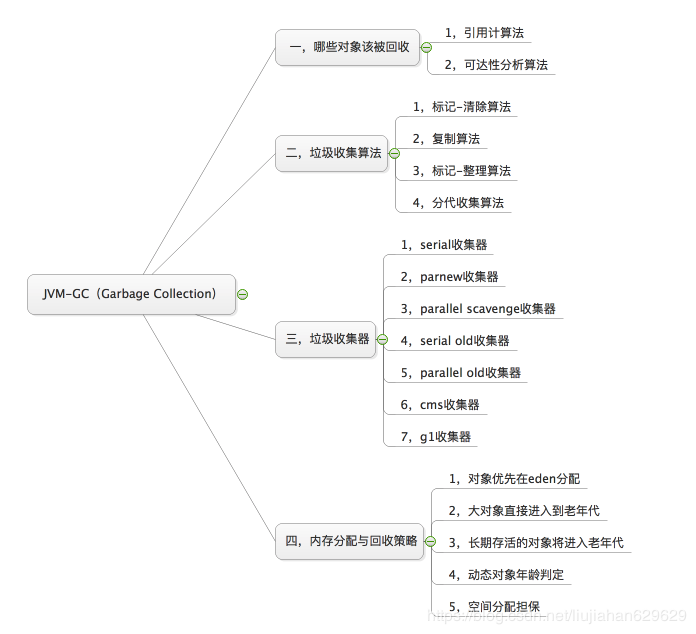

# 对象被判定为垃圾的标准

GC主要是回收Java堆中的对象，即此对象已经没有了价值，就是变成了“垃圾”，那么对象被判定为垃圾的标准是什么呢？——没有被其他对象引用。

# 判定对象是否为垃圾的算法

## 引用计数算法

**主要是判断对象的引用数量**

- 通过判断对象的引用数量来决定对象是否可以被回收
- 每个对象实例都有一个引用计数器，被引用则+1，完成引用则-1
- 任何引用计数为0的对象实例都可以被当作垃圾收集

下面就是对一个引用计数的举例：

引用计数法有一个致命的缺陷，如下图，就是当两个对象相互引用时，这两个对象实际是不可获得的，但是由于引用计数不为零，所以均不会被回收。

**优点：执行效率高，程序被影响小**
**缺点：无法解决循环引用问题 导致内存泄漏，所以在 Java 的垃圾回收器中没有使用这种算法**

## 可达性分析法

**通过判断对象的引用链遍历（从`GC Root`开始）是否可达来决定对象是否可以被回收。**

如下图，从`GC Root`不能到达`ObjD` `ObjF` ` ObjE`，所以这三个对象是不可用的。

**可作为GC Root的对象：**

- 虚拟机栈中引用的对象（栈帧中的本地变量表）
- 方法区中的常量引用的对象
- 方法区中的类静态属性引用的对象
- 本地方法栈中JNI（Native方法）的引用对象
- 活跃线程的引用对象

# 回收垃圾的算法

## 标记-清除算法（Mark and Sweep）

- 标记：从根集合进行扫描，对存活的对象进行标记（可达性分析算法）
- 清除：对堆内存从头到尾进行线性遍历，回收不可达的对象内存

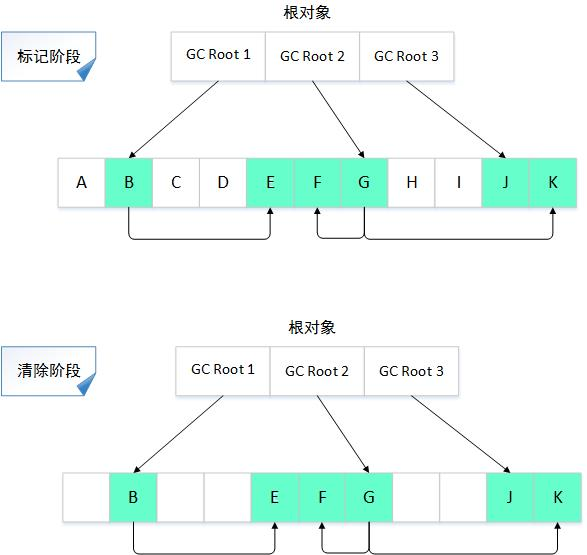

上图是标记/清除算法的示意图，在标记阶段，从对象GC Root 1可以访问到B对象，从B对象又可以访问到E对象，因此从GC Root 1到B、E都是可达的，同理，对象F、G、J、K都是可达对象；到了清除阶段，所有不可达对象都会被回收。

缺点：

- 效率问题

**标记和清除两个阶段的效率都不高**，因为这两个阶段都需要遍历内存中的对象，很多时候内存中的对象实例数量是非常庞大的，这无疑很耗费时间，而且GC时需要停止应用程序，这会导致非常差的用户体验。

- 空间问题

标记清除之后会**产生大量不连续的内存碎片**（从上图可以看出），内存空间碎片太多可能会导致以后在程序运行过程中需要分配较大对象时，无法找到足够的连续内存而不得不提前触发另一次垃圾回收动作。

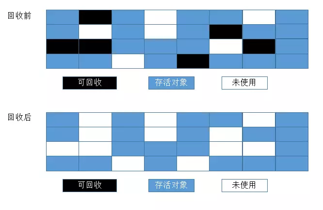

## 复制算法（Copying）

- 将可用内存按容量分为对象面和空闲面大小相等的两块
- 对象在对象面上创建
- 存活的对象被从对象面复制到空闲面
- 回收时将对象面所有对象内存清除

回收前：

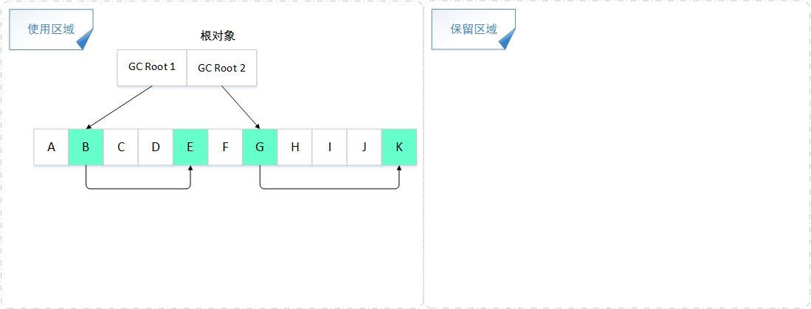

回收后：

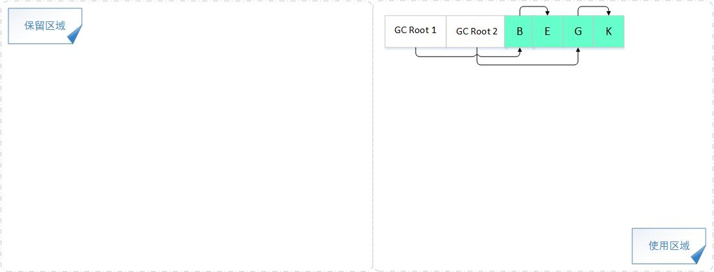

整体上看：

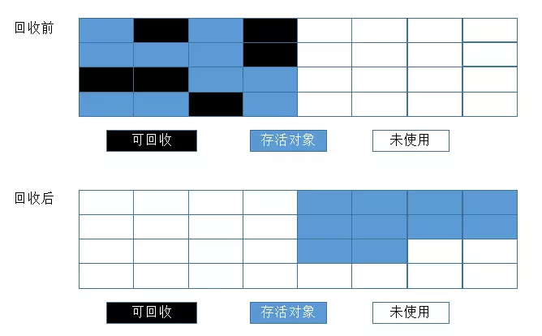

**复制算法每次都是对整个半区进行内存回收，这样就减少了标记对象遍历的时间**，在清除使用区域对象时，不用进行遍历，直接清空整个区域内存，**而且在将存活对象复制到保留区域时也是按地址顺序存储的**，这样就解决了内存碎片的问题，在分配对象内存时不用考虑内存碎片等复杂问题，只需要按顺序分配内存即可。

优点：

- 优化了标记/清除算法的效率低、内存碎片多的问题
- 顺序分配内存，简单高效

缺点：

- 将内存缩小为原来的一半，浪费了一半的内存空间，代价太高；
- 如果对象的存活率很高，极端一点的情况假设对象存活率为100%，那么我们需要将所有存活的对象复制一遍，耗费的时间代价也是不可忽视的。

**适用场景**：适用于对象存活率低的场景（年轻代）

## 标记-整理算法（Compacting）

- 标记：从根集合进行扫描，对存活的对象进行标记
- 清除：移动所有存活的对象，且按照内存地址次序依次排列，然后将末端内存地址以后的内存全部回收。

回收前：

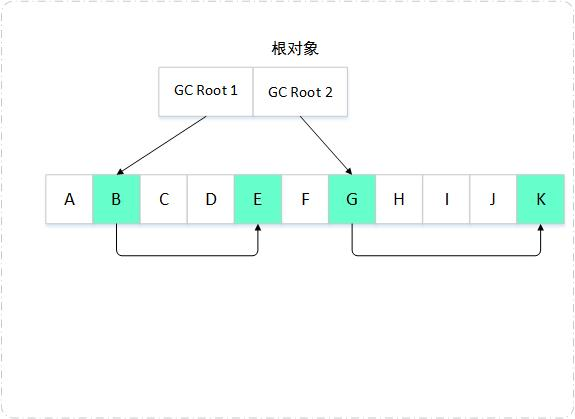

回收后：

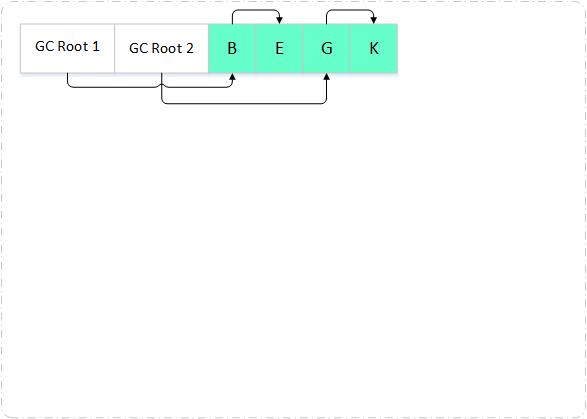

整体上看：

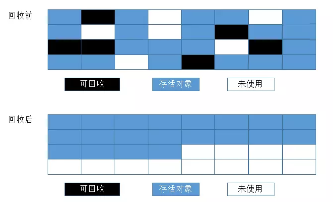

可以看到，**回收后可回收对象被清理掉了，存活的对象按规则排列存放在内存中**。这样一来，当我们给新对象分配内存时，jvm只需要持有内存的起始地址即可。标记/整理算法不仅**弥补了标记/清除算法存在内存碎片的问题，也消除了复制算法内存减半的高额代价**，可谓一举两得。但**标记/整理算法的缺点就是效率也不高**，不仅要标记存活对象，还要整理所有存活对象的引用地址，在效率上不如复制算法。

**适用场景**：适用于存活率高的场景（老年代）

## 标记分代收集算法（Generational Collector）

- 垃圾回收算法的组合拳
- 按照对象生命周期的不同划分区域以采用不同的垃圾回收算法
- 目的：用于提高JVM垃圾回收的效率

先看堆内存分布：

- jdk6，jdk7

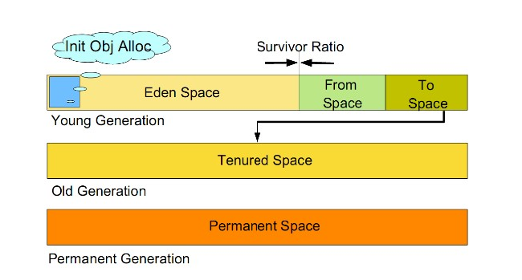

大致分为`Young Generation`年轻代，`Old Generation`老年代和`Permanent Generation`永久代这三部分

- jdk8以及之后版本

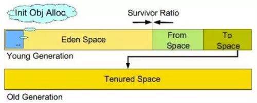

永久代被去除掉，如图所示。新加了一个称为”元空间“的空间，它与永久代最大的区别就是元空间使用本地内存，而永久代使用的是`JVM`内存 

在jdk6,7,8以及后面的版本中，年轻代和老年代均被保留了下来。**年轻代的对象存活率低，就会采用复制算法，而老年代存活率高，则会采用标记-清除算法，或者标记-整理算法。**

---

标记分代收集算法分为`Minor GC`和`Full GC`两类

---

### Minor GC

在年轻代`Young space`(包括`Eden`区和`Survivor`区)中的垃圾回收称之为 `Minor GC`，所采用的是算法是复制算法。

年轻代（`Young Generation`）：

年轻代几乎是所有Java对象出生的地方，即Java内存的申请和存放都是在这个地方进行的。该区域的对象几乎都是“朝生夕灭”。

年轻代分为两部分：

- `Eden`（伊甸园）区

  1. 正常情况对象刚被创建出来的时候在`Eden`区，当`Eden`区内存不足时会放到`Survivor`区，对象很大时会放入老年代。 
  2. 发生`Minor GC`后有用对象年龄+1并被放入到`Suvivor`区 
  3. `Eden`默认占年轻代8的权重，`Survivor`区两空间分别占1

- 两个`Survivor`区（`from`、`to`）

  发生`Minor GC`后有用对象年龄+1，并将存活对象从`From`使用复制算法到`To`中，清空`From`空间，当对象年龄达到一定值后进入老年区（默认15岁时进入）

---

年轻代垃圾回收的过程演示：

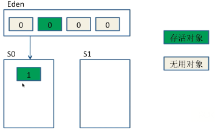

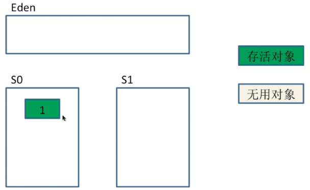

首次`Minor GC`的过程：有用对象年龄+1并被放入到`Suvivor`区 ，然后清除`Eden`区

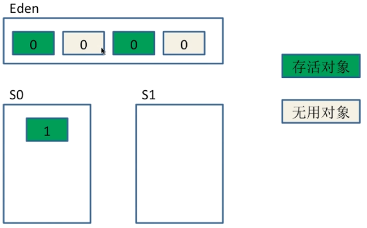

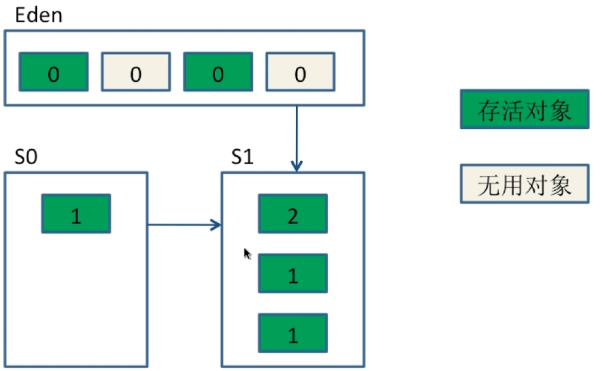

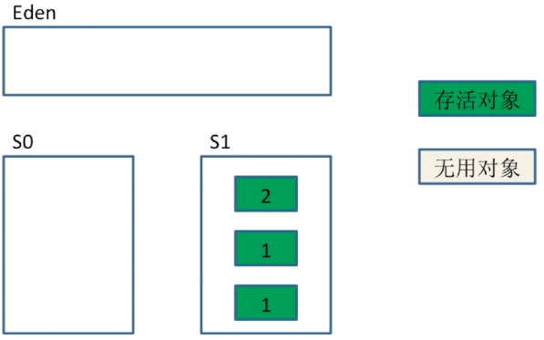

`Eden`区再次填满，又会触发一次`Minor GC`，此时便将其他两个区存活的对象拷贝到`S1`区中，年龄相对应增加，然后清除`Eden`和`S0`区，完成了第二次`Minor GC`。

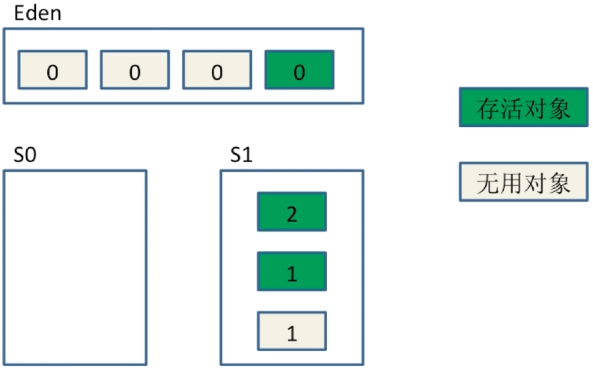

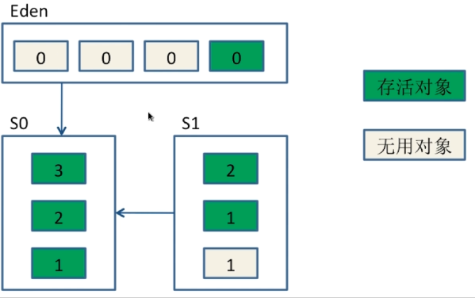

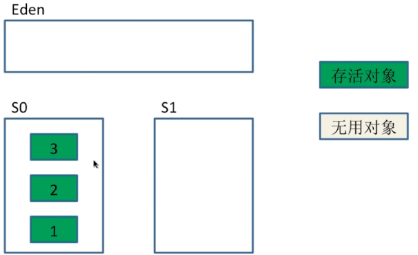

假设`Eden`区又满了，`S1`区有个无用的对象，此时又触发一次`Minor GC`，将其他区的对象拷贝到`S0`区，年龄对应增加，拷贝完成后清除`Eden`和`S1`区，完成了第三次`Minor GC`

---

**对象如何晋升为老年代**

- 经历一定`Minor GC`次数依然存活的对象
- `Survivor`区放不下的对象
- 新生成的大对象（可以设置`-XX:+PretenuerSizeThreshold`设置大对象大小，超过这个大小的大对象会直接放入老年代）

**常用的调优参数**

- `-XX:SurvivorRatio`:`Eden`和`Survivor`的比值，默认8:1:1
- `-XX:NewRatio`:老年代和年轻代内存的大小比例
- `-XX:MAXTenuringThreshold`:对象从年轻代晋升到老年代进过GC次数的最大阈值

### Full GC

主要对老年代（该区域的对象是“幸存”下来的对象，一般不会再轻易“死亡”）的回收，但同时包含了对年轻代的回收（即包含了`Minor GC`）。采用的收集算法是标记-清除和标记-整理。相比`Minor GC`慢，执行频率低。

---

老年代：**存放生命周期较长的对象**

**触发`Full GC`的条件**

- 老年代空间不足

- 永久代空间不足（JDK1.8之前）

- `CMS GC`时出现`promotion failed，concurrent mode failure`

- `Minor GC`晋升到老年代的平均大小大于老年代的剩余空间

- 调用`System.gc()`（仅是通知，不保证何时执行）

- 使用`RMI`来进行`RPC`或管理的`JDK`应用，每小时执行1此`Full GC`

> CMS gc：CMS并行GC收集器
>
> promotion failed：该问题是在进行Minor GC时，Survivor Space放不下，对象只能放入老年代，而此时老年代也放不下造成的
>
> RMI：Java远程方法调用，Java编程语言里，一种用于实现远程过程调用的应用程序编程接口
>
> RPC：远程过程调用，它是一种通过网络从远程计算机程序上请求服务，而不需要了解底层网络技术的协议

## 对比

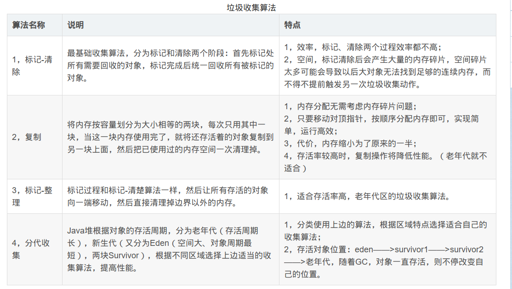

# 垃圾收集器相关名词

## Stop-the-World

不管选择哪种GC算法，`stop-the-world`都是不可避免的。*`Stop-the-world`*意味着从应用中停下来并进入到`GC`执行过程中去。一旦`Stop-the-world`发生，除了`GC`所需的线程外，其他线程都将停止工作，中断了的线程直到`GC`任务结束才继续它们的任务。`GC`调优通常就是为了改善`stop-the-world`的时间。

## Safepoint

- 分析过程中对象引用关系不会发生变化的点
- 产生`Safepoint`的地方：方法调用、循环跳转、异常跳转等
- 安全点数量要适中（太少会让GC等待太长的时间，太多增加了程序运行的负荷）

# 常见的垃圾收集器

## JVM两种运行模式

- Server：重量级级启动，速度较慢，优化更多
- Client：轻量级启动，速度快

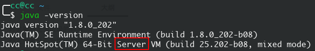

## 年轻代常见的垃圾收集器

### Serial收集器

设置`-XX:+UseSerialGC`可以让年轻代使用该垃圾收集器

`Serial`收集器是最基本、发展历史最久的收集器，是一个采用复制算法的单线程的年轻代收集器

特点：

1. 针对年轻代

2.  采用复制算法 

3.  单线程。 

   它的“单线程”意义： 

   ​	a. 它只会使用一个CPU或一条线程去完成垃圾收集工作 

   ​	b. 它进行垃圾收集时必须暂停其他线程的所有工作，直到它收集结束（`STW，Stop The World`）。

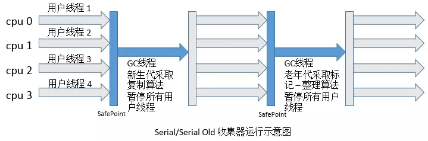

**应用场景：** `Serial`收集器是虚拟机运行在`Client`模式下的默认年轻代收集器 **优点：** 简单高效。对于单个CPU环境而言，`Serial`收集器由于没有线程交互的开销，专心做垃圾收集自然可以获得最高的单线程收集效率。

### ParNew收集器

设置`-XX:+UseParNewGC(UseParallelOldGC`可以让年轻代使用该垃圾收集器

`ParNew`收集器其实就是`Serial`收集器的多线程版本，在可用控制参数、收集算法、`Stop The World`、对象分配规则、回收策略等都与`Serial`收集器完全一样。是一个采用复制算法的并行多线程收集器，是一个年轻代收集器。

**特点：** 

1. 与`Serial`收集器相同的特点： a. 针对年轻代； b. 采用复制算法； c. STW
2. 主要特点： 多线程。使用多线程进行垃圾收集。

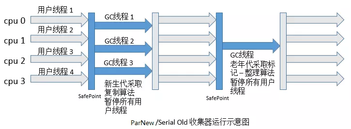

**应用场景：** 它是`Server`模式下的虚拟机首选的新生代收集器。但在单个CPU环境中，不会比`Serail`收集器有更好的效果，因为存在线程交互的开销。

### Parrallel Scanvenge收集器

设置`-xx:+UseParallelGC可以让年轻代使用该垃圾收集器

`Parallel Scavenge`收集器也是一个采用复制算法的并行多线程收集器，是一个年轻代收集器。`Parallel Scavenge`收集器因为与吞吐量关系密切，也称为吞吐量收集器

> 所谓吞吐量的意思就是CPU用于运行用户代码时间与CPU总消耗时间的比值，即吞吐量=运行用户代码时间/（运行用户代码时间+垃圾收集时间），虚拟机总运行100分钟，垃圾收集1分钟，那吞吐量就是99%

**特点：**

1. 与`ParNew`收集器相同的特点： a. 新生代收集器； b. 采用复制算法； c. 多线程收集；
2.  主要特点： `Parallel Scavenge`收集器的目标是达一个可控制的吞吐量，而`CMS`等收集器的关注点是尽可能地缩短垃圾收集时用户线程的停顿时间。

**应用场景：** 1.高吞吐量为目标，即减少垃圾收集时间，让用户代码获得更长的运行时间。 2.当应用程序运行在具有多个CPU上，对暂停时间没有特别高的要求时，即程序主要在后台进行计算，而不需要与用户进行太多交互。例如，那些执行批量处理、订单处理、工资支付、科学计算的应用程序

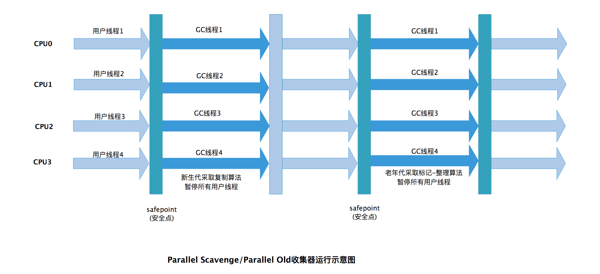

## 老年代常见的垃圾收集器

### Serial Old收集器

设置`-XX:+UseSerialOldGC`可以让老年代使用该垃圾收集器

`Serial Old` 是 `Serial`收集器的老年代版本，它同样是一个**单线程收集器**，使用**“标记-整理”（Mark-Compact）**算法。

收集器的主要意义也是在于给`Client`模式下的虚拟机使用。如果在`Server`模式下，它还有两大用途：

- 在JDK1.5 以及之前版本（`Parallel Old`诞生以前）中与`Parallel Scavenge`收集器搭配使用。
- 作为`CMS`收集器的后备预案，在并发收集发生**Concurrent Mode Failure**时使用。

它的工作流程与`Serial`收集器相同。

### Parallel Old收集器

设置`-xx:+UseParallelOldGC`可以让老年代使用该垃圾收集器

---

`Parallel Old`收集器是`Parallel Scavenge`收集器的老年代版本，使用多线程和“标记-整理”算法。

在JDK1.6中才开始提供，在此之前，新生代选择了`Parallel Scavenge`收集器，老年代只能选择`Serial Old`，因为`Parallel Scavenge`是多线程收集器，但是到了老年代只能用`Serial Old`收集器，这样相当于只能在新生代达到提高吞吐量的效果。

直到老年代也提供了这种以提高吞吐量为主的收集器，新生代使用`Parallel Scavenge`收集器，老年代使用`Parallel Old`收集器就形成了以吞吐量优先的收集器组合。在注重吞吐量以及CPU资源敏感的场合，可以优先考虑这种场合。

它的工作流程与`Parallel Scavenge`收集器相同。

### CMS收集器

设置`-XX:+UseConcMarkSweepGC`可以让老年代使用该垃圾收集器

**CMS（Concurrent Mark Sweep）**收集器是一种以**获取最短回收停顿时间**为目标的收集器，它非常符合那些集中在互联网站或者B/S系统的服务端上的Java应用，这些应用都非常重视服务的响应速度。从名字上（“Mark Sweep”）就可以看出它是基于**“标记-清除”**算法实现的。

`CMS`收集器工作的整个流程：

- 初始标记：仅仅只是标记一下`GC Roots`能直接关联到的对象，速度很快，需要`Stop The World`。并发标记：并发追溯标记，程序不会停顿

- 并发预清理：查找执行并发标记阶段从年轻代晋升到老年代的对象

- 重新标记：暂停虚拟机，扫描CMS堆中的剩余对象。仅仅只是标记一下`GC Roots`能直接关联到的对象，速度很快，需要`Stop The World`。

- 并发清理：清理垃圾对象，程序不会停顿

- 并发重置：重置CMS收集器的数据结构

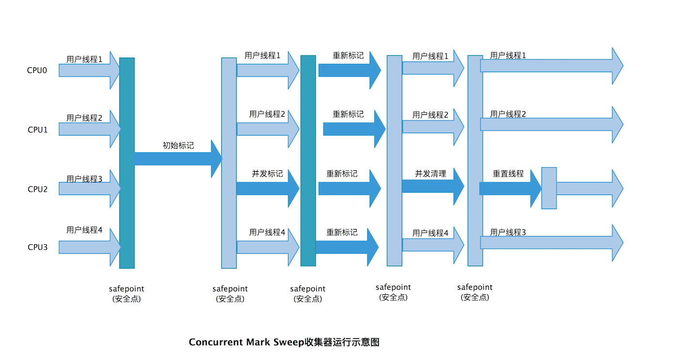

优点：

CMS是一款优秀的收集器，它的主要**优点**在名字上已经体现出来了：**并发收集**、**低停顿**，因此CMS收集器也被称为**并发低停顿收集器（Concurrent Low Pause Collector）**。

缺点：

- **CMS收集器对CPU资源非常敏感**。在并发标记和并发清除时是和用户线程一起运行的，收集过程中肯定占用了用户程序的CPU资源。默认启动的回收线程数是（cpu数量+3）/4，当cpu数较少的时候，会分掉大部分的cpu去执行收集器线程，影响用户，降低吞吐量。

- **CMS收集器无法处理浮动垃圾**。在并发清除阶段，用户程序并没有停止，所以还会继续产生垃圾，而这部分垃圾只能等待着下一次收集时才能进行回收。

- **CMS收集器会产生空间碎片**。因为CMS收集器是基于“标记-清除”算法实现的，所以在进行大量的垃圾回收时，会产生很多不连续的内存空间。这是使用“标记-清除”算法都会有的缺点。

### G1收集器

设置`-XX:+UseG1GC`可以让老年代使用该垃圾收集器

G1（`Garbage First`）收集器是目前最新的收集器了，**java9以及java10默认的垃圾收集器就是G1。**在`JDK6u14`中就有`Early Access`版本的G1收集器提供开发人员试用。到`JDK 7u4`才算是正是发布。G1是基于“标记-整理”算法来实现的，可以独立的维护新生代以及老年代两个部分

与其他的GC收集器相比，G1有如下特点：

- **并行与并发**，G1充分利用多CPU资源来缩短停顿时间，即执行GC过程中用户程序扔可继续执行。

- **分代收集，**虽然G1可以不需要与其他收集器配合就可以独立管理整个GC堆，但分代感念在G1中依然保留，这样可以让G1采用不同的方式来处理年轻代和老年代的对象。

- **空间整合**，因为G1是基于“标记-整理”算法实现的，所以不会产生空间碎片，内存空间很好的整合起来了。

- **可预测的停顿，**这个特点是相对CMS收集器的一个优势，G1可以让使用者明确指定在一个长度为M毫秒的时间片段内，消耗在牢记收集上的时间不得超过N秒。

前面介绍的几个收集器，要么是作用在新生代，要么是作用在老年代，**G1作用于整个堆**，它将整个堆分为多个大小相等的独立区域（`Region`）,虽然仍保留了分代，但不再是物理隔离，都是一部分`Region`的集合。

G1收集器运行过程大致分为以下几步：

- 初始标记
- 并发标记
- 最终标记
- 筛选回收

**初始标记阶段**和`CMS`收集器类似，也是仅仅标记一下`GC Roots`能直接关联到的对象，并且修改`TAMS（Next Top at Mark Start）`的值，让下一阶段用户程序并发运行时可以在正确的`Reginon`中创建新对象。**并发标记阶段**是对堆中对象进行可达性分析，找出存活对象，这个阶段可以与用户线程并发进行，而**最终标记阶段**是为了修正在并发标记期间因为用户程序并发运行，而导致标记产生变动的那部分标记记录，这阶段需要用户线程停顿，但是可并发进行。在最后的**筛选回收阶段**首先对各个Region的回收价值和成本进行排序，然后根据用户所期望的GC停顿时间来制定回收计划

### JDK11:Epsilon GC与ZGC

`Epsilon GC`：无操作实验垃圾收集器，处理内存分配但没有实现任何实际的内存回收机制。一旦可用的Java堆耗尽，JVM就会关闭。

`Epsilon`垃圾回收器和其他的垃圾回收器一样，使用`-XX:+UseEpsilonGC`开启。

---

`ZGC`：Java 11 新加入的ZGC号称可以达到10ms 以下的 GC 停顿

## 对比

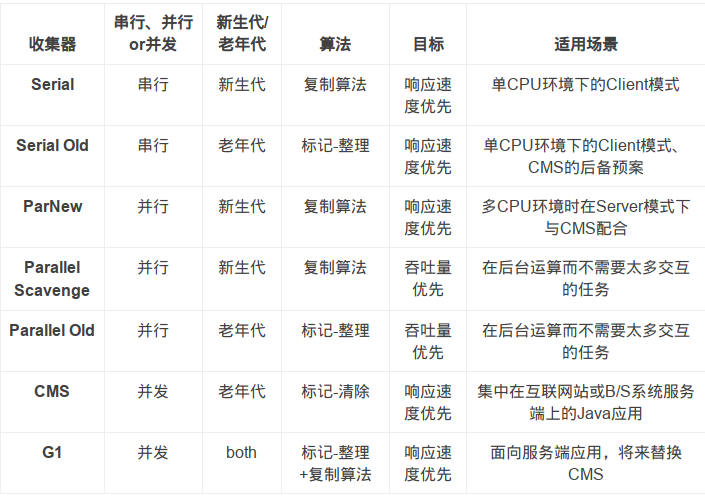

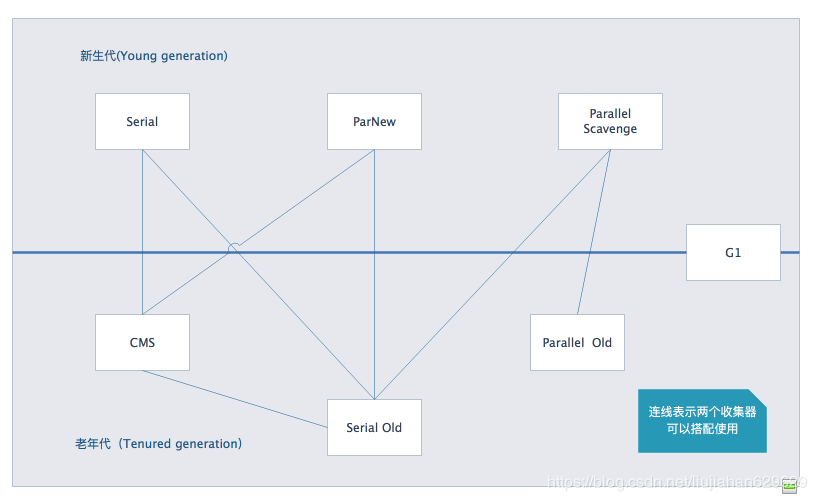

----

参考：

[JVM 垃圾回收 - 知乎](https://zhuanlan.zhihu.com/p/26386634)

[Java 垃圾回收机制(GC) - 掘金](https://juejin.im/post/5d241fcf6fb9a07ecd3d826b)

[Java虚拟机：GC算法深度解析 - 风中程序猿 - 博客园](https://www.cnblogs.com/fangfuhai/p/7203468.html)

[JVM 垃圾回收 Minor gc vs Major gc vs Full gc | 鸟窝](https://colobu.com/2015/04/07/minor-gc-vs-major-gc-vs-full-gc/)

[006. 深入JVM学习—年轻代 - 易冥天 - OSCHINA](https://my.oschina.net/shadowolf/blog/1834231)

[java 面试知识点笔记（四）垃圾回收 上篇 - 风格源于执着 - OSCHINA](https://my.oschina.net/pentakill/blog/3049804)

[[译]GC专家系列1：理解Java垃圾回收 - 牧曦之晨 - SegmentFault 思否](https://segmentfault.com/a/1190000004233812)

[JVM学习记录-垃圾收集器 - 纪莫 - 博客园](https://www.cnblogs.com/jimoer/p/9038648.html)

[深入理解JVM(3)——7种垃圾收集器 - 王泽远的博客 | Crow's Blog](https://crowhawk.github.io/2017/08/15/jvm_3/)

[java11新特性--Epsilon:A No-Op Garbage Collector - 掘金](https://juejin.im/post/5bb4866df265da0a914559b5)

[An Introduction to Epsilon GC: A No-Op Experimental Garbage Collector – Baeldung](https://www.baeldung.com/jvm-epsilon-gc-garbage-collector)

[Java程序员的荣光，听R大论JDK11的ZGC - 后端 - 掘金](https://juejin.im/entry/5b86a276f265da435c4402d4)

[JVM(二)——垃圾回收（GC Garbage Collection） - 学会改变自己——才能突破 - CSDN博客](https://blog.csdn.net/liujiahan629629/article/details/85215655)

---

