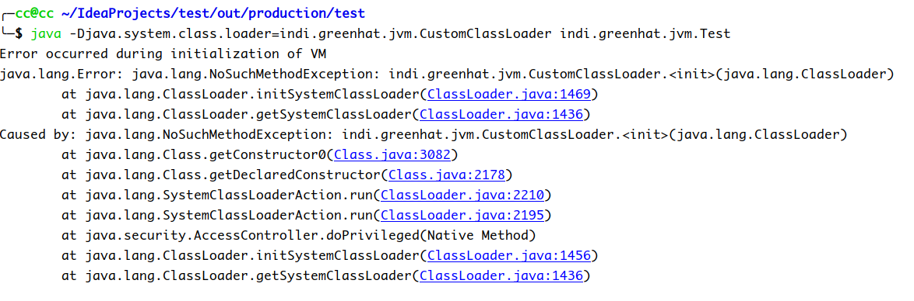
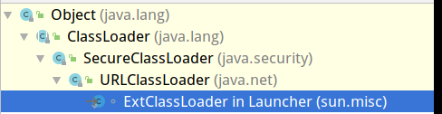

Launcher类部分内容分析
 <!-- more -->

# 三种类加载器之间的关系

1. 内建于JVM中的启动类加载器会加载`java.lang.ClassLoder`以及其他Java平台类，当JVM启动时，一块特殊的机器码会运行，它会加载扩展类加载器与系统类加载器，这块特殊的机器码叫做启动类加载器（Bootstrap）。

2. 启动类加载器不是Java类，而其他的加载器则都是Java类，启动类加载器是特定于平台的机器指令，它负责开启整个过程。

3. 所有类加载器（除了启动类加载器）都被实现为Java类。不过，总归要有一个组件来加载第一个Java类加载器，从而让整个加载过程能够顺利进行下去，加载第一个纯Java类加载器就是启动类加载器的职责。

4. 启动类加载器还会负责加载供JRE正常运行所需要的基本组件，这包括`java.util`与`java.lang`包中的类等等。

# 验证

```java
System.out.println(ClassLoader.class.getClassLoader());
//输出null
```

但是不能直接获取扩展类加载器和系统类加载器，因为没有声明这两个类为public

```java
public class Launcher {
    ...
     static class AppClassLoader extends URLClassLoader{
         ...
     }
    static class ExtClassLoader extends URLClassLoader {
        ...
    }
    ...
}
```

但是我们可以用Launcher类的类加载器验证

```java
System.out.println(Launcher.class.getClassLoader());
//输出null
```

所以扩展类加载器和系统类加载器也是由启动类加载器就加载的。

# getSystemClassLoader

```java
public static ClassLoader getSystemClassLoader()
```

jdk8文档中有下面内容：

> If the system property "java.system.class.loader" is defined when this method is first invoked then the value of that property is taken to be the name of a class that will be returned as the system class loader. The class is loaded using the default system class loader and must define a public constructor that takes a single parameter of type ClassLoader which is used as the delegation parent. An instance is then created using this constructor with the default system class loader as the parameter. The resulting class loader is defined to be the system class loader

如果在首次调用此方法时定义了系统属性“java.system.class.loader”，那么该属性的值将被视为系统类加载器返回的类的名称。使用默认的系统类加载器加载该类，并且必须定义一个公共构造函数，该构造函数接受类型为ClassLoader的单个参数，该参数用作委托父类。然后使用此构造函数创建一个实例，并使用默认的系统类加载器作为参数。生成的类加载器被定义为系统类加载器。

那么就是说，如果我们想要更改系统类加载器为自定义类加载器，一是得改变`java.system.class.loader`，二是在我们的自定义类加载器中添加一个参数为ClassLoader的构造函数

---

首先，未更改`java.system.class.loade`时，输出其值：

```java
//indi.greenhat.jvm.Test.java
System.out.println(System.getProperty("java.system.class.loader"));
//输出null
```
可以发现此时该属性值为null，如果我们不加上面所说的构造函数，直接更改属性值去加载别的类，那么会抛出异常

```java
java -Djava.system.class.loader=indi.greenhat.jvm.CustomClassLoader               indi.greenhat.jvm.Test
```



在CustomClassLoader中加入

```java
    public CustomClassLoader(ClassLoader parent){
        super(parent);
    }
```

然后就会输出

```java
indi.greenhat.jvm.CustomClassLoader
```

为什么要加入一个这样的方法呢？

这个与ClassLoader类里面的一个SystemClassLoaderAction类的run方法有关，此方法处理了用户自定义`java.system.class.loader`属性的情况。处理方法如下：

```java
//String cls = System.getProperty("java.system.class.loader")        
Constructor<?> ctor = Class.forName(cls, true, parent)
            .getDeclaredConstructor(new Class<?>[] { ClassLoader.class });
        ClassLoader sys = (ClassLoader) ctor.newInstance(
            new Object[] { parent });
```

因为这时候需要传递一个parent参数进去。

# Launcher构造方法

来自openjdk8

```java
    public Launcher() {
        // 创建扩展类加载器
        ClassLoader extcl;
        try {
            //ExtClassLoader:用于加载已安装扩展的类加载器
            extcl = ExtClassLoader.getExtClassLoader();
        } catch (IOException e) {
            throw new InternalError(
                "Could not create extension class loader", e);
        }

        // 现在创建用于启动应用程序的类加载器
        try {
            //与创建extcl的方法大同小异
            loader = AppClassLoader.getAppClassLoader(extcl);
        } catch (IOException e) {
            throw new InternalError(
                "Could not create application class loader", e);
        }

        // 还为原始线程设置上下文类加载器。
        Thread.currentThread().setContextClassLoader(loader);

        // 最后，根据请求安装安全管理器
        String s = System.getProperty("java.security.manager");
        if (s != null) {
            SecurityManager sm = null;
            if ("".equals(s) || "default".equals(s)) {
                sm = new java.lang.SecurityManager();
            } else {
                try {
                    sm = (SecurityManager)loader.loadClass(s).newInstance();
                } catch (IllegalAccessException e) {
                } catch (InstantiationException e) {
                } catch (ClassNotFoundException e) {
                } catch (ClassCastException e) {
                }
            }
            if (sm != null) {
                System.setSecurityManager(sm);
            } else {
                throw new InternalError(
                    "Could not create SecurityManager: " + s);
            }
        }
    }
```

## ExtClassLoader

```java
    static class ExtClassLoader extends URLClassLoader {

        //并行加载
        static {
            ClassLoader.registerAsParallelCapable();
        }
		/**
		 * 创建一个ExtClassLoader,ExtClassLoader是在一个上下文中创建的
		 * 该上下文限制了它可以读取的文件,即限制从哪里读取class文件
		 */
        public static ExtClassLoader getExtClassLoader() throws IOException
        {
            //获得扩展类加载器读取的路径
            final File[] dirs = getExtDirs(); 

            try {

                /**
                  * 此doPrivileged（）块的先前实现通过调用
                  * 私有方法ExtClassLoader.getContext（）来提供合成的ACC
                  * 用于权限的校验
                  */
                return AccessController.doPrivileged(
                    new PrivilegedExceptionAction<ExtClassLoader>() {
                        public ExtClassLoader run() throws IOException {
                            int len = dirs.length;
                            for (int i = 0; i < len; i++) {
                                MetaIndex.registerDirectory(dirs[i]);
                            }
                            return new ExtClassLoader(dirs);
                        }
                    });
            } catch (java.security.PrivilegedActionException e) {
                throw (IOException) e.getException();
            }
        }
```

## ExtClassLoader继承树



可以看到`ExtClassLoader`最终还是继承于`ClassLoader`

### getExtDirs

```java
        private static File[] getExtDirs() {
            //获得扩展类加载器系统属性集
            String s = System.getProperty("java.ext.dirs");
            File[] dirs;
            if (s != null) {
                /**
                 * File.pathSeparator指的是分隔连续多个路径字符串的分隔符
                 * 即将获取到的属性集进行分割
                 */
                StringTokenizer st =
                    new StringTokenizer(s, File.pathSeparator);
                // 得到分割后的数量
                int count = st.countTokens();
                dirs = new File[count];
                //赋值
                for (int i = 0; i < count; i++) {
                    dirs[i] = new File(st.nextToken());
                }
            } else {
                //s为空，dirs为空
                dirs = new File[0];
            }
            return dirs;
        }
```

## getAppClassLoader

```java
/**
 * 用于从java.class.path加载的类加载器。 
 * 在受限制的安全上下文中运行。
 */
static class AppClassLoader extends URLClassLoader {

       /**
        * 并行加载
        */
        static {
            ClassLoader.registerAsParallelCapable();
        }

        public static ClassLoader getAppClassLoader(final ClassLoader extcl)
            throws IOException
        {
            final String s = System.getProperty("java.class.path");
            final File[] path = (s == null) ? new File[0] : getClassPath(s);
           
            return AccessController.doPrivileged(
                new PrivilegedAction<AppClassLoader>() {
                    public AppClassLoader run() {
                    URL[] urls =
                        (s == null) ? new URL[0] : pathToURLs(path);
                    return new AppClassLoader(urls, extcl);
                }
            });
        }

    		/**
    		 * 创建一个新的AppClassLoader
    		 */
            AppClassLoader(URL[] urls, ClassLoader parent) {
            super(urls, parent, factory);
        }
```

