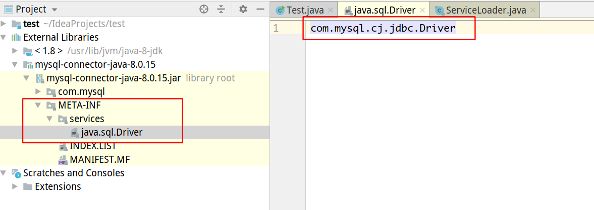

ServiceLoader-javaDoc

<!-- more -->

```java
package indi.greenhat.jvm;

import java.sql.Driver;
import java.sql.DriverManager;
import java.util.Iterator;
import java.util.ServiceLoader;

public class Test {
    public static void main(String[] args) throws Exception {
        ServiceLoader<Driver> loader = ServiceLoader.load(Driver.class);
        Iterator<Driver> iterator = loader.iterator();

        while (iterator.hasNext()) {
            Driver driver = iterator.next();
            System.out.println("drive:" + driver.getClass() + ",loader:" + driver.getClass().getClassLoader());
        }
        System.out.println("当前上下文类加载器：" + Thread.currentThread().getContextClassLoader());
        System.out.println("ServiceLoader的类加载器:" + ServiceLoader.class.getClassLoader());
    }
}
```

输出：

```java
drive:class com.mysql.cj.jdbc.Driver,loader:sun.misc.Launcher$AppClassLoader@18b4aac2
当前上下文类加载器：sun.misc.Launcher$AppClassLoader@18b4aac2
ServiceLoader的类加载器:null
```

# ServiceLoader

```java
java.util 
public final class ServiceLoader<S> extends Object
implements Iterable<S>
```

```
A simple service-provider loading facility.
一个简单的服务提供商加载设施。
A service is a well-known set of interfaces and (usually abstract) classes.
服务是一组众所周知的接口和（通常是抽象的）类。
A service provider is a specific implementation of a service.
服务提供商是服务的具体实现。
The classes in a provider typically implement the interfaces and subclass the classes defined in the service itself. 
提供者中的类通常实现接口并对服务本身定义的类进行子类化
Service providers can be installed in an implementation of the Java platform in the form of extensions, that is, jar files placed into any of the usual extension directories. 
服务提供者可以以扩展的形式安装在Java平台的实现中，即，将jar文件放入任何通常的扩展目录中。
Providers can also be made available by adding them to the application's class path or by some other platform-specific means.
提供程序也可以通过将它们添加到应用程序的class path或其他特定于平台的方法来提供
For the purpose of loading, a service is represented by a single type, that is, a single interface or abstract class. (A concrete class can be used, but this is not recommended.)
出于加载的目的，服务由单个类型表示，即单个接口或抽象类。（可以使用具体类，但不建议这样做。）
A provider of a given service contains one or more concrete classes that extend this service type with data and code specific to the provider.
给定服务的提供者包提供程序类的详细信息往往是高度特定于服务的; 没有单个类或接口可以统一它们，所以这里没有定义这样的类型。含一个或多个具体类，这些类使用特定于提供者的数据和代码扩展此服务类型。
The provider class is typically not the entire provider itself but rather a proxy which contains enough information to decide whether the provider is able to satisfy a particular request together with code that can create the actual provider on demand.
提供者类通常不是整个提供者本身，而是包含足够信息的代理，以确定提供者是否能够满足特定请求以及可以按需创建实际提供者的代码
The details of provider classes tend to be highly service-specific; no single class or interface could possibly unify them, so no such type is defined here. 
提供者类的详细信息往往是高度特定于服务的; 没有单个类或接口可以统一它们，所以这里没有定义这样的类型。
The only requirement enforced by this facility is that provider classes must have a zero-argument constructor so that they can be instantiated during loading.
此工具强制执行的唯一要求是提供者类必须具有零参数构造函数，以便可以在加载期间实例化它们。
```

```
A service provider is identified by placing a provider-configuration file in the resource directory META-INF/services.
通过将提供者配置文件放在资源目录META-INF/services中来标识服务提供者。
The file's name is the fully-qualified binary name of the service's type.
文件名是服务类型的完全限定二进制名称
The file contains a list of fully-qualified binary names of concrete provider classes, one per line. 
该文件包含具体提供者类的完全限定二进制名称列表，每行一个。
Space and tab characters surrounding each name, as well as blank lines, are ignored.
每个名称周围的空格和制表符(tab)以及空行都将被忽略。
The comment character is '#' ('\u0023', NUMBER SIGN); on each line all characters following the first comment character are ignored. The file must be encoded in UTF-8.
注释字符为'＃'（'\ u0023'，NUMBER SIGN）; 在每一行上，忽略第一个注释字符后面的所有字符。 该文件必须以UTF-8编码。
```

```
If a particular concrete provider class is named in more than one configuration file, or is named in the same configuration file more than once, then the duplicates are ignored. 
如果一个特定的具体提供程序类在多个配置文件中命名，或者在同一配置文件中多次命名，则忽略重复的配置文件。
The configuration file naming a particular provider need not be in the same jar file or other distribution unit as the provider itself.
命名特定提供者的配置文件不必与提供程序本身位于同一jar文件或其他分发单元中。
The provider must be accessible from the same class loader that was initially queried to locate the configuration file; note that this is not necessarily the class loader from which the file was actually loaded.
提供程序必须可以从与定位寻找配置文件的类加载器加载; 请注意，这不一定是实际加载文件的类加载器。
```

---

从这里我们可以看出，`ServiceLoader`是从`META-INF/services`来定位jar包的，然后读取文件中的限定名



所以上面就的输出正好验证了这一个

---

```
Providers are located and instantiated lazily, that is, on demand. 
提供者可以延迟地定位和实例化，即按需提供。
A service loader maintains a cache of the providers that have been loaded so far.
服务加载器会维护到目前为止已经加载的提供程序的缓存
Each invocation of the iterator method returns an iterator that first yields all of the elements of the cache, in instantiation order, and then lazily locates and instantiates any remaining providers, adding each one to the cache in turn.The cache can be cleared via the reload method.
每次调用iterator方法都会返回一个迭代器，首先按照实例化顺序生成缓存的所有元素，然后延迟地定位和实例化任何剩余的提供程序，依次将每个元素添加到缓存中。 缓存可以通过reload方法清除。
```

---
```java
//缓存提供程序，以实例化顺序排列
private LinkedHashMap<String,S> providers = new LinkedHashMap<>();
```
通过上面可以看到的，缓存是通过一个HashMap来存储的

---
```
Instances of this class are not safe for use by multiple concurrent threads.
此类的实例不能安全地被多个并发线程使用。
Unless otherwise specified, passing a null argument to any method in this class will cause a NullPointerException to be thrown.
除非另有说明，否则传递null参数到此类中的任何方法将导致抛出NullPointerException 
Example Suppose we have a service type com.example.CodecSet which is intended to represent sets of encoder/decoder pairs for some protocol. In this case it is an abstract class with two abstract methods:
示例假设我们有一个服务类型com.example.CodecSet，用于表示一些协议的编码器/解码器对的集合。在这种情况下，它是一个抽象类，有两个抽象方法：
public abstract Encoder getEncoder(String encodingName);
public abstract Decoder getDecoder(String encodingName);

Each method returns an appropriate object or null if the provider does not support the given encoding. Typical providers support more than one encoding.
每个方法返回一个适当的对象，如果提供者不支持给定的编码，则返回null。 典型的提供程序支持多种编码

If com.example.impl.StandardCodecs is an implementation of the CodecSet service then its jar file also contains a file named META-INF/services/com.example.CodecSet
如果com.example.impl.StandardCodecs是CodecSet服务的实现，那么它的jar文件还包含一个名为META-INF/services/com.example.CodecSet的文件

此文件包含单行：
com.example.impl.StandardCodecs    # Standard codecs

CodecSet类在初始化时创建并保存单个服务实例：
private static ServiceLoader<CodecSet> codecSetLoader
     = ServiceLoader.load(CodecSet.class);
     
为了找到一个给定的编码名称的编码器，它定义了一个静态工厂方法，它遍历已知和可用的提供者，只有当它找到一个合适的编码器或已经用完提供者时才返回。
 public static Encoder getEncoder(String encodingName) {
     for (CodecSet cp : codecSetLoader) {
         Encoder enc = cp.getEncoder(encodingName);
         if (enc != null)
             return enc;
     }
     return null;
 }
```

