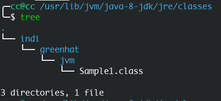
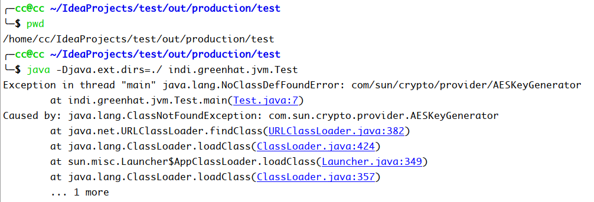
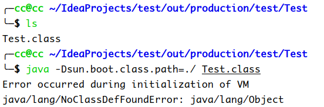

System.getProperty
<!-- more -->

# System.getProperty()

参考：[<https://www.jianshu.com/p/9b262628e041>](https://www.jianshu.com/p/9b262628e041)

```java
package indi.greenhat.jvm;

public class Test {
    public static void main(String[] args) throws Exception{
        /**
         * 获取指定键指示的系统属性
         * 首先，如果存在安全管理器，会调用其checkPropertiesAccess无参方法，有可能抛出安全异常
         * 当前系统属性集会通过Property对象返回（对象有getProperty()方法）
         * 如果当前没有系统属性集，会创建并初始化系统属性集。
         */
        //获得根类加载器系统属性
        System.out.println(System.getProperty("sun.boot.class.path"));
        //获得扩展类加载器系统属性
        System.out.println(System.getProperty("java.ext.dirs"));
        //获得系统类加载器系统属性
        System.out.println(System.getProperty("java.class.path"));
    }
}
```

输出

```java
/usr/lib/jvm/java-8-jdk/jre/lib/resources.jar:/usr/lib/jvm/java-8-jdk/jre/lib/rt.jar:/usr/lib/jvm/java-8-jdk/jre/lib/sunrsasign.jar:/usr/lib/jvm/java-8-jdk/jre/lib/jsse.jar:/usr/lib/jvm/java-8-jdk/jre/lib/jce.jar:/usr/lib/jvm/java-8-jdk/jre/lib/charsets.jar:/usr/lib/jvm/java-8-jdk/jre/lib/jfr.jar:/usr/lib/jvm/java-8-jdk/jre/classes

/usr/lib/jvm/java-8-jdk/jre/lib/ext:/usr/java/packages/lib/ext

/usr/lib/jvm/java-8-jdk/jre/lib/charsets.jar:/usr/lib/jvm/java-8-jdk/jre/lib/deploy.jar:/usr/lib/jvm/java-8-jdk/jre/lib/ext/cldrdata.jar:/usr/lib/jvm/java-8-jdk/jre/lib/ext/dnsns.jar:/usr/lib/jvm/java-8-jdk/jre/lib/ext/jaccess.jar:/usr/lib/jvm/java-8-jdk/jre/lib/ext/jfxrt.jar:/usr/lib/jvm/java-8-jdk/jre/lib/ext/localedata.jar:/usr/lib/jvm/java-8-jdk/jre/lib/ext/nashorn.jar:/usr/lib/jvm/java-8-jdk/jre/lib/ext/sunec.jar:/usr/lib/jvm/java-8-jdk/jre/lib/ext/sunjce_provider.jar:/usr/lib/jvm/java-8-jdk/jre/lib/ext/sunpkcs11.jar:/usr/lib/jvm/java-8-jdk/jre/lib/ext/zipfs.jar:/usr/lib/jvm/java-8-jdk/jre/lib/javaws.jar:/usr/lib/jvm/java-8-jdk/jre/lib/jce.jar:/usr/lib/jvm/java-8-jdk/jre/lib/jfr.jar:/usr/lib/jvm/java-8-jdk/jre/lib/jfxswt.jar:/usr/lib/jvm/java-8-jdk/jre/lib/jsse.jar:/usr/lib/jvm/java-8-jdk/jre/lib/management-agent.jar:/usr/lib/jvm/java-8-jdk/jre/lib/plugin.jar:/usr/lib/jvm/java-8-jdk/jre/lib/resources.jar:/usr/lib/jvm/java-8-jdk/jre/lib/rt.jar:/home/cc/IdeaProjects/test/out/production/test:/home/cc/opt/idea-IU-191.7141.44/lib/idea_rt.jar
```

从这里可以看到`System.getProperty()`主要能够拿到一些关于Java的系统属性，如：java版本，java的vendor，操作系统版本等等。另外，还能够运行java命令时，通过-D参数来指定系统属性

# 样例1

从上面可以到根类加载器的一个加载目录有`/usr/lib/jvm/java-8-jdk/jre/classes`，然后我们可以把一个`.class`放在这个目录下，尝试去让根类加载器去加载它。

我们用自定义类加载器去加载`indi.greenhat.jvm.Sample1`，把其`.class`文件复制到刚刚那个目录



```java
package indi.greenhat.jvm;

public class Test {
    public static void main(String[] args) throws Exception{
        CustomClassLoader loader1 = new CustomClassLoader("loder1");
        loader1.setPath("/home/cc/Test");

        Class<?> clazz = loader1.loadClass("indi.greenhat.jvm.Sample1");

        System.out.println(clazz.getClassLoader());
    }
}
```

输出：

```java
null
```

可以看到，最终该类是由根类加载器加载，这正好也对应了双亲委派机制。

# 样例2

```java
package indi.greenhat.jvm;

import com.sun.crypto.provider.AESKeyGenerator;

public class Test {
    public static void main(String[] args) throws Exception{
        AESKeyGenerator aesKeyGenerator = new AESKeyGenerator();
        System.out.println(aesKeyGenerator.getClass().getClassLoader());
        System.out.println(Test.class.getClassLoader());
    }
}
```

输出：

```java
sun.misc.Launcher$ExtClassLoader@12a3a380
sun.misc.Launcher$AppClassLoader@18b4aac2
```

`AESKeyGenerator`该类定义在扩展类加载器所对应的目录下，所有有扩展类加载器加载的，而`Test`类则是由系统类加载器加载的。

上面说过，可以通过-D参数来指定系统属性。



我们通过-D改变扩展类的加载器寻找的目录，然后就会抛出异常。

正好说明了`AESKeyGenerator`类是由扩展类加载器加载的。

# java.ext.dirs

如果将`java.ext.dirs`目录指定到含有某个类的.class的文件夹中，尝试用扩展类加载器加载，这样是不行的。

因为扩展类加载器查找的`.jar`文件。

所以可以运用`jar`命令将`.class`文件打包成jar包，例如

`jar cvf test.jar test.class`

# sun.boot.class.path

如果我们修改`sun.boot.class.path`对应的路径则会抛出异常。

因为`Object`类是每个类的父类，如果父类都没有了，那么不用说别的了。



