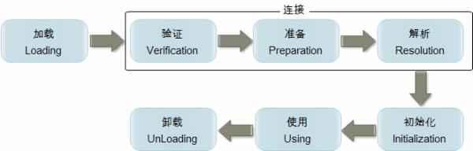

学习自周志明老师的《深入理解Java虚拟机》第二版

<!-- more -->

同时参考：[http://www.cnblogs.com/plxx/p/4528688.html](http://www.cnblogs.com/plxx/p/4528688.html)

# 类的加载

**虚拟机把描述类的数据从Class文件加载到内存，并对数据进行校验,转换解析和初始化，最终形成可以被虚拟机直接使用的Java类型，这就是虚拟机的类加载机制**

与那些在编译时需要进行连接工作的语言不同，在Java语言里面，类型的加载、连接和初始化过程都是在**程序运行期间完成**的，这种策略虽然会令类加载时稍微增加一些性能开销，但是**会为Java应用程序提供高度的灵活性**

Java里天生可以扩展的语言特性就是依赖**运行期动态加载和动态连接**这个特点实现的，比如

- 编写一个面向接口的应用程序，可以等到运行时再指定其实际的实现类
- 用户可以通过Java预定义的和自定义类加载器，让 一个本地的应用程序可以在运行时从网络或其他地方加载一个二进制流作为程序代码的一部 分，这种组装应用程序的方式目前已广泛应用于Java程序之中。从最基础的`Applet`、`JSP`到相 对复杂的`OSGi`技术

> OSGi(Open Service Gateway  Initiative)技术是Java动态化模块化系统的一系列规范。OSGi一方面指维护OSGi规范的OSGI官方联盟，另一方面指的是该组织维护的基于Java语言的服务（业务）规范。简单来说，OSGi可以认为是Java平台的模块层。
>
> OSGi服务平台向Java提供服务，这些服务使Java成为软件集成和软件开发的首选环境。Java提供在多个平台支持产品的可移植性。OSGi技术提供允许应用程序使用精炼、可重用和可协作的组件构建的标准化原语，这些组件能够组装进一个应用和部署中。

# 类加载的时机

类从被加载到虚拟机内存中开始，直到卸载出内存为止，它的整个生命周期包括了： **加载、验证、准备、解析、初始化、使用和卸载** 这7个阶段。其中， **验证、准备和解析这三个部分统称为连接（linking）** 。



# 类进行初始化的情况

什么情况下需要开始类加载过程的第一个阶段:"加载"。虚拟机规范中并没强行约束，这点可以交给虚拟机的的具体实现自由把握，但是对于**初始化阶段虚拟机规范是严格规定了有且只有5种情况，如果类未初始化会对类进行初始化**。

**初始化不等同于赋值，所以是先进行初始化然后再进行赋值的**

1. 使用new关键字**实例化对象的**时、**读取或设置一个类的静态字段**（被final修饰、已在编译期把结果放入常 量池的静态字段除外）的时候，以及**调用一个类的静态方法**的时候。

   *因为编译器把他们当作值(value)而不是域(field)来对待。如果你的代码中用到了常变 量(constant 
   variable)，编译器并不会生成字节码来从对象中载入域的值，而是直接把这个值插入到字节码中。这是一种很有用的优化，但是如果你需要改变 final域的值那么每一块用到那个域的代码都需要重新编译。*

2. **反射** 如( `Class.forName("com.xxx.Test")` )
3. 当初始化一个类时，发现**其父类还未初始化，则先出触发父类的初始化**
4. 虚拟机启动时，**用户需要指定一个要执行的主类（包含main()办法的那个类），虚拟机会先初始化这个主类**
5. JDK1.7的动态语言支持，如果一个`java.lang.invoke.MethodHandle `实例最后解析结果`REF_getStatic`,`REF_putStatic`,`REF_invokeStatic` 的方法句柄，并且这个方法句柄对应的类没有进行初始化，则需要将其初始化。

这五种场景中的行为对一个类进行**主动引用**，除此之外，所有引用类的方式都不会触发初始化，称为**被动引用**

所有java虚拟机实现必须在每个类或接口被java程序**“首次使用”**时才初始化他们

## 例子

**1. 通过子类引用父类的静态字段，不会导致子类初始化**

```java
/*
通过子类引用父类的静态字段，不会导致子类初始化
*/
public class SuperCalss {
    static {
        System.out.println("super class init");
    }
    public static int value = 23;
}

public class SubClass extends SuperCalss {
    static {
        System.out.println("subclass init");
    }
}

public class Demo1 {
    public static void main(String[] args) {
        System.out.println(SubClass.value);
    }
}
//output： super class init
```

**对于静态字段，只有直接定义这个字段的类才会初始化**，因此通过其子类来引用父类中定义的静态字段，只会触发父类的初始化而不会触发子类的初始化。*至于是否触发子类中定义**加载和验证**，在规范中未明确规定，取决于虚拟机的实现，`Sun HotSpot`虚拟机会导致子类的加载*

**2. 使用数组来定义引用类，不会触发该类的初始化**

   ```java
SuperCalss[]subClass = new SuperCalss[10]; 
//执行之后不会有任何的输出。
   ```

**3. 常量在编译接阶段就会存入调用类的常量池中，本质上没有直接引用定义常量的类，因此不会触发被引用的类的初始化**

```java
public class Test{
    static{
        System.out.println("Test init!");
    }
    public static final String s = "Hello";
}

public class Main{
    public static void main(String[] args){
        System.out.println(Test.s);
    }
}
//执行之后不会有任何的输出。
```

# 接口的加载

接口的加载过程与类加载过程稍有一些不同，针对接口需要做一些特殊说明：接口也有初始化过程，这点与类是一致的，上面的代码都是用静态语句块“static{}”来输出初始化信息 的，而接口中不能使用“static{}”语句块，但编译器仍然会为接口生成“`<clinit>()”`类构造 器，**用于初始化接口中所定义的成员变量**。接口与类真正有所区别的是前面讲述的5种“有且仅有”需要开始初始化场景中的第3种：当一个类在初始化时，要求其父类全部都已经初始 化过了，但是一个接口在初始化时，**并不要求其父接口全部都完成了初始化**，只有在真正使用到父接口的时候才会初始化

# 类加载、连接与初始化

加载：查找并加载类的二进制数据

连接：

- 验证：确保被加载的类的正确性
- 准备：为类的**静态变量**分配内存，并将其初始化为**默认值**
- 解析：把类中的符号引用转换为直接引用

**初始化：为类的静态变量赋予正确的初始值**

```
在java中，一个java类将会编译成一个class文件。在编译时，java类并不知道引用类的实际内存地址，因此只能使用符号引用来代替。比如org.simple.People类引用org.simple.Tool类，在编译时People类并不知道Tool类的实际内存地址，因此只能使用符号org.simple.Tool(假设)来表示Tool类的地址。而在类装载器装载People类时，此时可以通过虚拟机获取Tool类 的实际内存地址，因此便可以既将符号org.simple.Tool替换为Tool类的实际内存地址，即直接引用地址。
```

# 类的加载

类的加载指的是将类的`.class`文件中的二进制数据读入到内存中，将其放在运行时数据区的方法区内，然后在内存中创建一个`java.lang.Class`对象（规范并未说明CIass对象位于哪里，HotSpot虚拟机将其放在了方法区中）用来封装类在方法区内的数据结构

## 类的加载方式

加载`.class`文件的方式

- 从本地系统中直接加载
- 通过网络下载`.class`文件，最典型应用是`Applet`
- 从zip，jar等归档文件中加载`.class`文件
- 从专有数据库中提取`.class`文件
- 将Java源文件动态编为`.class`文件，典型场景是JSP应用

> Applet是采用Java编程语言编写的小应用程序，该程序可以包含在 HTM页中与在页中包含图像的方式大致相同。
>
> 含有Applet的网页的HTML文件代码中部带有`<applet> `和`</applet>`这样一对标记，当支持Java的网络浏览器遇到这对标记时，就将下载相应的小应用程序代码并在本地计算机上执行该Applet。

