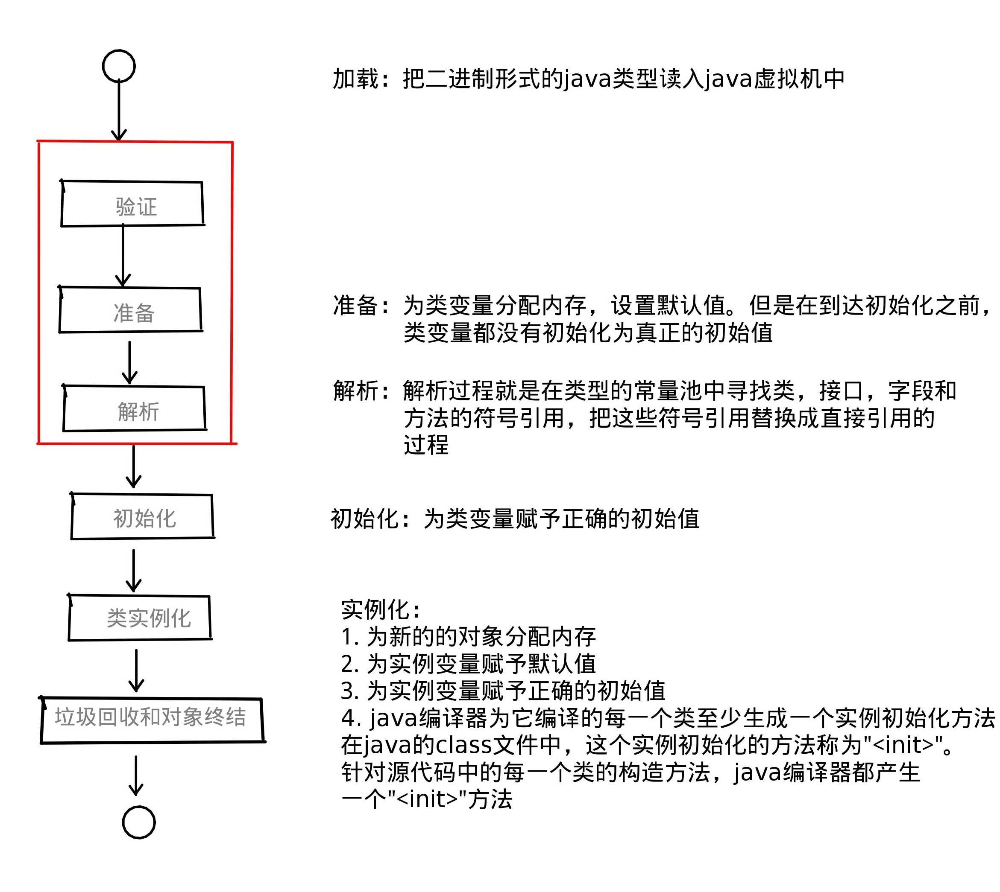
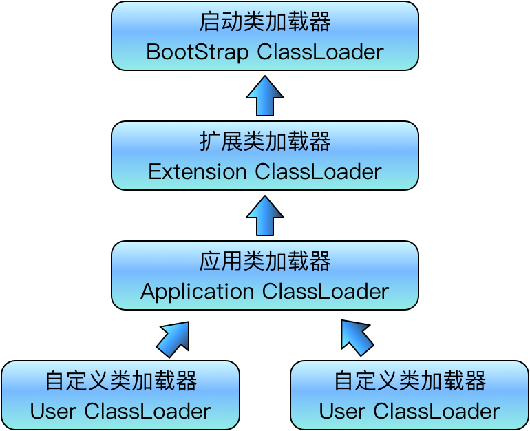

继续学习jvm类的加载

<!-- more -->



# 类的加载

1. 类一定是由类加载器加载但是

2. 类的加载的最终产品是位于内存中的class对象

3. class对象封装了类在方法区内的数据结构，并且向java程序员提供了访问方法区内的数据结构的接口
4. **类加载器并不需要等到某个类被“首次主动使用”时再加载它**

## 预加载

1. jvm规范允许类加载器在预料某个类将要被使用时就预先加载它，如果在预先加载的过程中遇到了class文件缺失或存在错误，类加载器必须在**程序首次主动**使用该类时才报告错误**（LinkageError错误）**

2. 如果这个类一直没有被程序主动使用，那么**类加载器就不会报告这个错误**

## 类的加载器

类加载器用来把类加载到java虚拟机中。从jdk1.2版本开始，类的加载过程采用父亲委托机制，这种机制能更好保证java平台的安全。在此委托机制中，除了java虚拟机自带的根类加载器以外，其余的类加载器都有且只有一个父加载器。当java程序要求加载loader1加载Sample类时，loader1首先委托自己的父加载器去加载Sample类，若加载器能加载，则由父加载器完成加载任务，否则才由加载器loader1本身记载Sample类

有两种类型的类加载器

### Java虚拟机自带的加载器

1. 根类加载器（Bootstrap）
2. 扩展类加载器（Extension）
3. 系统（应用）类加载器（System）

### 用户自定义的类加载器

1. `java.lang.ClassLoader`的子类
2. 用户可以定义类的加载方式

### 详细介绍三种类加载器

Java虚拟机自带了以下几加载器．

1. 根(Bootstrap)类加载器：该加载器没有父加载器，它负责加载虚拟机的核心类库．如`java.lang.*`等。
   根类加载器从系统属性`sun.boot.class.path`所指定的目录中加载类库。根类加载器的实现依赖于底层操作系统，属于虚拟机的实现的一剖分，它并没有继承`java.lang.ClassLoader`类。
2. 扩展(Extension）类加器：它的父加载器为根类加载器。它从`java.ext.dirs`系属性所指定的目录中加类厍，或者从JDK的安装目录`jre\lib\ext`子目录（扩展目录）下加载类库，如果把用户创建的JAR文件放在这个目录下，也会自动由扩展类加载器加载。扩展类加载器是纯Java类，是`java.lang.ClassLoader`类的子类。
3. 系统(System)类加载器：也称为应用类加载器．它的父加载器为扩展类加
   载器。它从环境变量`classpath`或者系统属性`java.class.path`所指定的目录中加
   载类，它是用户自定义的类加载器的默认父加载器。系统类加载器是纯Java
   类，是`java.lang.ClassLoader`类的子类。

## 简略加载过程

参考：[https://javacodes.cn/464.html](https://javacodes.cn/464.html)



- 如果一个类加载器收到了类加载的请求，它不会先自己尝试处理这个请求，而是委派给它的父类加载器，所有的请求最终都会传送到顶层的启动类加载器
- 只有当父类反馈自己无法完成该请求（它的搜索范围中没有找到所需的类，即抛出`ClassNotFoundException`）时，子加载器才会尝试自己加载。

# 类的验证

类被加载后，就进入连接阶段。连接就是将已经读入到内存的类的二进制数据集合并到虚拟机的运行时环境去。

## 类验证部分内容

1. 类的文件结构检查
2. 语义检查
3. 字节码验证
4. 二进制兼容性的验证

# 类的准备

在准备阶段，java虚拟机为类的静态变量分配内存，并设置默认的初始值。例如对于下面的Sample类，在准备阶段，将为int类型的静态变量a分配4个字节的内存空间，并且赋予默认值0，为long类型的静态变量b分配8个字节的内存空间，并且赋予默认值0。

```java
public class Sample{
    private static int a = 1;
    private static long b;
    static{
        b = 2;
    }
    ...
}
```

# 类的初始化

在初始化阶段，java虚拟机执行类的初始化语句，为类的静态变量赋予初始值。在程序中，静态变量的初始化有两种途径：

1. 在静态变量的声明处进行初始化
2. 在静态代码块中进行初始化。

例如在下面代码中，静态变量a和b都被显式初始化，而静态变量c没有被显式初始化，它将保持默认值0.

```java
public class Sample{
    private static int a = 1; //在静态变量的声明处进行初始化
    public static long b;
    public static long c;
    
    static{
        b = 2; //在静态代码块中进行初始化
    }
    ...
}
```

静态变量的声明语句中，以及静态代码块都被看做类的初始化语句，java虚拟机会按照初始化语句在类文件中的先后顺序来依次执行它们。例如当以下Sample雷欧被初始化后，它的静态变量a的取值为4.

```java
public class Sample{
    static int a = 1；
    static{ a = 2; }
    static{ a = 4; }
    public static void Main(Stringa args[]){
        System.out.println(a); //打印4
    }
}
```

## 类的初始化步骤

1. 假设这个类还没有被加载和连接，那就先进行加载和连接
2. 假设类存在直接父类，并且这个父类还没有好被初始化，那就先初始化直接父类
3. 假设类中存在初始化语句，那就依次执行这些初始化语句

## 类的初始化时机

1. 创建类的实例

2. 访问某个类或接口的静态变量，或者对该静态变量赋值

3. 调用类的静态方法

4. 发射（如Class.forName("com.test.test")）

5. 初始化一个类的子类

6. java虚拟机启动时被标明为启动类的类

7. jdk1.7开始提供动态语言支持：

   `java.lang.invoke.MethodHandle`实例的解析结果`REF_getStatic`,`REF_putStatic`,`REF_invokeStatic`句柄对应的类没有初始化，则初始化

除了上述7种情形，其他使用java类的方式都被看做是被动使用，不会导致的类的初始化

（调用ClassLoader类的loadClass方法加载一个类，并不是对类的主动使用，不会导致类的初始化）

## 接口初始化

当java虚拟机初始化一个类时，要求它的所有父类都已经被初始化，但是这条规则并不适用于接口。

- 在初始化一个类时，并不会先初始化它所实现的接口
- 在初始化一个接口时，并不会先初始化它的父接口

因此，一个父接口并不会因为它的子接口或者实现类的初始化而初始化。只有当程序首次使用特定接口的静态变量时，才会导致该接口的初始化

