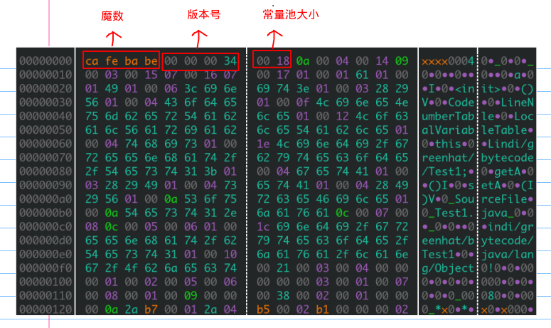
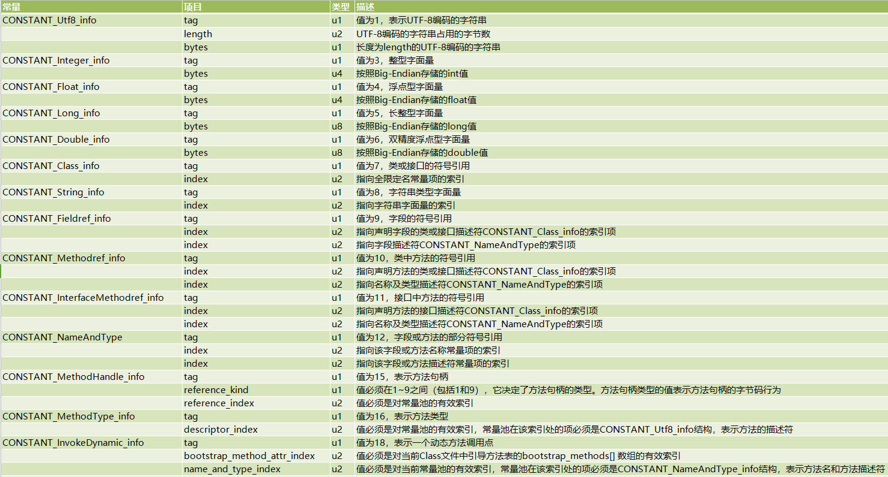
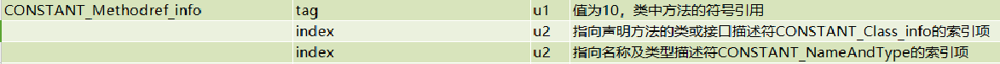
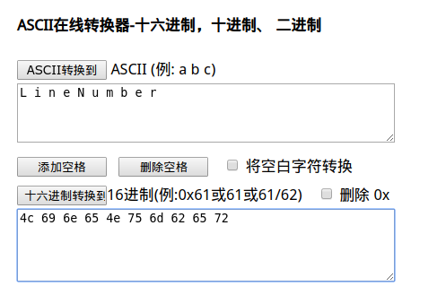

常量池（Constant Pool）

<!-- more -->

# 常量池（Constant Pool）

```java
package indi.greenhat.bytecode;

public class Test1 {
    private int a = 1;

    public int getA() {
        return a;
    }

    public void setA(int a) {
        this.a = a;
    }
}
```



```java
Constant pool:
   #1 = Methodref          #4.#20         // java/lang/Object."<init>":()V
   #2 = Fieldref           #3.#21         // indi/greenhat/bytecode/Test1.a:I
   #3 = Class              #22            // indi/greenhat/bytecode/Test1
   #4 = Class              #23            // java/lang/Object
   #5 = Utf8               a
   #6 = Utf8               I
   #7 = Utf8               <init>
   #8 = Utf8               ()V
   #9 = Utf8               Code
  #10 = Utf8               LineNumberTable
  #11 = Utf8               LocalVariableTable
  #12 = Utf8               this
  #13 = Utf8               Lindi/greenhat/bytecode/Test1;
  #14 = Utf8               getA
  #15 = Utf8               ()I
  #16 = Utf8               setA
  #17 = Utf8               (I)V
  #18 = Utf8               SourceFile
  #19 = Utf8               Test1.java
  #20 = NameAndType        #7:#8          // "<init>":()V
  #21 = NameAndType        #5:#6          // a:I
  #22 = Utf8               indi/greenhat/bytecode/Test1
  #23 = Utf8               java/lang/Object
```

紧接着主次版本号之后的是常量池入口

常量池可以理解为**Class文件之中的资源仓库**，它是Class文件结构中与其他项目关联最多的数据类型，也是占用Class文件空间最大的数据项目之一，同时它还是在Class文件中第一个出现的表类型数据项目。

**常量池中主要存放两大类常量：字面量（`Literal`）和符号引用（`Symbolic References`）。**

- 字面量比较接近于Java语言层面的常量概念，如文本字符串、声明为final的常量值等。
- 而符号引用则属于编译原理方面的概念，包括了下面三类常量：
  - 类和接口的全限定名（`Fully Qualified Name`） 
  - 字段的名称和描述符（`Descriptor`） 
  - 方法的名称和描述符

*Java代码在进行`Javac`编译的时候，并不像C和C++那样有“连接”这一步骤，而是在虚拟机加载Class文件的时候进行动态连接。也就是说，**在Class文件中不会保存各个方法、字段的最终内存布局信息**，因此这些字段、方法的符号引用不经过运行期转换的话无法得到真正的内存入口地址，也就无法直接被虚拟机使用。当虚拟机运行时，需要从常量池获得对应的符号引用，再在类创建时或运行时解析、翻译到具体的内存地址之中。*

------

常量池的总体结构：**Java类所对应的常量池主要由常量池数量与常量池数组这两部分共同组成**。**常量池数量紧跟在主版本号后面**，占据2个字节（`u2`类型数据）；**常量池数组则紧跟在常量池数量之后**。常量池数组与一般数组不同的是，**常量池数组中不同的元素的类型、结构都是是不同的，长度当然也就不同**；但是，**每一种元素的第一个数据都是一个`u1`类型**，该字节是个标志位，占据1个字节，JVM在解析常量池时，会根据这个`u1`类型来获取元素的具体类型。

------

由上面的16进制图可以看到，常量池数量为`0x18`，即24个常量，我们也可以看反编译的结果：`#1～#23`

值得注意的是，`常量池数组中的元素个数=常量池数-1（其中0暂时不使用）`，目的是满足某些常量池索引值的数据在特定情况下需要表达`不引用任何一个常量池`的含义；根本原因在于，索引为0也是一个常量（保留常量），只不过它不位于常量表中，这个常量就对应`null`值；所以，常量池的索引从1开始而非0开始。

# 常量池中数据类型结构

常量池中的每一项常量都是一个表，在 JDK 7 之前共有 11 种结构不同的表，在 JDK 7 中为了更好的支持动态语言调用，又增加了3种。都是`CONSTANT`开头，`info`结尾



其中 `CONSTANT_Utf8_info` 类型的常量，它的 `length` 值说明了这个 UTF-8 编码的字符串长度是多少字节，`bytes` 的值为长度为 `length` 字节的 UTF-8 缩略编码表示的字符串

*由于 Class 文件中方法、字段等都需要引用 `CONSTANT_Utf8_info` 型常量来描述名称，所以 `CONSTANT_Utf8_info` 型常量的最大长度也就是 Java 中方法、字段名的最大长度，即 `u2` 的 65535，也就是说最大 65535 字节，即 64KB。*

# 分析常量池中的数值

从`0a`开始，`0x0a`的十进制为10，因为每一个元素的第一个数据都是一个标志位，查`数据类型结构`表得u1为10的常量：



发现其后面两个值都是索引值，其对应的十六进制为`00 04 00 14`，转换为十进制分别是4和20，那么4和20分别是

```java
#4 = Class              #23            // java/lang/Object
#20 = NameAndType        #7:#8          // "<init>":()V
#23 = Utf8               java/lang/Object
#7 = Utf8               <init>
#8 = Utf8               ()V
```

所以第一个元素`0a 00 04 00 14`代表的是

```jaba
#1 = Methodref          #4.#20         // java/lang/Object."<init>":()V
```

那么`<init>`和`:()v`代表什么呢？

---

在JVM规范中，每个变量/字段都有描述信息，描述信息主要的作用是描述字段的数据类型、方法的参数列表（包括数量、类型与顺序）与返回值。根据描述符规则，**基本数据类型和代表无返回值的void类型都用一个大写字符来表示，对象类型则使用字符工加对象的全限定名称来表示**。为了压缩字节码文件的体积，对于基本数据类型，JVM都只使用一个大写字母来表示，如下所示：

`B-byte，C-char，D-double，F-float，I-int，J-long，S-short，Z-boolean，V-void，L-对象类型`，如`Ljava/lang/String`

对于数组类型来说，每一个维度使用一个前置的`[`来表示，如`int[]`被记录为`[I`，`String[][]`被记录为`[[Ljava/lang/string`

用描述符描述方法时，按照先参数列表，后返回值的顺序来描述。参数列表按照参数的严格顺序放在一组`()`之内，如方法：`String name(int id，String name)`的描述符为：`(I,Ljava/lang/String)Ljava/lang/String`

---

回归正题，`<init>`表示类的构造方法，`()v`：括号里面内容为空，则代表该方法没有参数，v则代表是`void`类型，那么连起来就是代表没有参数返回值为`void`的构造函数，因为我们没有定义这个构造方法，所以这个构造方法是自动生成的，其父类是`object`类

---

接着，`0x09`的十进制为9，也刚好有两个索引值：`00 03 00 15`，转换为十进制分别是`3和21`

```java
#2 = Fieldref           #3.#21         // indi/greenhat/bytecode/Test1.a:I
#3= Class              #22            // indi/greenhat/bytecode/Test1
#22 = Utf8               indi/greenhat/bytecode/Test1    
```

正好对应的是样例类，`a：I`说明有个属性为a，类型是`int`

---

对应一些字符串的常量可以将其转换为ascii码查看其值，比如

```java
 #10 = Utf8               LineNumberTable
```

其对应的十六进制为

`0f 4c 69 6e 65 4e 75 6d 62 65 72`



使用的工具：[ASCII 在线转换器-ASCII码-十六进制-二进制-十进制-字符串-ascii查询器-懒人计算器](http://www.ab126.com/goju/1711.html)

---

```java
#20 = NameAndType        #7:#8          // "<init>":()V
#21 = NameAndType        #5:#6          // a:I
```

`CONSTANT_NameAndType_info`确定唯一的成员变量，比如上面的#20表明是无参的构造方法，`a:I`代表是`int a`

