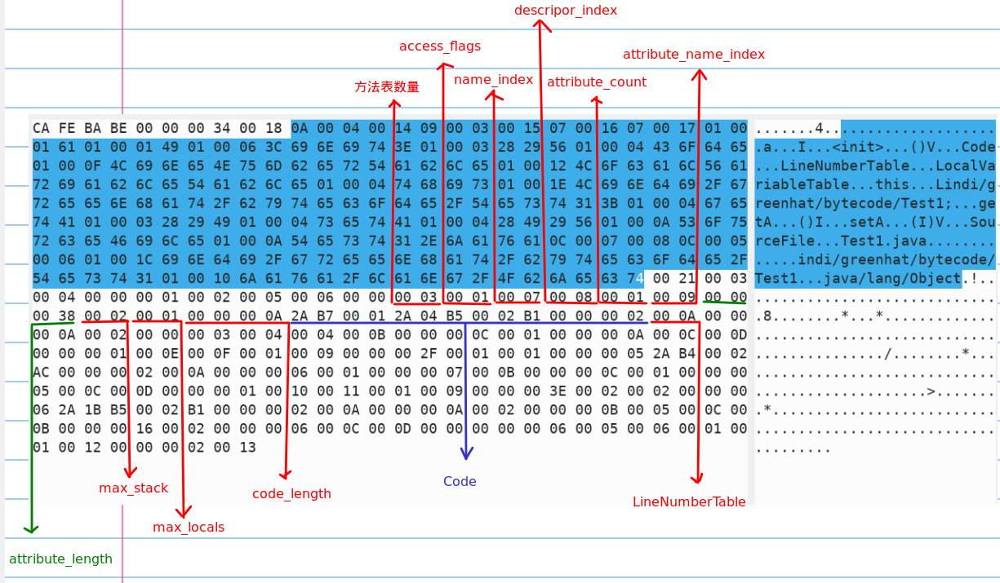

 .class文件

<!-- more -->

Java从刚开始的时候就有两套 规范，一个是Java语言规范，另外一个是Java虚拟机规范，Java语言规范只是规定了Java语言相关的约束以及规则，而虚拟机规范则才是真正从跨平台的角度去设计的

# Java语言的平台无关性

在虚拟机出现之前，程序要想正确运行在计算机上，首先要将代码编译成二进制本地机器码，而这个过程是和电脑的操作系统OS、CPU指令集强相关的，所以可能代码只能在某种特定的平台下运行，而换一个平台或操作系统就无法正确运行了。随着虚拟机的出现，直接将程序编译成机器码，已经不再是唯一的选择了。越来越多的程序语言选择了与操作系统和机器指令集无关的、平台中立的格式作为程序编译后的存储格式。Java就是这样一种语言。“一次编写，到处运行”于是成立Java的宣传口号。

**正是虚拟机和字节码(ByteCode)构成了平台无关性的基石，从而实现“一次编写，到处运行”**

Java虚拟机将.java文件编译成字节码,而.class字节码文件经过JVM转化为当前平台下的机器码后再进行程序执行。这样，程序猿就无需重复编写代码来适应不同平台了，而是一套代码处处运行，至于字节码怎样转化成对应平台下的机器码，那就是Java虚拟机的事情了。

# JVM的语言无关性

时至今日，商业机构和开源机构以及在Java语言之外发展出一大批在Java虚拟机之上运行的语言，如`Groovy`,`JRuby`,`Jython`,`Scala`等等。这些语言通过各自的编译器编译成为.class文件，从而可以被JVM所执行。


所以，由于Java虚拟机设计之初的定位，以及字节码(`ByteCode`)的存在，使得JVM可以执行不同语言下的字节码.class文件，从而构成了语言无关性的基础。

# Class文件结构

## 总体概况

**注意，任何一个Class文件都对应着唯一一个类或接口的定义信息，但反过来说，类或接口并不一定都得定义在文件里（譬如类或接口也可以通过类加载器直接生成）**

```java
package indi.greenhat.bytecode;

public class Test1 {
    private int a = 1;

    public int getA() {
        return a;
    }

    public void setA(int a) {
        this.a = a;
    }
}
```

使用到java内置的一个反编译工具`javap`可以反编译字节码文件。 通过`javap -help`可了解javap的基本用法

```shell
用法: javap <options> <classes>
其中, 可能的选项包括:
  -help  --help  -?        输出此用法消息
  -version                 版本信息
  -v  -verbose             输出附加信息
  -l                       输出行号和本地变量表
  -public                  仅显示公共类和成员
  -protected               显示受保护的/公共类和成员
  -package                 显示程序包/受保护的/公共类
                           和成员 (默认)
  -p  -private             显示所有类和成员
  -c                       对代码进行反汇编
  -s                       输出内部类型签名
  -sysinfo                 显示正在处理的类的
                           系统信息 (路径, 大小, 日期, MD5 散列)
  -constants               显示最终常量
  -classpath <path>        指定查找用户类文件的位置
  -cp <path>               指定查找用户类文件的位置
  -bootclasspath <path>    覆盖引导类文件的位置
```

反编译上面的java代码后出现的结果

```java
Classfile /home/cc/IdeaProjects/test/out/production/test/indi/greenhat/bytecode/Test1.class
  Last modified Jun 23, 2019; size 485 bytes
  MD5 checksum 6c83e799a2a04ca1ae44b4eb2e46ae35
  Compiled from "Test1.java"
public class indi.greenhat.bytecode.Test1
  minor version: 0
  major version: 52
  flags: ACC_PUBLIC, ACC_SUPER
Constant pool:
   #1 = Methodref          #4.#20         // java/lang/Object."<init>":()V
   #2 = Fieldref           #3.#21         // indi/greenhat/bytecode/Test1.a:I
   #3 = Class              #22            // indi/greenhat/bCC`ytecode/Test1
   #4 = Class              #23            // java/lang/Object
   #5 = Utf8               a
   #6 = Utf8               I
   #7 = Utf8               <init>
   #8 = Utf8               ()V
   #9 = Utf8               Code
  #10 = Utf8               LineNumberTable
  #11 = Utf8               LocalVariableTable
  #12 = Utf8               this
  #13 = Utf8               Lindi/greenhat/bytecode/Test1;
  #14 = Utf8               getA
  #15 = Utf8               ()I
  #16 = Utf8               setACC`
  #17 = Utf8               (I)V
  #18 = Utf8               SourceFile
  #19 = Utf8               Test1.java
  #20 = NameAndType        #7:#8          // "<init>":()V
  #21 = NameAndType        #5:#6          // a:I
  #22 = Utf8               indi/greenhat/bytecode/Test1
  #23 = Utf8               java/lang/Object
{
  public indi.greenhat.bytecode.Test1();
    descriptor: ()V
    flags: ACC_PUBLIC
    Code:
      stack=2, locals=1, args_size=1
         0: aload_0
         1: invokespecial #1                  // Method java/lang/Object."<init>":()V
         4: aload_0
         5: iconst_1### attribute_count


         6: putfield      #2                  // Field a:I
         9: return
      LineNumberTable:
        line 3: 0
        line 4: 4
      LocalVariableTable:### attribute_count


        Start  Length  Slot  Name   Signature
            0      10     0  this   Lindi/greenhat/bytecode/Test1;

  public int getA();
    descriptor: ()I
    flags: ACC_PUBLIC
    Code:
      stack=1, locals=1, args_size=1
         0: aload_0
         1: getfield      #2                  // Field a:I
         4: ireturn
      LineNumberTable:
        line 7: 0
      LocalVariableTable:
        Start  Length  Slot  Name   Signature
            0       5     0  this   Lindi/greenhat/bytecode/Test1;

  public void setA(int);
    descriptor: (I)V
    flags: ACC_PUBLIC
    Code:
      stack=2, locals=2, args_size=2
         0: aload_0
         1: iload_1
         2: putfield      #2                  // Field a:I
         5: return
      LineNumberTable:
        line 11: 0
        line 12: 5
      LocalVariableTable:
        Start  Length  Slot  Name   Signature
            0       6     0  this   Lindi/greenhat/bytecode/Test1;
            0       6     1     a   I
}
SourceFile: "Test1.java"
```

在linux下我们可以用`hexyl`工具在终端下查看文件的16进制表示，或者使用`vim -b filename`然后键入`%!xxd -g1`命令查看


可以看到，Class文件是一组以8位字节（由八个二进制数位组成的字节，通常可表示一个字符，即2个字符占一个字节。因为2的4次方表示16，）为基础单位的二进制流，各个数据项目严格按照顺序紧凑地排列在Class文件之中，中间没有添加任何分隔符，这使得整个Class文件中存储的内容几乎 全部是程序运行的必要数据，没有空隙存在。当遇到需要占用8位字节以上空间的数据项 时，则会按照高位在前的方式分割成若干个8位字节进行存储。

一个class文件的结构：





## 字节码中的数据类型

Class字节码中有两种数据类型 

- 字节数据直接量：这是基本的数据类型。共细分为u1，u2， u4，u8四种，分别代表连续的1个字节、2个字节、4个字节、8个字节组成的整体数据。
- 表（数组）：表是由多个基本数据或其他表， 按照既定顺序组成的大的数据集合。表是有结构的，它的结构体现在：组成表的成分所在的位置和顺序都是已经严格定义好的。 

## 魔数（Magic Number）

**每个Class文件的头4个字节称为魔数（0xCAFEBABE），它的唯一作用是确定这个文件是否为一个能被虚拟机接受的Class文件。**

很多文件存储标准中都使用魔数来进行身份识别， 譬如图片格式，如gif或者jpeg等在文件头中都存有魔数。使用魔数而不是扩展名来进行识别 主要是基于安全方面的考虑，因为文件扩展名可以随意地改动。文件格式的制定者可以自由 地选择魔数值，只要这个魔数值还没有被广泛采用过同时又不会引起混淆即可。否被声明为final等。具体的标志位以及标志的含义：否被声明为final等。具体的标志位以及标志的含义：

## Class文件的版本

紧接着魔数的4个字节存储的是Class文件的版本号：第5和第6个字节是次版本号（`Minor Version`），第7和第8个字节是主版本号（`Major Version`）。**Java的版本号是从45开始的**，JDK 1.1之后的每个JDK大版本发布主版本号向上加1（JDK 1.0～1.1使用了45.0～45.3的 版本号），高版本的JDK能向下兼容以前版本的Class文件，但不能运行以后版本的Class文 件，即使文件格式并未发生任何变化，虚拟机也必须拒绝执行超过其版本号的Class文件。


从上面反编译的结果可以看到 `minor version: 0 major version: 52`，或者`0x34`，正好52对应了jdk1.8，

最后面的0为次版本号

 **Class文件版本号**


## 常量池

[Java虚拟机笔记-字节码文件中的常量池 | 葵花妈妈开课辣](Java虚拟机笔记-字节码文件中的常量池 | 葵花妈妈开课辣)

## 访问标志

在常量池结束之后， 紧接着的两个字节代表访问标志（`access_flags`） ， 这个标志用于识别一些类或者接口层次的访问信息， 包括： 这个Class是类还是接口； 是否定义为`public`类型； 是否定义为`abstract`类型； 如果是类的话， 是否被声明为`final`等。具体的标志位以及标志的含义：


`00 21`为此Class文件的一个访问标志符，查看访问表格没有值为21的标志。是因为JVM并不是枚举每一个标志值。

`0x00 21`是`0x0001`和`0x0020`的并集，表示`ACC_PUBLIC`与`ACC_SUPER`

## 类索引、 父类索引与接口索引集合

1. 类索引(`this_class`) 和父类索引(`super_class`) 都是一个`u2`类型的数据， 而接口索引集合(`interfaces`)是一组`u2`类型的数据的集合， **Class文件中由这三项数据来确定这个类的继承关系**。 **类索引用于确定这个类的全限定名， 父类索引用于确定这个类的父类的全限定名**。 由于Java语言不允许多重继承， 所以父类索引只有一个， 除了`java.lang.Object`之外， 所有的Java类都有父类，**因此除了`java.lang.Object`外， 所有Java类的父类索引都不为0**。**接口索引集合就用来描述这个类实现了哪些接口**， 这些被实现的接口将按`implements`语句（ 如果这个类本身是一个接口， 则应当是`extends`语句） 后的接口顺序从左到右排列在接口索引集合中。

2. 类索引和父类索引各自指向一个类型`为CONSTANT_Class_info`的类描述符常量， 通过`CONSTANT_Class_info`类型的常量中的索引值可以找到定义在`CONSTANT_Utf8_info`类型的常量中的全限定名字符串

3. 对于接口索引集合， 入口的第一项——u2类型的数据为接口计数器(`interfaces_count`) ， 表示索引表的容量。 如果该类没有实现任何接口， 则该计数器值为0，后面接口的索引表不再占用任何字节

`00 03`为一个类索引，通过寻找`utf-8`类型确定类的全限定名

```java
#3 = Class              #22            // indi/greenhat/bCC`ytecode/Test1
#22 = Utf8               indi/greenhat/bytecode/Test1
```

`00 04`是一个父类索引

```java
#4 = Class              #23            // java/lang/Object
#23 = Utf8               java/lang/Object
```

`00 00 `为接口索引集合，因为值为0，所以没有后续接口内容

## 字段表集合

字段表(`field_info`)用于描述接口或者类中声明的变量。 字段(`field`)包括类级变量以及实例级变量， 但不包括在方法内部声明的局部变量。

字段表的结构如下所示：


### access_flags

字段修饰符放在`access_flags`项目中， 它与类中的`access_flags`项目是非常类似的， 都是一个`u2`的数据类型

其中可以设置的标志位和含义:


很明显， 在实际情况中， `ACC_PUBLIC`，`ACC_PRIVATE`，`ACC_PROTECTED`三个标志最多只能选择其一，`ACC_FINAL`，`ACC_VOLATILE`不能同时选择。 接口之中的字段必须有`ACC_PUBLIC`，`ACC_STATIC`，`ACC_FINAL`标志， 这些都是由Java本身的语言规则所决定的。

### name_index与descripor_index

跟随`access_flags`标志的是两项索引值： `name_index`和`descriptor_index`。它们都是对常量池的引用， **分别代表着字段的简单名称以及字段和方法的描述符。**

*简单名称是指没有类型和参数修饰的方法或者字段名称， 比如一个类中的inc()方法和m字段的简单名称分别是`inc`和`m`。描述符可以参考：[Java虚拟机笔记-字节码文件中的常量池 | 葵花妈妈开课辣](Java虚拟机笔记-字节码文件中的常量池 | 葵花妈妈开课辣)*

### attribute_count

在`descriptor_index`之后跟随着一个属性表集合用于存储一些额外的信息， 字段都可以在属性表中描述零至多项的额外信息。

---

`00 01`表示的是属性的数量，表明只有一个字段，然后可以从字段表结构出发，分析这个字段的结构

`00 02`为`access_flags`，表示是`private`

`00 05`为`name_index`，表示的是`a`

```java
#5 = Utf8               a
```

`00 06`为`descripor_index`，表示的是`I`

```java
 #6 = Utf8               I
```

`00 00`表示`attribute_count`的值为0

## 方法表集合

Class文件存储格式中对方法的描述与对字段的描述几乎采用了完全一致的方式

- 方法表结构：


- `attribute_info`结构：

```java
attribute_info{
    u2 attribute_name_index;  //属性名的索引
    u4 attribute_length;   //属性的长度
    u1 info[attribute_length];  //具体的信息
}
```

- 访问标志：


---

`00 03`为方法表的数量，转换为十进制有3个，也就是

1. `getA()`
2. `setA()`
3. 编译器自动生成的默认构造方法

`00 01`为`ACC_public`访问标志

`00 07`和`00 08`为常量池索引，分别表示`name_index`与`descripor_index`

```java
#7 = Utf8               <init>
#8 = Utf8               ()V
```

`00 01`为`attribute_count`，也就是说共有一个属性表

`00 09`为`attribute_info`里面的`attribute_name_index`

```java
#9 = Utf8               Code
```

方法里的Java代码， 经过编译器编译成字节码指令后， 存放在方法属性表集合中一个名为`Code`的属性里面

比如：

```java
  public int getA();
    descriptor: ()I
    flags: ACC_PUBLIC
    Code:
      stack=1, locals=1, args_size=1
         0: aload_0
         1: getfield      #2                  // Field a:I
         4: ireturn
      LineNumberTable:
        line 7: 0
      LocalVariableTable:
        Start  Length  Slot  Name   Signature
            0       5     0  this   Lindi/greenhat/bytecode/Test1;
```

`00 00 00 38`为`attribute_length`，转换为十进制为56，也就是说会用56个字节作为`code`里面的值

### Code属性

**Java程序方法体中的代码经过`Javac`编译器处理后， 最终变为字节码指令存储在`Code`属性内**。 `Code`属性出现在方法表的属性集合之中， 但并非所有的方法表都必须存在这个属性， 譬如接口或者抽象类中的方法就不存在`Code`属性， 如果方法表有`Code`属性存在， 那么它的结构如下所示：


- `attribute_name_index`是一项指向`CONSTANT_Utf8_info`型常量的索引， 常量值固定为`Code`， 它代表了该属性的属性名称

-  `attribute_length`指示了属性值的长度， 由于属性名称索引与属性长度一共为6字节， 所以属性值的长度固定为整个属性表长度减去6个字节

- `max_stack`代表了操作数栈(`Operand Stacks`)深度的最大值。 在方法执行的任意时刻，操作数栈都不会超过这个深度。 虚拟机运行的时候需要根据这个值来分配栈帧(`Stack Frame`)中的操作栈深度

- `max_locals`代表了局部变量表所需的存储空间。

  *在这里， `max_locals`的单位是`Slot`,`Slot`是虚拟机为局部变量分配内存所使用的最小单位。 对于`byte`，`char`，`float`，`int`，`short`，`boolean`和`returnAddress`等长度不超过32位的数据类型， 每个局部变量占用1个`Slot`， 而`double`和`long`这两种64位的数据类型则需要两个`Slot`来存放*

- `code_length`和`code`用来存储Java源程序编译后生成的字节码指令。`code_length`代表字节码长度， `code`是用于存储字节码指令的一系列字节流

   *既然叫字节码指令， 那么每个指令就是一个u1类型的单字节， 当虚拟机读取到code中的一个字节码时， 就可以对应找出这个字节码代表的是什么指令， 并且可以知道这条指令后面是否需要跟随参数， 以及参数应当如何理解*

  *关于`code_length`， 有一件值得注意的事情， 虽然它是一个u4类型的长度值， 理论上最大
  值可以达到`2^32-1`， 但是虚拟机规范中明确限制了一个方法不允许超过65535条字节码指令，
  即它实际只使用了u2的长度， 如果超过这个限制， Javac编译器也会拒绝编译。 一般来讲， 编
  写Java代码时只要不是刻意去编写一个超长的方法来为难编译器， 是不太可能超过这个最大
  值的限制。 但是， 某些特殊情况， 例如在编译一个很复杂的JSP文件时， 某些JSP编译器会把
  JSP内容和页面输出的信息归并于一个方法之中， 就可能因为方法生成字节码超长的原因而
  导致编译失败*

- `exception_table`用来存放的是异常处理的信息，每个`exception_table`表项由`start_pc`，`end_pc`，`handler_pc`以及`catch_type`组成


---

我们可以用[jclasslib](https://github.com/ingokegel/jclasslib)这个软件来帮助我们查看字节码


可以看到Code里面其实是一系列的助记符，其对应的十六进制为


也就是说`0x2A`对应的就是`aload_0`

`0xB7`对应的就是` invokespecial`，后面的`00 01`代表` java/lang/Object."<init>":()V`，也就是`invokespecial`后面所要接受的参数值

对应的助记符解释（来自《Java虚拟机规范 JavaSE8》）


#### LineNumberTable属性

`LineNumberTable`属性用于描述Java源码行号与字节码行号（ 字节码的偏移量） 之间的对应关系。 它并不是运行时必需的属性， 但默认会生成到Class文件之中


`line_number_table`是一个数量为`line_number_table_length`，类型为`line_number_info`的集
合， `line_number_info`表包括了`start_pc`和`line_number`两个`u2`类型的数据项， 前者是字节码行
号， 后者是Java源码行号。当程序运行抛出异常时，异常堆栈中显示出错的行号就是根据这个对应关系来显示的。


#### LocalVariableTable属性

`LocalVariableTable`属性用于描述栈帧中局部变量表中的变量与Java源码中定义的变量之间的关系， 它也不是运行时必需的属性， 但默认会生成到Class文件之中


`local_variable_info`结构:


- `start_pc`和`length`属性分别代表了这个局部变量的生命周期开始地字节码偏移量及其作用范围覆盖的长度，两者结合起来就是这个局部变量在字节码之中的作用域范围。
- `name_index`和`descriptor_index`都是指向常量池中`CONSTANT_Utf8_info`型常量的索引，分别代表了局部变量的名称以及这个局部变量的描述符。
- `index`是这个局部变量在栈帧局部变量表中`Slot`的位置。当这个变量数据类型是 64位类型时（`double`和`long`），他占用的`Slot`为`index`和`index+1`两个


**可以看到默认构造函数有一个局部变量this，代表类自身**

参考：

[Java虚拟机—Class文件结构 - 知乎](https://zhuanlan.zhihu.com/p/45003974)

[轻松看懂Java字节码 - 掘金](https://juejin.im/post/5aca2c366fb9a028c97a5609)

[类文件结构 | nekolr's blog](https://blog.nekolr.com/2018/04/18/%E7%B1%BB%E6%96%87%E4%BB%B6%E7%BB%93%E6%9E%84/)

[认识 .class 文件的字节码结构 | 一些无处安放的代码和故事](https://lijiankun24.com/%E8%AE%A4%E8%AF%86-class-%E6%96%87%E4%BB%B6%E7%9A%84%E5%AD%97%E8%8A%82%E7%A0%81%E7%BB%93%E6%9E%84/)

[Java Class文件结构解析-云栖社区-阿里云](https://yq.aliyun.com/articles/640924)

《深入理解java虚拟机（第二版 周志明）》