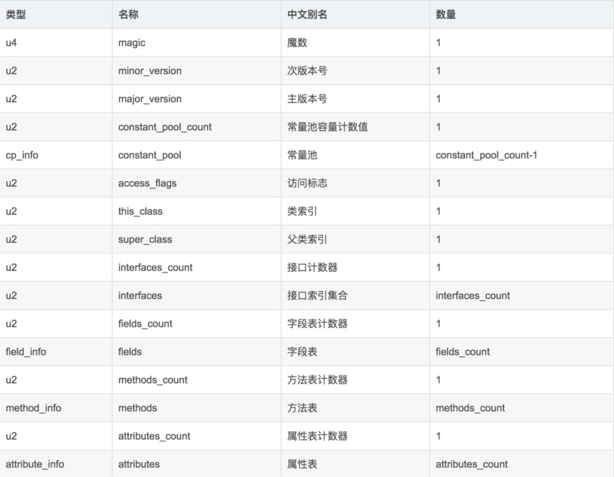
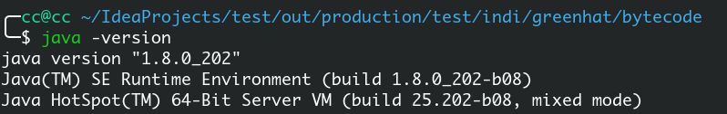

 .class文件

<!-- more -->

Java从刚开始的时候就有两套 规范，一个是Java语言规范，另外一个是Java虚拟机规范，Java语言规范只是规定了Java语言相关的约束以及规则，而虚拟机规范则才是真正从跨平台的角度去设计的

# Java语言的平台无关性

在虚拟机出现之前，程序要想正确运行在计算机上，首先要将代码编译成二进制本地机器码，而这个过程是和电脑的操作系统OS、CPU指令集强相关的，所以可能代码只能在某种特定的平台下运行，而换一个平台或操作系统就无法正确运行了。随着虚拟机的出现，直接将程序编译成机器码，已经不再是唯一的选择了。越来越多的程序语言选择了与操作系统和机器指令集无关的、平台中立的格式作为程序编译后的存储格式。Java就是这样一种语言。“一次编写，到处运行”于是成立Java的宣传口号。

**正是虚拟机和字节码(ByteCode)构成了平台无关性的基石，从而实现“一次编写，到处运行”**

Java虚拟机将.java文件编译成字节码,而.class字节码文件经过JVM转化为当前平台下的机器码后再进行程序执行。这样，程序猿就无需重复编写代码来适应不同平台了，而是一套代码处处运行，至于字节码怎样转化成对应平台下的机器码，那就是Java虚拟机的事情了。

# JVM的语言无关性

时至今日，商业机构和开源机构以及在Java语言之外发展出一大批在Java虚拟机之上运行的语言，如`Groovy`,`JRuby`,`Jython`,`Scala`等等。这些语言通过各自的编译器编译成为.class文件，从而可以被JVM所执行。


所以，由于Java虚拟机设计之初的定位，以及字节码(`ByteCode`)的存在，使得JVM可以执行不同语言下的字节码.class文件，从而构成了语言无关性的基础。

# Class文件结构

## 总体概况

**注意，任何一个Class文件都对应着唯一一个类或接口的定义信息，但反过来说，类或接口并不一定都得定义在文件里（譬如类或接口也可以通过类加载器直接生成）**

```java
package indi.greenhat.bytecode;

public class Test1 {
    private int a = 1;

    public int getA() {
        return a;
    }

    public void setA(int a) {
        this.a = a;
    }
}
```

使用到java内置的一个反编译工具`javap`可以反编译字节码文件。 通过`javap -help`可了解javap的基本用法

```shell
用法: javap <options> <classes>
其中, 可能的选项包括:
  -help  --help  -?        输出此用法消息
  -version                 版本信息
  -v  -verbose             输出附加信息
  -l                       输出行号和本地变量表
  -public                  仅显示公共类和成员
  -protected               显示受保护的/公共类和成员
  -package                 显示程序包/受保护的/公共类
                           和成员 (默认)
  -p  -private             显示所有类和成员
  -c                       对代码进行反汇编
  -s                       输出内部类型签名
  -sysinfo                 显示正在处理的类的
                           系统信息 (路径, 大小, 日期, MD5 散列)
  -constants               显示最终常量
  -classpath <path>        指定查找用户类文件的位置
  -cp <path>               指定查找用户类文件的位置
  -bootclasspath <path>    覆盖引导类文件的位置
```

反编译上面的java代码后出现的结果

```java
Classfile /home/cc/IdeaProjects/test/out/production/test/indi/greenhat/bytecode/Test1.class
  Last modified Jun 23, 2019; size 485 bytes
  MD5 checksum 6c83e799a2a04ca1ae44b4eb2e46ae35
  Compiled from "Test1.java"
public class indi.greenhat.bytecode.Test1
  minor version: 0
  major version: 52
  flags: ACC_PUBLIC, ACC_SUPER
Constant pool:
   #1 = Methodref          #4.#20         // java/lang/Object."<init>":()V
   #2 = Fieldref           #3.#21         // indi/greenhat/bytecode/Test1.a:I
   #3 = Class              #22            // indi/greenhat/bytecode/Test1
   #4 = Class              #23            // java/lang/Object
   #5 = Utf8               a
   #6 = Utf8               I
   #7 = Utf8               <init>
   #8 = Utf8               ()V
   #9 = Utf8               Code
  #10 = Utf8               LineNumberTable
  #11 = Utf8               LocalVariableTable
  #12 = Utf8               this
  #13 = Utf8               Lindi/greenhat/bytecode/Test1;
  #14 = Utf8               getA
  #15 = Utf8               ()I
  #16 = Utf8               setA
  #17 = Utf8               (I)V
  #18 = Utf8               SourceFile
  #19 = Utf8               Test1.java
  #20 = NameAndType        #7:#8          // "<init>":()V
  #21 = NameAndType        #5:#6          // a:I
  #22 = Utf8               indi/greenhat/bytecode/Test1
  #23 = Utf8               java/lang/Object
{
  public indi.greenhat.bytecode.Test1();
    descriptor: ()V
    flags: ACC_PUBLIC
    Code:
      stack=2, locals=1, args_size=1
         0: aload_0
         1: invokespecial #1                  // Method java/lang/Object."<init>":()V
         4: aload_0
         5: iconst_1
         6: putfield      #2                  // Field a:I
         9: return
      LineNumberTable:
        line 3: 0
        line 4: 4
      LocalVariableTable:
        Start  Length  Slot  Name   Signature
            0      10     0  this   Lindi/greenhat/bytecode/Test1;

  public int getA();
    descriptor: ()I
    flags: ACC_PUBLIC
    Code:
      stack=1, locals=1, args_size=1
         0: aload_0
         1: getfield      #2                  // Field a:I
         4: ireturn
      LineNumberTable:
        line 7: 0
      LocalVariableTable:
        Start  Length  Slot  Name   Signature
            0       5     0  this   Lindi/greenhat/bytecode/Test1;

  public void setA(int);
    descriptor: (I)V
    flags: ACC_PUBLIC
    Code:
      stack=2, locals=2, args_size=2
         0: aload_0
         1: iload_1
         2: putfield      #2                  // Field a:I
         5: return
      LineNumberTable:
        line 11: 0
        line 12: 5
      LocalVariableTable:
        Start  Length  Slot  Name   Signature
            0       6     0  this   Lindi/greenhat/bytecode/Test1;
            0       6     1     a   I
}
SourceFile: "Test1.java"
```

在linux下我们可以用`hexyl`工具在终端下查看文件的16进制表示，或者使用`vim -b filename`然后键入`%!xxd -g1`命令查看


可以看到，Class文件是一组以8位字节（由八个二进制数位组成的字节，通常可表示一个字符，即2个字符占一个字节。因为2的4次方表示16，）为基础单位的二进制流，各个数据项目严格按照顺序紧凑地排列在Class文件之中，中间没有添加任何分隔符，这使得整个Class文件中存储的内容几乎 全部是程序运行的必要数据，没有空隙存在。当遇到需要占用8位字节以上空间的数据项 时，则会按照高位在前的方式分割成若干个8位字节进行存储。

一个class文件的结构：



## 魔数（Magic Number）

**每个Class文件的头4个字节称为魔数（0xCAFEBABE），它的唯一作用是确定这个文件是否为一个能被虚拟机接受的Class文件。**

很多文件存储标准中都使用魔数来进行身份识别， 譬如图片格式，如gif或者jpeg等在文件头中都存有魔数。使用魔数而不是扩展名来进行识别 主要是基于安全方面的考虑，因为文件扩展名可以随意地改动。文件格式的制定者可以自由 地选择魔数值，只要这个魔数值还没有被广泛采用过同时又不会引起混淆即可。

## Class文件的版本

紧接着魔数的4个字节存储的是Class文件的版本号：第5和第6个字节是次版本号（`Minor Version`），第7和第8个字节是主版本号（`Major Version`）。**Java的版本号是从45开始的**，JDK 1.1之后的每个JDK大版本发布主版本号向上加1（JDK 1.0～1.1使用了45.0～45.3的 版本号），高版本的JDK能向下兼容以前版本的Class文件，但不能运行以后版本的Class文 件，即使文件格式并未发生任何变化，虚拟机也必须拒绝执行超过其版本号的Class文件。



从上面反编译的结果可以看到 `minor version: 0 major version: 52`，或者`0x34`，正好52对应了jdk1.8，

最后面的0为次版本号

 **Class文件版本号**


参考：

[Java虚拟机—Class文件结构 - 知乎](https://zhuanlan.zhihu.com/p/45003974)

[轻松看懂Java字节码 - 掘金](https://juejin.im/post/5aca2c366fb9a028c97a5609)

《深入理解java虚拟机（第二版 周志明）》

[类文件结构 | nekolr's blog]([https://blog.nekolr.com/2018/04/18/%E7%B1%BB%E6%96%87%E4%BB%B6%E7%BB%93%E6%9E%84/](https://blog.nekolr.com/2018/04/18/类文件结构/))