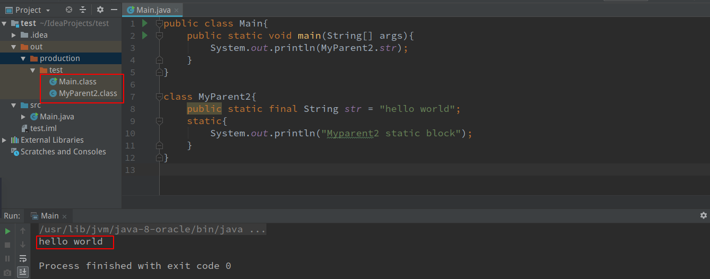
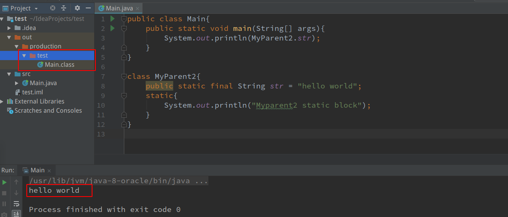
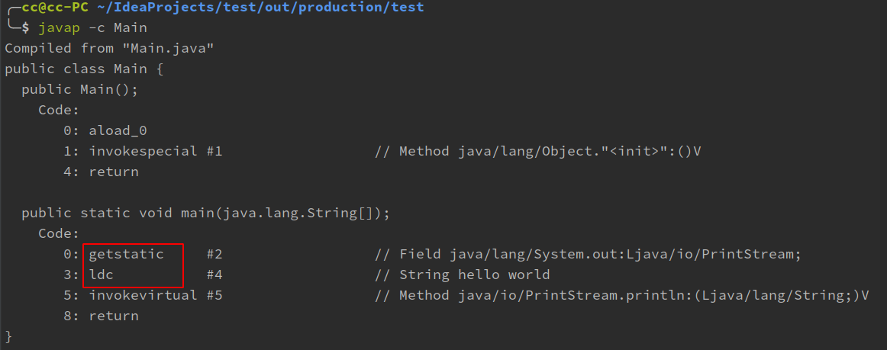
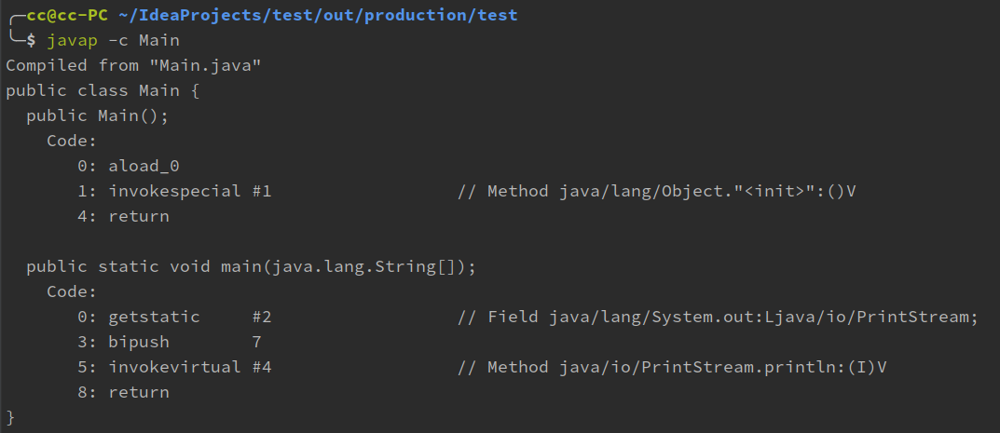
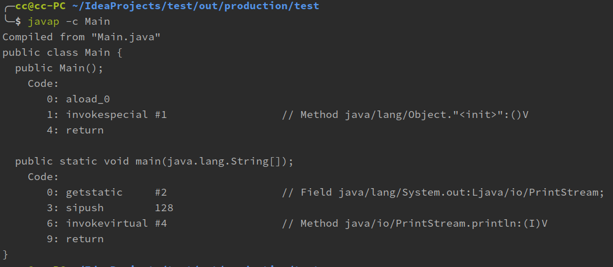
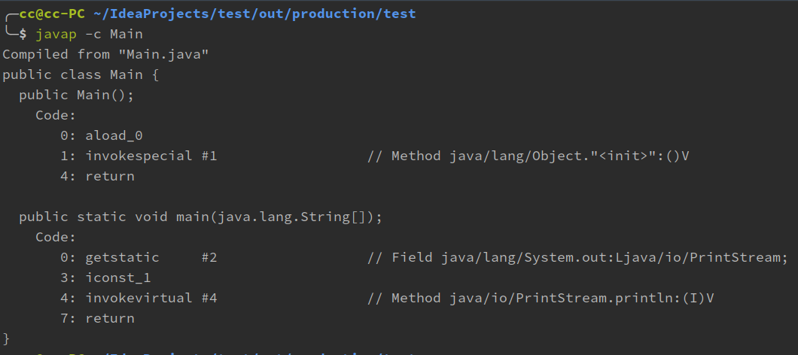
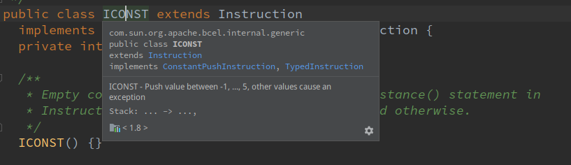
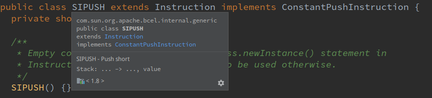

常量的本质含义以及反编译出现的部分助记符

<!-- more -->

# 样例1

```java
public class Main{
    public static void main(String[] args){
        System.out.println(Mychild1.str);
    }
}

class MyParent1{
    public static String str = "hello world";
    static{
        out.println("Myparent1 static block");
    }
}

class Mychild1 extends MyParent1{
    public static String str2 = "welcome";
    static{
        System.out.println("Mychild1 static block");
    }
}
```

对于静态字段来说，只有定义了该字段的类才会被初始化，当一个类在初始化时，要求其父类全部都已经初始化完毕了。所以上述代码只会输出

```
Myparent1 static block
hello world
```

并没有`welcome`以及`Mychild1 static block`

但是子类`Mychild1`有没有被加载呢，可以使用虚拟机参数去查看

`-XX:+TraceClassLoading`

然后运行，可以看到子类被加载了，(这个有没有加载并没有规范)

```java
...
[Loaded sun.net.NetHooks$Provider from /usr/lib/jvm/java-8-oracle/jre/lib/rt.jar]
[Loaded sun.net.sdp.SdpProvider from /usr/lib/jvm/java-8-oracle/jre/lib/rt.jar]
[Loaded MyParent1 from file:/home/cc/IdeaProjects/test/out/production/test/]
[Loaded Mychild1 from file:/home/cc/IdeaProjects/test/out/production/test/]
[Loaded java.net.Socket$2 from /usr/lib/jvm/java-8-oracle/jre/lib/rt.jar]
Myparent1 static block
hello world
[Loaded java.net.SocketInputStream from /usr/lib/jvm/java-8-oracle/jre/lib/rt.jar]
[Loaded sun.nio.cs.US_ASCII$Decoder from /usr/lib/jvm/java-8-oracle/jre/lib/rt.jar]
[Loaded java.lang.Shutdown from /usr/lib/jvm/java-8-oracle/jre/lib/rt.jar]
[Loaded java.lang.Shutdown$Lock from /usr/lib/jvm/java-8-oracle/jre/lib/rt.jar]

Process finished with exit code 0
```

# 虚拟机参数一般形式

`-XX:+<option>`：表示开启option选项

`-XX:-<option>`：表示关闭option选项

``-XX:<option>=value`：表示将option选项的值设置为value

# 样例2

```java
public class Main{
    public static void main(String[] args){
        System.out.println(MyParent2.str);
    }
}

class MyParent2{
    public static final String str = "hello world";
    static{
        System.out.println("Myparent2 static block");
    }
}
//output: hello world
```

为什么输出没有`Myparent2 static block`呢？

**常量在编译阶段会存入到调用这个常量的方法所在的类的常量池中，本质上，调用类并没有直接引用到定义常量的类，因此并不会触发定义常量的类的初始化**

**注意：这里指的是将常量放到了`Main`的常量池中，之后`Main`与`MyParent2`就没有任何关系了.**

甚至可以将`MyParent2`的class文件删除





# 对样例2反编译



对样例2反编译后我们可以看到一些助记符以及code那里的一些构造方法,下面看一些助记符(操作码)

- gestatic：得到out这个对象,本身out这个对象是一个静态成员变量

- ldc：表示将int，float或是String类型的常量值从常量池中推送至栈顶（栈顶表示等会立即要用的）

将代码改为

````java
public class Main{
    public static void main(String[] args){
        System.out.println(MyParent2.S);
    }
}

class MyParent2{
    public static final short S = 7;
    static{
        System.out.println("Myparent2 static block");
    }
}
````

然后反编译



可以看到其他的相同，出现一个新的名叫`bipush`的助记符

- bipush：表示将单字节(-128~127)的常量值推送到栈顶

改为

```java
public static final int i = 128;
```



- sipush：表示将一个短整型的常量值(-32768~32767)推送到栈顶

改为

```java
public static final int i = 1;
```



- iconst_1：表示将int型1推送至栈顶(`iconst_m1~iconst_5`)

# 助记符

助记符在`jt.jar`包有相关的类实现

比如`ICONST`，在包`com.sun.org.apache.bcel.internal.generic`里面



```java
public class ICONST extends Instruction
  implements ConstantPushInstruction, TypedInstruction {
  private int value;

  /**
   * Empty constructor needed for the Class.newInstance() statement in
   * Instruction.readInstruction(). Not to be used otherwise.
   */
  ICONST() {}

  public ICONST(int i) {
    super(com.sun.org.apache.bcel.internal.Constants.ICONST_0, (short)1);

    if((i >= -1) && (i <= 5))
      opcode = (short)(com.sun.org.apache.bcel.internal.Constants.ICONST_0 + i); // Even works for i == -1
    else
      throw new ClassGenException("ICONST can be used only for value between -1 and 5: " +
                                  i);
    value = i;
  }
```

可以看到，它`icosnt`只有[-1,5]

再比如`sipush`



```java
public class SIPUSH extends Instruction implements ConstantPushInstruction {
  private short b;

  /**
   * Empty constructor needed for the Class.newInstance() statement in
   * Instruction.readInstruction(). Not to be used otherwise.
   */
  SIPUSH() {}

  public SIPUSH(short b) {
    super(com.sun.org.apache.bcel.internal.Constants.SIPUSH, (short)3);
    this.b = b;
  }
```

