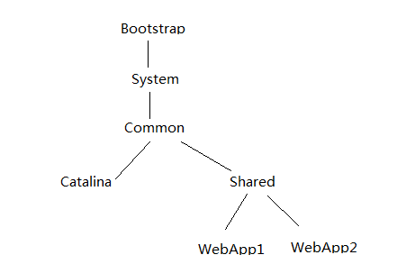
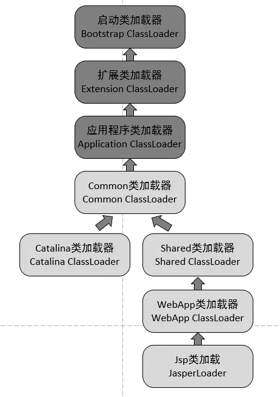
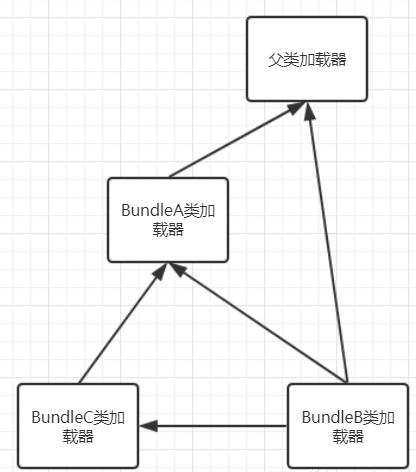

类加载器与 Web 容器，类加载器与 OSGi

<!-- more -->

参考:[深入探讨 Java 类加载器](https://www.ibm.com/developerworks/cn/java/j-lo-classloader/index.html)

[深入理解 Tomcat（四）Tomcat 类加载器之为何违背双亲委派模型](https://juejin.im/post/5a59f2296fb9a01ca871eb8c)

# 类加载器与Web容器

对于运行在`Java EE™`容器中的 Web 应用来说，类加载器的实现方式与一般的 Java 应用有所不同。不同的 Web 容器的实现方式也会有所不同。

## Apache Tomcat

以`Apache Tomcat `来说，每个 Web 应用都有一个对应的类加载器实例。**该类加载器也使用代理模式，所不同的是它是首先尝试去加载某个类，如果找不到再代理给父类加载器。这与一般类加载器的顺序是相反的**。这是 `Java Servlet `规范中的推荐做法，其目的是使得 Web 应用自己的类的优先级高于 Web 容器提供的类。**这种代理模式的一个例外是：Java 核心库的类是不在查找范围之内的。这也是为了保证 Java 核心库的类型安全。**

## Tomcat加载过程

我们看到，前面3个类加载和默认的一致，`CommonClassLoader`，`CatalinaClassLoader`，`SharedClassLoader`和`WebappClassLoader`则是Tomcat自己定义的类加载器，它们分别加载`/common/*`、`/server/*`、`/shared/*`（在tomcat 6之后已经合并到根目录下的lib目录下）和`/WebApp/WEB-INF/*`中的Java类库。其中`WebApp`类加载器和Jsp类加载器通常会存在多个实例，**每一个Web应用程序**对应一个WebApp类加载器，每一个JSP文件对应一个Jsp类加载器。

- commonLoader：Tomcat最基本的类加载器，加载路径中的class可以被Tomcat容器本身以及各个Webapp访问；
- catalinaLoader：Tomcat容器私有的类加载器，加载路径中的class对于Webapp不可见；
- sharedLoader：各个Webapp共享的类加载器，加载路径中的class对于所有Webapp可见，但是对于Tomcat容器不可见；
- WebappClassLoader：各个Webapp私有的类加载器，加载路径中的class只对当前Webapp可见；

---

**图中的委派关系**

1. CommonClassLoader能加载的类都可以被Catalina ClassLoader和SharedClassLoader使用，从而实现了公有类库的共用，而CatalinaClassLoader和Shared ClassLoader自己能加载的类则与对方相互隔离。
2. WebAppClassLoader可以使用SharedClassLoader加载到的类，但各个WebAppClassLoader实例之间相互隔离。
3. 而JasperLoader的加载范围仅仅是这个JSP文件所编译出来的那一个.Class文件，它出现的目的就是为了被丢弃：当Web容器检测到JSP文件被修改时，会替换掉目前的JasperLoader的实例，并通过再建立一个新的Jsp类加载器来实现JSP文件的HotSwap功能。

## 原则

绝大多数情况下，Web 应用的开发人员不需要考虑与类加载器相关的细节。下面给出几条简单的原则：

- 每个 Web 应用自己的 Java 类文件和使用的库的 jar 包，分别放在 `WEB-INF/classes`和 `WEB-INF/lib`目录下面。
- 多个应用共享的 Java 类文件和 jar 包，分别放在 Web 容器指定的由所有 Web 应用共享的目录下面。
- 当出现找不到类的错误时，检查当前类的类加载器和当前线程的上下文类加载器是否正确。

# 类加载器与 OSGi

`OSGi™`是 Java 上的动态模块系统。它为开发人员提供了面向服务和基于组件的运行环境，并提供标准的方式用来管理软件的生命周期。OSGi 已经被实现和部署在很多产品上，在开源社区也得到了广泛的支持。Eclipse 就是基于 OSGi 技术来构建的。

OSGi 中的每个模块（bundle）都包含 Java 包和类。模块可以声明它所依赖的需要导入（import）的其它模块的 Java 包和类（通过 `Import-Package`），也可以声明导出（export）自己的包和类，供其它模块使用（通过 `Export-Package`）。也就是说需要能够隐藏和共享一个模块中的某些 Java 包和类。这是通过 OSGi 特有的类加载器机制来实现的。**OSGi 中的每个模块都有对应的一个类加载器。它负责加载模块自己包含的 Java 包和类。当它需要加载 Java 核心库的类时（以 `java`开头的包和类），它会代理给父类加载器（通常是启动类加载器）来完成。当它需要加载所导入的 Java 类时，它会代理给导出此 Java 类的模块来完成加载**。模块也可以显式的声明某些 Java 包和类，必须由父类加载器来加载。只需要设置系统属性 `org.osgi.framework.bootdelegation`的值即可。

## 加载过程

假设有两个模块 bundleA 和 bundleB，它们都有自己对应的类加载器 classLoaderA 和 classLoaderB。在 bundleA 中包含类 `com.bundleA.Sample`，并且该类被声明为导出的，也就是说可以被其它模块所使用的。bundleB 声明了导入 bundleA 提供的类 `com.bundleA.Sample`，并包含一个类 `com.bundleB.NewSample`继承自 `com.bundleA.Sample`。在 bundleB 启动的时候，其类加载器 classLoaderB 需要加载类 `com.bundleB.NewSample`，进而需要加载类 `com.bundleA.Sample`。由于 bundleB 声明了类 `com.bundleA.Sample`是导入的，classLoaderB 把加载类 `com.bundleA.Sample`的工作代理给导出该类的 bundleA 的类加载器 classLoaderA。classLoaderA 在其模块内部查找类 `com.bundleA.Sample`并定义它，所得到的类 `com.bundleA.Sample`实例就可以被所有声明导入了此类的模块使用。对于以 `java`开头的类，都是由父类加载器来加载的。如果声明了系统属性 `org.osgi.framework.bootdelegation=com.example.core.*`，那么对于包 `com.example.core`中的类，都是由父类加载器来完成的。

---

OSGi 模块的这种类加载器结构，使得一个类的不同版本可以共存在 Java 虚拟机中，带来了很大的灵活性。不过它的这种不同，也会给开发人员带来一些麻烦，尤其当模块需要使用第三方提供的库的时候。