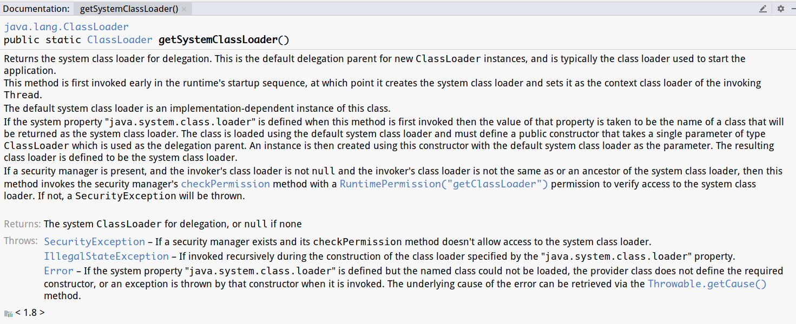
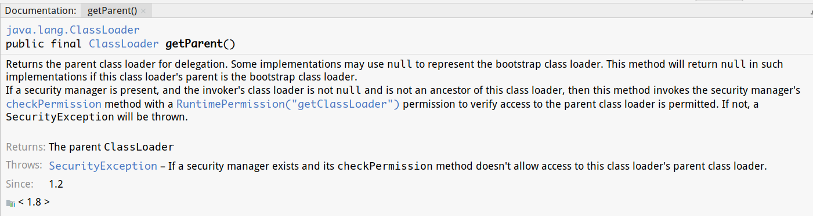
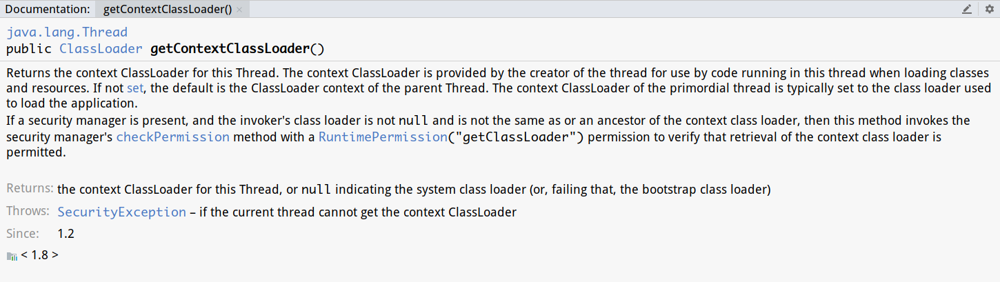
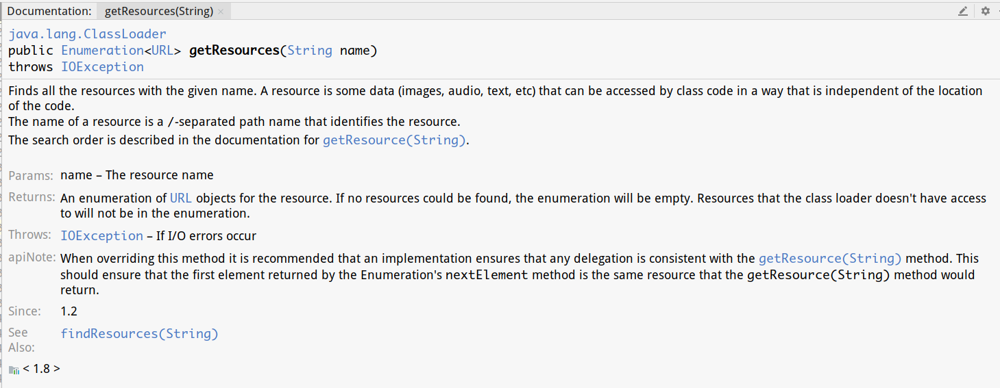

继续学习jvm类加载器双亲委派机制

<!-- more -->

# 循环获得ClassLoader

```java
public class Main{
    public static void main(String[] args) throws Exception{
        //获取系统类加载器
        ClassLoader classLoader = ClassLoader.getSystemClassLoader();
        System.out.println(classLoader);
        System.out.println("-------------------");
        
        while(null != classLoader){
            //获取加载器的父亲
            classLoader = classLoader.getParent(); 
            System.out.println(classLoader);
        }
    }
}
/*输出：
sun.misc.Launcher$AppClassLoader@18b4aac2
-------------------
sun.misc.Launcher$ExtClassLoader@74a14482
null
*/
```

## getSystemClassLoader



```java
/**
 * 返回用于委派的系统类加载器。 
 * 这是新的ClassLoader实例的默认委派父项， 通常是用于启动应用程序的类加载器。
 * 该方法首先在运行时的启动顺序中早期被调用
 * 此时它将创建系统类加载器并将其设置为调用Thread的上下文类加载器
 * 默认的系统类加载器是此类的实现相关实例
 * 如果在首次调用此方法时定义系统属性"java.system.class.loader"
 * 那么该属性的值将被视为将作为系统类  加载器返回的类的名称
 * 类使用默认的系统类加载器加载，必须定义一个公共构造函数，其被用作代理父ClassLoader类型的单个参数
 * 然后使用该构造函数创建一个实例，并使用默认的系统类加载器作为参数
 * 所生成的类加载器被定义为系统类加载器。
 */
@CallerSensitive
public static ClassLoader getSystemClassLoader() {
    initSystemClassLoader();
    if (scl == null) {
        return null;
    }
    SecurityManager sm = System.getSecurityManager();
    if (sm != null) {
        checkClassLoaderPermission(scl, Reflection.getCallerClass());
    }
    return scl;
}
```

### initSystemClassLoader()

```java
    private static synchronized void initSystemClassLoader() {
        //sclSet:设定好系统类加载器了的话该值为true
        if (!sclSet) {
            //scl:系统类加载器
            if (scl != null)
                //递归调用异常
                throw new IllegalStateException("recursive invocation");
            sun.misc.Launcher l = sun.misc.Launcher.getLauncher();
            if (l != null) {
                Throwable oops = null;
                //通过Launch类的getClassLoader()获得应用类加载器
                scl = l.getClassLoader();
                try {
                    scl = AccessController.doPrivileged(
                        /**
                         * 处理用户自定义了java.system.class.loader系统属性的情况
                         * 有可能是默认的AppClassLoader，也有可能是用户自定义的
                         */
                        new SystemClassLoaderAction(scl));
                } catch (PrivilegedActionException pae) {
                    oops = pae.getCause();
                    if (oops instanceof InvocationTargetException) {
                        oops = oops.getCause();
                    }
                }
                if (oops != null) {
                    if (oops instanceof Error) {
                        throw (Error) oops;
                    } else {
                        // wrap the exception
                        throw new Error(oops);
                    }
                }
            }
            //系统类加载器设置完毕
            sclSet = true;
        }
    }
```

#### SystemClassLoaderAction

```java
class SystemClassLoaderAction
    implements PrivilegedExceptionAction<ClassLoader> {
    private ClassLoader parent;

    SystemClassLoaderAction(ClassLoader parent) {
        this.parent = parent;
    }

    public ClassLoader run() throws Exception {
        //自定义类加载器系统属性
        String cls = System.getProperty("java.system.class.loader");
        if (cls == null) {
            return parent;
        }

        Constructor<?> ctor = Class.forName(cls, true, parent)
            .getDeclaredConstructor(new Class<?>[] { ClassLoader.class });
        ClassLoader sys = (ClassLoader) ctor.newInstance(
            new Object[] { parent });
        Thread.currentThread().setContextClassLoader(sys);
        return sys;
    }
}
```

#### class.forName

```java
/**
 * 返回一个给定类或者接口的一个Class对象，如果没有给定classloader，那么会使用根类加载器，
 * 给定了类或者接口的完全限定名，那么这个方法将尝试去定位，加载和链接类或接口，
 * 如果initalize这个参数传了true，那么给定的类如果之前没有被初始化过，那么会被初始化。
 * @param name 所需类的完全限定名称
 * @param initialize 是否初始化
 * @param loader 类加载器
 */
public static Class<?> forName(String name, boolean initialize,
                                   ClassLoader loader)
        throws ClassNotFoundException
    {
        Class<?> caller = null;
        SecurityManager sm = System.getSecurityManager();
        if (sm != null) {
        	
        	//获取到调用forName这个方法的Class对象
            caller = Reflection.getCallerClass();
            if (sun.misc.VM.isSystemDomainLoader(loader)) {
            	//获取到调用forName这个方法的Class对象的类加载器
                ClassLoader ccl = ClassLoader.getClassLoader(caller);
                if (!sun.misc.VM.isSystemDomainLoader(ccl)) {
                    sm.checkPermission(
                        SecurityConstants.GET_CLASSLOADER_PERMISSION);
                }
            }
        }
        //forName0:native方法
        return forName0(name, initialize, loader, caller);
    }
```

## getParent



```java
/**
 * 返回父类加载器进行委派
 * 一些实现可以使用null来表示根类加载器
 * 如果此类加载器的父级是根类加载器，则此方法将返回null
 */
@CallerSensitive
public final ClassLoader getParent() {
    if (parent == null)
        return null;
    SecurityManager sm = System.getSecurityManager();
    if (sm != null) {
        // Check access to the parent class loader
        // If the caller's class loader is same as this class loader,
        // permission check is performed.
        checkClassLoaderPermission(parent, Reflection.getCallerClass());
    }
    return parent;
}
```

# 获得指定class文件的资源

```java
import java.net.URL;
import java.util.Enumeration;

public class Main{
    public static void main(String[] args) throws Exception{
        //获取当前线程上下文的类加载器
        ClassLoader classLoader = Thread.currentThread().getContextClassLoader();

        String res = "Main.class";
        //获取给定名称的所有资源
        Enumeration<URL> urls = classLoader.getResources(res);

        //遍历输出所有资源
        while(urls.hasMoreElements()){
            URL url = urls.nextElement();
            System.out.println(url);
        }
    }
}
/*输出：
file:/home/cc/IdeaProjects/test/out/production/test/Main.class
*/
```

## getContextClassLoader()



```java
    /**
     * @since 1.2
     * 返回此Thread的上下文ClassLoader
     * 上下文ClassLoader由线程的创建者提供，以便在加载类和资源时在此线程中运行的代码使用
     * 默认是父线程的ClassLoader上下文
     * 原始线程的上下文ClassLoader通常设置为用于加载应用程序的类加载器
     */
    @CallerSensitive
    public ClassLoader getContextClassLoader() {
        if (contextClassLoader == null)
            return null;
        SecurityManager sm = System.getSecurityManager();
        if (sm != null) {
            ClassLoader.checkClassLoaderPermission(contextClassLoader,
                                                   Reflection.getCallerClass());
        }
        return contextClassLoader;
    }
```

## getResources()



```java
    /**
     * 查找具有给定名称的所有资源
     * 资源是可以通过独立于代码位置的方式由类代码访问的一些数据（图像，音频，文本等）
     * 资源的名称是标识资源的/分隔路径名
     */
    public Enumeration<URL> getResources(String name) throws IOException {
        @SuppressWarnings("unchecked")
        Enumeration<URL>[] tmp = (Enumeration<URL>[]) new Enumeration<?>[2];
        if (parent != null) {
            tmp[0] = parent.getResources(name);
        } else {
            tmp[0] = getBootstrapResources(name);
        }
        tmp[1] = findResources(name);

        return new CompoundEnumeration<>(tmp);
    }
```

# 获取ClassLoader的途径

1. 获取当前类的ClassLoader

```java
class<?> clazz
clazz.getClassLoader();
```

2. 获取当前线程上下文的ClassLoader

```java
Thread.currentThread.getContextClassLoader();
```

3. 获得系统的ClassLoader

```java
ClassLoader.getSystemClassLoader();
```

4. 获得调用者的ClassLoader

```java
DriverManager.getCallerClassLoader();
```

