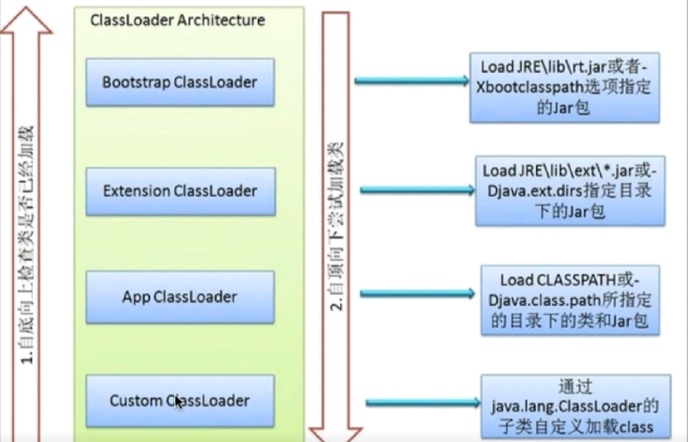
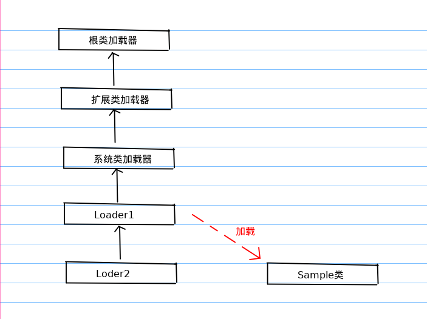

jvm类加载器双亲委派机制

<!-- more -->

并不是所有的jvm虚拟机都使用这个机制，只是大部分，比如还有使用osgi的。

# 类加载器的双亲委派机制

在双亲委派机制中，各个加载器按照父子关系形成了树形结构（逻辑意义），除了根类加载器之外，其余的类加载器都有且有一个父加载器



根类加载器和扩展类加载器只能加载指定路径的里面的类，而系统类加载器一般可以加载我们工程中所定义的类

- 根类加载器：由c++实现，不是`ClassLoader`子类

- 扩展类加载器：由`sun.misc.Launcher$ExtClassLoader`实现

（代表ExtClassLoader是sun.misc.Launcher的一个内部类）

- 系统类加载器：由`sun.misc.Launcher$AppClassLoader`实现

# 过程实例



Loder1与Loader2是用户自定义的类加载器，两者之间又形成了父子关系

1. Loder1想要加载我们编写的Sample类，根据类加载器的双亲委派机制，并不是由Loader1直接加载到虚拟机当中，而是把加载任务委派给Loader1的父亲系统类加载器，系统类加载器再将任务委派给扩展类加载器，同理，扩展类加载器将任务最终委派给根类加载器

2. 根类加载器尝试去加载编写的Sample类，根类加载器不能加载Sample类，然后把加载任务返回给扩展类加载器，扩展类加载器也不能加载Sample类，同样返回给系统类加载器，最终加载成功，接着把流程返回给Loader1，加载过程结束。

- 如果一个类加载器收到了类加载的请求，它不会先自己尝试处理这个请求，而是委派给它的父类加载器，所有的请求最终都会传送到顶层的启动类加载器
- 只有当父类反馈自己无法完成该请求（它的搜索范围中没有找到所需的类，即抛出`ClassNotFoundException`）时，子加载器才会尝试自己加载。

# 代码实例

```java
public class Main{
    public static void main(String[] args) throws Exception{
        Class<?> clazz = Class.forName("java.lang.String");
        /* public ClassLoader getClassLoader()
         * 返回类的类加载器
         * 一些实现可能使用null来表示根类加载器。
         * 如果此类由根类加载器加载，则此方法将在此类实现中返回null。
         * 如果此对象表示原始类型或空值，则返回null
         */
        System.out.println(clazz.getClassLoader());

        Class<?> clazz2 = Class.forName("Main");
        System.out.println(clazz2.getClassLoader());
    }
}

class C{

}
/*输出：
null
sun.misc.Launcher$AppClassLoader@18b4aac2
*/
//18b4aac2是它的hash code
```

可以看到Main是由系统类加载器加载的

# 优势

1. 可以确保Java核心库的类型安全：所有的Java应用都至少会引用`java.lang.Object`类，也就是说在运行期，`java.lang.Object`这个类会被加载到Java虚拟机中；如果个加载过程是由Java应用自己类加载器所完成的，那么很可能就会在JVM中存在多个版本的`java.lang.Object`，而且这些类之间还是不兼容的，相互不可见的（正是命名空间在发挥着作用）
   借助于双亲委托机制，Java核心类库中的类的加载工作都是由启动类加载器来统一完成，从而确保了Java应用所使用的都是同一个版本的Java核心类库，他们之间是相互兼容的。
2. 可以确保Java核心类库所提供的类不会被定义的类所替代。
3. 不同的类加载器可以为相同名称(`binaryname`)的类创建额外的命名空间。相同名称的类可以并存在Java虚拟机中，只需要用不同的类加载器来加载他们即可。不同类加载器所加载的类之间是不兼容的，这就相当于在Java虚拟机内部创建了一个又一个相互隔离的Java类空间，这类技术在很多框架中都得到了实际应用。

