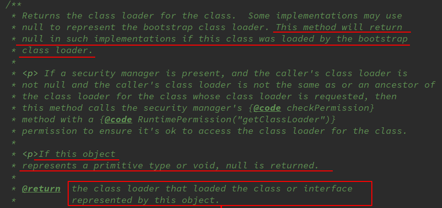

jvm类加载器双亲委派机制

<!-- more -->

并不是所有的jvm虚拟机都使用这个机制，只是大部分，比如还有使用osgi的。

# 类加载器的双亲委派机制

在双亲委派机制中，各个加载器按照父子关系形成了树形结构（逻辑意义），除了根类加载器之外，其余的类加载器都有且有一个父加载器


根类加载器和扩展类加载器只能加载指定路径的里面的类，而系统类加载器一般可以加载我们工程中所定义的类

- 根类加载器：由c++实现，不是`ClassLoader`子类

- 扩展类加载器：由`sun.misc.Launcher$ExtClassLoader`实现

（代表ExtClassLoader是sun.misc.Launcher的一个内部类）

- 系统类加载器：由`sun.misc.Launcher$AppClassLoader`实现

# 过程实例


Loder1与Loader2是用户自定义的类加载器，两者之间又形成了父子关系

1. Loder1想要加载我们编写的Sample类，根据类加载器的双亲委派机制，并不是由Loader1直接加载到虚拟机当中，而是把加载任务委派给Loader1的父亲系统类加载器，系统类加载器再将任务委派给扩展类加载器，同理，扩展类加载器将任务最终委派给根类加载器

2. 根类加载器尝试去加载编写的Sample类，根类加载器不能加载Sample类，然后把加载任务返回给扩展类加载器，扩展类加载器也不能加载Sample类，同样返回给系统类加载器，最终加载成功，接着把流程返回给Loader1，加载过程结束。

- 如果一个类加载器收到了类加载的请求，它不会先自己尝试处理这个请求，而是委派给它的父类加载器，所有的请求最终都会传送到顶层的启动类加载器
- 只有当父类反馈自己无法完成该请求（它的搜索范围中没有找到所需的类，即抛出`ClassNotFoundException`）时，子加载器才会尝试自己加载。

# 代码实例

```java
public class Main{
    public static void main(String[] args) throws Exception{
        Class<?> clazz = Class.forName("java.lang.String");
        System.out.println(clazz.getClassLoader());

        Class<?> clazz2 = Class.forName("Main");
        System.out.println(clazz2.getClassLoader());
    }
}

class C{

}
/*输出：
null
sun.misc.Launcher$AppClassLoader@18b4aac2
*/
//18b4aac2是它的hash code
```

可以看到Main是由系统类加载器加载的

`getClassLoader()`作用：



