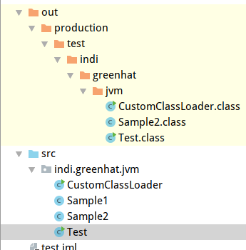
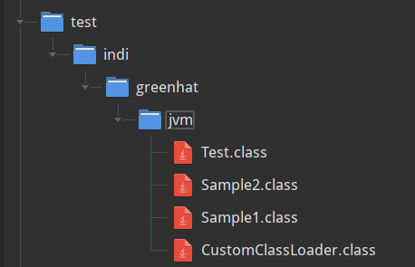
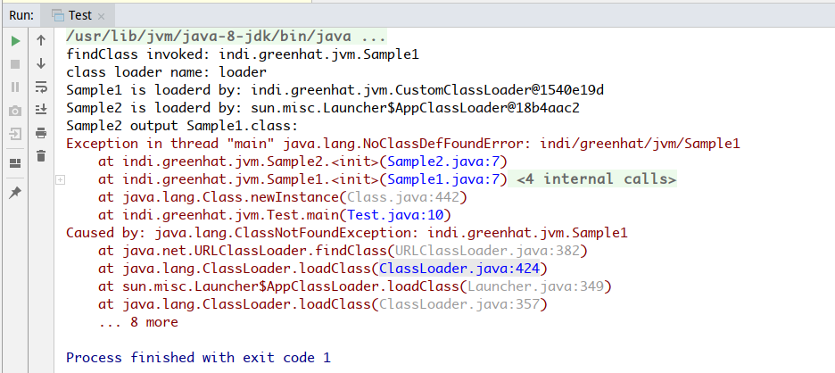

类加载器的命名空间

<!-- more -->
参考：[https://blog.csdn.net/sureyonder/article/details/5564181](https://blog.csdn.net/sureyonder/article/details/5564181)

[http://www.importnew.com/17093.html](http://www.importnew.com/17093.html)

# 命名空间

类加载体系为不同类加载器加载的类提供不同的命名空间，**同一命名空间内的类可以互相访问，不同命名空间的类不知道彼此的存在(除非显式提供访问机制)**。同一类可以再不同的命名空间内，但无法在同一命名空间内重复出现。

----

命名空间是这样定义的：**实际完成加载类的工作**的加载器为定义类加载器，而**加载的双亲委托路径上的所有加载器**为初始类加载器，某个加载器的命名空间就是所有以该加载器为初始类加载器的类所组成。

---

可以预见，**子加载器的命名空间包括其父/祖先加载器的命名空间和只有自己才可以加载的类所组成**。根据加载体系结构的安全机制，同一命名空间内的类可 以互相访问，所以**父加载器所加载的类不一定可以访问子加载器所加载的类，但子加载器所加载的类必然可以访问父加载器加载的类**。父加载器加载的类就好像小箱 子，子加载器加载的类可能用到父加载器加载的类，就像一个大箱子，只能把小箱子放进大箱子，而不能反过来做(当然显式的访问机制除外)

# 命名空间的类型共享

前面提到过只有同一个命名空间内的类才可以直接进行交互，但是我们经常在由用户自定义类装载器定义的类型中直接使用JAVA API类，这不是矛盾了吗？这是类型共享 原因－**如果某个类装载器把类型装载的任务委派给另外一个类装载器，而后者定义了这个类型，那么被委派的类装载器装载的这个类型，在所有被标记为该类型的初始类装载器的命名空间中共享**。

# 运行时包

每个类装载器都有自己的命名空间，**其中维护着由它装载的类型**。**所以一个JAVA程序可以多次装载具有同一个全限定名的多个类型**。这样一个类型的全限定名就不足以确定在一个JAVA虚拟机中的唯一性。因此，当多个类装载器都装载了同名的类型时，为了唯一表示该类型，**还要在类型名称前加上装载该类型的类装载器来表示－`[classloader class]`**

在允许两个类型之间对包内可见的成员进行访问前，**虚拟机不但要确定这个两个类型属于同一个包，还必须确认它们属于同一个运行时包－它们必须有同一个类装载器装载的**。这样，`java.lang.Virus`和来自核心的`java.lang`的类不属于同一个运行时包，`java.lang.Virus`就不能访问`JAVA API`的`java.lang`包中的包内可见的成员。

# 不同命名空间不能访问

```java
//Sample1.java
package indi.greenhat.jvm;

public class Sample1 {
    public Sample1(){
        System.out.println("Sample1 is loaderd by: " + this.getClass().getClassLoader());
        
        new Sample2();
    }
}
```

```java
//Sample2.java
package indi.greenhat.jvm;

public class Sample2 {
    public Sample2(){
        System.out.println("Sample2 is loaderd by: " + this.getClass().getClassLoader());
        System.out.println("Sample2 output Sample1.class:");
        System.out.println(Sample1.class);
    }
}
```

```java
//Test.java
package indi.greenhat.jvm;

public class Test {
    public static void main(String[] args) throws Exception{
        CustomClassLoader loader = new CustomClassLoader("loader");
        loader.setPath("/home/cc/test/");

        Class<?> clazz = loader.loadClass("indi.greenhat.jvm.Sample1");

        Object object = clazz.newInstance();
    }
}
```

-----

目录结构：

**已经把Sample1.class删除**




同时`/home/cc/test`目录下这个几个类的class文件



输出：



-------------------

`Sample2在Sample1里面`，所以`Sample2`是由`Sample1`的加载器加载的，因为在项目目录下面没有`Sample1.class`，所以只能由自定义类加载器加载，如上图输出。

虽然`Sample1`是由自定义类加载器加载的，但是根据双亲委派机制，加载`Sample2`时先委派给父加载器，又因为项目目录下有`Sample2.class`，所以父加载器加载成功，所以`Sample2`是由系统类加载器加载的。

----

因为这两个记载器是不同的，所以不能互相访问，故`Sample2`尝试输出`Sample1.class`时会抛出异常

----

自定义类加载器代码：

```java
//CustomClassLoader.java
package indi.greenhat.jvm;

import java.io.*;

//用户自定义类加载器必须继承ClassLoader类
public class CustomClassLoader extends ClassLoader{

    private String classLoaderName;

    //类的扩展名
    private final String fileExtension = ".class";

    private  String path;

    public void setPath(String path){
        this.path = path;
    }

    public CustomClassLoader(String classLoaderName){
        //使用方法getSystemClassLoader（）返回的ClassLoader作为父类加载器创建新的类加载器
        super();
        this.classLoaderName = classLoaderName;
    }

    public CustomClassLoader(String classLoaderName, ClassLoader parent){
        //使用指定的父类加载器创建新的类加载器以进行委派
        super(parent);
        this.classLoaderName = classLoaderName;
    }


    @Override
    protected Class<?> findClass(String className) throws ClassNotFoundException{
        System.out.println("findClass invoked: " + className);
        System.out.println("class loader name: " + this.classLoaderName);
        byte[] data = this.loadClassDate(className);
        return this.defineClass(className, data, 0, data.length);
    }

    private byte[] loadClassDate(String name){
        InputStream is = null;
        byte[] data = null;
        ByteArrayOutputStream baos = null;

        try{
            //转换为磁盘对应的地址
            name = name.replace(".", "/");
            is = new FileInputStream(new File(this.path+ name + this.fileExtension));
            baos = new ByteArrayOutputStream();

            int ch = 0;
            while((ch = is.read()) != -1){
                baos.write(ch);
            }
            data = baos.toByteArray();
        }catch (Exception e){
            e.printStackTrace();
        }finally {
            try{
                is.close();
                baos.close();
            }catch (Exception e){
                e.printStackTrace();
            }
        }
        return data;
    }

    public static void main(String[] args) throws Exception {
        CustomClassLoader loader1 = new CustomClassLoader("loader1");
        loader1.setPath("/home/cc/test/");
        Class<?> clazz = loader1.loadClass("indi.greenhat.jvm.Test");
        Object object = clazz.newInstance();
    }
}
```

