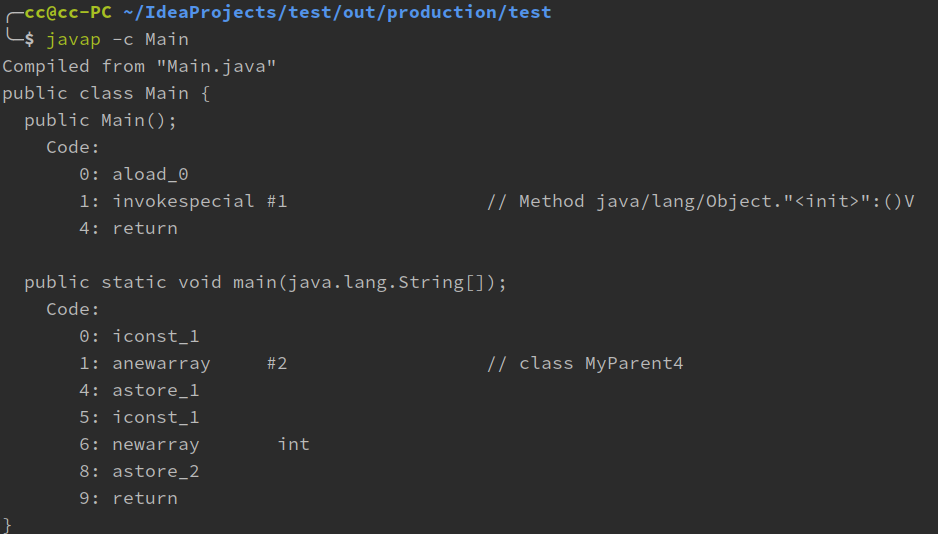

编译期常量与运行期常量的区别及数组创建本质分析

<!-- more -->

# 样例1

```java
import java.util.UUID;

public class Main{
    public static void main(String[] args){
        System.out.println(MyParent3.str);
    }
}

class MyParent3{
    public static final String str = UUID.randomUUID().toString();
    
    static{
        System.out.println("MyParent3 code block");        
    }
}
/*
output:
MyParent3 code block
0e7ed916-96de-4805-865d-1b2e703482ec
*/
```

**当一个常量的值并非编译期间可以确定的，那么其值就不会被放到调用类的常量池中，这时程序运行时，会导致主动使用这个常量所在的类，显然会导致这个的类的初始化。**

# 样例2

```java
public class Main{
    public static void main(String[] args){
        MyParent4[] myParent4s = new MyParent4[1];
    }
}

class MyParent4{

    static{
        System.out.println("MyParent3 code block");
    }
}
```

程序并没有输出，那么为什么呢

对于数组实例来说，其类型是由JVM在运行期动态生成的，并没有主动使用这个类，所以不会导致类的初始化

接着我们可以看这个的类的类型以及它的父类

```java
System.out.println(myParent4s.getClass());
System.out.println(myParent4s.getClass().getSuperclass());
```

程序输出

```java
class [LMyParent4;
class java.lang.Object
```

说明这个动态生成的类型表现为`[LMyParent4`这种形式。动态生成的类型，其父类是`Object`

对于数组来说，`JavaDoc`经常将构成数组的元素为`Component`，实际上就是将数组降低一个维度后的类型。

那么二维数组又是什么形式呢

```java
MyParent4[][] myParent4s1 = new MyParent4[1][1];
System.out.println(myParent4s1.getClass());
System.out.println(myParent4s1.getClass().getSuperclass());
```

输出

```java
class [[LMyParent4;
class java.lang.Object
```

上面是引用类型的数组，那么原始类型数组的呢

```java
int[] ints = new int[1];
System.out.println(ints.getClass());

char[] chars = new char[1];
System.out.println(chars.getClass());

Boolean[] bools = new Boolean[1];
System.out.println(bools.getClass());
```

输出

```java
class [I
class [C
class [Ljava.lang.Boolean;
```

# 反编译样例2

```java
public class Main{
    public static void main(String[] args){
        MyParent4[] myParent4s = new MyParent4[1];

        int[] ints = new int[1];
    }
}

class MyParent4{

    static{
        System.out.println("MyParent3 code block");
    }
}
```



- anewarray：表示创建一个引用类型的（如类，接口，数组）数组，并将其引用值压入栈顶
- newarray：表示创建一个指定的原始类型（如int， float）的数组并将其引用值压入栈顶