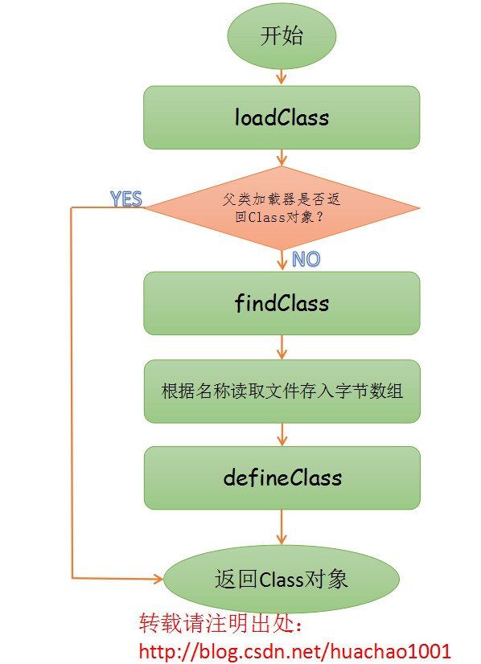

jvm自定义类加载器

<!-- more -->

# JDK加载类流程

参考：[https://juejin.im/post/5a1fad585188252ae93ab953](https://juejin.im/post/5a1fad585188252ae93ab953)

## loadClass

```java
protected Class<?> loadClass(String name, boolean resolve) throws ClassNotFoundException
{
    synchronized (getClassLoadingLock(name)) {
        /**
         * 1.检查类是否已经加载过
         * @param name 类的二进制名字     
         * @return 类对象（Class<?>），如果没有加载该类，则返回null
         */
        Class c = findLoadedClass(name);
        if (c == null) {
            long t0 = System.nanoTime();
            try {
                if (parent != null) {
                // 2.1.如果没有加载过，先调用父类加载器去加载
                    c = parent.loadClass(name, false);
                } else {
                // 2.2.如果没有加载过，且没有父类加载器，就用BootstrapClassLoader去加载
                c = findBootstrapClassOrNull(name);
                }
            } catch (ClassNotFoundException e) {
                // ClassNotFoundException thrown if class not found
                // from the non-null parent class loader
            }

            if (c == null) {
                //3. 如果父类加载器没有加载到，调用findClass去加载
                long t1 = System.nanoTime();
                c = findClass(name);

                // this is the defining class loader; record the stats
                sun.misc.PerfCounter.getParentDelegationTime().addTime(t1 - t0);
                sun.misc.PerfCounter.getFindClassTime().addElapsedTimeFrom(t1);
                sun.misc.PerfCounter.getFindClasses().increment();
            }
        }
        if (resolve) {
            resolveClass(c);
        }
        return c;
    }
}

```

从上面代码可以明显看出，`loadClass(String, boolean)`函数即实现了双亲委派模型！整个大致过程如下：

1. 检查一下指定名称的类是否已经加载过，如果加载过了，就不需要再加载，直接返回。
2. 如果此类没有加载过，那么，再判断一下是否有父加载器；如果有父加载器，则由父加载器加载（即调用`parent.loadClass(name, false);`）.或者是调用`bootstrap`类加载器来加载。
3. 如果父加载器及`bootstrap`类加载器都没有找到指定的类，那么调用当前类加载器的**`findClass`**方法来完成类加载。默认的`findclass`毛都不干，直接抛出`ClassNotFound`异常，所以我们自定义类加载器就要覆盖这个方法了。
4. **可以猜测:`ApplicationClassLoader`的`findClass`是去`classpath`下去加载，`ExtentionClassLoader`是去`java_home/lib/ext`目录下去加载。实际上就是`findClass`方法不一样罢了**。

---

`loadClass`在父加载器无法加载类的时候，就会调用我们自定义的类加载器中的`findClass`函数，因此我们必须要在`loadClass`这个函数里面实现将一个指定类名称转换为Class对象。

根据JavaDoc

> 一些类可能并不是来自一个文件，它们可能来自于其他来源，比如网络或者由应用本身构建出来。在这种情况下，defineClass方法会将一个字节数组转换成class类的一个实例，这个新定义的实例是可以通过Class.newInstance去创建。

于是我们可以运用`defineClass`去创建



## defineClass

```java
/**
 * 将字节数组转换为类Class的实例
 * @param b 组成类数据的字节数组
 *        off 数据起始位置
 *        len 数组长度
 * @ return 从指定的类数据创建的Class对象
 */
protected final Class<?> defineClass(byte[] b, int off, int len)
        throws ClassFormatError
    {
    	/**
    	* @param name 类的预期二进制名称，如果未知，则为null
    	*        b 组成类数据的字节数组
        *        off 数据起始位置
        *        len 数组长度 
        *        ProtectionDomain 保护域（保护域定义了授予一段特定代码的所有权限）
        * @return 从数据创建的Class对象，以及可选的ProtectionDomain
    	*/
        return defineClass(null, b, off, len, null);
    }
```

## 总结流程

其实很简单，继承ClassLoader类，覆盖findClass方法，这个方法的作用就是找到.class文件,转换成字节数组，调用defineClass对象转换成Class对象返回

# 简单实现自定义类加载器

```java
import java.io.*;

//用户自定义类加载器必须继承ClassLoader类
public class Main extends ClassLoader{

    private String classLoaderName;

    //类的扩展名
    private final String fileExtension = ".class";

    public Main(String classLoaderName){
        //使用方法getSystemClassLoader（）返回的ClassLoader作为父类加载器创建新的类加载器
        super();
        this.classLoaderName = classLoaderName;
    }

    public Main(String classLoaderName, ClassLoader parent){
        //使用指定的父类加载器创建新的类加载器以进行委派
        super(parent);
        this.classLoaderName = classLoaderName;
    }

    @Override
    public String toString(){
        return "[" + this.classLoaderName + "]";
    }

    @Override
    protected Class<?> findClass(String className) throws ClassNotFoundException{
        byte[] data = this.loadClassDate(className);
        return this.defineClass(className, data, 0, data.length);
    }

    private byte[] loadClassDate(String name){
        InputStream is = null;
        byte[] data = null;
        ByteArrayOutputStream baos = null;

        try{
            //转换为磁盘对应的地址
            name = name.replace(".", "/");
            String projectPath = "/home/cc/IdeaProjects/test/out/production/test/";
            is = new FileInputStream(new File(projectPath + name + this.fileExtension));
            baos = new ByteArrayOutputStream();

            int ch = 0;
            while((ch = is.read()) != -1){
                baos.write(ch);
            }
            data = baos.toByteArray();
        }catch (Exception e){
            e.printStackTrace();
        }finally {
            try{
                is.close();
                baos.close();
            }catch (Exception e){
                e.printStackTrace();
            }
        }
        return data;
    }

    public static void test(ClassLoader classLoader) throws Exception {
        Class<?> clazz = classLoader.loadClass("Main");
        Object object = clazz.newInstance();

        System.out.println(object);
    }

    public static void main(String[] args) throws Exception {
        Main loader1 = new Main("loader1");
        test(loader1);
    }
}
```

