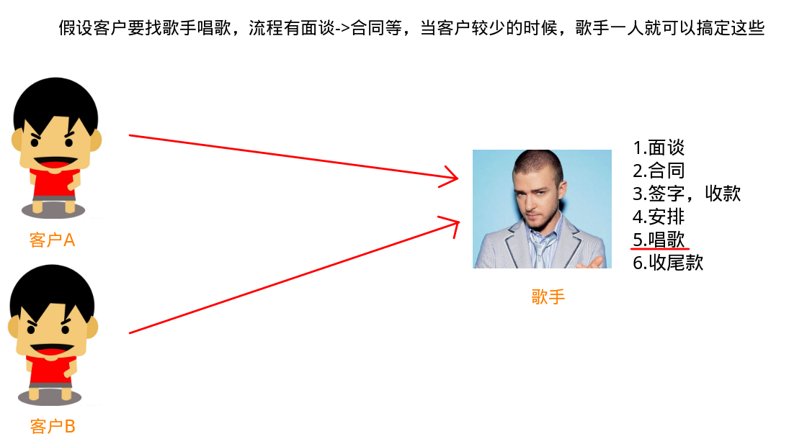
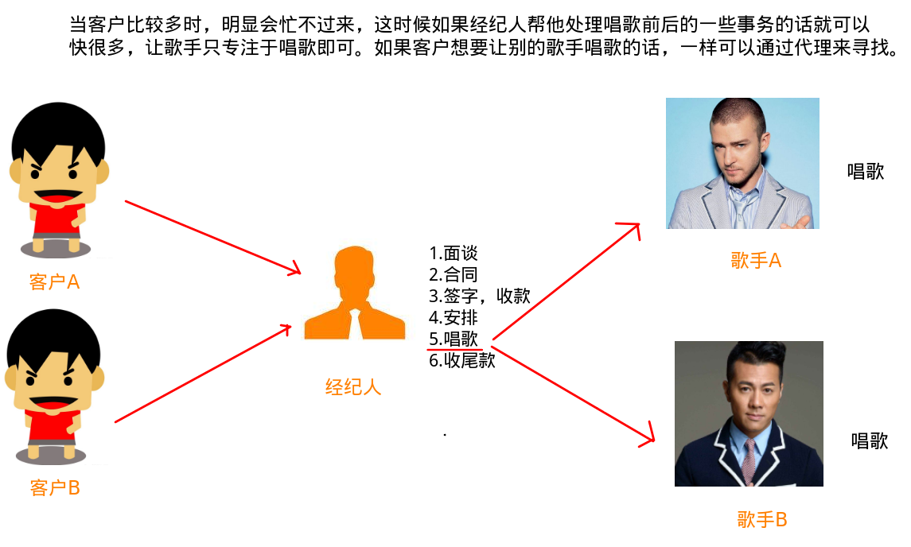
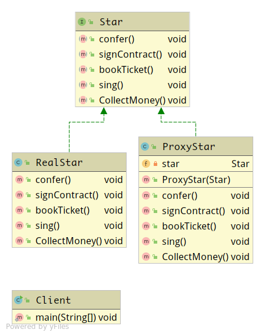
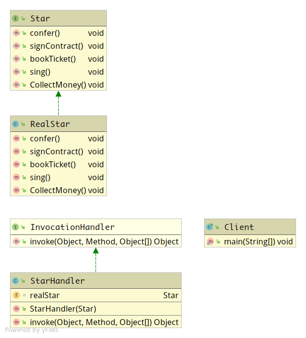

代理模式

<!-- more -->

参考:[Java三种代理模式：静态代理、动态代理和cglib代理](https://segmentfault.com/a/1190000011291179)

[C#设计模式之代理模式](https://blog.csdn.net/LoveLion/article/details/8227953)

[基于 JDK 的动态代理机制](https://www.cnblogs.com/yangming1996/p/9254412.html)

# 代理模式

## 含义

代理模式是一种设计模式，提供了对目标对象额外的访问方式，即通过代理对象访问目标对象，这样可以在不修改原目标对象的前提下，提供额外的功能操作，扩展目标对象的功能。简言之，代理模式就是设置一个中间代理来控制访问原目标对象，以达到增强原对象的功能和简化访问方式。

----

举例歌手与经纪人





## 结构

代理模式的结构比较简单，其核心是代理类，为了让客户端能够一致性地对待真实对象和代理对象，在代理模式中引入了抽象层


**Subject（抽象角色）：**定义代理角色和真实角色的公共对外方法

**Proxy（代理角色）**：实现抽象角色，是真实角色的代理，通过真实角色的业务逻辑方法来实现抽象方法，并可以附加自己的操作

**RealSubject（真实角色）：**实现抽象角色，定义真实角色所要实现的业务逻辑，供代理角色调用。关注于真正的业务逻辑

## 核心作用

1. 通过代理，控制对象的访问：可以详细控制访问某个（某类）对象的方法，在调用这个方法前做前置处理，调用这个方法后做后置处理。（即AOP的微观实现）
2. AOP(Aspect Oriented Programming 面向切面编程)的核心实现机制

## 应用场景

1. 安全代理：屏蔽对真实角色的直接访问
2. 远程代理：通过代理类处理远程方法调用（*RMI*:远程方法调用(Remote Method Invocation)）
3. 延迟加载：先加载轻量级的代理对象，真正需要再加载真实对象

4. 开发框架中的应用场景：
   - struct2中拦截器的实现
   - 数据库连接池关闭处理
   - Hibernate中延时加载的实现
   - mybatis中实现拦截器插件
   - AspectJ的实现
   - spring中AOP的实现：日志拦截，声明式事务处理
   - web service
   - RMI远程方法调用
   - ...

## 分类

1. 静态代理（静态定义代理类）
2. 动态代理（动态生成代理类）
   - JDK自带的动态代理
   - javaassist字节码操作库实现
   - CGLIB
   - ASM（底层使用指令，可维护性较差）

# 静态代理

这种代理方式需要代理对象和目标对象实现一样的接口

- 优点：可以在不修改目标对象的前提下扩展目标对象的功能

- 缺点：
  1. 冗余。由于代理对象要实现与目标对象一致的接口，会产生过多的代理类。
  2. 不易维护。一旦接口增加方法，目标对象与代理对象都要进行修改。

## 实例

根据前面举例的经纪人和歌手关系来编写简单的实例



**Star是抽象角色，RealStar是真实角色，ProxyStar是代理角色，client是用户**

### Star.java

```java
package StaticProxy;

/**
 * 抽象角色
 */
public interface Star {
    /**
     * 面谈
     */
    void confer();

    /**
     * 签合同
     */
    void signContract();

    /**
     * 订飞机票
     */
    void bookTicket();

    /**
     * 唱歌
     */
    void sing();


    /**
     * 收尾款
     */
    void CollectMoney();
}
```

### RealStar.java

```java
package StaticProxy;

/**
 * 真实角色
 */
public class RealStar implements Star {

    @Override
    public void confer() {
        System.out.println("RealStar.confer");
    }

    @Override
    public void signContract() {
        System.out.println("RealStar.signContract");
    }

    @Override
    public void bookTicket() {
        System.out.println("RealStar.bookTicket");
    }

    @Override
    public void sing() {
        System.out.println("RealStar(歌星本人).sing");
    }

    @Override
    public void CollectMoney() {
        System.out.println("RealStar.CollectMoney");
    }
}
```

### ProxyStar.java

```java
package StaticProxy;

/**
 * 代理角色
 */
public class ProxyStar implements Star {

    private Star star;

    public ProxyStar(Star star) {
        this.star = star;
    }

    @Override
    public void confer() {
        System.out.println("ProxyStar.confer");
    }

    @Override
    public void signContract() {
        System.out.println("ProxyStar.signContract");
    }

    @Override
    public void bookTicket() {
        System.out.println("ProxyStar.bookTicket");
    }

    /**
     * 这里和明星不同的是，经纪人不能唱歌
     * 所以只能交给歌手
     * 那么就需要一个歌手对象
     */
    @Override
    public void sing() {
        star.sing();
    }

    @Override
    public void CollectMoney() {
        System.out.println("ProxyStar.CollectMoney");
    }
}
```

### Client.java

```java
package StaticProxy;

/**
 * 客户角色
 */
public class Client {
    public static void main(String[] args) {
        Star real = new RealStar();
        Star proxy = new ProxyStar(real);

        proxy.confer();
        proxy.signContract();
        proxy.bookTicket();
        proxy.sing();
        proxy.CollectMoney();
    }
}
```

### 输出

```
ProxyStar.confer
ProxyStar.signContract
ProxyStar.bookTicket
RealStar(歌星本人).sing
ProxyStar.CollectMoney
```

# 动态代理

抽象角色（接口）声明的所有方法都被转移到调用处理器一个集中的方法中处理，这样，我们可以更加灵活和统一的处理众多方法。

静态代理与动态代理的区别主要在：

- 静态代理在编译时就已经实现，编译完成后代理类是一个实际的class文件
- 动态代理是在运行时动态生成的，即编译完成后没有实际的class文件，而是在运行时动态生成类字节码，并加载到JVM中

## JDK自带的动态代理

```java
public class Proxy extends Object implements Serializable
```

`Proxy`提供了创建动态代理类和实例的静态方法，它也是由这些方法创建的所有动态代理类的超类

为某个接口创建代理`Foo` :

```java
InvocationHandler handler = new MyInvocationHandler(...);
     Class<?> proxyClass = Proxy.getProxyClass(Foo.class.getClassLoader(), Foo.class);
     Foo f = (Foo) proxyClass.getConstructor(InvocationHandler.class).
                     newInstance(handler); 
```

或更简单地：

```java
 Foo f = (Foo) Proxy.newProxyInstance(Foo.class.getClassLoader(),
                                          new Class<?>[] { Foo.class },
                                          handler);
```

*动态代理类* （以下简称为*代理类* ）是一个实现在类创建时在运行时指定的接口列表的类，具有如下所述的行为。

*代理接口*是由代理类实现的接口。每个代理实例都有一个关联的调用处理程序对象，该对象实现了`InvocationHandler`接口。通过其代理接口之一对代理实例进行方法调用将被调度到实例调用处理程序的`invoke`方法，并传递代理实例`java.lang.reflect`。标识被调用方法的方法对象，以及包含参数的Object类型数组。调用处理程序根据需要处理编码的方法调用，并且它返回的结果将作为代理实例上的方法调用的结果返回。

代理类具有以下属性:

- 代理类是public,final的，不是抽象的，不可继承
- 代理对象类名是没有明确定义的，但是以`$Proxy`开头的类名要给代理对象保留着，所以标准情况下如果发现某个class的类名以`$Proxy`开头，那它肯定是代理对象，
- 代理类扩展了`java.lang.reflect.proxy`。所以可以用`instanceof`来判断是否是代理对象

---

**JDK中生成代理对象主要涉及的类有**

### java.lang.reflect Proxy

动态生成代理类和对象，其主要方法：

```java
/**
 * 返回指定接口的代理类的实例，该接口将方法调用分派给指定的调用处理程序。
 * @param loader:用于定义代理类的类加载器
 * @param interfaces:要实现的代理类的接口列表
 * @param h:将方法调用分派到的调用处理程序
 * @return 具有指定的代理类调用处理程序的代理实例，该代理类由指定的类加载器定义并实现指定的接口
 */
public static Object newProxyInstance(ClassLoader loader,
                                          Class<?>[] interfaces,
                                          InvocationHandler h) 
    throws IllegalArgumentException{
    ...
}
```

### java.lang.reflect InvocationHandler（处理类接口）

可以通过`invoke`方法对真实角色的代理访问，每次通过`Proxy`生成代理类对象时都要指定对应的处理器对象。其主要方法：

```java
/**
 * 处理代理实例上的方法调用并返回结果。
 * 在与其关联的代理实例上调用方法时，将在调用处理程序上调用此方法
 * @param proxy:调用该方法的代理实例
 * @param method:对应于在代理实例上调用的接口方法的方法实例。
 * 方法对象的声明类将是方法声明所在的接口，它可能是代理类继承方法的代理接口的超接口。
 * @param args:包含在代理实例上的方法调用中传递的参数值的对象数组，如果接口方法不带参数，则返回null。
 * 原始类型的参数包含在适当的原始包装类的实例中，例如java.lang.Integer或java.lang.Boolean.
 */
public Object invoke(Object proxy, Method method, Object[] args) throws Throwable;
```

## 实例

Star.java，RealStar.java与静态代理的一样



### StarHandler.java

```java
package DynamicProxy;

import java.lang.reflect.InvocationHandler;
import java.lang.reflect.Method;

public class StarHandler implements InvocationHandler {
    Star realStar;

    public StarHandler(Star realStar) {
        this.realStar = realStar;
    }

    @Override
    public Object invoke(Object proxy, Method method, Object[] args) throws Throwable {

        System.out.println("真正方法执行前！");
        System.out.println("面谈，签合同...");

        if(method.getName().equals("sing"))
            method.invoke(realStar, args);

        System.out.println("真正方法执行后！");
        System.out.println("收尾款");
        return null;
    }
}
```

**所有的代理类方法内部都会调用处理器类的 invoke 方法并传入被代理类的当前方法，而这个 invoke 方法可以选择去让 method 正常被调用，也可以跳过 method 的调用，甚至可以在 method 真正被调用前后做一些额外的事情。**

### Client.java

```java
package DynamicProxy;

import java.lang.reflect.Proxy;

public class Client {
    public static void main(String[] args) {
        Star realStar = new RealStar();
        StarHandler starHandler = new StarHandler(realStar);

        Star proxy = (Star) Proxy.newProxyInstance(ClassLoader.getSystemClassLoader(), new Class[]{Star.class}, starHandler);

        /**
         * proxy调用的方法都会跳转到StarHandler.invoke方法里面处理
         * 所以有时候在需要在invoke里面统一处理就行了
         */
        proxy.sing();
    }
}
```

### 输出

```
真正方法执行前！
面谈，签合同...
RealStar(歌星本人).sing
真正方法执行后！
收尾款
```

## 大概流程

首先，一个处理器类的定义是必不可少的（比如`StarHandler`），它的内部必须得关联一个真实对象，即被代理类实例（比如`realStar`）。

接着，我们从外部调用代理类的任一方法，代理类方法会转而去调用处理器的 invoke 方法并传入方法签名和方法的形式参数集合（`StarHandler.invoke`）。

最后，方法能否得到正常的调用取决于处理器 invoke 方法体是否实实在在去调用了 method 方法。

其实，基于 JDK 实现的的动态代理是有缺陷的，并且这些缺陷是不易修复的，所以才有了 CGLIB 的流行。

## 缺陷与不足

### 单一的代理机制

虚拟机生成的代理类为了公用 Proxy 类中的 `InvocationHandler `字段来存储自己的处理器类实例而继承了 Proxy 类，那说明了什么？

Java 的单根继承告诉你，代理类不能再继承任何别的类了，那么被代理类父类中的方法自然就无从获取，即代理类无法代理真实类中父类的任何方法。

### 不友好的返回值

`newProxyInstance`返回值是object，要使用它得强制类型转换

那么问题来了，假如我们的被代理类实现了多个接口，请问你该强转为那个接口类型，现在假设被代理类实现了接口 A 和 B，那么最后的实例如果强转为 A ，自然被代理类所实现的接口 B 中所有的方法你都不能调用，反之亦然。

这样就直接导致一个结果，你得清楚哪个方法是哪个接口中的，调用某个方法之前强转为对应的接口，相当不友好的设计。

