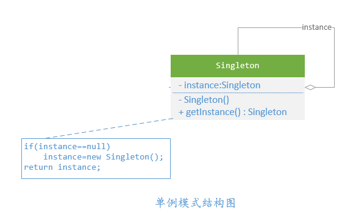
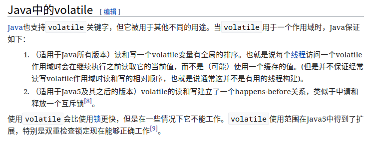
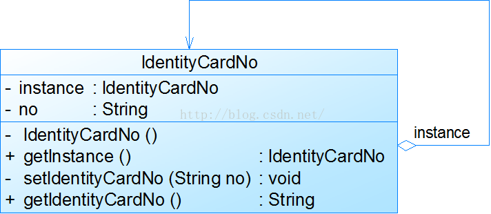
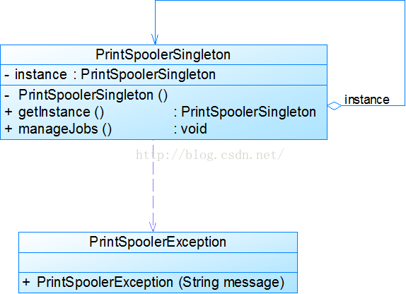

对于系统中的某些类来说，只有一个实例很重要

<!-- more -->

# 模式动机

**对于系统中的某些类来说，只有一个实例很重要**，例如，一个系统中可以存在多个打印任务，但是只能有一个正在工作的任务；一个系统只能有一个窗口管理器或文件系统；一个系统只能有一个计时工具或ID（序号）生成器。

---

如何保证一个类只有一个实例并且这个实例易于被访问呢？

定义一个全局变量可以确保对象随时都可以被访问，但**不能防止我们实例化多个对象**

一个更好的解决办法是**让类自身负责保存它的唯一实例**。这个类可以保证没有其他实例被创建，并且它可以提供一个访问该实例的方法。这就是单例模式的模式动机。

# 单例模式(Singleton Pattern)

单例模式确保某一个类只有一个实例，而且**自行实例化并向整个系统提供这个实例**，这个类称为单例类，它提供全局访问的方法。

单例模式是一种对象创建型模式。单例模式又名单件模式或单态模式。

## 要点

- 某个类只能有一个实例
- 它必须自行创建这个实例
- 它必须自行向整个系统提供这个实例

## 结构



(图源：[设计模式从入门到放弃 - 单例模式 - jtahstu的博客](http://www.jtahstu.com/blog/Singleton.html))

## 分析

单例模式的目的是保证一个类仅有一个实例，并提供一个访问它的全局访问点。单例模式包含的角色只有一个，就是单例类——`Singleton`

单例类拥有一个私有构造函数，确保用户无法通过new关键字直接实例化它。

除此之外，该模式中包含一个静态私有成员变量与静态公有的工厂方法，**该工厂方法负责检验实例的存在性并实例化自己，然后存储在静态成员变量中，以确保只有一个实例被创建**。

# 实现

在单例模式的实现过程中，需要注意如下三点：

- 单例类的构造函数为私有；
- 提供一个自身的静态私有成员变量；
- 提供一个公有的静态工厂方法。

**通常单例模式在Java语言中，有两种构建方式：**

- 懒汉方式。指全局的单例实例在第一次被使用时构建。
- 饿汉方式。指全局的单例实例在类装载时构建。

## 懒汉式，线程不安全

> 是否 Lazy 初始化：是
> 是否多线程安全：否
> 实现难度：易
> 描述：这种方式是最基本的实现方式，这种实现最大的问题就是不支持多线程。因为没有加锁 `synchronized`，所以严格意义上它并不算单例模式。
> 这种方式 `lazy loading` 很明显，不要求线程安全，在多线程不能正常工作。

*延迟初始化(`lazy initialization`)，也就是在真正被使用的时候才开始初始化的技巧。主要用于提高性能，避免浪费计算，并减少程序内存要求。(延迟初始化=延迟实例化)*

```java
package indi.greenhat.designpattern;

/**
 * @author GreenHatHG
 **/
public class Singleton {
    /**
     * 静态私有成员变量
     */
    private static Singleton instance = null;

    /**
     * 私有构造函数
     */
    private Singleton(){

    }

    /**
     * 静态公有工厂方法，返回唯一实例
     * @return
     */
    public static Singleton getInstance(){
        if(instance == null){
            instance = new Singleton();
        }
        return instance;
    }
}
```

**接下来介绍的几种实现方式都支持多线程，但是在性能上有所差异。**

## 懒汉式，线程安全

> 是否 Lazy 初始化：是
> 是否多线程安全：是
> 实现难度：易
> 描述：这种方式具备很好的 `lazy loading`，能够在多线程中很好的工作，但是，效率很低，99% 情况下不需要同步。
> 优点：第一次调用才初始化，避免内存浪费。
> 缺点：必须加锁 `synchronized` 才能保证单例，但加锁会影响效率。
> `getInstance()` 的性能对应用程序不是很关键（该方法使用不太频繁）。

```java
package indi.greenhat.designpattern;

/**
 * @author GreenHatHG
 **/
public class Singleton {

    private static Singleton instance = null;

    private Singleton(){

    }

    public static synchronized Singleton getInstance(){
        if(instance == null){
            instance = new Singleton();
        }
        return instance;
    }
}
```

## 饿汉式

> 是否 Lazy 初始化：否
> 是否多线程安全：是
> 实现难度：易
> 描述：这种方式比较常用，但容易产生垃圾对象。
> 优点：没有加锁，执行效率会提高。
> 缺点：类加载时就初始化，浪费内存。
> 它基于`classloder`机制避免了多线程的同步问题，不过，`instance`在类装载时就实例化，虽然导致类装载的原因有很多种，在单例模式中大多数都是调用`getInstance`方法， 但是也不能确定有其他的方式（或者其他的静态方法）导致类装载，这时候初始化`instance`显然没有达到`lazy loading`的效果

```java
package indi.greenhat.designpattern;

/**
 * @author GreenHatHG
 **/
public class Singleton {

    private static Singleton instance = new Singleton();
    private Singleton (){}
    
    public static Singleton getInstance() {
        return instance;
    }
}
```

## 双检锁/双检查锁（DCL，即 double-checked locking）

> JDK 版本：JDK1.5 起
> 是否 Lazy 初始化：是
> 是否多线程安全：是
> 实现难度：较复杂
> 描述：这种方式称为双重检查锁(Double-Check Locking)，需要注意的是，如果使用双重检查锁定来实现懒汉式单例类，需要在静态成员变量`instance`之前增加**修饰符volatile**，被`volatile`修饰的成员变量可以确保多个线程都能够正确处理，且该代码只能在JDK 1.5及以上版本中才能正确执行。由于`volatile`关键字会屏蔽Java虚拟机所做的一些代码优化，可能会导致系统运行效率降低，因此即使使用双重检查锁定来实现单例模式也不是一种完美的实现方式。



(图源：[Volatile变量 - Wikipedia]([https://zh.wikipedia.org/wiki/Volatile%E5%8F%98%E9%87%8F#Java%E4%B8%AD%E7%9A%84volatile](https://zh.wikipedia.org/wiki/Volatile变量#Java中的volatile)))

```java
package indi.greenhat.designpattern;

/**
 * @author GreenHatHG
 **/
public class Singleton {
    private volatile static Singleton singleton;
    private Singleton (){
        
    }
    public static Singleton getSingleton() {
        if (singleton == null) {
            synchronized (Singleton.class) {
                if (singleton == null) {
                    singleton = new Singleton();
                }
            }
        }
        return singleton;
    }
}
```

## 静态内部类

> 是否 Lazy 初始化：是
> 是否多线程安全：是
> 实现难度：一般
> 描述：饿汉式单例类不能实现延迟加载，不管将来用不用始终占据内存；懒汉式单例类线程安全控制烦琐，而且性能受影响。可见，无论是饿汉式单例还是懒汉式单例都存在这样那样的问题，有没有一种方法，能够将两种单例的缺点都克服，而将两者的优点合二为一呢？答案是：Yes！下面我们来学习这种更好的被称之为**Initialization Demand Holder (IoDH)**的技术。在`IoDH`中，我们在单例类中增加一个**静态(static)内部类**，在该内部类中创建单例对象，再将该单例对象通过`getInstance()`方法返回给外部使用。由于静态单例对象没有作为`Singleton`的成员变量直接实例化，因此类加载时不会实例化`Singleton`，第一次调用`getInstance()`时将加载内部类`SingletonHolder`，在该内部类中定义了一个`static`类型的变量`instance`，此时会首先初始化这个成员变量，由Java虚拟机来保证其线程安全性，确保该成员变量只能初始化一次。由于`getInstance()`方法没有任何线程锁定，因此其性能不会造成任何影响。**通过使用`IoDH`，我们既可以实现延迟加载，又可以保证线程安全，不影响系统性能，不失为一种最好的Java语言单例模式实现方式**（其缺点是与编程语言本身的特性相关，很多面向对象语言不支持`IoDH`）

```java
package indi.greenhat.designpattern;

/**
 * @author GreenHatHG
 **/
public class Singleton {
    private static class SingletonHolder {
        private static final Singleton INSTANCE = new Singleton();
    }
    private Singleton (){
        
    }
    public static final Singleton getInstance() {
        return SingletonHolder.INSTANCE;
    }
}

```

## 枚举

> JDK 版本：JDK1.5 起
>
> 是否 Lazy 初始化：否
> 是否多线程安全：是
> 实现难度：易
> 描述：这种实现方式还没有被广泛采用，但这是实现单例模式的最佳方法。它更简洁，自动支持序列化机制，绝对防止多次实例化。
> 这种方式是`Effective Java`作者`Josh Bloch`提倡的方式，它不仅能避免多线程同步问题，而且还自动支持序列化机制，防止反序列化重新创建新的对象，绝对防止多次实例化。不过，由于 JDK1.5 之后才加入 enum 特性，用这种方式写不免让人感觉生疏，在实际工作中，也很少用。
> 不能通过`reflection attack`来调用私有构造方法。

```java
public enum Singleton {  
    INSTANCE;  
    public void whateverMethod() {  
    }  
}
```

## 饿汉式单例与懒汉式单例类比较

- 饿汉式单例类在自己被加载时就将自己实例化。单从**资源利用效率角度来讲，这个比懒汉式单例类稍差些。从速度和反应时间角度来讲，则比懒汉式单例类稍好些**。
- 懒汉式单例类在实例化时，必须**处理好在多个线程同时首次引用此类时的访问限制问题**，特别是当单例类作为资源控制器，在实例化时必然涉及资源初始化，而资源初始化很有可能耗费大量时间，这意味着出现多线程同时首次引用此类的机率变得较大，需要通过同步化机制进行控制

## 选择

一般情况下，不建议使用第 1 种和第 2 种懒汉方式，建议使用第 3 种饿汉方式。只有在要明确实现`lazy loading`效果时，才会使用第 5 种登记方式。如果涉及到反序列化创建对象时，可以尝试使用第 6 种枚举方式。如果有其他特殊的需求，可以考虑使用第 4 种双检锁方式。

# 实例

## 身份证号码

在现实生活中，居民身份证号码具有唯一性，同一个人不允许有多个身份证号码，第一次申请身份证时将给居民分配一个身份证号码，如果之后因为遗失等原因补办时，还是使用原来的身份证号码，不会产生新的号码。现使用单例模式模拟该场景



(图源：[设计模式之单例模式 - leehsiao的专栏 - CSDN博客](https://blog.csdn.net/leehsiao/article/details/48297911)）

## 打印池

在操作系统中，打印池(`Print Spooler`)是一个用于管理打印任务的应用程序，通过打印池用户可以删除、中止或者改变打印任务的优先级，在一个系统中只允许运行一个打印池对象，如果重复创建打印池则抛出异常。现使用单例模式来模拟实现打印池的设计



(图源：[设计模式之单例模式 - leehsiao的专栏 - CSDN博客](https://blog.csdn.net/leehsiao/article/details/48297911)）

## java.lang.Runtime

`Runtime`类封装了Java运行时的环境。**每一个java程序实际上都是启动了一个JVM进程，那么每个JVM进程都是对应这一个Runtime实例，此实例是由JVM为其实例化的。每个 Java 应用程序都有一个 Runtime 类实例，使应用程序能够与其运行的环境相连接**。

由于Java是单进程的，所以，在一个JVM中，Runtime的实例应该只有一个。所以应该使用单例来实现。

```java
public class Runtime {
    private static Runtime currentRuntime = new Runtime();

    public static Runtime getRuntime() {
        return currentRuntime;
    }

    private Runtime() {}
}
```

以上代码为JDK中`Runtime`类的部分实现，可以看到，这其实是饿汉式单例模式。在该类第一次被`classloader`加载的时候，这个实例就被创建出来了。

# 优缺点

## 优点

- **提供了对唯一实例的受控访问**。因为单例类封装了它的唯一实例，所以它可以严格控制客户怎样以及何时访问它，并为设计及开发团队提供了共享的概念。
- 由于在系统内存中只存在一个对象，因此**可以节约系统资源**，对于一些需要频繁创建和销毁的对象，单例模式无疑可以提高系统的性能。
- **允许可变数目的实例**。我们可以基于单例模式进行扩展，使用与单例控制相似的方法来获得指定个数的对象实例。

## 缺点

- 由于单例模式中没有抽象层，因此**单例类的扩展有很大的困难**。
- **单例类的职责过重**，在一定程度上违背了“单一职责原则”。因为单例类既充当了工厂角色，提供了工厂方法，同时又充当了产品角色，包含一些业务方法，将产品的创建和产品的本身的功能融合到一起。
- **滥用单例将带来一些负面问题**，如为了节省资源将数据库连接池对象设计为单例类，可能会导致共享连接池对象的程序过多而出现连接池溢出；现在很多面向对象语言(如Java、C#)的运行环境都提供了自动垃圾回收的技术，因此，如果实例化的对象长时间不被利用，系统会认为它是垃圾，会自动销毁并回收资源，下次利用时又将重新实例化，这将导致对象状态的丢失。

# 适用环境

在以下情况下可以使用单例模式：

- **系统只需要一个实例对象**，如系统要求提供一个唯一的序列号生成器，或者需要考虑资源消耗太大而只允许创建一个对象。
- 客户调用类的单个实例**只允许使用一个公共访问点**，除了该公共访问点，不能通过其他途径访问该实例。
- **在一个系统中要求一个类只有一个实例时才应当使用单例模式。反过来，如果一个类可以有几个实例共存，就需要对单例模式进行改进，使之成为多例模式**。

----

参考：

[设计模式干货系列：（四）单例模式【学习难度：★☆☆☆☆，使用频率：★★★★☆】 | 嘟嘟独立博客](http://tengj.top/2016/04/06/sjms4singleton/)

[单例模式 - 维基百科，自由的百科全书]([https://zh.wikipedia.org/wiki/%E5%8D%95%E4%BE%8B%E6%A8%A1%E5%BC%8F](https://zh.wikipedia.org/wiki/单例模式))

[设计模式（三）——JDK中的那些单例-HollisChuang's Blog](https://www.hollischuang.com/archives/1383)

---

