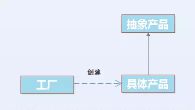
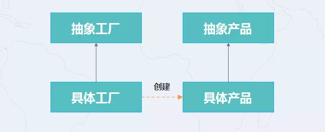
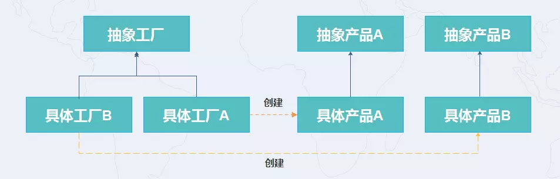

《Head first设计模式》之工厂模式

<!-- more -->

按照这本书以披萨店为例子讲解，工厂模式分为`简单工厂模式`，`工厂方法模式`，`抽象工厂模式`

参考：[<http://www.importnew.com/23499.html>](http://www.importnew.com/23499.html)

[https://github.com/crazysunj/crazysunj.github.io/wiki/%E5%B7%A5%E5%8E%82%E6%A8%A1%E5%BC%8F](https://github.com/crazysunj/crazysunj.github.io/wiki/工厂模式)

<https://www.jianshu.com/p/78c4d93fab87>

# 简单工厂模式

## 预定披萨

假设有一家披萨店，预定披萨的代码如下：

```java
Pizza orderPizza(){
    Pizza pizza = new Pizza();
     
    // 准备面皮，加调料等
    pizza.prepare();
    // 烘烤
    pizza.bake();
    // 切片
    pizza.cut();
    //包装
    pizza.box();
    return pizza;
}
```

更多披萨类型

刚刚只是一个Pizza类型，现在需要更多的披萨类型。所以代码可以改为如下；

```java
// 现在把披萨类型传入orderPizza
Pizza orderPizza(String type){
    Pizza pizza;
    
    // 根据披萨的类型，我们实例化正确的具体类，然后将其赋值给pizza实例变量。
    // 请注意，这里的任何披萨都必须实现pizza接口
     if (type.equals("cheese")) {
        pizza = new CheesePizza();
    } else if (type.equals("greek")) {
        pizza = new GreekPizza();
    } else if (type.equals("pepperoni")) {
        pizza = new PepperoniPizza();
    }
     
    // 准备面皮，加调料等
    pizza.prepare();
    // 烘烤
    pizza.bake();
    // 切片
    pizza.cut();
    //包装
    pizza.box();
    return pizza;
}
```

## 修改披萨类型

现在需要对披萨类型进行增加和删除，假定去掉`greek`披萨，并且增加个`clam`披萨，所以可以修改如下：

```java
// 现在把披萨类型传入orderPizza
Pizza orderPizza(String type){
    Pizza pizza;
    
    // 根据披萨的类型，我们实例化正确的具体类，然后将其赋值给pizza实例变量。
    // 请注意，这里的任何披萨都必须实现pizza接口
     if (type.equals("cheese")) {
        pizza = new CheesePizza();
//    } else if (type.equals("greek")) {
//        pizza = new GreekPizza();
      } else if (type.equals("pepperoni")) {
          pizza = new PepperoniPizza();
      } else if (type.equals("clam")) {
          pizza = new clamPizza();
         
    // 这里是我们不想改变的地方。因为披萨的准备、烘烤、包装，多年来持续不变
    // 所以这部分的代码不会改变，只有发生这些动作的披萨会改变
    pizza.prepare();
    pizza.bake();
    pizza.cut();
    pizza.box();
    return pizza;
}
```

由此看来，我们又得去改方法里面的具体代码，但是改着改着，我们会发现，我们改的都是同一个地方，是的，具体的pizza不停的变，而其它的都没变。

现在我们已经知道哪些会改变，哪些不会改变，该是使用封装的时候了。封装可以让我们将要修改的部分放到别的地方，从而不用修改`orderPizza`类，专注于需要修改的地方。现在最好将创建对象移到`orderPizza()`之外，但怎么做呢？我们可以把创建披萨的代码移到另一个对象中，由这个新对象专职创建披萨。

----

**我们称这个新对象为“工厂”**

工厂（`factory`）处理创建对象的细节。一旦有了`SimplePizzaFactory`，`orderPizza()`就变成此对象的客户。当需要披萨时，就叫披萨工厂做一个。

现在`orderPizza()`方法只关心从工厂得到了一个披萨，而这个披萨实现了Pizza接口，所以它可以调用`prepare()`，`bake()`，`cut()`，`box()`来分别进行准备、烘烤、切片、装盒。

```java
// 现在我们为PizzaStore加上一个对SimplePizzaFactory的引用
public class PizzaStore {
    SimplePizzaFactory factory;
 
    // PizzaStore的构造器，需要一个工厂作为参数
    public PizzaStore(SimplePizzaFactory factory){
        this.factory = factory;
    }
 
    public Pizza orderPizza(String type) {
        Pizza pizza;
 
        // orderPizza()方法通过简单传入订单类型来使用工厂创建披萨。
        // 请注意，我们把new操作符替换成工厂对象的创建方法。这里不再使用具体实例化
        pizza = factory.createPizza(type);
 
        pizza.prepare();
        pizza.bake();
        pizza.cut();
        pizza.box();
 
        return pizza;
    }
}
```

```java
// SimplePizzaFactory是我们的新类，它只做一件事情：帮它的客户创建披萨
public class SimplePizzaFactory {
    // 首先，在这个工厂内定义一个createPizza()方法，所有客户用这个方法来实例化新对象。
    public Pizza createPizza(String type) {
        Pizza pizza = null;
 
        // 这是从orderPizza()方法中移过来的代码
        if (type.equals("cheese")) {
            pizza = new CheesePizza();
        } else if (type.equals("pepperoni")) {
            pizza = new PepperoniPizza();
        } else if (type.equals("clam")) {
            pizza = new ClamPizza();
        }
        
        return pizza;
    }
}
```

# 工厂模式方法

## 加盟店

我们的品牌越做越大，总是并免不了加盟这玩意，作为老板，那么你必须严格细查这些加盟店的质量，加盟店可能来自不同的地区，风味不同，不妨说纽约、芝加哥、加州。

第一种想法就是，建立3个不同的工厂，传入PizzaStore即可。但是这种感觉是，3个厂加工了比萨之后，只能放在我的店里卖的节奏哈？

那我们为什么不把制造pizza抽象出来呢，同时店也抽象出来，不同的店去做不同类型的pizza，不是更好么？但都是在我品牌下。

----

首先，我们先对`PizzaStore`做出改变，把`createPizza()`方法放回到PizzaStore中，不过要把它设置成“抽象方法”。

```java
public abstract class PizzaStore {
 
    public Pizza orderPizza(String type) {
        Pizza pizza;
 
        // 现在createPizza()方法从工厂对象中移回PizzaStore
        pizza = createPizza(type);
 
        // 这些都没变
        pizza.prepare();
        pizza.bake();
        pizza.cut();
        pizza.box();
 
        return pizza;
    }
 
    // 现在把工厂对象移到这个方法中
    // 在PizzaStore里，“工厂方法”现在是抽象的
    // 每个子类都会覆盖createPizza()方法
    abstract Pizza createPizza(String type);
}
```

现在已经有一个PizzaStore作为超类；让加盟店（NYPizzaStore，ChicagoPizzaStore，CaliforniaPizzaStore）都继承这个PizzaStore，每个子类各自决定如何制作披萨。

```java
// 如果加盟店为顾客提供纽约风味的披萨，就使用NyStylePizzaStore，
// 因为此类的createPizza()方法会建立纽约风味的披萨
public class NyStylePizzaStore extends PizzaStore{
 
    @Override
    Pizza createPizza(String type) {
        Pizza pizza = null;
 
        if (type.equals("cheese")) {
            pizza = new NyStyleCheesePizza();
        } else if (type.equals("pepperoni")) {
            pizza = new NyStylePepperoniPizza();
        } else if (type.equals("clam")) {
            pizza = new NyStyleClamPizza();
        } else if (type.equals("veggie")) {
            pizza = new NyStyleVeggiePizza();
        }
        return pizza;
    }
}
```

```java
// 类似的，利用芝加哥子类，我们得到了带芝加哥原料的createPizza()实现
public class ChicagoStylePizzaStore extends PizzaStore{
 
    @Override
    Pizza createPizza(String type) {
        Pizza pizza = null;
 
        if (type.equals("cheese")) {
            pizza = new ChicagoCheesePizza();
        } else if (type.equals("pepperoni")) {
            pizza = new ChicagoPepperoniPizza();
        } else if (type.equals("clam")) {
            pizza = new ChicagoClamPizza();
        } else if (type.equals("veggie")) {
            pizza = new ChicagoVeggiePizza();
        }
        return pizza;
    }
}
```


## 地区差异材料不同

每个加盟店因为口味不同所使用的材料也会不同，有的是A面团，有的是B面团，按照之前的那种观念，我们同样可以把pizza改为抽象类，这样就可以由加盟店自己决定材料了。

```java
public abstract class AbstractPizza {
    protected String name = "pizza";//名称
    protected String dough = "dough";//面团
    protected String sauce = "sauce";//调味汁
    public void prepare() {
        System.out.println("preparing");
    }
    public void bake() {
        System.out.println("bake");
    }
    public void cut() {
        System.out.println("cut");
    }
    public void box() {
        System.out.println("box");
    }
}
```

 抽象类Pizza提供名称、面团、调味汁、配料的属性，子类可以在构造方法中赋值，这样就打造了不同的口味，更友好一点，可以在prepare()或者构造函数等地方赋值默认值。也可以指定默认材料，如果子类不更改，则造出默认pizza。

# 抽象工厂模式

现在加盟店打算使使用别的类型材料以减少它们的成本，所以我们需要改变材料的类型

```java
public abstract class AbstractPizza {
    protected String name = "pizza";//名称
    protected Dough dough = "dough";//面团
    protected Sauce sauce = "sauce";//调味汁
    public void prepare() {
        System.out.println("preparing");
    }
    public void bake() {
        System.out.println("bake");
    }
    public void cut() {
        System.out.println("cut");
    }
    public void box() {
        System.out.println("box");
    }
}
```

这样我们就可以根据类的不一样来实现不一样的原料，然后我们还需要原料工厂去实现这些原料，按照之前，我们先实现一个抽象原料工厂

```java
public interface PizzaIngredientFctory(){
    public Dough CreateDough();
    public Sauce CreateSauce();
}
```

然后不同地区的加盟店就可以有不同的原料工厂去造不一样的原料

```java
public class ChicagoPizzaIngredientFctory implemets PizzaIngredientFctory{
    public Dough CreateDough(){
        return new ChicagoDough();
    }
    public Sauce CreateSauce(){
        return new ChicagoDough();
    }
}
```

```java
public class PizzaIngredientFctory implemets PizzaIngredientFctory{
    public Dough CreateDough(){
        return new NYDough();
    }
    public Sauce CreateSauce(){
        return new NYDough();
    }
}
```

# 工厂模式

 工厂模式已经清晰了，所有工厂模式都用来封装对象的创建，它通过让子类决定该创建的对象是什么，来达到将对象创建的过程封装的目的。

# 三种对比

## 简单工厂模式

简单工厂模式是类的创建模式，又叫做静态工厂方法（`Static Factory Method`）模式。简单工厂模式是由一个工厂对象决定创建出哪一种产品类的实例。
结构如下：



### 优点

模式的核心是工厂类。这个类含有必要的判断逻辑，可以决定在什么时候创建哪一个产品类的实例。而客户端则可以免除直接创建对象的责任（比如那个店长）。简单工厂模式通过这种做法实现了对责任的分割。

### 缺点

这个工厂类集中了所以的创建逻辑，当有复杂的多层次等级结构时，所有的业务逻辑都在这个工厂类中实现。什么时候它不能工作了，整个系统都会受到影响。并且简单工厂模式违背了开闭原则（对扩展的开放，对修改的关闭）。

## 工厂模式方法

首先，在工厂方法模式中，核心的工厂类不再负责所有产品的创建，而是将具体创建的工作交给子类去做.这个核心类则摇身一变，成为了一个抽象工厂角色，仅负责给出具体工厂子类必须实现的接口，而不接触哪一个产品类应当被实例化这种细节。

这种进一步抽象化的结果，使这种工厂方法模式可以用来予许系统在不修改具体工厂角色的情况下引进新的产品，也就遵循了开闭原则。

结构如下：



---

1. 抽象工厂利用多态的优势将具体的产品的实例化放在具体工厂中实现。

2. 抽象工厂创建的是抽象产品--提供的是抽象方法(`createPizza`)，但是具体的实现是推迟到具体的工厂中实现。

3. 客户端中对用户可见的对象表面上看到的是两个抽象对象，但是具体工厂会创建用户指定类型的产品。

## 抽象工厂模式

`抽象工厂模式`是所有形态的工厂模式中最为抽象和最具一般性的一种形态。`抽象工厂模式`可以向客户端提供一个接口，使得客户端在不必指定产品的具体类型的情况下，创建多个产品族中的产品对象。这就是抽象工厂的用意。

结构如下：



# 倒置原则

倒置原则：要依赖抽象，不要依赖具体类，这个原则说明了高层组件不能依赖底层组件，而且不管高层或底层组件，都应该依赖于抽象。

让我们再回顾一下上面的例子，PizzaStore就是高层组件，而Pizza就是底层组件，而且前者依赖后者，很清晰。那么，要符合这个原则，我们应该怎么做呢？现在我们来倒置你的思考方式：

1. 开始我们需要一家比萨店
2. 我们得先从顶端开始，然后往下到具体类。但是，正如你所看到的你不想让比萨店实例这些具体类，要不然比萨店将全都依赖这些具体类。现在，开始”倒置”，别从顶端开始，而是从比萨开始，然后想想看能抽象化些什么
3. 你得抽象抽象化一个比萨
4. 你还得用一个工厂来将这些具体类取出比萨店，这样，各种不同的具体比萨类就只能依赖一个抽象，而比萨店也会依赖这个抽象，倒置完毕

以下方法能帮你避免在OO设计中违反依赖倒置原则：

- 变量不可以持有具体类的引用
- 不要让类派生自具体类
- 不要覆盖类中已实现的方法

# 要点

1. 所有的工厂都是用来封装对象的创建
2. 简单工厂，虽然不是真正的设计模式，但仍不失为一个简单的方法，可以将客户程序从具体类解耦
3. 工厂方法使用继承：把对象的创建委托给子类，子类实现工厂方法来创建对象
4. 抽象工厂使用对象组合：对象的创建被实现在工厂接口所暴露出来的方法中
5. 所有工厂模式都通过减少应用程序和具体类之间的依赖促进松耦合
6. 工厂方法允许类将实例化延迟到子类进行
7. 抽象工厂创建相关的对象家族，而不需要依赖它们的具体类
8. 依赖倒置原则，知道我们避免依赖具体类型，而要尽量依赖抽象
9. 工厂是很有威力的技巧，帮助我们针对抽象编程，而不要针对具体类编程


