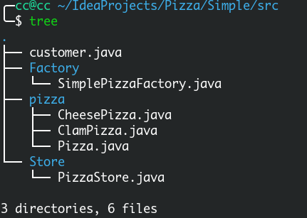
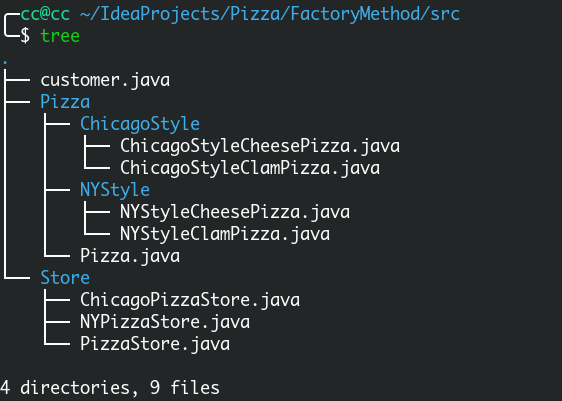
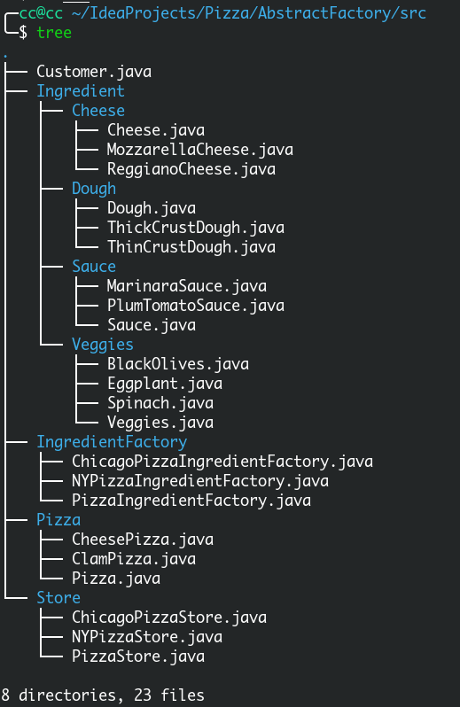

工厂模式的java实现

<!-- more -->

代码地址：

[github](https://github.com/GreenHatHG/blog_md/tree/master/Java%E8%AE%BE%E8%AE%A1%E6%A8%A1%E5%BC%8F-%E5%B7%A5%E5%8E%82%E6%A8%A1%E5%BC%8FJava%E5%AE%9E%E7%8E%B0/Code)

# 简单工厂模式



## pizza

### Pizza.java

```java
package pizza;

import java.util.ArrayList;

/**
 * 抽象Pizza类，其他种类都继承这个类
 */
public abstract class Pizza {
    /**
     * Pizza名字
     */
    String name;
    /**
     * 面团
     */
    String dough;
    /**
     * 调味汁
     */
    String sauce;
    /**
     * 配料
     */
    ArrayList<String> toppings = new ArrayList<String>();

    public String getName() {
        return name;
    }

    /**
     * 准备
     */
    public void prepare() {
        System.out.println("Preparing " + name);
    }

    /**
     * 烘焙
     */
    public void bake() {
        System.out.println("Baking " + name);
    }

    /**
     * 切片
     */
    public void cut() {
        System.out.println("Cutting " + name);
    }

    /**
     * 包装
     */
    public void box(){
        System.out.println("Cutting " + name);
    }

    @Override
    public String toString() {
        StringBuffer display = new StringBuffer();
        display.append("---- " + name + " ----\n");
        display.append("dough:" + dough + "\n");
        display.append("sauce:" + sauce + "\n");
        display.append("toppings:" + "\n");
        for (String topping : toppings){
            display.append(topping + "\n");
        }
        return display.toString();
    }
}
```

### CheesePizza.java

```java
package pizza;

public class CheesePizza extends Pizza {
    public CheesePizza() {
        name = "Cheese Pizza";
        dough = "Regular Crust";
        sauce = "Marinara Pizza Sauce";
        toppings.add("Fresh Mozzarella");
        toppings.add("Parmesan");
    }
}

```

### ClamPizza.java

```java
package pizza;

public class ClamPizza extends Pizza {
    public ClamPizza() {
        name = "Clam Pizza";
        dough = "Thin crust";
        sauce = "White garlic sauce";
        toppings.add("Clams");
        toppings.add("Grated parmesan cheese");
    }
}
```

## Factory

### SimplePizzaFactory.java

```java
package Factory;

import pizza.CheesePizza;
import pizza.ClamPizza;
import pizza.Pizza;

/**
 * 简单工厂用于制作pizza
 */
public class SimplePizzaFactory {
    public Pizza createPizza(String type) {
        Pizza pizza = null;

        if (type.equals("cheese")) {
            pizza = new CheesePizza();
        } else if (type.equals("clam")) {
            pizza = new ClamPizza();
        }

        return pizza;
    }
}
```

## Store

### PizzaStore.java

```java
package Store;

import Factory.SimplePizzaFactory;
import pizza.Pizza;

/**
 * Pizza店，用于订购Pizza
 */
public class PizzaStore {
    SimplePizzaFactory factory;

    public PizzaStore(SimplePizzaFactory factory) {
        this.factory = factory;
    }

    public Pizza orderPizza(String type) {
        Pizza pizza;

        /**
         * 工厂制作处type类型的Pizza
         */
        pizza = factory.createPizza(type);

        /**
         * 烘焙，切片，打包等
         */
        pizza.prepare();
        pizza.bake();
        pizza.cut();
        pizza.box();

        return pizza;
    }

}
```

## Customer.java

```java
import Factory.SimplePizzaFactory;
import Store.PizzaStore;
import pizza.Pizza;

/**
 * 模拟顾客购买pizza
 */
public class customer {
    public static void main(String[] args) {
        /**
         * 创建工厂并且创建一个PizzaStore对象
         */
        SimplePizzaFactory factory = new SimplePizzaFactory();
        PizzaStore store = new PizzaStore(factory);

        Pizza pizza = store.orderPizza("cheese");
        System.out.println("We ordered a " + pizza.getName() + "\n");
        System.out.println(pizza);

        pizza = store.orderPizza("clam");
        System.out.println("We ordered a " + pizza.getName() + "\n");
        System.out.println(pizza);
    }
}

```

## 输出

```java
Preparing Cheese Pizza
Baking Cheese Pizza
Cutting Cheese Pizza
Cutting Cheese Pizza
We ordered a Cheese Pizza

---- Cheese Pizza ----
dough:Regular Crust
sauce:Marinara Pizza Sauce
toppings:
Fresh Mozzarella
Parmesan

Preparing Clam Pizza
Baking Clam Pizza
Cutting Clam Pizza
Cutting Clam Pizza
We ordered a Clam Pizza

---- Clam Pizza ----
dough:Thin crust
sauce:White garlic sauce
toppings:
Clams
Grated parmesan cheese
```

# 工厂方法模式



## Pizza

### Pizza.java

```java
package Pizza;

import java.util.ArrayList;
public abstract class Pizza {
    public String name;
    public String dough;
    public String sauce;
    public ArrayList<String> toppings = new ArrayList<String>();

    public void prepare() {
        System.out.println("Prepare " + name);
        System.out.println("Tossing dough...");
        System.out.println("Adding sauce...");
        System.out.println("Adding toppings: ");
        for (String topping : toppings) {
            System.out.println("   " + topping);
        }
    }

    public void bake() {
        System.out.println("Bake for 25 minutes at 350");
    }

    public void cut() {
        System.out.println("Cut the pizza into diagonal slices");
    }

    public void box() {
        System.out.println("Place pizza in official PizzaStore box");
    }

    public String getName() {
        return name;
    }

    public String toString() {
        StringBuffer display = new StringBuffer();
        display.append("---- " + name + " ----\n");
        display.append(dough + "\n");
        display.append(sauce + "\n");
        for (String topping : toppings) {
            display.append(topping + "\n");
        }
        return display.toString();
    }

}
```

### NYStyle

#### NYStyleCheesePizza.java

```java
package Pizza.NYStyle;
import Pizza.Pizza;

/**
 * 纽约式CheesePizza
 */
public class NYStyleCheesePizza extends Pizza {
    public NYStyleCheesePizza() {
        name = "NY Style Sauce and Cheese Pizza";
        dough = "Thin Crust Dough";
        sauce = "Marinara Sauce";

        toppings.add("Grated Reggiano Cheese");
    }
}
```

#### NYStyleClamPizza.java

```java
package Pizza.NYStyle;
import Pizza.Pizza;

/**
 * 纽约式ClamPizza
 */
public class NYStyleClamPizza extends Pizza {
    public NYStyleClamPizza() {
        name = "NY Style Clam Pizza";
        dough = "Thin Crust Dough";
        sauce = "Marinara Sauce";

        toppings.add("Grated Reggiano Cheese");
        toppings.add("Fresh Clams from Long Island Sound");
    }
}
```

### ChicagoStyle

#### ChicagoStyleCheesePizza.java

```java
package Pizza.ChicagoStyle;
import Pizza.Pizza;

/**
 * 芝加哥式CheesePizza
 */
public class ChicagoStyleCheesePizza extends Pizza {
    public ChicagoStyleCheesePizza() {
        name = "Chicago Style Deep Dish Cheese Pizza";
        dough = "Extra Thick Crust Dough";
        sauce = "Plum Tomato Sauce";

        toppings.add("Shredded Mozzarella Cheese");
    }

    public void cut() {
        System.out.println("Cutting the pizza into square slices");
    }
}
```

#### ChicagoStyleClamPizza.java

```java
package Pizza.ChicagoStyle;

import Pizza.Pizza;

/**
 * 芝加哥式ClamPizza
 */
public class ChicagoStyleClamPizza extends Pizza {
    public ChicagoStyleClamPizza() {
        name = "Chicago Style Clam Pizza";
        dough = "Extra Thick Crust Dough";
        sauce = "Plum Tomato Sauce";

        toppings.add("Shredded Mozzarella Cheese");
        toppings.add("Frozen Clams from Chesapeake Bay");
    }

    public void cut() {
        System.out.println("Cutting the pizza into square slices");
    }
}
```

## Store

### PizzaStore.java

```java
package Store;

import Pizza.Pizza;

public abstract class PizzaStore {
    /**
     * 制作item类型的Pizza
     * @param item 需要item类的Pizza
     * @return Pizza
     */
    public abstract Pizza createPizza(String item);

    public Pizza orderPizza(String type){
        Pizza pizza = createPizza(type);
        System.out.println("--- Making a " + pizza.getName() + " ---");
        pizza.prepare();
        pizza.bake();
        pizza.cut();
        pizza.box();
        return pizza;
    }
}
```

### NYPizzaStore.java

```java
package Store;

import Pizza.NYStyle.*;
import Pizza.Pizza;

/**
 * 纽约Pizza店
 */
public class NYPizzaStore extends PizzaStore {
    @Override
    public Pizza createPizza(String item) {

        switch (item) {
            case "cheese":
                return new NYStyleCheesePizza();
            case "clam":
                return new NYStyleClamPizza();
            default:
                return null;
        }
    }
}
```

### ChicagoPizzaStore.java

```java
package Store;

import Pizza.ChicagoStyle.*;
import Pizza.Pizza;

/**
 * 芝加哥Pizza店
 */
public class ChicagoPizzaStore extends PizzaStore {
    @Override
    public Pizza createPizza(String item) {

        switch (item) {
            case "cheese":
                return new ChicagoStyleCheesePizza();
            case "clam":
                return new ChicagoStyleClamPizza();
            default:
                return null;
        }

    }
}
```

## Customer.java

```java
import Pizza.Pizza;
import Store.ChicagoPizzaStore;
import Store.NYPizzaStore;
import Store.PizzaStore;

/**
 * 模拟顾客购买pizza
 */
public class customer {
    public static void main(String[] args) {
        /**
         * 开两家店
         */
        PizzaStore nyStore = new NYPizzaStore();
        PizzaStore chicagoStore = new ChicagoPizzaStore();

        /**
         * 纽约式CheesePizza
         */
        Pizza pizza = nyStore.orderPizza("cheese");
        System.out.println("Ethan ordered a " + pizza.getName() + "\n");

        /**
         * 购买芝加哥式CheesePizza
         */
        pizza = chicagoStore.orderPizza("cheese");
        System.out.println("Joel ordered a " + pizza.getName() + "\n");

    }
}
```

## 输出

```java
--- Making a NY Style Sauce and Cheese Pizza ---
Prepare NY Style Sauce and Cheese Pizza
Tossing dough...
Adding sauce...
Adding toppings: 
   Grated Reggiano Cheese
Bake for 25 minutes at 350
Cut the pizza into diagonal slices
Place pizza in official PizzaStore box
Ethan ordered a NY Style Sauce and Cheese Pizza

--- Making a Chicago Style Deep Dish Cheese Pizza ---
Prepare Chicago Style Deep Dish Cheese Pizza
Tossing dough...
Adding sauce...
Adding toppings: 
   Shredded Mozzarella Cheese
Bake for 25 minutes at 350
Cutting the pizza into square slices
Place pizza in official PizzaStore box
Joel ordered a Chicago Style Deep Dish Cheese Pizza
```

# 抽象工厂模式



篇幅较长，只贴上部分代码

## Ingredient

### Cheese.java

```java
package Ingredient.Cheese;

public interface Cheese {
    String toString();
}
```

### MozzarellaCheese.java

```java
package Ingredient.Cheese;

import Ingredient.Cheese.Cheese;

public class MozzarellaCheese implements Cheese {
    public String toString() {
        return "Shredded Mozzarella";
    }
}
```

### ReggianoCheese.java

```java
package Ingredient.Cheese;

public class ReggianoCheese implements Cheese {
    public String toString() {
        return "Reggiano Cheese";
    }
}
```

## IngredientFactory

### ChicagoPizzaIngredientFactory.java

```java
package IngredientFactory;

import Ingredient.Cheese.*;
import Ingredient.Dough.*;
import Ingredient.Sauce.*;
import Ingredient.Veggies.*;

/**
 * 芝加哥原料工厂
 */
public class ChicagoPizzaIngredientFactory implements PizzaIngredientFactory {
    @Override
    public Dough createDough() {
        return new ThickCrustDough();
    }

    @Override
    public Sauce createSauce() {
        return new PlumTomatoSauce();
    }

    @Override
    public Cheese createCheese() {
        return new MozzarellaCheese();
    }

    @Override
    public Veggies[] createVeggies() {
        Veggies[] veggies = {
                new BlackOlives(),
                new Spinach(),
                new Eggplant()
        };
        return veggies;
    }

}
```

## Pizza

### CheesePizza.java

```java
package Pizza;

import IngredientFactory.PizzaIngredientFactory;

public class CheesePizza extends Pizza {
    /**
     * 原料工厂
     */
    PizzaIngredientFactory ingredientFactory;

    public CheesePizza(PizzaIngredientFactory ingredientFactory) {
        this.ingredientFactory = ingredientFactory;
    }

    /**
     * 原料工厂制作原料
     */
    public void prepare() {
        System.out.println("Preparing " + name);
        dough = ingredientFactory.createDough();
        sauce = ingredientFactory.createSauce();
        cheese = ingredientFactory.createCheese();
    }
}
```

## Store

### ChicagoPizzaStore.java

```java
package Store;

import IngredientFactory.ChicagoPizzaIngredientFactory;
import IngredientFactory.PizzaIngredientFactory;
import Pizza.*;

/**
 * 芝加哥Pizza店
 */
public class ChicagoPizzaStore extends PizzaStore {

    @Override
    protected Pizza createPizza(String item) {
        Pizza pizza = null;
        PizzaIngredientFactory ingredientFactory = new ChicagoPizzaIngredientFactory();

        /**
         * 制作item类型的Pizza
         */
        switch (item){
            case "cheese":
                pizza = new CheesePizza(ingredientFactory);
                pizza.setName("Chicago Style Cheese Pizza");
                break;
            case "clam":
                pizza = new ClamPizza(ingredientFactory);
                pizza.setName("Chicago Style Clam Pizza");
                break;
        }

        return pizza;
    }
}
```

## Customer.java

```java
import Pizza.Pizza;
import Store.ChicagoPizzaStore;
import Store.NYPizzaStore;
import Store.PizzaStore;

public class Customer {
    public static void main(String[] args) {
        PizzaStore nyStore = new NYPizzaStore();
        PizzaStore chicagoStore = new ChicagoPizzaStore();

        Pizza pizza = nyStore.orderPizza("cheese");
        System.out.println("Ethan ordered a " + pizza + "\n");

        pizza = chicagoStore.orderPizza("cheese");
        System.out.println("Joel ordered a " + pizza + "\n");
    }
}
```

## 输出

```java
--- Making a NY Style Sauce and Cheese Pizza ---
Prepare NY Style Sauce and Cheese Pizza
Tossing dough...
Adding sauce...
Adding toppings: 
   Grated Reggiano Cheese
Bake for 25 minutes at 350
Cut the pizza into diagonal slices
Place pizza in official PizzaStore box
Ethan ordered a NY Style Sauce and Cheese Pizza

--- Making a Chicago Style Deep Dish Cheese Pizza ---
Prepare Chicago Style Deep Dish Cheese Pizza
Tossing dough...
Adding sauce...
Adding toppings: 
   Shredded Mozzarella Cheese
Bake for 25 minutes at 350
Cutting the pizza into square slices
Place pizza in official PizzaStore box
Joel ordered a Chicago Style Deep Dish Cheese Pizza
```

