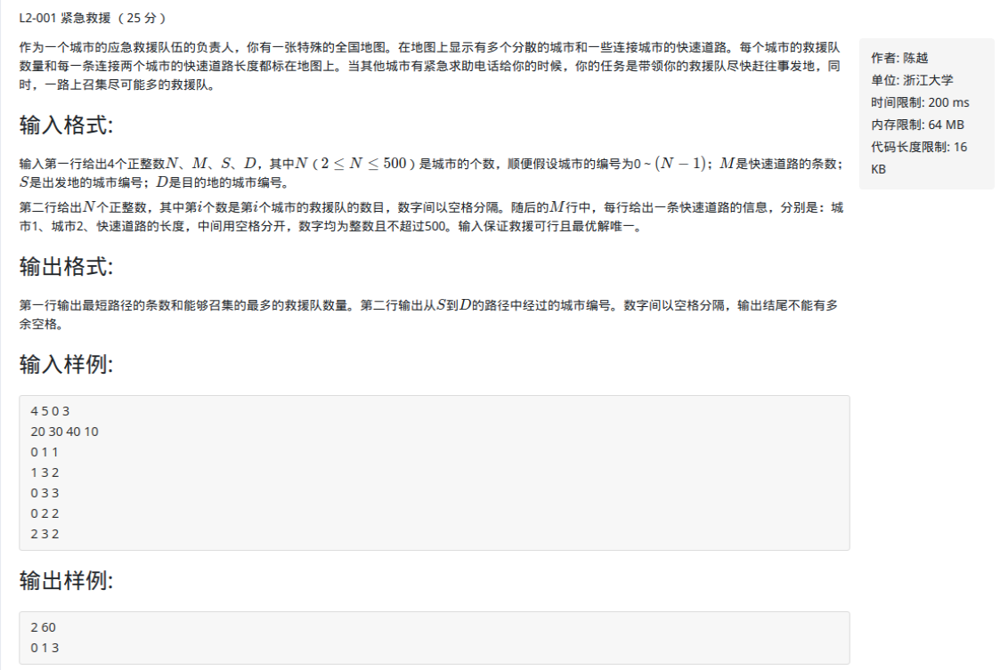

L2-001紧急救援

<!-- more -->

# 题目

[L2-001紧急救援](https://pintia.cn/problem-sets/994805046380707840/problems/994805073643683840)



# 解析

```c++
/*
2019/2/22 17:08:10
56ms
*/

#include <bits/stdc++.h>
using namespace std;

const int MAXN = 1e3;
const int INF = 0X3F3F3F3F;
int edge[MAXN][MAXN]; 
int vis[MAXN] = {0}; 
int dis[MAXN];
int num[MAXN]; //存每个点救援人员数量
int path[MAXN]; //存储路径，path[i]:表示最短路径的前一个结点，最后递归打印路径即可
int totWeight[MAXN] = {0}; //totWeight[i]:代表从起点到点i所能召集的最多救援队的数量
int totPath[MAXN]; //totPath[i]:起始到点i的最短路径数目

int num_e, num_v, beg, en, MIN;

void dijkstra(int beg)
{
    for(int i = 0; i < num_v; i++)
    {
        dis[i] = edge[beg][i];
        path[i] = beg;
        if(i != beg)
            totWeight[i] = num[beg] + num[i];
        totPath[i] = 1;
    }
	vis[beg] = 1;
    for(int i = 0; i < num_v; i++)
    {
        int k = 0;
        MIN = INF;
        for(int j = 0; j < num_v; j++)
        {
            if(vis[j] == 0 && MIN > dis[j])
            {
                MIN = dis[j];
                k = j;
            }
        }
        vis[k] = 1;
        for(int j = 0; j < num_v; j++)
        {
            if(vis[j] == 0)
            {
                if(dis[k] + edge[k][j] < dis[j]) //松弛时各数组的更新
                {
                    dis[j] = dis[k] + edge[k][j];
                    path[j] = k;
                    totPath[j] = totPath[k];
                    totWeight[j] = totWeight[k] + num[j];
                }
                else if(dis[k] + edge[k][j] == dis[j]) //相等时的更新
                {
                    totPath[j] += totPath[k]; //应该是二者最短路径的和
                     //追求最短路的前提下尽可能地增加队员数目
                    if(totWeight[k] + num[j] > totWeight[j])
                    {
                        totWeight[j] = totWeight[k] + num[j];
                        path[j] = k;
                    }
                }
            }
        }
    }
}

void printPath(int en) //输出路径
{
    if(en == beg)
    {
        cout << en;
        return;
    }
    printPath(path[en]);
    cout << " " << en;
}

int main()
{
    ios::sync_with_stdio(false);
    cin.tie(0);
    cout.tie(0);

    cin >> num_v >> num_e >> beg >> en;
    for(int i = 0; i < num_v; i++)
    {
        for(int j = 0; j < num_v; j++)
        {
            if(i == j)
                edge[i][j] = 0;
            else
                edge[i][j] = edge[j][i] = INF;
        }
    }

    for(int i = 0; i < num_v; i++)
        cin >> num[i];
    int e1, e2, val;
    for(int i = 0; i < num_e; i++)
    {
        cin >> e1 >> e2 >> val;
        edge[e1][e2] = edge[e2][e1] = val;
    }
    dijkstra(beg);
    cout << totPath[en] << " " << totWeight[en] << endl;
    printPath(en);
    return 0;
}
```

参考：

[http://www.voidcn.com/article/p-vibveive-tk.html](http://www.voidcn.com/article/p-vibveive-tk.html)

[https://blog.csdn.net/wbb1997/article/details/79119608](https://blog.csdn.net/wbb1997/article/details/79119608)

[https://www.liuchuo.net/archives/2362](https://www.liuchuo.net/archives/2362)

