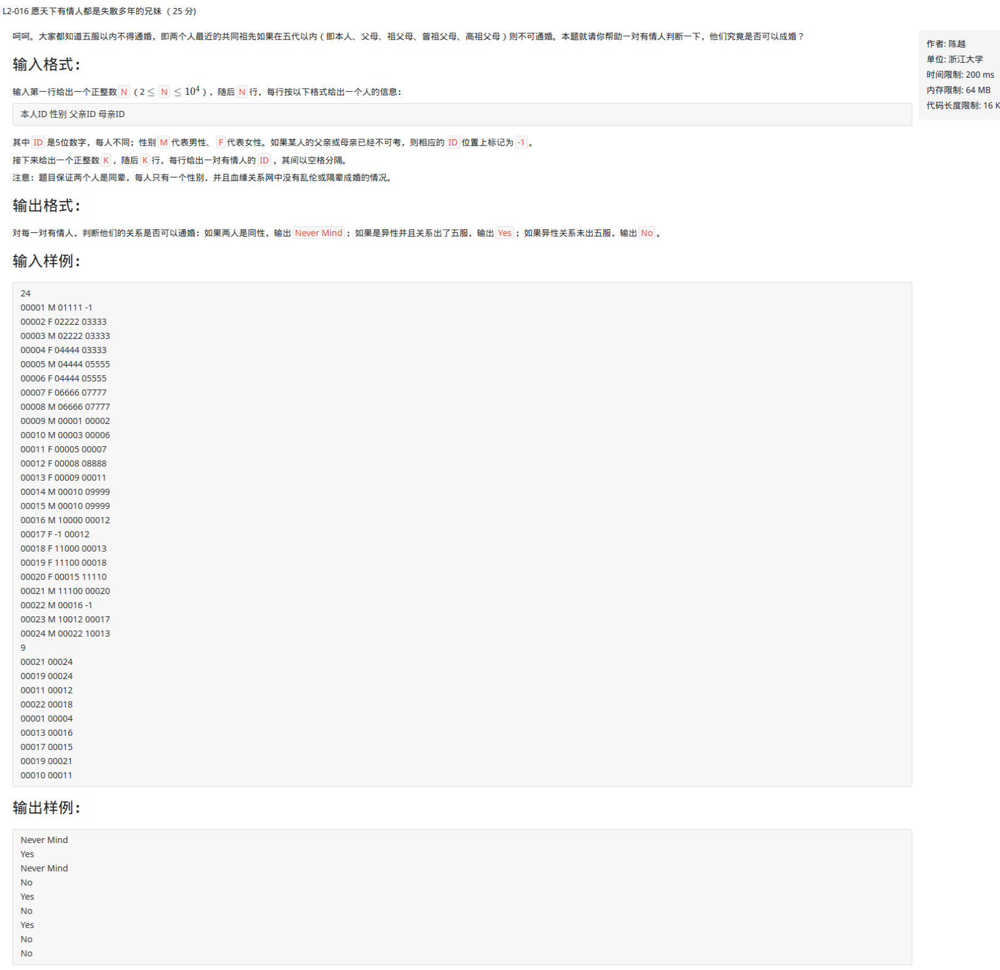
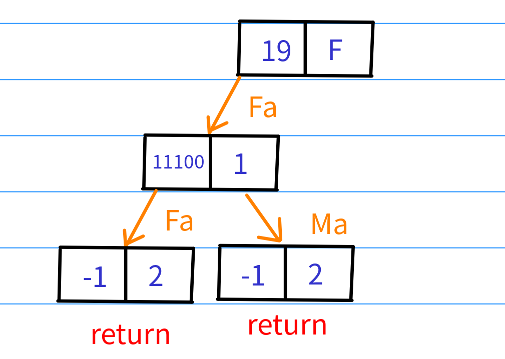
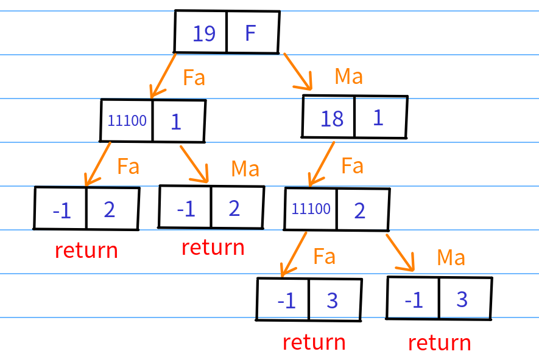
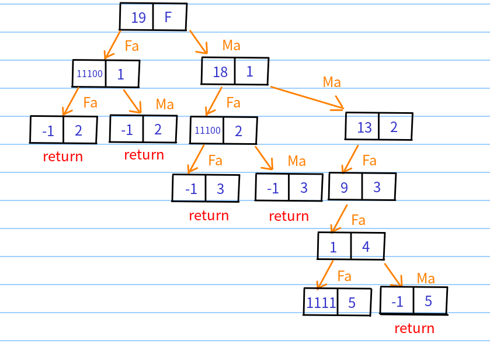

L2-016 愿天下有情人都是失散多年的兄妹

<!--more-->

# [L2-016 愿天下有情人都是失散多年的兄妹](<https://pintia.cn/problem-sets/994805046380707840/problems/994805061769609216>)



# 思路

找到并标记两人的5代以内祖先，如果发现已标记过的祖先，就说明两人有共同祖先

## 存储和查找

输入的数据包含一个人的ID、性别和父母的ID，为了方便可以就用一个结构体来存储数据，声明一个结构体数组，

其数组下标代表这个人的id，结构体属性有父母id。另外开辟一个数组空间来保存性别，一个数组空间保存标记信息。

## 坑点

**测试数据里面可能会判断某个人的父亲，或者母亲和某个人是否能结婚，所以也要标记父母的性别**

```c++
#include <cstdio>
#include <cstring>
using namespace std;

const int MAXN = 100005;
//sex[i]:编号为i的人的性别，vis[i]：编号为i的人是否已经标记，flag：判断两人是否可行
int sex[MAXN], vis[MAXN], flag;
struct node
{
    //fa:父亲id，ma：母亲id，初始化为-1
    int fa = -1, ma = -1;
}stru[MAXN];

void dfs(int n, int num)
{
    //超过五代，或者父母不可考
    if(num > 4 || n == -1) 
        return;
    //如果已经被标记过，说明有在五代内有共同亲属，则不能结婚
    if(vis[n])
    {
        flag = 1;
        return;
    }
    vis[n] = 1;
   //进行dfs查找五代内的信息
    dfs(stru[n].fa, num+1);
    dfs(stru[n].ma, num+1);
}

int main()
{
    int t;
    scanf("%d", &t);
    int id, fa, ma;
    char se;
    while(t--)
    {
        scanf("%d %c %d %d", &id, &se, &fa, &ma);
        sex[id] = (int)se;
        stru[id].fa = fa;
        stru[id].ma = ma;
        sex[fa] = (int)'M';
		sex[ma] = (int)'F';
	}
    int m, id1, id2;
    scanf("%d", &m);
    while(m--)
    {
        scanf("%d %d", &id1, &id2);
        if(sex[id1] == sex[id2])
        {
            printf("Never Mind\n");
            continue;
        }
        memset(vis, 0, sizeof(vis));
        flag = 0;
        dfs(id1, 0);
        dfs(id2, 0);
        if(flag)
            printf("No\n");
        else
            printf("Yes\n");
    }
    return 0;
}
```

## 关于DFS

**dfs会一直遍历父节点，直到遇到父节点的值为-1或者已经超过五代，这时候会回溯回去遍历母亲节点。**



**此时，return后，会回溯到19这个节点，接着访问19的母亲节点**



**接着如此循环，直到遇到结束条件**



**...**

--------

**遍历完第一个人的关系图后，我们再遍历第二个人的，如果在遍历第二个人的关系图时发现在遍历第一个人的时候已经标记过了而且没有超过五代，这时候就可以判断不能结婚，否则可以结婚**

