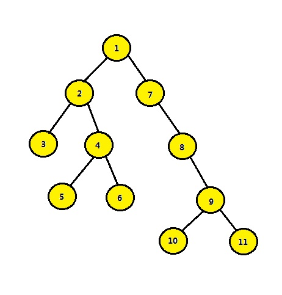

倍增，ST-RMQ，Tarjan求LCA

<!-- more -->

# LCA

所谓`LCA`，是当给定一个有根树T时，对于任意两个结点u、v，找到一个离根最远的结点x，使得x同时是u和v的祖先，x 便是u、v的最近公共祖先（原问题涵盖一般性的有根树，为了简化，多使用二叉树来讨论）。例如下面：



结点3和结点4的最近公共祖先是结点2，即LCA（3， 4）=2 。在此，需要注意到当两个结点在同一棵子树上的情况，如结点3和结点2的最近公共祖先为2，即 LCA（3，2）=2。同理：LCA（5，6）=4，LCA（6，10）=1。

---

求`LCA`的方法主要有：

1. 倍增求`LCA`
2. `ST-RMQ`求`LCA`
3. `Tarjan`求`LCA`

前面两者都是在线算法，最后一个是离线算法

> **在线**和**离线**可以简单的理解为**对于所有的操作是否需要读入完毕**。
>
> 在线的要求是可以不用先知道所有的操作（类似询问、修改），边读入边执行，类似**“走一步，做一步”**的思想。
>
> 离线则与在线相反，要求必须知道所有的操作，类似**"记录所有步，回头再做”**的思想，一般用Query[]记录所有操作
>
> 转自：[在线和离线算法 - 简书](https://www.jianshu.com/p/2f21f9d125df)

# 倍增求LCA

## 倍增算法

所谓倍增，就是按2的倍数来增大，也就是跳 `1,2,4,8,16,32 ……` 不过在这我们不是按从小到大跳，而是从大向小跳，即按`……32,16,8,4,2,1`来跳，如果大的跳不过去，再把它调小。这是因为从小开始跳，可能会出现“悔棋”的现象。拿 5为例，从小向大跳，$5≠1+2+4$,所以我们还要回溯一步，然后才能得出$5=1+4$；而从大向小跳，直接可以得出$5=4+1$。这也可以拿二进制为例，5(101)，从高位向低位填很简单，如果填了这位之后比原数大了，那我就不填，这个过程是很好操作的。

---

## 求LCA

程序开始时选取任意节点为树根，进行`dfs`，得到所有点的深度与`pre[i][j]`。`pre[i][j]` 指节点 i 的第 $2^j$个祖先


如上图中，10 的第 1 个祖先是 9，第二个祖先是 8，第三个祖先是 7，第四个祖先是 1。所以 10 的第 2 的 0 次方个祖先是 9($2^0=1$)，10 的第 2 的 1 次方个祖先是 8($2^1=2$)，10 的第 2 的 2 次方个祖先是 1($2^2=4$)。很显然，10 没有 2 的 3 次方个祖先。所以` pre[10][0]=9,pre[10][1]=8,pre[10][2]=1`

而且通过倍增的思想，**我们不难发现 i 的第 $2^j$ 个祖先就是 i 的第 $2^{j-1}$个祖先的第 $2^{j-1}$个祖先（$j>=1$）。**

比如当`i=10，j=1`的时候，`pre[10][1]=8`，`pre[10][0]=9`，`pre[9][0]=8`；或者由下面推出

$2^i = 2*2^{i-1} = 2^{i-1} + 2^{i-1}$

**所以` pre[i][j]=pre[pre[i][j-1]][j-1]`**。

有了这个规律，我们就可以在 `dfs` 中预处理所有的 pre 了！

---

有了`pre`，接着看看怎么求`LCA`

x、y分别是树上的两个点，找他们的最近的公共祖先

开头用一个判断，规定 x 的深度一定比 y 大，否则就交换一下。

- 首先让 x 往上跳，去找y的所在层
  - 如果 x 和 y 重合了，就已经是答案了
- 否则 让 x 和 y 一起向上跳，直到找到答案

---

## [洛谷-P3379最近公共祖先](https://www.luogu.org/problem/P3379)


```c++
/*
P3379 【模板】最近公共祖先（LCA）
评测状态
Accepted
评测分数
100
提交时间
2019-08-03 22:31:54
*/
#include<cstdio>
#include<algorithm>
using namespace std;

const int MAXN = 500005;
int n, m, s, len = 0;
//d数组存储的就是每个节点的深度（默认根节点深度为1）
//pre[i][j]: 指节点 i 的第 2^j个祖先
//h数组：邻接表
int d[MAXN], pre[MAXN][30], h[MAXN];
struct nod
{
    int x, y, gg;
}b[MAXN*2];//存边：双向边，所以数据要开够
void ins(int x, int y)//邻接表
{
    len++;
    b[len].x = x;
    b[len].y = y;
    b[len].gg = h[x];
    h[x] = len;
}
void dfs(int x) //x 去找所有的 y
{
    for(int i = h[x]; i > 0; i = b[i].gg)
    {
        int y = b[i].y;
        if(d[y] == 0) // y 未被访问过
        {
            d[y] = d[x] + 1;// y 是x的儿子，所以层数+1
            pre[y][0] = x; // y向上跳一格，一定是到 x
            dfs(y);
        }
    }
}
int lca(int x, int y) //查找 x 与 y 的最近公共祖先
{
    if(d[x] < d[y]) swap(x,y);// 要求 x 比较深， 去找 y
    for(int i=20; i>=0; i--) //先让 x 跳到 y 的同层
    {
        if(d[pre[x][i]] >= d[y])
        {
            x = pre[x][i];
        }
    }
    if(x == y) return x; //如果重合，就已经结束了
    for(int i=20; i>=0; i--)//不重合，x 和 y 一起往上跳
    {
        if(pre[x][i] != pre[y][i]) //只要父亲不同，就跳，父亲相同，就停了
        {                    // 最后一次，是没有跳上去的
            x = pre[x][i];
            y = pre[y][i];
        }
    }
    return pre[x][0];//要输出，必须要跳最后一次
}
int main()
{
    scanf("%d %d %d",&n, &m, &s);
    for(int i = 1; i<= n; i++)
    {
        h[i] = d[i] = 0;
    }
    int x,y;
    for(int i = 1;i < n; i++)
    {
        scanf("%d %d",&x,&y);
        ins(x,y);
        ins(y,x);//双向边
    }
    //默认根节点深度为1
    d[s] = 1;
    pre[s][0] = 0;
    //构树：分层+倍增
    dfs(s);
    for(int i=1; i<=20; i++)//倍增数组的建立，这里是整个算法的核心
    {
        for(x=1; x<=n; x++)
        {
            pre[x][i] = pre[pre[x][i-1]][i-1];
        }
    }
    for(int i=1; i<=m; i++)//询问
    {
        scanf("%d %d", &x, &y);
        printf("%d\n", lca(x, y));
    }
    return 0;
}
```

参考:

[【算法】倍增求 LCA – MiNa!](https://www.mina.moe/archives/401)

[节点的最近公共祖先 【倍增算法】 | Hang_c's Blog](https://hangcc.cn/2018/11/12/计蒜客-节点最近的公共祖先/)

[题解 P3379 liusu201601 的博客 - 洛谷博客](https://www.luogu.org/blog/cccx2016/solution-p3379)

---

