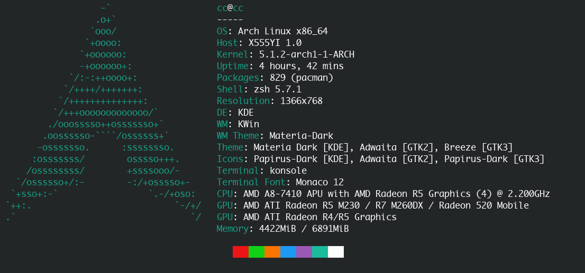
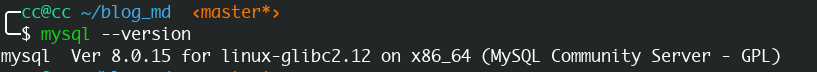

二进制安装可控，方便

<!-- more -->



参考：

[<https://linuxops.org/blog/mysql/mysql8.html>](https://linuxops.org/blog/mysql/mysql8.html)

[https://www.kancloud.cn/lengyueguang/linux/660448](https://www.kancloud.cn/lengyueguang/linux/660448)

官方文档：

[<https://dev.mysql.com/doc/refman/8.0/en/binary-installation.html>](https://dev.mysql.com/doc/refman/8.0/en/binary-installation.html)

# 下载二进制包

选择一个镜像站下载，查找起来比较方便，因为官网没有提供国内的源，所以挑了一个比较快的。

[http://mysql.inspire.net.nz/Downloads](http://mysql.inspire.net.nz/Downloads)

然后下载`mysql-xxxx-linux-glibcxx-xx.xx`就行了

比如http://mysql.inspire.net.nz/Downloads/MySQL-8.0/mysql-8.0.15-linux-glibc2.12-i686.tar.xz

# 解压

解压

```shell
tar -xvf mysql-8.0.15-linux-glibc2.12-x86_64.tar.xz 
```

移动到`~/opt`（可选）

```shell
mv  mysql-8.0.15-linux-glibc2.12-x86_64 ~/opt/mysql
```

# 配置用户和组（可选，这里用默认个人账号）

```shell
groupadd mysql  
useradd -r -g mysql -s /bin/false mysql
```

# 主配置文件

log配置：[<https://segmentfault.com/a/1190000003072237>](<https://segmentfault.com/a/1190000003072237>)

创建数据存放文件夹

```shell
mkdir -p ~/opt/mysqlData/data
mkdir -p ~/opt/mysqlData/log
chmod 750 ~/opt/mysqlData/data ~/opt/mysqlData/log
```

创建并编辑配置文件

```shell
#mkdir -p /home/cc/opt/mysql/etc
# vim /home/cc/opt/mysql/etc/my.cnf
[mysql]
# 设置mysql客户端默认字符集
default-character-set=utf8
[mysqld]
port=3306
# 设置mysql的安装目录
basedir=/home/cc/opt/mysql
# 设置mysql数据库的数据的存放目录
datadir=/home/cc/opt/mysqlData/data
character-set-server=utf8
# 创建新表时将使用的默认存储引擎
default-storage-engine=INNODB
#log
#记录启动、运行或停止mysqld时出现的问题
log-error=/home/cc/opt/mysqlData/log/error.log
#是指执行超过多久的sql会被log下来，这里是2秒
long_query_time=2
#记录所有执行时间超过long_query_time秒的所有查询或不使用索引的查询
log-slow-queries=/home/cc/opt/mysqlData/log/slowquery.log
#记录所有更改数据的语句，还用于复制
log_bin=/home/cc/opt/mysqlData/log/log_bin.log
```

MySQL配置文件条目很多，这边我们设置了常用的必须的一些配置项，如上，我们设置了`mysql`的监听端口、socket、安装目录、数据库文件存放目录等等配置。

MySQL的配置也是分段配置的，每一个段都有一个名称，例如上面的配置`[mysql]` 配置了mysql工具的默认设置，`[mysqld]`则为MySQL服务器的配置

MySQL配置项众多，对于每一个配置项官方都提供了一个默认值，如果你不确定使用它，可以不在配置文件中体现，这样MySQL会读取默认配置。

当然，如果你无法确定MySQL提供了那些配置，或者不确定配置项的名称，你可以通过`mysqld --verbose --help` 命令查看，配合`grep`你会快速找到你想要的内容。

------------

在MySQL8.0中，默认的密码认证插件更换为`caching_sha2_password`，一些老的客户端和程序并不支持这种认证插件，所以为了兼容性，我们可能需要将认证插件修改为`mysql_native_password`

在配置文件中指定`default-authentication-plugin = mysql_native_password`，以后创建的用户都将使用`mysql_native_password`来验证，但是之前的账户并不会更改验证插件。

---------------------------------

# 安装依赖

```shell
yay -S libtinfo5
sudo pacman -S numactl
```

# 初始化数据库

装好了MySQL，也写好了配置文件，这个时候你并不能直接通过`mysqld`来启动MySQL。

因为还缺少系统必须的表，所以要通过命令先初始化MySQL，

```shell
mysqld --initialize-insecure  --basedir=/home/cc/opt/mysql --datadir=/home/cc/opt/mysqlData/data
```

初始化命令中`--initialize-insecure`告诉mysql不需要帮我生成root密码，这个时候mysql的root用户是没有密码的，你需要尽快修改它。

如果没有指定这个参数，MySQL会生成一个随机的密码，并且会告诉你密码存放在哪个文件中。

# 配置启动mysqld服务

```shell
#sudo vim /usr/lib/systemd/system/mysqld.service
[Unit]
Description=MySQL Server
After=network.target
After=syslog.target

[Install]
WantedBy=multi-user.target

[Service]
User=cc
Group=cc
Type=notify
TimeoutSec=0
PermissionsStartOnly=true
ExecStart=/home/cc/mysql/bin/mysqld --basedir=/home/cc/opt/mysql --datadir=/home/cc/opt/mysqlData/data
LimitNOFILE = 10000
Restart=always
RestartPreventExitStatus=1
Environment=MYSQLD_PARENT_PID=1
PrivateTmp=false
```

接着

```shell
sudo systemctl enable mysqld.service
sudo systemctl start mysqld.service
```

# 修改密码

```shell
ALTER USER 'root'@'localhost' IDENTIFIED WITH mysql_native_password BY '新密码'
```

