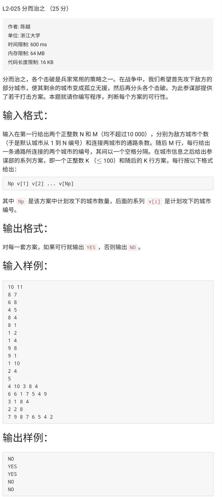

L2-025-分而治之
<!-- more -->

# 题目

链接：[L2-025](https://pintia.cn/problem-sets/994805046380707840/problems/994805056195379200)



# 解析

**图问题！！**

刚开始是想存储在vector里面，然后如果摧毁i的话，就把对应的`vector<i>`清空，还有查询别的vector，如果有i的话，则去掉，然后提交了一发，过了两个test，TLE了两个（很明显暴力超时，而且暴力不对）

附上TLE代码

```c++
/*
2019/3/6 20:42:45	
*/

#include <iostream>
#include <vector>
#include <cstring>
#include <algorithm>
using namespace std;

int vis[11000];
int main()
{
    ios::sync_with_stdio(false);

    int n, m, e1, e2;
    cin >> n >> m;
    vector< vector<int> >v(n+10);
    v.reserve(m+10);
    for(int i = 0; i < m; i++)
    {
        cin >> e1 >> e2;
        v[e1].push_back(e2);
        v[e2].push_back(e1);
    }
    int num, in1, in2;
    cin >> num;
    for(int i = 0; i < num; i++)
    {
        vector< vector<int> > vec(v);
        memset(vis, 0, sizeof(vis));
        cin >> in1;
        while(in1--)
        {
            cin >> in2;
            vis[in2] = 1;
            vec[in2].clear();
            for(int j = 0; j < n; j++)
            {
                vector<int>::iterator findInput = find(vec[j].begin(), vec[j].end(), in2);
                if(findInput != vec[j].end())
                    vec[j].erase(findInput);
            }
        }
        int j;
        for(j = 0; j < n; j++)
        {
            if(!vis[j])
            {
                bool flag = false;
                for(int k = 0; k < n; k++)
                {
                    if(find(vec[j].begin(), vec[j].end(), j) != vec[j].end())
                    {
                        flag = true;
                        break;
                    }
                }
                if(!vec[j].empty())
                    flag = true;
                if(flag)
               {
                   cout << "NO" << endl;
                   break;
               }
            }
        }
        if(j == n)
            cout << "YES" << endl;
    }
    return 0;
}
```

**上面代码问题在于查找和删除这个过程，其实完全没有必要这种做**

因为是摧毁，所以一条路摧毁一个城市就可以把这条路给毁了，**所以我们只需要判断所有的孤立的城市是否哦满足条件即可，孤立的城市 = 没被摧毁且没有连接到别的城市**

```c++
/*
2019/3/6 21:07:37	
*/

#include <iostream>
#include <vector>
#include <cstring>
#include <algorithm>
using namespace std;

int vis[11000];  //vis[i]:代表第i座城市是否被摧毁
vector<int> v[11000];

bool fun(int n) //查询所有孤立的点是否满足条件
{
    for(int i = 1; i <= n; i++)
        for(int j = 0; j < v[i].size(); j++)
        {
            //孤立的城市 = 没被摧毁且没有连接到别的城市
            //v[i][j]代表一个城市，v[i][j]代表i连通的某个城市的值
            if(!vis[i] && vis[v[i][j]] == 0)
                return false;
        }
    return true;
}

int main()
{
    ios::sync_with_stdio(false);
    cin.tie(0);
    cout.tie(0);

    int n, m, e1, e2;
    cin >> n >> m;
    for(int i = 0; i < m; i++)
    {
        cin >> e1 >> e2;
        v[e1].push_back(e2);
        v[e2].push_back(e1);
    }
    int num, in1, in2;
    cin >> num;
    for(int i = 0; i < num; i++)
    {
        memset(vis, 0, sizeof(vis));
        cin >> in1;
        while(in1--)
        {
            cin >> in2;
            vis[in2] = 1;
        }
        if(fun(n))
            cout << "YES" << endl;
        else
            cout << "NO" << endl;
    }
    return 0;
}

```

