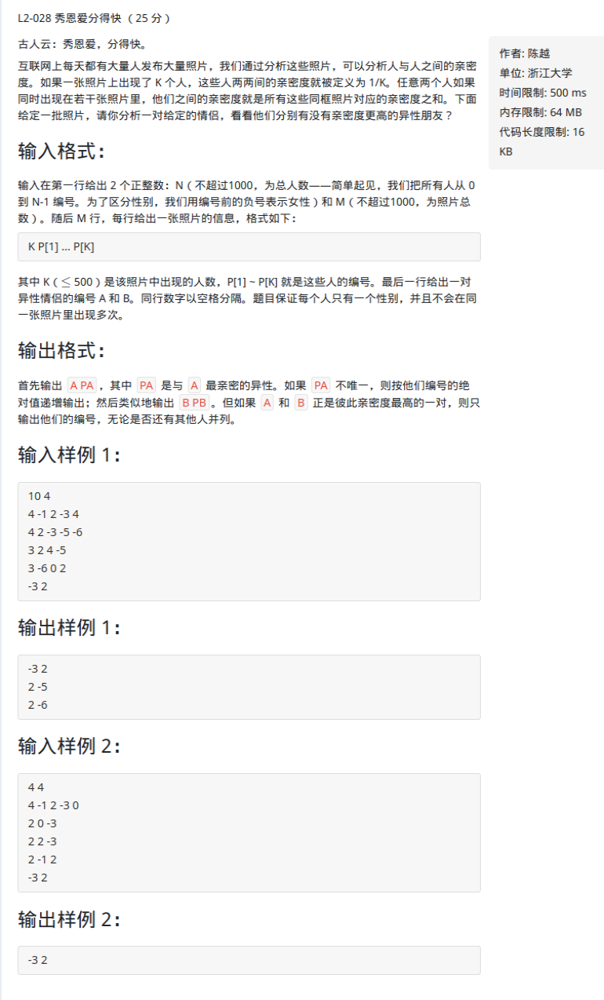

L2-028 秀恩爱分得快 

<!-- more -->

# 题目

链接：[L2-028](https://pintia.cn/problem-sets/994805046380707840/problems/994805054698012672)



# 解析

分别求出a，b与编号为i(i>0)的人的亲密度va[i]，vb[i]，还有va，vb的最大值MAXA，MAXB然后进行判断

- 如果MAXA对应的人是b而且MAXB对应的人是a，那么输出a，b即可
- 否则，分别按要求输出MAXA对应的人的编号，MAXB对应的人的编号

对于va，vb我们可以用个double数组存储，因为编号有正有负，所以得进行绝对值处理，所以得有另外一个数组g进行标记性别，**同时需要注意到0这个点，因为会有+0，-0出现，所以得以字符串的形式输入**

存储输入的数据，因为每行的个数都不一样，所以可以开辟一个较大的二维数组，或者用vector，这里选用vector

参考：[https://blog.csdn.net/qq1013459920/article/details/86772096](https://blog.csdn.net/qq1013459920/article/details/86772096)

----------

```c++
#include <bits/stdc++.h>
using namespace std;

//va[i]:a编号为i(i>0)的人的亲密度,vb[i]同理
double va[1100] = {0.0}, vb[1100] = {0.0};
//g[i]==true:编号为i的为女性
bool g[1100] = {false};
//以字符串的形式读入，将读入的字符串变为整型，同时取绝对值，并且标记性别
int read()
{
	int input = 0, sign = 0;
	char a = getchar();
	while ((a<'0' || a>'9') && a != '-')
		a = getchar();
	if (a == '-')
    {
		sign = 1;
		a = getchar();
	}
	while (a >= '0' && a <= '9')
    {
		input = input * 10 + a - '0';
		a = getchar();
	}
	g[input] = sign;
	return input;
}

int main()
{
    int n, m, input1;
    char input2[10];
    scanf("%d%d", &n, &m);
    vector< vector<int> >photos(n); //存储输入的数据
    for(int i = 0; i < m; i++)
    {
        scanf("%d", &input1);
        photos[i].resize(input1);
        for(int j = 0; j < input1; j++)
        {
            //如果读进去字符串再转化的话，可能会超时
            photos[i][j] =  read();
        }
    }
    
    int a = read();
    int b = read();
    double MAXA = 0.0, MAXB = 0.0;
    for(int i = 0; i < m; i++)
    {
        //是否在一行数据中找得到a
        bool findA = find(photos[i].begin(), photos[i].end(), a) != photos[i].end();
        bool findB = find(photos[i].begin(), photos[i].end(), b) != photos[i].end();
        if(findA || findB)
        {
            for(int j = 0; j < photos[i].size(); j++)
            {
                if(findA && g[a] != g[photos[i][j]])
                {
                    va[photos[i][j]] += (double)1.0/photos[i].size();
                    if(va[photos[i][j]] > MAXA)
                        MAXA = va[photos[i][j]];
                }
                else if(findB && g[b] != g[photos[i][j]])
                {
                    vb[photos[i][j]] += (double)1.0/photos[i].size();
                    if(vb[photos[i][j]] > MAXB)
                        MAXB = vb[photos[i][j]];
                }
            }
        }
    }

    if(MAXA == va[b] && MAXB == vb[a])
        printf("%s%d %s%d\n", g[a] ? "-" : "", a, g[b] ? "-" : "", b);
    else
    {
        for(int i = 0; i < n; i++)
        {
            if(va[i] == MAXA)
                printf("%s%d %s%d\n", g[a] ? "-" : "", a, g[i] ? "-" : "", i);
        }
        for(int i = 0; i < n; i++)
        {
            if(vb[i] == MAXB)
                printf("%s%d %s%d\n", g[b] ? "-" : "", b, g[i] ? "-" : "", i);
        }
    }
    return 0;
}

```

