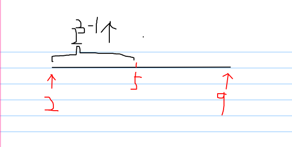
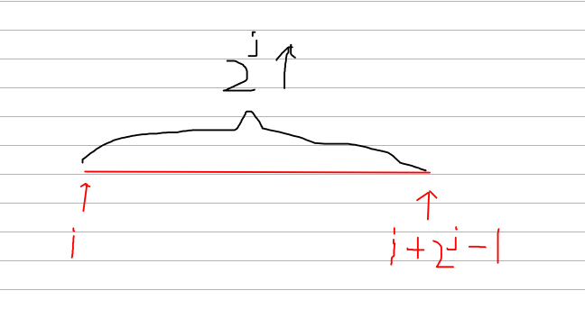
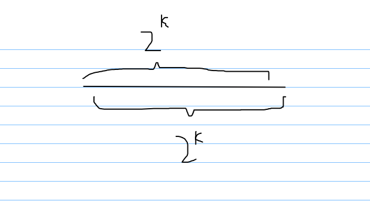

区间最值查询

<!-- more -->

参考：[https://blog.csdn.net/qq_41311604/article/details/79900893](https://blog.csdn.net/qq_41311604/article/details/79900893)

# RMQ

**RMQ**`（Range Minimum/Maximum Query）`，**即区间最值查询**，这是一种在线算法，所谓在线算法，是指用户每次输入一个查询，便马上处理一个查询。RMQ算法一般用较长时间做预处理，时间复杂度为O(nlogn)，然后可以在O(1)的时间内处理每次查询。

---

## 求dp

现假设有一数组arr={1,3,6,7,4,2,5}；

设`dp[i][j]`表示从第i位开始连续2^j个数中的最小值。

例如`dp[2][1]`表示从第二位开始连续两个数的最小值（也就是从第二位数到第三位数的最小值），即3，6中的最小值，所以`dp[2][1] = 3`;

那么怎么求`dp[2][1]`呢？

1. 当i=2，j=3时，求dp`[2][3]`

   

   因为2^3=8，代表从2开始有8个数，所以范围为[2,9]
   然后我们可以将其按照类似二分的思想将其拆分为两部分
   所以中间mid=(2+9)/2=5

   - 左区间[2,5]：有4个数，其对应`dp[2][2]`
   - 右区间[6,9]：有4个数，其对应`dp[6][2]`

2. 推广到普遍情况

   

   对照上面例子，因为平分，所以每个区间都可以分到一半的数(因为j是2的次方)，所以j肯定是j-1，`2^(j-1)`代表除以`2^j/2`，接着i就是很常见的位置关系了
   左区间：`dp[i][j-1]`
   右区间：`dp[i+(2^j)/2][j-1]`

所以

```c++
dp[i][j] = min(dp [i][j - 1], dp [i + (1 << j - 1)][j - 1])
```

```c++
/*
先更新每两个元素中的最小值，然后通过每两个元素的最小值获得每4个元素中的最小值，依次类推更新所有长度的最小值
*/
void rmq_init()
{
    for(int i = 1; i <=N; i++)
        dp[i][0] = arr[i];//初始化
    for(int j = 1; (1<<j) <= N; j++) //2^j不超过N
        for(int i = 1; i+(1<<j)-1 <= N; i++)
            dp[i][j]=min(dp[i][j-1], dp[i+(1<<j-1)][j-1]);
}
```

## 查询dp

得到了dp数组，那么怎么得到区间[l,r]最小值呢？我们只需要对每个二分区间进行取min就行了，首先我们得到这个区间是2的几次方

```c++
k = log2(r - l + 1);
```



然后2^k取到前面那些数的最小值，还没有覆盖整个区间，所以我们可以从后面再取最小值，最后再两者取最小就行了。

所以

```c++
RMQ[l,r] = min(dp[l][k], dp[r - (1 << k) + 1][k]);
```

```c++
int rmq(int l,int r)
{
    int k=log2(r-l+1);
    return min(dp[l][k],dp[r-(1<<k)+1][k]);
}
```

