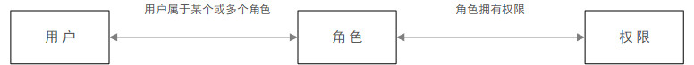
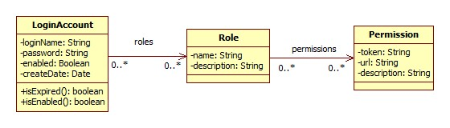
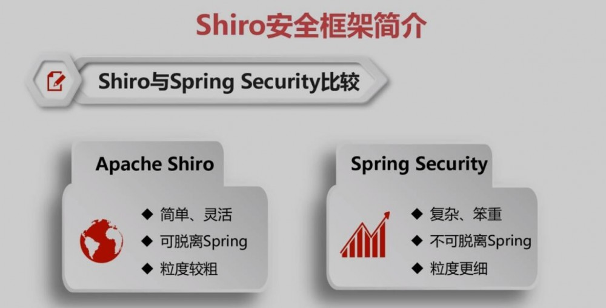
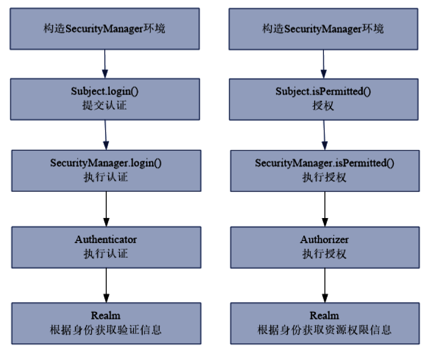

shiro介绍

<!-- more -->

# RBAC

在了解`Shiro`之前，我们需要认知用户权限模型。

基于角色的权限访问控制（`Role-Based Access Control`）作为传统访问控制（自主访问，强制访问）的有前景的代替受到广泛的关注。在`RBAC`中，**权限与角色相关联**，用户通过成为适当角色的成员而得到这些角色的权限。这就极大地简化了权限的管理。

为实现一个较为灵活的用户权限数据模型，通常把**用户信息单独用一个实体表示，用户权限信息用两个实体表示**。

1. 用户信息用`LoginAccount`表示，最简单的用户信息可能只包含用户名`loginName`及密码`password`两个属性。实际应用中可能会包含用户是否被禁用，用户信息是否过期等信息。
2. 用户权限信息用`Role`与`Permission`表示，`Role`与`Permission`之间构成多对多关系。`Permission`可以理解为对一个资源的操作，`Role`可以简单理解为`Permission`的集合。
3. 用户信息与`Role`之间构成多对多关系。表示同一个用户可以拥有多个`Role`，一个`Role`可以被多个用户所拥有。



(图源：[RBAC模型：基于用户-角色-权限控制的一些思考 | 人人都是产品经理](http://www.woshipm.com/pd/1150093.html))



(图源：[在 Web 项目中应用 Apache Shiro](https://www.ibm.com/developerworks/cn/java/j-lo-shiro/))

# Shiro

## Java常见安全管理框架

一般项目都会有严格的认证和授权操作，在 Java 开发领域常见安全框架有`Shiro`和`Spring Security `

- `Shiro`是个轻级的安全管理框架，提供了认证、授权、会话管理、密码管理、缓存管理等功能

- `Spring Security `是个相对复杂的安全管理框架，功能比`Shiro`更加强大，权限控制细粒度更高，对 `OAuth`支持 更友好，又因为`Spring Security`源自`Spring`家族，因此可以和`Spring`框架无缝整合，特别是`Spring Boot`中提供的自动化配 方案，可以让`Spring Security`的使用更加便捷



(图源：[学习springBoot（11）shiro安全框架 | Harries Blog™](http://www.liuhaihua.cn/archives/546461.html))

## 作用

- 验证用户身份
- 用户访问权限控制，比如：1、判断用户是否分配了一定的安全角色。2、判断用户是否被授予完成某个操作的权限
- 在非 `Web` 或 `EJB `容器的环境下可以任意使用 `Session API`
- 可以响应认证、访问控制，或者 `Session` 生命周期中发生的事件
- 可将一个或以上用户安全数据源数据组合成一个复合的用户 `view`(视图)
- 支持单点登录(`SSO`)功能
- 支持提供`Remember Me`服务，获取用户关联信息而无需登录
  …

下图是Shiro的功能模块：


(图源：[Apache Shiro | Simple. Java. Security.](https://shiro.apache.org/introduction.html))

- `Authentication`：**认证**，有时也简称为“登录”，这是一个证明用户是他们所说的他们是谁的行为

- `Authorization`：**授权**，访问控制的过程，例如“用户是否允许编辑帐户”，“该用户是否允许查看此网页”，“该用户是否可以访问”到这个按钮？“这些都是决定用户有权访问的决定，因此都代表授权检查
- `Cryptography`：密码术是通过隐藏信息或将其转换为无意义的信息来保护源信息免受不良访问的做法，因此没有其他人可以阅读它。`Shiro`专注于密码学的两个核心要素：使用公钥或私钥加密数据的密码，以及对密码等数据进行不可逆转加密的哈希（也称为消息摘要）
- `Session Management`：`Session`会话，会话是您的用户在使用您的应用程序时携带一段时间的数据桶。传统上，会话专用于`Web`或`EJB`环境。Shiro支持任何应用程序环境的会话（即使在非`Web`或`EJB`应用程序中，也可以管理特定于用户的会话）。此外，Shiro还提供许多其他强大功能来帮助您管理会话
- `Web Support`：`Shiro`的`web`支持的`API`能够轻松地帮助保护 `Web` 应用程序。主要就是用来对`Web`程序进行一个好的支持的
- `Caching`：确保安全操作快速而又高效
- `Concurrency`：利用它的并发特性来支持多线程应用程序
- `Testing`：测试支持的存在来帮助你编写单元测试和集成测试，并确保你的能够如预期的一样安全
- `"Run As"`：其实这个就是有是有允许一个用户假设为另外一个用户身份的功能，有时候在管理脚本的时候很有效果
- `Remember Me`：在会话中记住用户的身份

## 核心

三大核心组件，`Subject`、`SecurityManager`和`Realms`。

- `Subject`：即“当前操作用户”。但是，在`Shiro`中，`Subject`这一概念并不仅仅指人，也可以是第三方进程、后台帐户(`Daemon Account`)或其他类似事物。它仅仅意味着“当前跟软件交互的东西”。但考虑到大多数目的和用途，你可以把它认为是`Shiro`的“用户”概念。Subject代表了当前用户的安全操作，`SecurityManager`则管理所有用户的安全操作。

- `SecurityManager`：它是`Shiro`框架的核心，典型的`Facade`模式，`Shiro`通过`SecurityManager`来管理内部组件实例，并通过它来提供安全管理的各种服务。
  
  > 外观模式(`Facade Pattern`)：外部与一个子系统的通信必须通过一个统一的外观对象进行，为子系统中的一组接口提供一个一致的界面，外观模式定义了一个高层接口，这个接口使得这一子系统更加容易使用。 外观模式又称为门面模式，它是一种对象结构型模式。
  
- `Realm`： `Realm`充当了`Shiro`与应用安全数据间的“桥梁”或者“连接器”。也就是说，当对用户执行认证（登录）和授权（访问控制）验证时，`Shiro`会从应用配置的`Realm`中查找用户及其权限信息。从这个意义上讲，`Realm`实质上是一个安全相关的`DAO`：**它封装了数据源的连接细节，并在需要时将相关数据提供给`Shiro`**。当配置`Shiro`时，你必须至少指定一个`Realm`，用于认证和或授权。*配置多个`Realm`是可以的，但是至少需要一个*。 

## 认证与授权处理过程

1. 被`Shir`保护的资源，才会经过认证与授权过程
2. 用户访问受`Shiro`保护的`URL`
3. `Shiro` **首先检查用户是否已经通过认证，如果未通过认证检查，则跳转到登录页面，否则进行授权检查**。**认证过程需要通过 `Realm` 来获取用户及密码信息，通常情况我们实现 `JDBC Realm`，此时用户认证所需要的信息从数据库获取**。如果使用了缓存，除第一次外用户信息从缓存获取。
4. **认证通过后接受`Shiro`授权检查，授权检查同样需要通过`Realm`获取用户权限信息**。`Shiro` 需要的用户权限信息包括`Role`或`Permission`，可以是其中任何一种或同时两者，具体取决于受保护资源的配置。如果用户权限信息未包含`Shiro`需要的`Role`或`Permission`，授权不通过。**只有授权通过，才可以访问受保护`URL`对应的资源，否则跳转到“未经授权页面”。**



(图源：[Shiro简介 · 疯狂的小鸡](https://whetherlove.github.io/2018/11/30/Shiro%E7%AE%80%E4%BB%8B/))

# 与SpringBoot集成(没有jwt)

## 依赖

### shiro-spring-boot-web-starter

```xml
<dependency>
    <groupId>org.apache.shiro</groupId>
    <artifactId>shiro-spring-boot-web-starter</artifactId>
    <version>1.4.1</version>
</dependency>
```

### spring-boot-starter-web

```xml
<dependency>
    <groupId>org.springframework.boot</groupId>
    <artifactId>spring-boot-starter-web</artifactId>
    <version>2.1.7.RELEASE</version>
</dependency>
```

### 其他

其他自己需要的依赖可以自行补全

## RBAC思想建表

这里使用`Spring data jpa`来处理持久层

按照`RBAC`思想，最简单的得有用户信息，角色信息，权限信息

### 用户信息

```java
@Entity
public class UserInfo implements Serializable {
    @Id
    @GeneratedValue
    private Integer uid;
    @Column(unique =true)
    
    //帐号
    private String username;
    
    //名称（昵称或者真实姓名，不同系统不同定义）
    private String name;
    
    //密码;
    private String password;
    
    //加密密码的盐
    private String salt;
    
    //用户状态,0:创建未认证（比如没有激活，没有输入验证码等等）--等待验证的用户 , 1:正常状态,2：用户被锁定.
    private byte state;
    
    /**
     * 多对多配置
     */
    //立即从数据库中进行加载数据;
    @ManyToMany(fetch = FetchType.EAGER)
    @JoinTable(name = "SysUserRole", joinColumns = { @JoinColumn(name = "uid") }, inverseJoinColumns ={@JoinColumn(name = "roleId") })
    // 一个用户具有多个角色
    private List<SysRole> roleList;

    // 省略 get set 方法
 }
```

### 角色信息

```java
@Entity
public class SysRole {
    @Id
    @GeneratedValue
    
    // 编号
    private Integer id; 
    
    // 角色标识程序中判断使用,如"admin",这个是唯一的:
    private String role; 
    
    // 角色描述,UI界面显示使用
    private String description;   
    
    // 是否可用,如果不可用将不会添加给用户
    private Boolean available = Boolean.FALSE;
    
    //角色 -- 权限关系：多对多关系;
    @ManyToMany(fetch= FetchType.EAGER)
    @JoinTable(name="SysRolePermission",joinColumns={@JoinColumn(name="roleId")},inverseJoinColumns={@JoinColumn(name="permissionId")})
    private List<SysPermission> permissions;

    // 用户 - 角色关系定义;
    @ManyToMany
    @JoinTable(name="SysUserRole",joinColumns={@JoinColumn(name="roleId")},inverseJoinColumns={@JoinColumn(name="uid")})
    
    // 一个角色对应多个用户
    private List<UserInfo> userInfos;

    // 省略 get set 方法
 }
```

### 权限信息

```java
@Entity
public class SysPermission implements Serializable {
    
    @Id
    @GeneratedValue
    
    //主键
    private Integer id;
    
    //名称
    private String name;
    @Column(columnDefinition="enum('menu','button')")
    
    //资源类型，[menu|button]
    private String resourceType;
    
    //资源路径
    private String url;
    
    //权限字符串,menu例子：role:*，button例子：role:create,role:update,role:delete,role:view
    private String permission; 
    
    //父编号
    private Long parentId; 
    
    //父编号列表
    private String parentIds; 
    private Boolean available = Boolean.FALSE;
    @ManyToMany
    @JoinTable(name="SysRolePermission",joinColumns={@JoinColumn(name="permissionId")},inverseJoinColumns={@JoinColumn(name="roleId")})
    private List<SysRole> roles;

    // 省略 get set 方法
 }
```

根据以上的代码会自动生成 `user_info`（用户信息表）、`sys_role`（角色表）、`sys_permission`（权限表）、`sys_user_role`（用户角色表）、`sys_role_permission`（角色权限表）这五张表

测试数据如下：

```java
INSERT INTO `user_info` (`uid`,`username`,`name`,`password`,`salt`,`state`) VALUES ('1', 'admin', '管理员', 'd3c59d25033dbf980d29554025c23a75', '8d78869f470951332959580424d4bf4f', 0);
INSERT INTO `sys_permission` (`id`,`available`,`name`,`parent_id`,`parent_ids`,`permission`,`resource_type`,`url`) VALUES (1,0,'用户管理',0,'0/','userInfo:view','menu','userInfo/userList');
INSERT INTO `sys_permission` (`id`,`available`,`name`,`parent_id`,`parent_ids`,`permission`,`resource_type`,`url`) VALUES (2,0,'用户添加',1,'0/1','userInfo:add','button','userInfo/userAdd');
INSERT INTO `sys_permission` (`id`,`available`,`name`,`parent_id`,`parent_ids`,`permission`,`resource_type`,`url`) VALUES (3,0,'用户删除',1,'0/1','userInfo:del','button','userInfo/userDel');
INSERT INTO `sys_role` (`id`,`available`,`description`,`role`) VALUES (1,0,'管理员','admin');
INSERT INTO `sys_role` (`id`,`available`,`description`,`role`) VALUES (2,0,'VIP会员','vip');
INSERT INTO `sys_role` (`id`,`available`,`description`,`role`) VALUES (3,1,'test','test');
INSERT INTO `sys_role_permission` VALUES ('1', '1');
INSERT INTO `sys_role_permission` (`permission_id`,`role_id`) VALUES (1,1);
INSERT INTO `sys_role_permission` (`permission_id`,`role_id`) VALUES (2,1);
INSERT INTO `sys_role_permission` (`permission_id`,`role_id`) VALUES (3,2);
INSERT INTO `sys_user_role` (`role_id`,`uid`) VALUES (1,1);
```

## shiro配置

###  ShiroConfig

首先要配置的是 `ShiroConfig` 类，`Apache Shiro` 核心通过 `Filter `来实现，就好像 `SpringMvc` 通过 `DispachServlet` 来主控制一样。
**既然是使用 `Filter` 一般也就能猜到，是通过 `URL` 规则来进行过滤和权限校验，所以我们需要定义一系列关于 `URL` 的规则和访问权限。**

```java
@Configuration
public class ShiroConfig {
    
    @Primary
    @Bean
    public ShiroFilterFactoryBean shirFilter(SecurityManager securityManager) {
        ShiroFilterFactoryBean shiroFilterFactoryBean = new ShiroFilterFactoryBean();
        shiroFilterFactoryBean.setSecurityManager(securityManager);
        
        //拦截器.
        Map<String,String> filterChainDefinitionMap = new LinkedHashMap<String,String>();
        // 配置不会被拦截的链接 顺序判断
        filterChainDefinitionMap.put("/static/**", "anon");
        
        //配置退出 过滤器,其中的具体的退出代码Shiro已经替我们实现了
        filterChainDefinitionMap.put("/logout", "logout");
        
        //<!-- 过滤链定义，从上向下顺序执行，一般将/**放在最为下边 -->:这是一个坑呢，一不小心代码就不好使了;
        //<!-- authc:所有url都必须认证通过才可以访问; anon:所有url都都可以匿名访问-->
        filterChainDefinitionMap.put("/**", "authc");
        
        // 如果不设置默认会自动寻找Web工程根目录下的"/login.jsp"页面
        shiroFilterFactoryBean.setLoginUrl("/login");
        // 登录成功后要跳转的链接
        shiroFilterFactoryBean.setSuccessUrl("/index");

        //未授权界面;
        shiroFilterFactoryBean.setUnauthorizedUrl("/403");
        shiroFilterFactoryBean.setFilterChainDefinitionMap(filterChainDefinitionMap);
        return shiroFilterFactoryBean;
    }

    //自定义MyShiroRealm类
    @Primary
    @Bean
    public MyShiroRealm myShiroRealm(){
        MyShiroRealm myShiroRealm = new MyShiroRealm();
        return myShiroRealm;
    }


    @Primary
    @Bean
    public DefaultWebSecurityManager securityManager(){
        DefaultWebSecurityManager securityManager =  new DefaultWebSecurityManager();
        securityManager.setRealm(myShiroRealm());
        return securityManager;
    }
}
```

`Filter Chain` 定义说明：

- 一个`URL`可以配置多个 `Filter`，使用逗号分隔
- 当设置多个过滤器时，全部验证通过，才视为通过
- 部分过滤器可指定参数，如 `perms`，`roles`

### 登录认证实现

在认证、授权内部实现机制中都有提到，最终处理都将交给`Real`进行处理。因为在 `Shiro` 中，**最终是通过 `Realm `来获取应用程序中的用户、角色及权限信息的**。通常情况下，在 `Realm` 中会直接从我们的数据源中获取 `Shiro` 需要的验证信息。可以说，`Realm` 是专用于安全框架的 `DAO`.
`Shiro` 的认证过程最终会交由 `Realm` 执行，这时会调用 `Realm` 的`getAuthenticationInfo(token)`方法。

该方法主要执行以下操作:

1. 检查提交的进行认证的令牌信息

2. 根据令牌信息从数据源(通常为数据库)中获取用户信息

3. 对用户信息进行匹配验证。

4. 验证通过将返回一个封装了用户信息的`AuthenticationInfo`实例。

5. 验证失败则抛出`AuthenticationException`异常信息。

**而在我们的应用程序中要做的就是自定义一个 `Realm` 类，继承`AuthorizingRealm` 抽象类，重写`doGetAuthenticationInfo()`**

```java
@Override
protected AuthenticationInfo doGetAuthenticationInfo(AuthenticationToken token)
        throws AuthenticationException {
    
    //获取用户的输入的账号.
    String username = (String)token.getPrincipal();

    //通过username从数据库中查找 User对象，如果找到，没找到.
    //实际项目中，这里可以根据实际情况做缓存，如果不做，Shiro自己也是有时间间隔机制，2分钟内不会重复执行该方法
    UserInfo userInfo = userInfoService.findByUsername(username);
    if(userInfo == null){
        return null;
    }
    SimpleAuthenticationInfo authenticationInfo = new SimpleAuthenticationInfo(
            userInfo, //用户名
            userInfo.getPassword(), //密码
            ByteSource.Util.bytes(userInfo.getCredentialsSalt()),//salt=username+salt
            getName()  //realm name
    );
    return authenticationInfo;
}
```

### 链接权限的实现

`Shiro `的权限授权是通过继承`AuthorizingRealm`抽象类，重载`doGetAuthorizationInfo()`；**当访问到页面的时候，链接配置了相应的权限或者 `Shiro` 标签才会执行此方法否则不会执行，所以如果只是简单的身份认证没有权限的控制的话，那么这个方法可以不进行实现，直接返回 `null` 即可**。在这个方法中主要是使用类`SimpleAuthorizationInfo`进行角色的添加和权限的添加。

```java
@Override
protected AuthorizationInfo doGetAuthorizationInfo(PrincipalCollection principals) {

    SimpleAuthorizationInfo authorizationInfo = new SimpleAuthorizationInfo();
    UserInfo userInfo  = (UserInfo)principals.getPrimaryPrincipal();
    for(SysRole role:userInfo.getRoleList()){
        authorizationInfo.addRole(role.getRole());
        for(SysPermission p:role.getPermissions()){
            authorizationInfo.addStringPermission(p.getPermission());
        }
    }
    return authorizationInfo;
}
```

当然也可以添加 `set` 集合：`roles` 是从数据库查询的当前用户的角色，`stringPermissions` 是从数据库查询的当前用户对应的权限

```java
authorizationInfo.setRoles(roles);
authorizationInfo.setStringPermissions(stringPermissions);
```

如果在`shiro`配置文件中添加了`filterChainDefinitionMap.put(“/add”, “perms[权限添加]”);`就说明访问`/add`这个链接必须要有“权限添加”这个权限才可以访问；

如果在`shiro`配置文件中添加了`filterChainDefinitionMap.put(“/add”, “roles[100002]，perms[权限添加]”);`就说明访问`/add`这个链接必须要有“权限添加”这个权限和具有“`100002`”这个角色才可以访问

### 登录实现

登录过程其实只是处理异常的相关信息，具体的登录验证交给 Shiro 来处理

```java
@PostMapping("/login")
public String login(HttpServletRequest request, Map<String, Object> map) throws Exception{

    // 登录失败从request中获取shiro处理的异常信息。
    // shiroLoginFailure:就是shiro异常类的全类名.
    String exception = (String) request.getAttribute("shiroLoginFailure");
    System.out.println("exception=" + exception);
    String msg = "";
    if (exception != null) {
        if (UnknownAccountException.class.getName().equals(exception)) {
            System.out.println("UnknownAccountException -- > 账号不存在：");
            msg = "UnknownAccountException -- > 账号不存在：";
        } else if (IncorrectCredentialsException.class.getName().equals(exception)) {
            System.out.println("IncorrectCredentialsException -- > 密码不正确：");
            msg = "IncorrectCredentialsException -- > 密码不正确：";
        } else if ("kaptchaValidateFailed".equals(exception)) {
            System.out.println("kaptchaValidateFailed -- > 验证码错误");
            msg = "kaptchaValidateFailed -- > 验证码错误";
        } else {
            msg = "else >> "+exception;
            System.out.println("else -- >" + exception);
        }
    }
    map.put("msg", msg);
    // 此方法不处理登录成功,由shiro进行处理
    return "/login";
}
```

---

参考:

[Shiro框架详解 | Just Do Java](http://www.justdojava.com/2019/04/12/java-Shiro/)

[学习springBoot（11）shiro安全框架 | Harries Blog™](http://www.liuhaihua.cn/archives/546461.html)

[在 Web 项目中应用 Apache Shiro](https://www.ibm.com/developerworks/cn/java/j-lo-shiro/)

[RBAC_百度百科](https://baike.baidu.com/item/RBAC/1328788)

[Spring Boot (十四)： Spring Boot 整合 Shiro-登录认证和权限管理 - 纯洁的微笑 - 博客园](https://www.cnblogs.com/ityouknow/p/7089177.html)

---

