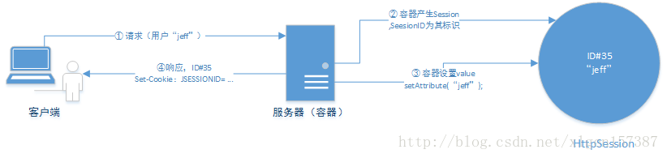
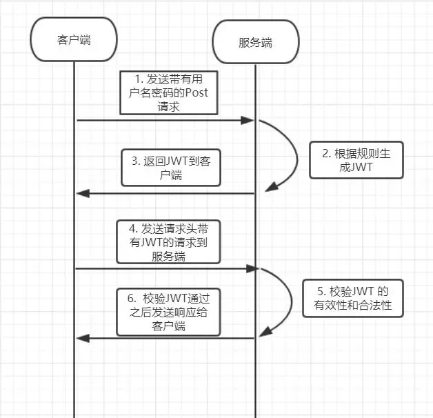

jwt介绍

<!-- more -->

转载自：[一步步带你了解前后端分离利器之JWT - 徐刘根的博客 - CSDN博客](https://blog.csdn.net/xlgen157387/article/details/79191900)

# RESTful API认证方式

一般来讲，对于`RESTful API`都会有认证(`Authentication`)和授权(`Authorization`)过程，保证`API`的安全性。

*`Authentication`指的是确定这个用户的身份，`Authorization`是确定该用户拥有什么操作权限。*

## Basic Authentication

这种方式是直接将用户名和密码放到`Header`中，使用`Authorization: Basic Zm9vOmJhcg==`，使用最简单但是最不安全。

## TOKEN认证

这种方式也是再HTTP头中，使用`Authorization: Bearer <token>`，使用最广泛的`TOKEN`是`JWT`，通过签名过的`TOKEN`。

## OAuth2.0

这种方式安全等级最高，但是也是最复杂的。如果不是大型API平台或者需要给第三方APP使用的，没必要整这么复杂。

一般项目中的`RESTful API`使用`JWT`来做认证就足够了

下面是`JWT`介绍

# HTTP的无状态性

`HTTP` 是无状态协议，它不对之前发送过的请求和响应的状态进行管理。也就是说，**无法根据之前的状态进行本次的请求处理。假设要求登录认证的 `Web` 页面本身无法进行状态的管理（不记录已登录的状态），那么每次跳转新页面不是要再次登录，就是要在每次请求报文中附加参数来管理登录状态。**

不可否认，无状态协议当然也有它的优点。由于不必保存状态，自然可减少服务器的 `CPU` 及内存资源的消耗。从另一侧面来说，也正是因为 `HTTP` 协议本身是非常简单的，所以才会被应用在各种场景里。

# Cookie 技术的引入

如果让服务器管理全部客户端状态则会成为负担，保留无状态协议这个特征的同时又要解决类似的矛盾问题，于是引入了` Cookie `技术。**`Cookie `技术通过在请求和响应报文中写入`Cookie`信息来控制客户端的状态。**

`Cookie`会根据从服务器端发送的响应报文内的一个叫做`Set-Cookie `的首部字段信息，通知客户端保存 `Cookie`。**当下次客户端再往该服务器发送请求时，客户端会自动在请求报文中加入`Cookie `值后发送出去。**

- 没有 `Cookie` 信息状态下的请求


- 第 2 次以后（存有 `Cookie` 信息状态） 的请求


- Cookie 传输过程


服务器端发现客户端发送过来的 Cookie 后， 会去检查究竟是从哪一个客户端发来的连接请求， 然后**对比服务器上的记录**， 最后得到之前的状态信息。

# 基于表单的认证

目前用户的认证多半是基于表单的认证，基于表单的认证一般会使用 `Cookie 来管理`Session`（`**Session`会话，`Session`代表着服务器和客户端一次会话的过程，直到`Session`失效（服务端关闭）或者客户端关闭时结束**）。**基于表单认证本身是通过服务器端的 `Web`应用，将客户端发送过来的用户ID和密码与之前登录过的信息做匹配来进行认证的。**

但鉴于 HTTP 是无状态协议， 之前已认证成功的用户状态无法通过协议层面保存下来。 即无法实现状态管理， 因此即使当该用户下一次继续访问，也无法区分他与其他的用户。**于是我们会使用`Cookie `来管理 `Session`，以弥补 `HTTP `协议中不存在的状态管理功能。**



简单的来说就是，**用户在登录的时候，会在`Web`服务器中开辟一段内存空间`Session`用于保存用户的认证信息和其他信息，用户登录成功之后会通过`Set-Cookie`的首部字段信息，通知客户端保存`Cookie`，而这`Cookie`保存的就是服务器端`Session`的`ID`**，下次请求的时候客户端会带上该`Cookie`向服务器端发送请求，服务器端进行校验，**如果`Session`中保存的有该`ID`的`Session`就表示用户认证通过，否则失败！**


# Session存储位置以及集群情况下的问题

`Session` 是存储在`Web`服务器（例如：`Tomcat`）中的，并针对每个客户端（客户），通过`SessionID`来区别不同用户的。**`Session`是以`Cookie`技术或`URL`重写实现，默认以`Cookie`技术实现，服务端会给这次会话创造一个`JSESSIONID`的`Cookie`值。**

但是一个显著的问题就是，**在集群模式下如果通过`Nginx`负载均衡的时候，如果有一个用户登录的时候请求被分配到服务器A上，登录成功后设置的`Session`就会存放在服务器A上了，但是在服务器B上却没有该用户的`Session`数据，当用户再次发起一个请求的时候，此时请求如果被分配到服务器B上，则就不会查询到该用户的登录状态，就会出现登录失败的情况！**

一种可以想到的方式就是将多个Web服务器上存储的`Session`统一存储到某一存储介质中，保证进集群中的每一台机器都可以看到所有相同`Session`数据，这里的同步体现在所有的`Session`存储在同一的存储介质里边。

幸运的是我们常用的`Tomcat`容器已经为我们提供了一个接口，可以让我们实现将`Session`存储到除当前服务器之外的其他存储介质上，例如`Redis`等。


# 小结与需求痛点

`Session`和`Cookie`的目的相同，都是为了克服`HTTP`协议无状态的缺陷，但完成的方法不同。`Session`通过`Cookie`，在客户端保存`SessionID`，而将用户的其他会话消息保存在服务端的`Session`对象中，与此相对的，`Cookie`需要将所有信息都保存在客户端。因此`Cookie`存在着一定的安全隐患，例如本地`Cookie`中保存的用户名密码被破译，或`Cookie`被其他网站收集。

上述过程我们简单的描述了`Session`的演进过程还有使用同步的方式解决`Session`在集群的时候出现的问题，但是我们意识到了使用`Spring Session`的方式来实现`Session`的同步是一件相对比较麻烦的事情，我们虽然使用`Redis`来进行同步，但是`Redis`并不是100%可靠的，**我们需要对`Redis`搭建集群、进行主从同步复制、进行持久化等，显然这是一件很复杂的事情，因此有没有一种小而轻便的方式来实现我们的这种认证需求！那就是`JWT`了！**

*除了上述我们遇到的问题之外，在目前前后端分离的大环境下经常会遇到需要根据用户来分配权限和显示相对应信息的问题，虽然传统的`Cookie`和`Session`机制可以解决这个问题，但就通用性而言，`JWT（JSON Web Token）`相对来说更好。*

# JWT是什么

`Json web token (JWT)`，是为了在网络应用环境间传递声明而执行的一种基于`JSON`的开放标准（(`RFC 7519`)。该标准被设计为紧凑且安全的，一般被用来在身份提供者和服务提供者间传递被认证的用户身份信息，以便于从资源服务器获取资源，也可以增加一些额外的其它业务逻辑所必须的声明信息。当然该标准也可直接被用于认证，也可被加密。

## **JWT的几个特点**

1. 由于它们的尺寸较小，`JWT`可以通过`URL`，`POST`参数或`HTTP`头部发送。 另外，尺寸越小意味着传输速度越快。

2. 有效载荷包含有关用户的所有必需信息，避免了多次查询数据库的需要。

## **JWT的使用场景**

### 验证

这是使用`JWT`最常见的情况。 **一旦用户登录，每个后续请求将包括`JWT`。它将允许用户访问该令牌允许的路由，服务和资源。 单点登录是当今广泛使用`JWT`的一项功能，因为它的开销很小，而且能够轻松地跨不同域使用。**

### 信息交换

`JWT`是在各方之间安全传输信息的好方法， 因为`JWT`可以被签名（例如使用公钥/私钥对进行签名）。所以你可以确定发件人是他们说的那个人。 此外，由于使用头部（`header`）和有效载荷（`payload`）计算签名，因此您还可以验证内容是否未被篡改。

# JWT的结构

## 总体结构

**JWT包含三个由点（.）分隔的部分**，它们是：

1. 头部（`header`）
2. 有效负载（`payload`）
3. 签名（`signature`）

因此，`JWT`通常看起来如下所示:

```
xxxxx.yyyyy.zzzzz
```

## 头部（header）

头部（`heade`）通常由两部分组成：令牌的类型（即`JWT`）和正在使用的散列算法（如`HMAC SHA256`或`RSA`）。如下所示：

```json
{
    "alg": "HS256",
    "typ": "JWT"
}
```

然后，将这个`JSON`用`Base64`编码，形成`JWT`的第一部分。

> **Base64**是一种基于64个可打印字符来表示[二进制数据](https://zh.wikipedia.org/wiki/二进制)的表示方法
>
> Base64常用于在通常处理文本[数据](https://zh.wikipedia.org/wiki/数据)的场合，表示、传输、存储一些二进制数据，包括[MIME](https://zh.wikipedia.org/wiki/MIME)的[电子邮件](https://zh.wikipedia.org/wiki/电子邮件)及[XML](https://zh.wikipedia.org/wiki/XML)的一些复杂数据。

## 有效负载（payload）

令牌的第二部分是包含声明的有效载荷。 声明是关于实体（通常是用户）和附加元数据的声明。 有三种类型的声明：

1. 标准中注册的声明；
2. 公开声明；
3. 私人声明；

```json
{
    "sub": "123",
    "name": "John",
    "admin": "true"
}
```

### 标准中注册的声明

标准中注册的声明：这是一组预先定义的声明，这些声明不是强制性的，但建议提供一套有用的，可互操作的声明。 如下：

```
iss: jwt签发者

sub: jwt所面向的用户

aud: 接收jwt的一方

exp: jwt的过期时间，这个过期时间必须要大于签发时间

nbf: 定义在什么时间之前，该jwt都是不可用的.

iat: jwt的签发时间

jti: jwt的唯一身份标识，主要用来作为一次性token,从而回避重放攻击。
```

注意：声明名称只有三个字符长，因为`JWT`是紧凑的。

### 公开声明

这些可以由使用`JWT`的人员随意定义。 但为避免冲突，应在`IANA JSON Web`令牌注册表中定义它们，或者将其定义为包含防冲突命名空间的`URI`。

### 私人声明

这是为了共享使用它们的当事方之间共享信息而创建的声明，既不是登记声明，也不是公开声明。

## 签名（signature）

要创建签名部分，您必须采用头部（`header`），有效载荷（`payload`），密钥（`secret`），以及头部中指定的算法。例如，如果你想使用`HMAC SHA256`算法，签名将按以下方式创建：


**签名通常用于验证`JWT`的发件人是谁，并JWT在传送的过程中不被篡改**。

注意：**上图红框中的`secret`是保存在服务器端的，`JWT`的签发生成也是在服务器端的，`secret`就是用来进行`JWT`的签发和`jwt`的验证，所以，它就是你服务端的私钥，在任何场景都不应该流露出去。一旦客户端得知这个`secret`，那就意味着客户端是可以自我签发`jwt`了。**

# 案例演示

下面显示了一个登录请求成功之后服务端返回的`Token`，它由编码头部（`header`）、编码有效载荷（`payload`）和签名（`signature`）通过（.）拼接而成：


如果需要，你可以使用[jwt.io](https://jwt.io/)的`Debugger`工具，来编码、验证和生成`JWT`。操作界面如下

刚开始没有输入`secret`则显示验证错误


输入后`jwt`是一样的，并且验证通过了

# JWT的工作原理

在身份验证中，当用户使用他们的凭证（如用户名、密码）成功登录时，后台服务器将返回一个`token`，前端接收到这个`token`将其保存在本地（通常在本地存储中，也可以使用`Cookie`，但不是传统方法中创建会话，服务器并返回一个`cookie`）。**下次用户想要访问受保护的路由或资源时，就将本地保存的`token`放在头部`Header`中发送到后台服务器。服务器接收到请求，检查头部中`token`的存在，如果存在就允许访问受保护的路由或资源，否则就不允许**。如下所示：


一般默认的`Value`是以`Bearer `开始，注意这里的`Bearer`之后有一个空格，**以便后端进行分割**。

这是一种无状态身份验证机制，因为用户状态永远不会保存在服务器内存中。 由于`JWT`是独立的，所有必要的信息都在那里，所以减少了多次查询数据库的需求。

# JWT总结

## 优点

1. 因为`Json`的通用性，所以JWT是可以进行跨语言支持的，像`Java`、`JavaScript`、`NodeJS`、`PHP`等很多语言都可以使用。

2. 因为有了`payload`部分，所以`JWT`可以在自身存储一些其他业务逻辑所必要的非敏感信息。

3. 便于传输，`JWT`的构成非常简单，字节占用很小，所以它是非常便于传输的。

4. 它不需要在服务端保存会话信息, 所以它易于应用的扩展

## 安全相关

1. 不应该在`JWT`的`payload`部分存放敏感信息，因为该部分是客户端可解密的部分。

2. 保护好`secret`私钥，该私钥非常重要。

3. 如果可以，请使用`HTTPS`协议，不！是务必使用`HTTPS`!

# session cookie jwt

转自：[五分钟带你了解Cookie、Session、Token 和 JWT](https://mp.weixin.qq.com/s/SY-5ETSjwSB28o95NIsxGw)

## 基于session的用户认证


## JWT




---

参考：

[SpringBoot系列 - 集成JWT实现接口权限认证 | 飞污熊博客](https://www.xncoding.com/2017/07/09/spring/sb-jwt.html)

---

