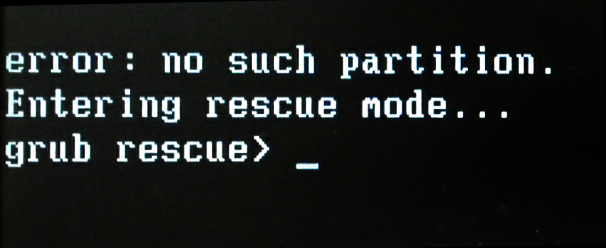

 

利用Live CD的另外一个方法解决grub rescue方法

<!-- more -->

开机缺引导日常进grub rescue，除了`set set prefix`的办法外，还可以利用Live CD进行`update-grub`命令

从Linux LIve CD启动后，能够通过`update-grub chroo`t到`grub`分区来解决这个问题

# 步骤

参考：[https://askubuntu.com/questions/254491/failed-to-get-canonical-path-of-cow](https://askubuntu.com/questions/254491/failed-to-get-canonical-path-of-cow)

*评论区还有个更好的解决方案，如果这个不行，可以试试那一个*

（`/dev/sda1`用你在grub上安装的任何分区替换下面。所有命令都是root。）

```shell
mkdir /mnt/chrootdir
mount /dev/sda1 /mnt/chrootdir

#分别用proc dev sys etc bin sbin var usr lib lib64 tmp替代$dir后执行命令
mkdir /mnt/chrootdir/$dir
mount --bind /$dir /mnt/chrootdir/$dir

chroot /mnt/chrootdir
update-grub2
#update-grub
```

如果缺引导，可以进live cd联网安装

```
mkdir /mnt
mount /dev/sda1 /mnt
cd /mnt
ls -l

grub-install --recheck --root-directory=/mnt /dev/sda
```

# 记记

## chroot

chroot是在unix系统的一个操作，针对正在运作的软件进程和它的子进程，改变它外显的根目录。一个运行在这个环境下，经由chroot设置根目录的程序，它不能够对这个指定根目录之外的文件进行访问动作，不能读取，也不能更改它的内容。chroot这一特殊表达可能指chroot系统调用或chroot前端程序

---[chroot - 维基百科，自由的百科全书](https://zh.wikipedia.org/zh-hans/Chroot)

## --bind

bind的意思是，把其他地方的子树再进行挂载，也就是说可以把文件系统中的某一个部分进行挂载。

这个特性是从linux2.4.0开始的。 
或者更简介的说,就是**挂载一个已有的文件夹**

---[bind mount 的用法](https://xionchen.github.io/2016/08/25/linux-bind-mount/)