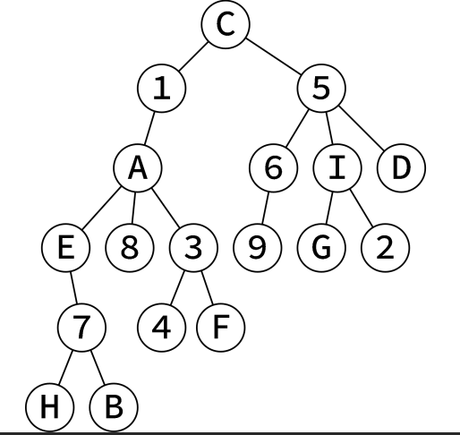
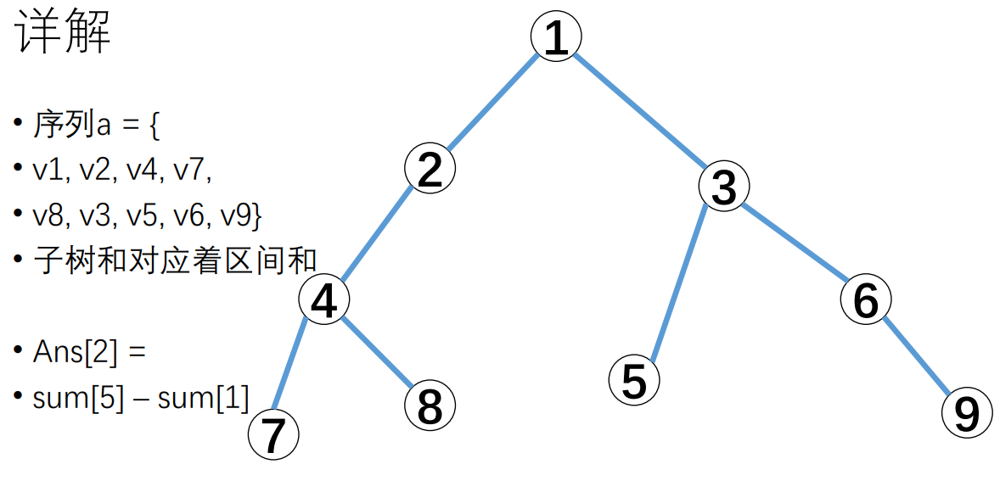

树的dfs

<!-- more -->

# dfs序



这棵树的 DFS 序列就是 `C 1 A E 7 H B 8 3 4 F 5 6 9 I G 2 D`(按照左优先)

定义子树 x表示结点x及其所有的子孙结点，该序列有一个很重要的性质：
**每棵子树x在 DFS 序列中一定是连续的一段，结点x一定在这段的开头**

```plain
C 1[A E 7 H B 8 3 4 F]5 6 9 I G 2 D
          子树A

C 1 A[E 7 H B]8 3 4 F 5 6 9 I G 2 D
       子树E

C 1 A E 7 H B 8 3 4 F[5 6 9 I G 2 D]
                          子树5

C 1 A E 7 H B 8 3 4 F 5[6 9]I G 2 D
                       子树6
```

这使得在子树上进行的修改、查询可以转化为区间修改、区间查询。结合树状数组 or 线段树食用均可

所以dfs序的作用是

- 相当于把树上的问题转化成了序列上的问题
- 辅以各种数据结构进行计算
- 比如ST表、树状数组、线段树
- **子树求和->区间求和**

# 模板

```c++
//遍历到x这个节点
void dfs(int x) 
{
	start[x] = ++dfs_clock;
	vis[x] = 1;
    //遍历y的子节点
	for(every y connected to x)
    {
        if (!vis[y])
            dfs(y);
    }
    end[x] = dfs_clock;
}
```

# 例题1

给一棵n个节点的树，以1为根，每个节点有权值value[i]，共有m个询问，每个问题要求给出x这个点的子树的权值和。N<=1000000, M <= 1000000, value[i] <= 1e9

----

做法:

按照dfs序将value[i]放成一列，用前缀和即可，即

`Ans = sum[end[x]] – sum[start[x] – 1]`



# 例题2

给一棵n个节点的树，以1为根，每个节点有权值value[i]。

共有m个操作：

• `Change(x, v) `将x这个点的权值改成v
• `Ask(x)` 询问x的子树的权值和

N, M <= 100000

---

做法：

同样将value[i]按照dfs序放成一排，用树状数组进行单点修改区间查询。单点修改、子树查询->单点修改、区间查询。

# 例题3

给一棵n个节点的树，以1为根，每个节点有权值value[i]。

共有m个操作：

- `Change(x, v)` 将x的子树中每个点的权值都加上v
- `Ask(x) `询问x的权值

N, M <= 100000

---

做法：

dfs序将树上问题变成序列问题。区间修改，单点查询，树状数组即可

# 例题4

有一棵n个点的树，以1为根，设根节点深度为0，有m个询问，每次查询要求找出x的子树中，深度为dep的节点有多少个。

N,M <= 100000

做法：

- 对每个深度都建一个数组，将该深度的点按照dfs序放进去。
-  深度为dep的数组中，属于x的子树的就一定会是连续的一段，用二分法即可求出。
- 变形：询问x的子树中，距离x为y的点有多少个。


参考:

[DFS 序入门 - 6174 的星球 - 洛谷博客](https://www.luogu.org/blog/P6174/dfs-xu-ru-men)

[树的dfs及其应用]([https://acm.sjtu.edu.cn/w/images/3/35/%E6%A0%91%E7%9A%84dfs%E5%BA%8F%E5%8F%8A%E5%85%B6%E5%BA%94%E7%94%A8%EF%BC%88%E9%97%AB%E9%B8%BF%E5%AE%87%EF%BC%89.pdf](https://acm.sjtu.edu.cn/w/images/3/35/树的dfs序及其应用（闫鸿宇）.pdf))