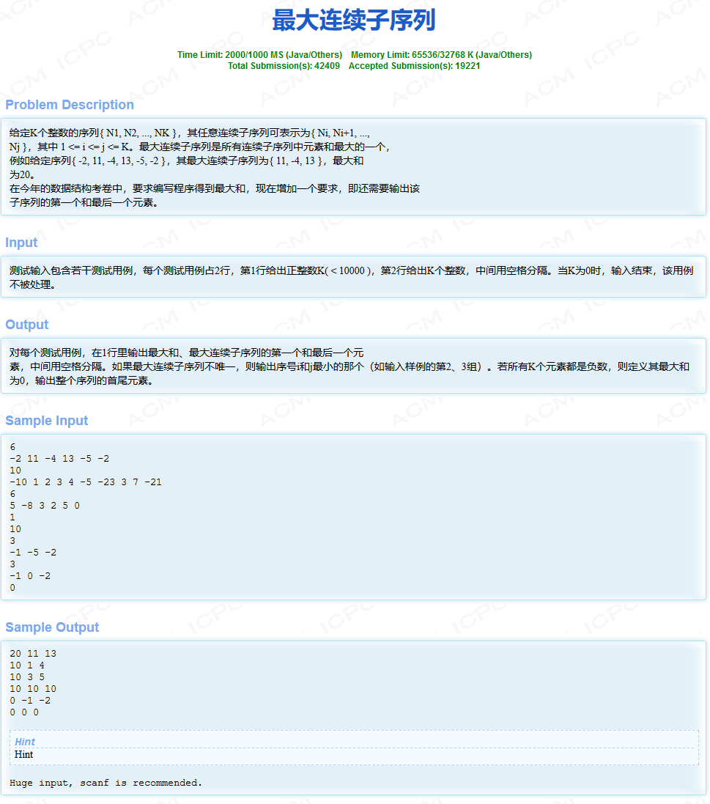

HDU1231最大连续子序列

<!-- more -->

# [HDU1231](http://acm.hdu.edu.cn/showproblem.php?pid=1231)



# 解析

***（转移方程好求，但是栽在了求位置上面，后来才想起是后往前推。）***

**转移方程**

dp[i]表示以i结尾的最大连续子序列的和

```
 状态转移方程：dp[i] = max(dp[i - 1] + num[i],num[i]) 
```

**记录位置**

根据转移方程求最大值，这样就能找到最大连续子序列的最后一个元素，然后根据这个位置再向前找起始位置即可

```c++
/*
2019-04-14 11:46:05
124MS	1628K
*/
#include <cstdio>
#include <cstring>
#include <algorithm>
using namespace std;
const int MAXN = 1e5+10;
const int INF = 0x3f3f3f3f;
int arr[MAXN];
int dp[MAXN];

int main()
{
    int n;
    while(scanf("%d", &n) != EOF && n)
    {
        int flag = 1;
        for(int i = 1; i <= n; i++)
        {
            scanf("%d", &arr[i]);
            if(arr[i] >= 0)
                flag = 0;
        }
        if(flag) //输入的数据全是负数
        {
            printf("0 %d %d\n", arr[1], arr[n]);
            continue;
        }
        memset(dp, 0, sizeof(dp));
        int MAX = -INF; //记录最大值
        int End, Begin; //结尾以及开始位置
        for(int i = 1; i <= n; i++)
        {
            dp[i] = max(dp[i-1]+arr[i], arr[i]);
            if(dp[i] > MAX)
            {
                MAX = dp[i];
                End = i;
            }
        }
        int tmp = MAX;
        for(int i = End; i >= 1; i--) //从末尾开始遍历
        {
            tmp -= arr[i];
            if(tmp == 0) 
            {
                Begin = i;
                break;
            }
        }
        printf("%d %d %d\n", MAX, arr[Begin], arr[End]);
    }
    return 0;
}
```

