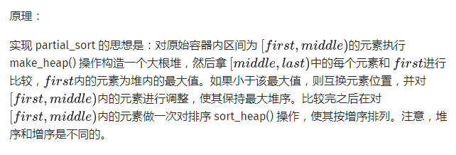

一些STL知识填坑

<!-- more -->

参考：[https://oi-wiki.org](https://oi-wiki.org)

## nth_element

作用是找到选定区间内第 大的数，并将所有比它小的数与比它大的数分别置于两侧，返回它的地址。原理是未完成的快速排序，时间复杂度：期望 O(n)

```c++
#include<iostream>
#include<algorithm>
using namespace std;
int main()
{
	int a[]={3,1,5,4,2,6,8,7,9};
	nth_element(a, a+5, a+9);
	for(int i=0;i<9;i++)
	   cout << a[i] << " ";
    cout<<endl<<"输出第五大的数： "<<a[4]<<endl; //注意下标是从0开始计数的
	return 0;
}

/*
output:
2 1 4 3 5 6 8 7 9
输出第五大的数： 5
*/
```

## stable_sort

稳定的O(nlogn)排序，即保证相等元素排序后的相对位置与原序列相同。

## partial_sort

将序列中前k小元素按顺序置于前k个位置，后面的元素不保证顺序。时间复杂度：O(nlogk)



```c++
#include<iostream>
#include<algorithm>
using namespace std;
int main()
{
	int a[]={3,1,5,4,2,6,8,7,9};
	partial_sort(a, a+3, a+9);
	for(int i=0;i<9;i++)
	   cout << a[i] << " ";
	return 0;
}
/*
output：
1 2 3 5 4 6 8 7 9
*/
```

